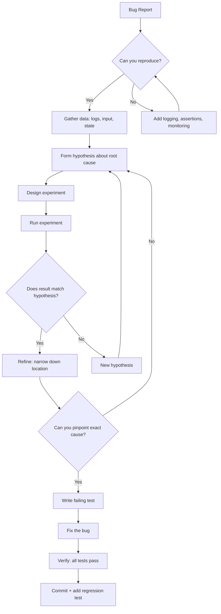
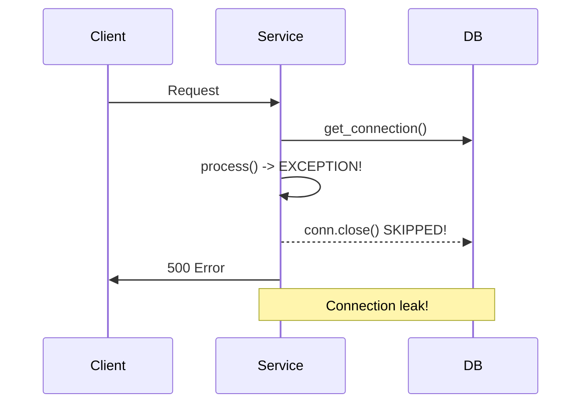

# Debugging Strategies

Debugging is the systematic process of identifying, isolating, and fixing bugs. A structured approach is faster than guessing.



## The Scientific Method

Debugging IS the scientific method applied to software. Every bug is a falsifiable hypothesis about how the system behaves.

### Real Debugging Story: The Ghost Connection Pool

A production service was leaking database connections. Every few hours, the pool exhausted and the service stopped serving requests.

**1. Observe**: Connection count grew monotonically. Each new request created a connection but never released it after the response.

**2. Hypothesis**: The `close()` call wasn't being reached in an exception path. Looked at the code:

```python
def handle_request(request):
    conn = pool.get_connection()
    result = process(request, conn)
    conn.close()  # This line is the suspect
    return result
```

**3. Predict**: If `process()` raises an exception, `conn.close()` never executes. Adding a `try/finally` should fix it.

**4. Experiment**: Modified to `try/finally`:

```python
def handle_request(request):
    conn = pool.get_connection()
    try:
        return process(request, conn)
    finally:
        conn.close()
```

Deployed to staging. Connection count was stable.

**5. Conclusion**: The hypothesis was correct. The fix was deployed to production. Connection leaks stopped.



## Print Debugging PROPERLY

Random `fmt.Println` / `console.log` statements are the most common debugging technique. Do them right.

### Structured Logging vs Print Statements

```python
# Bad: unstructured print
print(f"user: {user}")
print(f"got here: {x}")

# Good: structured logging with context
import structlog

logger = structlog.get_logger()
logger.info("processing_user", user_id=user.id, email=user.email)
logger.debug("intermediate_value", variable_name="x", value=x)
```

| Aspect | Print Statements | Structured Logging |
|--------|----------------|-------------------|
| Production | Never — breaks output | Configurable levels |
| Searchability | Grep strings | JSON fields, indexed |
| Context | Manual | Automatic (request_id, timestamp) |
| Levels | None | debug/info/warn/error |
| Destination | stdout | File, stdout, ELK, Datadog |

## Interactive Debugger

### pdb/ipdb Cheat Sheet

| Command | Shortcut | Action |
|---------|----------|--------|
| `l` (list) | — | Show current line + context |
| `n` (next) | — | Execute current line, stop at next |
| `s` (step) | — | Step INTO a function call |
| `c` (continue) | — | Resume until next breakpoint |
| `b 42` (break) | — | Set breakpoint at line 42 |
| `p var` (print) | — | Print variable value |
| `pp var` | — | Pretty-print complex objects |
| `w` (where) | — | Print stack trace |
| `q` (quit) | — | Exit debugger |
| `!var = 5` | — | Modify variable at runtime |
| `display var` | — | Auto-print var every time it changes |

### IDE Debugger Features

| Feature | VS Code | PyCharm | Chrome DevTools |
|---------|---------|---------|-----------------|
| Conditional breakpoints | ✓ | ✓ | ✓ |
| Logpoints (prints without stopping) | ✓ | ✓ | ✓ |
| Watch expressions | ✓ | ✓ | ✓ |
| Call stack navigation | ✓ | ✓ | ✓ |
| Variable inspection tree | ✓ | ✓ | ✓ |
| Evaluate expression | ✓ | ✓ | Console |
| Step back / reverse debug | ✗ | ✗ | Timeline |
| Thread/async visualization | ✓ | ✓ | ✓ |

## Binary Search Debugging

### git bisect Workflow

git bisect performs a binary search through your commit history to find the exact commit that introduced a bug.

```bash
# Start bisect: mark a known-good and known-bad commit
git bisect start
git bisect bad          # current commit is broken
git bisect good v1.0    # v1.0 was working

# git checks out a commit halfway between good and bad
# Test it, then mark:
git bisect good          # if this commit works
# OR
git bisect bad           # if this commit is broken

# Repeat ~log2(N) times. git tells you the exact commit.
# End:
git bisect reset
```

### Automation with git bisect run

```bash
# Create a test script that returns 0 (good) or non-zero (bad)
# Then let git automatically find the bug:
git bisect start HEAD v1.0
git bisect run pytest tests/test_bug.py
```

### Manual Binary Search in Code

When you can't bisect commits, bisect the code itself:

```python
# Binary search through a pipeline
def process_data(data):
    # Insert at step 1
    step1 = parse(data)
    if test_hypothesis_invalid(step1):
        print("Bug is BEFORE step 1")
        return

    # Insert at step 2
    step2 = transform(step1)
    if test_hypothesis_invalid(step2):
        print("Bug is BETWEEN step 1 and step 2")
        return

    # Check step 3
    step3 = validate(step2)
    if test_hypothesis_invalid(step3):
        print("Bug is BETWEEN step 2 and step 3")
        return
```

### Delta Debugging

Delta debugging automates the minimization of a failing test case. Instead of binary search through commits, it binary-searches the INPUT to find the minimal input that still triggers the bug.

Tools: `ddmin` algorithm, `creduce` (C/C++), `halfempty` (property-based testing), `picire` (general).

## Rubber Duck Debugging

### Why It Works (The Psychology)

Explaining a problem forces you to:

1. **Articulate assumptions** you hold implicitly
2. **Structure the problem** into a narrative with cause and effect
3. **Identify gaps** in your understanding that you gloss over when thinking silently
4. **Re-examine evidence** from a different perspective (outsider vs. insider)

The shift from intuitive thinking (System 1) to analytical thinking (System 2) is what triggers the insight. The duck doesn't matter — the vocalization does.

### Practical Approach

```
1. Find a rubber duck (or a colleague, a cat, a wall)
2. Explain the bug out loud:
   - "I expected X to happen, but Y happened instead"
   - "The code does A, then B, which should produce C..."
   - "But the actual output is D, which means..."
3. Halfway through, you'll usually interrupt yourself with "OH! I see it."
```

> 80% of the time, the answer appears before you finish the explanation.

## Reproducing Bugs

A bug you can't reproduce is a bug you can't fix.

### Flaky Tests

Flaky tests pass and fail without code changes. Strategies:

```python
# Use property-based testing to find minimal failure cases
from hypothesis import given, strategies as st

@given(st.lists(st.integers()))
def test_sort_returns_sorted(items):
    result = sort(items)
    assert all(result[i] <= result[i+1] for i in range(len(result)-1))
```

| Flakiness Cause | Detection | Mitigation |
|----------------|-----------|------------|
| Timing/race | Test fails intermittently | Add synchronization, remove shared state |
| Order dependency | Fails only in specific order | Isolate tests, randomize order |
| External service | Fails when service is down | Mock external dependencies |
| Date/time | Fails at midnight, DST change | Inject clocks, freeze time |
| Random data | Fails on specific inputs | Property-based testing, seed logging |
| Environment-specific | Fails only on CI / only locally | Containerize, use devcontainers |

### Race Condition Reproduction

```python
# Hard to reproduce, so increase probability:
import threading
import time

class Counter:
    def __init__(self):
        self.value = 0

    def increment(self):
        # Force context switch to increase race window
        tmp = self.value
        time.sleep(0.001)
        self.value = tmp + 1

# Run many threads to reproduce
counter = Counter()
threads = [threading.Thread(target=counter.increment) for _ in range(100)]
for t in threads:
    t.start()
for t in threads:
    t.join()
assert counter.value == 100  # Probably fails!
```

## Time Travel Debugging

### rr (Record and Replay)

rr records a program's execution so you can replay it forward AND backward.

```bash
# Record the program
rr record python buggy_script.py

# Replay with reverse debugging
rr replay
# Now you can use:
#   reverse-continue, reverse-next, reverse-step
# to go backwards in execution time
```

### UndoDB

Commercial reverse debugger for C/C++. Key features:

- Run backwards to find where state became corrupt
- Conditional breakpoints that "go back in time"
- Record once, debug many times
- Works with gdb/lldb interfaces

### When to Use Time Travel

| Scenario | rr/UndoDB Perfect For | Not Helpful |
|----------|----------------------|-------------|
| Heisenbugs | ✓ Bug disappears under debugger | — |
| Memory corruption | ✓ Find exactly when address was written | — |
| Infinite loops | ✓ See what state caused it | — |
| Race conditions | ✓ Deterministic replay | — |
| Performance bugs | ✗ | Better with profilers |

## Postmortem Debugging

When the process already crashed, you need a core dump or crash log.

### Core Dumps

```bash
# Enable core dumps
ulimit -c unlimited

# Analyze with gdb
gdb /path/to/binary core

# In gdb:
bt           # backtrace (where did it crash?)
frame 3      # switch to frame 3
info locals  # inspect variables
p variable   # print expression
```

### Crash Log Analysis

```python
# Always include context in crash logs
import logging
import traceback

logger = logging.getLogger(__name__)

def risky_operation(data):
    try:
        return complex_computation(data)
    except Exception:
        logger.critical(
            "Fatal error in risky_operation",
            extra={
                "data_summary": str(data)[:500],
                "data_type": type(data).__name__,
                "stack_trace": traceback.format_exc(),
            }
        )
        raise
```

### Analyzing Minidumps (Windows/.NET)

- Use WinDbg or Visual Studio
- `.dump /ma` for full dump with heap
- `!analyze -v` in WinDbg for automated analysis
- Look for exception records, stack traces, heap corruption

### Crash Symbol Server

Set up a symbol server (Breakpad, Microsoft Symbol Server) so postmortem debugging shows function names instead of raw addresses.

## Profiling-Guided Debugging

Sometimes slow IS wrong. A function that takes 10 seconds when it should take 100ms indicates a bug.

```python
import cProfile
import pstats

def find_bottleneck():
    profiler = cProfile.Profile()
    profiler.enable()
    result = buggy_slow_function()
    profiler.disable()

    stats = pstats.Stats(profiler)
    stats.sort_stats("cumtime")  # cumulative time
    stats.print_stats(20)        # top 20 by time
```

```bash
# Python
python -m cProfile -o profile.out my_script.py
snakeviz profile.out  # visualize

# Node.js
node --prof my_script.js
node --prof-process isolate-*.log

# Go
go test -bench . -cpuprofile=cpu.out
go tool pprof -http=:8080 cpu.out
```

| Pattern | Bug or Not? | Fix |
|---------|-------------|-----|
| N+1 queries | Bug | Eager loading, batching |
| O(n²) instead of O(n) | Bug | Algorithmic fix |
| Accidental O(n) in critical path | Design issue | Caching, restructure |
| Blocked on I/O when should be async | Bug | Async/await, thread pool |

## Memory Debugging

### Valgrind (Linux)

```bash
valgrind --leak-check=full ./my_program

# Output:
# ==12345== 40 bytes in 1 blocks are definitely lost
# ==12345==    at 0x4C2FB0F: malloc
# ==12345==    by 0x4005E7: create_buffer (buggy.c:10)
```

### Address Sanitizer (ASAN)

Built into Clang/GCC:

```bash
# Compile with ASAN
gcc -fsanitize=address -g -o my_program my_program.c
./my_program
# Detects: buffer overflows, use-after-free, memory leaks
```

### Detecting Memory Leaks in Python

```python
import tracemalloc
import gc

tracemalloc.start()

# ... run code ...

snapshot = tracemalloc.take_snapshot()
top_stats = snapshot.statistics('lineno')

for stat in top_stats[:10]:
    print(stat)
```

### Common Memory Bug Patterns

| Pattern | Symptom | Tool |
|---------|---------|------|
| Use-after-free | SEGFAULT, corruption | ASAN, Valgrind |
| Buffer overflow | SEGFAULT, strange behavior | ASAN, Valgrind |
| Memory leak | RAM grows over time | Valgrind, heaptrack |
| Double free | SEGFAULT, abort | ASAN, Valgrind |
| Stack overflow | SEGFAULT, silent crash | ASAN, ulimit |
| Reference cycle | Memory leak (GC language) | gc.get_objects(), tracemalloc |

## Network Debugging

### tcpdump / Wireshark

```bash
# Capture HTTP traffic on port 80
tcpdump -i eth0 -A port 80

# Save to file for Wireshark analysis
tcpdump -i eth0 -w capture.pcap port 80
```

### HTTP Debugging with curl

```bash
# Full request/response in verbose mode
curl -v https://api.example.com/users

# Timing breakdown
curl -w "\nTime: %{time_total}s\n" https://api.example.com

# Follow redirects, include headers
curl -L -I https://example.com

# Send custom headers
curl -H "Authorization: Bearer token123" -H "X-Request-Id: abc" \
     https://api.example.com/data
```

### Debugging REST APIs

| Issue | Check | Fix |
|-------|-------|-----|
| Wrong status code | Response headers | Review endpoint spec |
| Wrong data shape | Response body schema | Validate with Pydantic/Zod |
| Auth failure | Headers, cookies, tokens | Check expiry, format |
| CORS error | Origin headers | Configure CORS middleware |
| Rate limiting | Retry-After header | Implement backoff |
| Slow response | Timing breakdowns | Profile DB queries, cache |

## Async Debugging

### Callback Hell vs Promises vs Async/Await

```javascript
// Callback hell — impossible to trace errors
getUser(id, (err, user) => {
    getOrders(user.id, (err, orders) => {
        processPayment(orders[0], (err, result) => {
            if (err) console.error(err); // which err?
        });
    });
});

// Async/await — clean stack traces
async function processUserOrders(userId) {
    const user = await getUser(userId);
    const orders = await getOrders(user.id);
    return processPayment(orders[0]);
}
```

### Async Stack Traces

Python and Node have improved async stack traces, but they still lose context:

```python
# Python's asyncio: use contextvars for tracing
import contextvars
import asyncio

request_id = contextvars.ContextVar("request_id")

async def handler(request):
    request_id.set(request.id)
    await process()

async def process():
    # Can access request_id even across awaits
    rid = request_id.get()
    logger.info("processing", request_id=rid)
```

```javascript
// Node.js: enable async stack traces
// --async-stack-traces flag (Node 12+)
// Or use AsyncLocalStorage
const { AsyncLocalStorage } = require('async_hooks');
const storage = new AsyncLocalStorage();

app.use((req, res, next) => {
    storage.run({ requestId: req.id }, () => next());
});
```

## Production Debugging

### Canary Debugging

Deploy the fix to a subset of servers/instances first:

```
Traffic → [99%: Old Version] → monitor for errors
        → [ 1%: New Version] → verify fix works
100% rollout after confidence
```

### Log Levels in Production

| Level | When to Use | Example |
|-------|-------------|---------|
| TRACE | Per-request detail, only during active debugging | "Entering function X with param Y" |
| DEBUG | Development-only information | "Query returned 42 rows" |
| INFO | Normal operations, milestones | "User 123 registered successfully" |
| WARN | Unexpected but handled | "Rate limit approaching for IP 1.2.3.4" |
| ERROR | Operation failed, needs investigation | "Payment declined: insufficient funds" |
| FATAL | Process cannot continue | "Database unreachable, shutting down" |

### Feature Flags

Toggle behavior without deployment:

```python
# Debug a specific feature without touching code
ff = feature_flags.get("new_payment_flow")

if ff.is_enabled(user_id=user.id):
    # New implementation — temporarily enabled for diagnostics
    result = new_payment_flow(order)
    logger.info("new_payment_flow", user_id=user.id, result=result)
else:
    result = old_payment_flow(order)
```

### Traffic Mirroring

Mirror production traffic to a shadow instance for debugging:

```
Production Traffic → [Live Service] → [Client Response]
                  ↘ [Shadow Service] → [Debug Logs, No Impact]
```

The shadow instance gets identical requests but responses are discarded. Compare outputs to find differences.

## Debugging Distributed Systems

Distributed systems add network failures, partial failures, and asynchrony.

### Distributed Tracing

Every request gets a trace_id that propagates across services:

```
HTTP Request → [API Gateway] → [Auth Service] → [Order Service] → [Payment Service]
   trace_id=abc                trace_id=abc      trace_id=abc     trace_id=abc
                                   span=1            span=2           span=3
```

```python
# OpenTelemetry example
from opentelemetry import trace
from opentelemetry.instrumentation.requests import RequestsInstrumentation

tracer = trace.get_tracer(__name__)

def handle_request(request):
    with tracer.start_as_current_span("handle_request") as span:
        span.set_attribute("request_id", request.id)
        span.set_attribute("user_id", request.user_id)
        result = process(request)
        span.set_attribute("result.status", result.status)
        return result
```

### Correlation IDs

Add a unique ID to every request at the entry point:

```python
import uuid
from flask import g

@app.before_request
def set_correlation_id():
    g.correlation_id = request.headers.get(
        "X-Correlation-Id",
        str(uuid.uuid4())
    )

@app.after_request
def add_correlation_header(response):
    response.headers["X-Correlation-Id"] = g.correlation_id
    return response
```

### Distributed Logging Query Example

```bash
# Find all logs for a specific trace across services
grep "trace_id=abc123" /var/log/*.log

# With structured logging (JSON):
cat logs/app.log | jq 'select(.trace_id == "abc123")'
```

## Reverse Debugging

Sometimes the most effective technique is building backwards from the failure:

```
1. What is the exact error/output? → At the crash site
2. What data does this depend on? → Look at the inputs
3. Where did this data come from? → Walk up the call stack
4. What could have made it wrong? → Branching, previous mutations
5. Repeat until you find the creation of bad data
```

### Mental Model

```python
def process():
    data = load()              # Step 4: Was data correct here?
    cleaned = clean(data)      # Step 3: Was cleaned correct?
    validated = validate(cleaned)  # Step 2: What about validated?
    save(validated)            # Step 1: Crash here!
```

Work backwards: at each step, ask "could the bug originate in THIS function?" Check inputs, outputs, and invariants.

## Common Bug Patterns

| Category | Specific Pattern | Detection | Fix |
|----------|-----------------|-----------|-----|
| Off-by-one | `for i in range(n)` loop iteration | Boundary test | `range(n)` gives n elements from 0 to n-1 |
| Null reference | `user.address.city` when user or address is None | Static analysis (Pyright, mypy, TypeScript) | Optional chaining, early validation |
| Race condition | `counter += 1` without lock | Thread sanitizer | Mutex, atomic operation |
| Type confusion | Passing string where int expected | Type checker | Strict typing, runtime validation |
| Resource leak | File not closed on exception path | Resource tracking | `with` statement, try/finally |
| Logic error | `if a and b` instead of `if a or b` | Code review | Write domain tests |
| Off-by-one SQL | `LIMIT 10 OFFSET n*10` pagination | Edge case testing | Verify total rows, handle last page |
| Timezone | `datetime.now()` vs `utcnow()` | Golden hour testing | Always store UTC, convert on display |
| Floating point | `0.1 + 0.2 != 0.3` | Precision tests | Use `Decimal` for money |
| Cache invalidation | Stale data after update | Freshness tests | TTL, write-through cache, invalidation events |
| Serialization | Missing field in JSON/Protobuf | Schema validation | Required field annotation |
| Encoding | UTF-8 vs ASCII mismatch | Internationalization tests | Explicit encoding everywhere |

## Prevention

- Write tests before fixing (regression test)
- Add assertions for invariants
- Improve error messages
- Consider adding observability (metrics, traces)
- Document the root cause in the commit message

```python
# Commit message for a bug fix:
"""
Fix connection leak on payment timeout

Root cause: when PaymentGateway.timeout() was called, the finally block
in PaymentProcessor._charge() released the order lock but NOT the
database connection back to the pool. The connection was GC'd only when
the processor was garbage-collected, which could take minutes.

Fix: wrap connection usage in try/finally to guarantee pool.release().
Added a regression test that verifies connection count stays stable
under concurrent payment timeouts.
"""
```

**Links**: [[Error Handling Patterns]] | [[Unit Testing Guide]] | [[Git/Bisect]] | [[Git/Blame]] | [[Monitoring and Observability]] | [[Distributed Tracing]] | [[Performance Profiling]]
