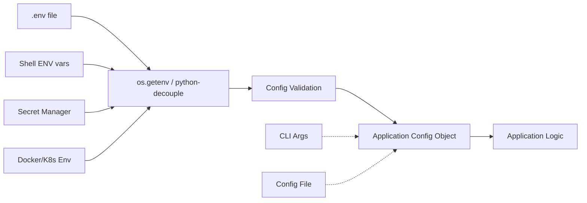
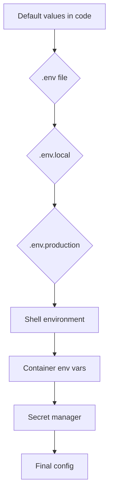
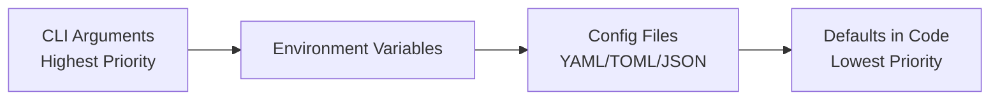

# Environment Variables

Environment variables externalize configuration from code, enabling the same build to run across environments.

## Config Flow: Env to Application



## Twelve-Factor App Config Principle

Factor III of [[Software Design Principles | 12-Factor App]] states: **Store config in the environment**. Code should be configurable at deploy-time, not build-time.

### Why Env Vars?

- Language- and OS-agnostic
- No config files checked into version control
- Easy to change per deployment without rebuilding
- Naturally scoped to processes

### What Not to Put in Env Vars

- Large structured data (use config files or a service)
- Secrets the application itself generates (tokens, session keys)
- File paths that are internal to the app
- Binary data (env vars are text-only)

## .env File Format Spec

```
# This is a comment — lines starting with #
DB_HOST=localhost
DB_PORT=5432
MULTI_LINE="line one\nline two"
EXPANDED=${HOME}/data          # Variable expansion
ESCAPED=\$NOT_VAR              # Literal $
EMPTY=                         # Empty string
export EXPORTED_VAR=value      # export prefix works like bash
```

### Rules

| Feature | Syntax | Notes |
|---------|--------|-------|
| Comments | `#` at line start | No inline comments |
| Quoting | Single/double quotes | Double quotes expand vars |
| Multi-line | `\n` escape or raw line | Depends on parser |
| Variable expansion | `${VAR}` or `$VAR` | Not all parsers |
| Empty values | `KEY=` | Value is empty string |
| Whitespace | Stripped around `=` | Use quotes for trailing spaces |

## Loading Order (Priority)



Higher priority overrides lower priority. Never commit `.env` or `.env.local` to version control. Only `.env.example` should be committed.

```python
# Priority loading implementation
from pathlib import Path
from dotenv import load_dotenv

BASE_DIR = Path(__file__).parent
load_dotenv(BASE_DIR / ".env")              # Base config
load_dotenv(BASE_DIR / ".env.local",        # Local overrides (git-ignored)
            override=True)
load_dotenv(BASE_DIR / ".env.production",   # Environment-specific
            override=True)
```

## Validation Patterns

### pydantic-settings

```python
from pydantic_settings import BaseSettings

class Settings(BaseSettings):
    app_name: str = "MyApp"
    debug: bool = False
    db_host: str = "localhost"
    db_port: int = 5432
    allowed_hosts: list[str] = ["*"]
    secret_key: str

    model_config = {"env_prefix": "MYAPP_"}

settings = Settings()  # Auto-loads from env
```

### python-decouple

```python
from decouple import config

DEBUG = config("DEBUG", default=False, cast=bool)
DB_URL = config("DB_URL")
EMAIL_HOST = config("EMAIL_HOST", default="localhost")
REDIS_URL = config("REDIS_URL", default="redis://localhost:6379")
```

### Dynaconf

```python
from dynaconf import Dynaconf

settings = Dynaconf(
    envvar_prefix="MYAPP",
    settings_files=["settings.toml", ".secrets.toml"],
    environments=True,
    load_dotenv=True,
)
```

## Naming Conventions

- `SCREAMING_SNAKE_CASE` by convention
- Prefix by application: `MYAPP_DB_HOST`, `MYAPP_LOG_LEVEL`
- Group related vars with common prefix
- Avoid names that conflict with OS vars (e.g. `PATH`, `HOME`, `USER`)

```
# Bad
host=localhost
port=5432
PATH=/usr/bin

# Good
MYAPP_DB_HOST=localhost
MYAPP_DB_PORT=5432
MYAPP_LOG_LEVEL=info
```

## Type Coercion

Env vars are strings by default. Explicit coercion is required.

```python
import os
from distutils.util import strtobool

# Booleans
DEBUG = os.getenv("DEBUG", "false").lower() in ("1", "true", "yes", "on")
DEBUG2 = bool(strtobool(os.getenv("DEBUG", "false")))  # True for y/yes/1/on

# Integers
DB_PORT = int(os.getenv("DB_PORT", "5432"))

# Floats
TIMEOUT = float(os.getenv("TIMEOUT", "30.0"))

# Lists (custom delimiter)
ALLOWED_HOSTS = os.getenv("ALLOWED_HOSTS", "").split(",")
ALLOWED_HOSTS = [h.strip() for h in ALLOWED_HOSTS if h.strip()]

# JSON parsing
import json
FEATURE_FLAGS = json.loads(os.getenv("FEATURE_FLAGS", "{}"))
```

## Secret Management

### HashiCorp Vault

```python
import hvac

client = hvac.Client(url="https://vault.example.com", token=os.getenv("VAULT_TOKEN"))
secret = client.secrets.kv.read_secret_version(path="myapp/prod")
DB_PASSWORD = secret["data"]["data"]["db_password"]
```

**See also**: [[Vault and Secret Management]]

### AWS Secrets Manager

```python
import boto3
from botocore.exceptions import ClientError

def get_secret(name: str) -> str:
    client = boto3.client("secretsmanager")
    response = client.get_secret_value(SecretId=name)
    return response["SecretString"]
```

### Azure Key Vault

```python
from azure.identity import DefaultAzureCredential
from azure.keyvault.secrets import SecretClient

client = SecretClient(
    vault_url="https://myvault.vault.azure.net",
    credential=DefaultAzureCredential()
)
secret = client.get_secret("myapp-db-password").value
```

### Doppler

```bash
doppler run -- python app.py
doppler secrets download --format env > .env
```

## Hierarchy: Env → Config File → CLI Args → Defaults



```python
import argparse
import os
import yaml

parser = argparse.ArgumentParser()
parser.add_argument("--db-host")
parser.add_argument("--config")
args = parser.parse_args()

config = {}
if args.config:
    with open(args.config) as f:
        config = yaml.safe_load(f)

DB_HOST = (
    args.db_host or
    os.getenv("MYAPP_DB_HOST") or
    config.get("db_host") or
    "localhost"
)
```

## Docker and Kubernetes

### Docker Compose

```yaml
services:
  app:
    image: myapp:latest
    environment:
      - DB_HOST=postgres
      - DB_NAME=myapp
    env_file:
      - .env.production
```

**See also**: [[Docker Compose]]

### Kubernetes ConfigMap & Secrets

```yaml
apiVersion: v1
kind: ConfigMap
metadata:
  name: myapp-config
data:
  DB_HOST: postgres-service
  LOG_LEVEL: info
---
apiVersion: v1
kind: Secret
metadata:
  name: myapp-secrets
type: Opaque
stringData:
  DB_PASSWORD: s3cret!
---
apiVersion: apps/v1
kind: Deployment
spec:
  template:
    spec:
      containers:
        - name: app
          envFrom:
            - configMapRef:
                name: myapp-config
            - secretRef:
                name: myapp-secrets
```

**See also**: [[Docker Containers]], [[Kubernetes Basics]]

## CI/CD Environment Variables

### GitHub Actions Secrets

```yaml
jobs:
  deploy:
    runs-on: ubuntu-latest
    steps:
      - uses: actions/checkout@v4
      - run: ./deploy.sh
        env:
          DOCKER_PASSWORD: ${{ secrets.DOCKER_PASSWORD }}
          AWS_ACCESS_KEY_ID: ${{ secrets.AWS_ACCESS_KEY_ID }}
```

### GitLab CI Variables

```yaml
variables:
  DEPLOY_ENV: production

deploy_job:
  variables:
    DB_HOST: prod-db.internal
  script:
    - echo "Deploying to $DEPLOY_ENV"
  environment: production
```

**See also**: [[CI CD Pipelines]]

## Testing with Environment Variables

### pytest monkeypatch

```python
import os
from myapp.config import get_config

def test_development_config(monkeypatch):
    monkeypatch.setenv("MYAPP_DEBUG", "true")
    monkeypatch.setenv("MYAPP_DB_HOST", "localhost")
    cfg = get_config()
    assert cfg.debug is True
    assert cfg.db_host == "localhost"

def test_production_config(monkeypatch):
    monkeypatch.delenv("MYAPP_DEBUG", raising=False)
    monkeypatch.setenv("MYAPP_DB_HOST", "prod.internal")
    cfg = get_config()
    assert cfg.debug is False
```

### unittest mock

```python
from unittest import mock
from myapp.config import load_settings

@mock.patch.dict(os.environ, {"MYAPP_DB_HOST": "test-db"})
def test_settings():
    settings = load_settings()
    assert settings.db_host == "test-db"
```

## Security: What NOT to Put in Env Vars

| Risk | Example | Better Approach |
|------|---------|----------------|
| Short-lived tokens | OAuth tokens, session IDs | Runtime generation, not env |
| Large secrets | TLS certs, API keys with expiry | Secret manager, vault agent |
| Structured config | XML/JSON config | Config files, mounted volumes |
| Binary data | GPG keys, binary certs | File mounts, base64 with care |
| Entropy-starved values | Weak passwords | Generated at deploy time |

### Secure Patterns

- Use ephemeral credentials via IAM roles (AWS), managed identities (Azure)
- Rotate secrets automatically
- Encrypt .env files at rest
- Audit secret access
- Never log env var values or error messages containing them

**See also**: [[Dev Environment Setup]], [[Vault and Secret Management]]

**Links**: [[Agile Development]] | [[Clean Code Principles]] | [[Code Review Best Practices]] | [[Code Review Process]] | [[Coding Interview Patterns]] | [[Debugging Strategies]] | [[Developer Experience]] | [[Error Handling Patterns]] | [[Estimation and Planning]] | [[Feature Flags and Toggles]] | [[GoF Design Patterns]] | [[Incident Response]] | [[Internationalization]] | [[Monorepo vs Polyrepo]] | [[Monorepo with Nx and Turborepo]] | [[Onboarding and Mentoring]] | [[Open Source]] | [[Performance Profiling]] | [[Programming Resources]] | [[Refactoring Techniques]] | [[Regular Expressions]] | [[Scrum Framework]] | [[Software Design Principles]] | [[SOLID Principles Deep Dive]] | [[System Design Interview]] | [[Technical Debt Management]] | [[Technical Writing]] | [[Unicode and Encoding]] | [[Vim and Neovim]] | [[Virtualization]]
