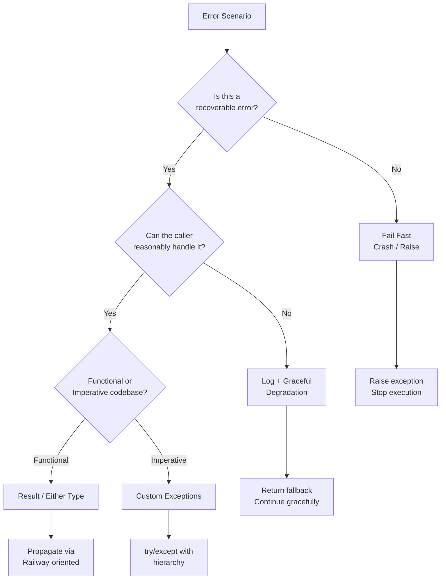
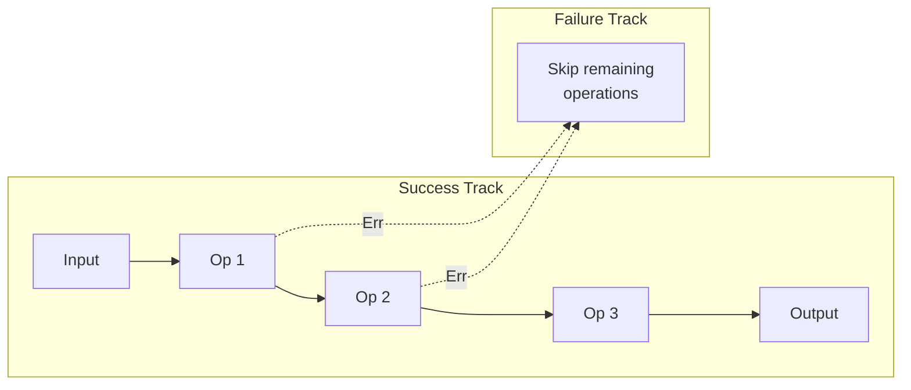

# Error Handling Patterns

Robust error handling prevents crashes, aids debugging, and provides clear feedback to users.

## Error Handling Strategy Selection



## Exceptions: Try/Except/Finally/Else

```python
try:
    result = risky_operation()
except ValueError as e:
    log.error(f"Invalid input: {e}")
    return fallback_value
except (IOError, OSError) as e:
    log.error(f"I/O error: {e}")
    raise  # Re-raise, don't swallow
except Exception as e:
    log.critical(f"Unexpected error: {e}")
    raise  # Fail fast for unknown errors
else:
    # Runs only if no exception occurred
    log.info(f"Operation succeeded: {result}")
    return result
finally:
    # Always runs — cleanup resources
    cleanup()
```

### Raise From and Chaining

```python
def load_config(path: str) -> dict:
    try:
        with open(path) as f:
            return json.load(f)
    except FileNotFoundError as e:
        raise ConfigError(f"Config not found: {path}") from e
    except json.JSONDecodeError as e:
        raise ConfigError(f"Invalid JSON in {path}") from e

# Usage — the chain preserves context
try:
    cfg = load_config("app.json")
except ConfigError as e:
    print(f"Caused by: {e.__cause__}")  # Original exception
    print(f"Chain: {e.__context__}")    # Previous exception in same try
```

## Result Type (Functional Error Handling)

### Full Implementation

```python
from __future__ import annotations
from dataclasses import dataclass
from typing import Generic, TypeVar, Callable, Union

T = TypeVar("T")
U = TypeVar("U")
E = TypeVar("E")
F = TypeVar("F")

@dataclass
class Ok(Generic[T]):
    value: T

    def map(self, fn: Callable[[T], U]) -> Ok[U] | Err:
        return Ok(fn(self.value))

    def map_error(self, fn: Callable[..., U]) -> Ok[T] | Err:
        return self

    def and_then(self, fn: Callable[[T], Ok[U] | Err]) -> Ok[U] | Err:
        return fn(self.value)

    def unwrap(self) -> T:
        return self.value

    def unwrap_or(self, default: T) -> T:
        return self.value

    def is_ok(self) -> bool:
        return True

    def is_err(self) -> bool:
        return False

@dataclass
class Err(Generic[E]):
    error: E

    def map(self, fn: Callable[..., U]) -> Ok | Err[E]:
        return self

    def map_error(self, fn: Callable[[E], F]) -> Ok | Err[F]:
        return Err(fn(self.error))

    def and_then(self, fn: Callable[..., Ok | Err]) -> Ok | Err[E]:
        return self

    def unwrap(self) -> None:
        raise RuntimeError(f"Called unwrap on Err: {self.error}")

    def unwrap_or(self, default: T) -> T:
        return default

    def is_ok(self) -> bool:
        return False

    def is_err(self) -> bool:
        return True

Result = Ok[T] | Err[E]
```

### Usage

```python
def parse_int(s: str) -> Result[int, str]:
    try:
        return Ok(int(s))
    except ValueError:
        return Err(f"Invalid integer: {s}")

def divide(a: int, b: int) -> Result[float, str]:
    if b == 0:
        return Err("Division by zero")
    return Ok(a / b)

# Chaining
result = (parse_int("10")
          .and_then(lambda n: divide(n, 2))
          .map(lambda x: x * 3))

match result:
    case Ok(value):
        print(f"Result: {value}")
    case Err(error):
        print(f"Error: {error}")
```

## Railway-Oriented Programming

Chain operations where errors short-circuit the pipeline. The two tracks (success/failure) never merge — errors are propagated.



### Implementation with Chain Helpers

```python
from typing import Callable, TypeVar

T = TypeVar("T")
U = TypeVar("U")
E = TypeVar("E")

Result = Ok[T] | Err[E]

class ResultPipeline:
    """Build composable pipelines with Result types."""

    @staticmethod
    def start(value: T) -> Ok[T]:
        return Ok(value)

    @staticmethod
    def then(result: Result[T, E],
             fn: Callable[[T], Result[U, E]]) -> Result[U, E]:
        match result:
            case Ok(val):
                return fn(val)
            case Err(err):
                return Err(err)

    @staticmethod
    def map(result: Result[T, E],
            fn: Callable[[T], U]) -> Result[U, E]:
        return result.map(fn)

# Usage
pipeline = (ResultPipeline
    .start(input_data)
    .then(validate)
    .then(transform)
    .then(enrich)
    .then(persist))
```

## Either Monad Pattern

### Rust Result Equivalent

```python
# Rust-inspired: Result<T, E> with ?
class RustResult:
    @staticmethod
    def try_chain(results: list[Result]) -> Result[list, str]:
        collected = []
        for r in results:
            match r:
                case Ok(v):
                    collected.append(v)
                case Err(e):
                    # Equivalent to Rust's ? operator
                    return Err(e)
        return Ok(collected)
```

### Haskell Either Style

```python
# Left = error, Right = success
from typing import TypeVar

L = TypeVar("L")
R = TypeVar("R")

class Left(Generic[L]):
    def __init__(self, value: L): self.value = value
    def bind(self, _): return self
    def fmap(self, _): return self
    def __repr__(self): return f"Left({self.value})"

class Right(Generic[R]):
    def __init__(self, value: R): self.value = value
    def bind(self, fn): return fn(self.value)
    def fmap(self, fn): return Right(fn(self.value))
    def __repr__(self): return f"Right({self.value})"
```

## Custom Exception Hierarchy

```python
class AppError(Exception):
    """Base exception for application."""
    def __init__(self, message: str, code: str = None, context: dict = None):
        self.message = message
        self.code = code or "UNKNOWN_ERROR"
        self.context = context or {}
        super().__init__(self.message)

class ConfigError(AppError):
    def __init__(self, message: str, key: str = None):
        super().__init__(message, code="CONFIG_ERROR", context={"key": key})

class DatabaseError(AppError):
    def __init__(self, message: str, query: str = None):
        super().__init__(message, code="DB_ERROR", context={"query": query})

class ValidationError(AppError):
    def __init__(self, message: str, field: str = None, value=None):
        super().__init__(message, code="VALIDATION_ERROR",
                         context={"field": field, "value": value})

class AuthError(AppError):
    def __init__(self, message: str, user_id: str = None):
        super().__init__(message, code="AUTH_ERROR", context={"user_id": user_id})

class NotFoundError(AppError):
    def __init__(self, message: str, resource: str = None, resource_id=None):
        super().__init__(message, code="NOT_FOUND",
                         context={"resource": resource, "id": resource_id})
```

## Exception Handling Best Practices

### Granular vs Broad Catches

```python
# BAD — broad catch hides bugs
try:
    process(data)
except Exception:
    pass  # Silently swallows everything

# GOOD — specific catches with action
try:
    process(data)
except ValueError:
    log.warning("Invalid data, skipping")
    return fallback
except PermissionError:
    log.error("No permission, aborting")
    raise

# GOOD — broad catch for top-level boundary
def main():
    try:
        run_app()
    except Exception as e:
        log.critical(f"App crashed: {e}", exc_info=True)
        sys.exit(1)
```

### When to Catch vs When to Let Propagate

| Catch | Let Propagate |
|-------|---------------|
| You can handle or recover | Caller should decide |
| You can add context (raise from) | Program can't continue |
| At system boundaries (API, CLI, UI) | Logic errors, assertion failures |
| For resource cleanup (finally) | Programming mistakes (TypeError, etc.) |

## Retry Patterns

### Exponential Backoff

```python
import time
import random
from functools import wraps

def retry(max_retries: int = 3, base_delay: float = 1.0,
          backoff: float = 2.0, exceptions: tuple = (Exception,)):
    def decorator(func):
        @wraps(func)
        def wrapper(*args, **kwargs):
            last_exception = None
            for attempt in range(max_retries):
                try:
                    return func(*args, **kwargs)
                except exceptions as e:
                    last_exception = e
                    if attempt < max_retries - 1:
                        delay = base_delay * (backoff ** attempt)
                        log.warning(f"Attempt {attempt+1} failed: {e}, "
                                   f"retrying in {delay:.1f}s")
                        time.sleep(delay)
            raise last_exception
        return wrapper
    return decorator

@retry(max_retries=5, base_delay=0.5, exceptions=(ConnectionError, TimeoutError))
def fetch_data(url: str) -> dict:
    return requests.get(url, timeout=5).json()
```

### Exponential Backoff with Jitter

```python
def sleep_with_jitter(base: float, attempt: int, max_jitter: float = 0.5):
    delay = base * (2 ** attempt)
    jitter = random.uniform(0, max_jitter)
    total = delay + jitter
    time.sleep(total)
    return total
```

### Circuit Breaker Pattern

```python
import time
from enum import Enum

class CircuitState(Enum):
    CLOSED = "closed"       # Normal operation
    OPEN = "open"           # Failing — reject immediately
    HALF_OPEN = "half_open" # Testing if service recovered

class CircuitBreaker:
    def __init__(self, failure_threshold: int = 5,
                 recovery_timeout: float = 30.0):
        self.state = CircuitState.CLOSED
        self.failure_count = 0
        self.failure_threshold = failure_threshold
        self.recovery_timeout = recovery_timeout
        self.last_failure_time = 0.0

    def call(self, func, *args, **kwargs):
        if self.state == CircuitState.OPEN:
            if time.time() - self.last_failure_time > self.recovery_timeout:
                self.state = CircuitState.HALF_OPEN
            else:
                raise CircuitBreakerOpenError("Service unavailable")

        try:
            result = func(*args, **kwargs)
            if self.state == CircuitState.HALF_OPEN:
                self.state = CircuitState.CLOSED
                self.failure_count = 0
            return result
        except Exception as e:
            self.failure_count += 1
            self.last_failure_time = time.time()
            if self.failure_count >= self.failure_threshold:
                self.state = CircuitState.OPEN
            raise e
```

## Graceful Degradation

Degrade features on failure rather than crashing the entire application:

```python
class RecommenderService:
    def get_recommendations(self, user_id: str) -> list[Item]:
        try:
            return self._personalized_recommendations(user_id)
        except ModelUnavailableError:
            log.warning("ML model unavailable, falling back to popular")
            return self._popular_items()
        except DatabaseError:
            log.warning("DB unavailable, returning empty")
            return []

class VideoPlayer:
    def play(self, url: str):
        try:
            self._play_hd(url)
        except BandwidthError:
            log.info("Network constrained, degrading to SD")
            self._play_sd(url)
        except PlaybackError:
            log.error("Playback failed, showing error to user")
            self._show_error_screen("Could not play video")
```

## Logging Errors

### Structured Logging

```python
import structlog

logger = structlog.get_logger()

def process_order(order_id: str):
    try:
        result = execute_order(order_id)
        logger.info("order_processed", order_id=order_id, status=result.status)
    except OrderError as e:
        logger.error("order_failed",
                     order_id=order_id,
                     error_code=e.code,
                     error_message=str(e),
                     exc_info=True)
```

### Correlation IDs

```python
import uuid
from contextvars import ContextVar

request_id: ContextVar[str] = ContextVar("request_id", default="")

def log_error(message: str, exc: Exception = None):
    logger.error(message,
                 request_id=request_id.get(),
                 exception=type(exc).__name__ if exc else None,
                 exc_info=exc)

# Middleware sets the correlation ID per request
async def middleware(request, call_next):
    rid = request.headers.get("X-Request-ID", str(uuid.uuid4()))
    request_id.set(rid)
    return await call_next(request)
```

**See also**: [[Logging Best Practices]]

## Error Boundaries in Frontend

### React Error Boundary

```typescript
import React, { Component, ErrorInfo, ReactNode } from 'react';

interface Props {
  children: ReactNode;
  fallback?: ReactNode;
}

interface State {
  hasError: boolean;
  error: Error | null;
}

class ErrorBoundary extends Component<Props, State> {
  state: State = { hasError: false, error: null };

  static getDerivedStateFromError(error: Error): State {
    return { hasError: true, error };
  }

  componentDidCatch(error: Error, info: ErrorInfo) {
    console.error('Error caught:', error, info.componentStack);
    // Send to error tracking service
    Sentry.captureException(error, { extra: info });
  }

  render() {
    if (this.state.hasError) {
      return this.props.fallback || <h1>Something went wrong</h1>;
    }
    return this.props.children;
  }
}
```

## Global Error Handlers

### Flask Error Handlers

```python
from flask import Flask, jsonify

app = Flask(__name__)

@app.errorhandler(ValidationError)
def handle_validation(error):
    return jsonify({
        "error": "validation_error",
        "message": str(error),
        "field": error.context.get("field"),
    }), 400

@app.errorhandler(AuthError)
def handle_auth(error):
    return jsonify({"error": "unauthorized"}), 401

@app.errorhandler(NotFoundError)
def handle_not_found(error):
    return jsonify({
        "error": "not_found",
        "resource": error.context.get("resource"),
    }), 404

@app.errorhandler(Exception)
def handle_unexpected(error):
    log.critical(f"Unhandled: {error}", exc_info=True)
    return jsonify({"error": "internal_server_error"}), 500
```

### Express Middleware

```typescript
import express, { Request, Response, NextFunction } from 'express';

class AppError extends Error {
  constructor(
    public statusCode: number,
    public code: string,
    message: string,
    public context?: Record<string, unknown>
  ) {
    super(message);
  }
}

function errorHandler(
  err: Error,
  req: Request,
  res: Response,
  next: NextFunction
) {
  if (err instanceof AppError) {
    return res.status(err.statusCode).json({
      error: err.code,
      message: err.message,
      ...(err.context && { context: err.context }),
    });
  }

  console.error('Unhandled error:', err);
  res.status(500).json({ error: 'internal_error' });
}

app.use(errorHandler);
```

## Domain Errors vs Technical Errors

```python
# Technical error — infrastructure failure
class DatabaseConnectionError(Exception):
    """Database is unreachable. Internal, not user-facing."""

# Domain error — business logic violation
class InsufficientBalanceError(DomainError):
    """User tried to withdraw more than balance."""
    def __init__(self, balance: Decimal, amount: Decimal):
        self.balance = balance
        self.amount = amount
        super().__init__(
            f"Insufficient balance: {balance} < {amount}",
            code="INSUFFICIENT_BALANCE",
            context={"balance": str(balance), "amount": str(amount)}
        )

class OrderAlreadyShippedError(DomainError):
    """Cannot cancel order after shipping."""
    def __init__(self, order_id: str):
        super().__init__(
            f"Order {order_id} already shipped, cannot cancel",
            code="ORDER_ALREADY_SHIPPED",
            context={"order_id": order_id}
        )
```

## Null Safety Patterns

### Optional / Maybe Pattern

```python
from typing import Optional, TypeVar
from dataclasses import dataclass

T = TypeVar("T")

@dataclass
class Some(Generic[T]):
    value: T

@dataclass
class Nothing:
    pass

Maybe = Some[T] | Nothing

def find_user(user_id: str) -> Maybe[User]:
    user = database.query(...)
    if user:
        return Some(user)
    return Nothing()

# Usage
match find_user("abc123"):
    case Some(user):
        send_email(user.email)
    case Nothing():
        log.warning("User not found")
```

### Early Returns Pattern

```python
def process_order(order_id: str) -> Result[Order, str]:
    order = get_order(order_id)
    if not order:
        return Err("Order not found")

    user = get_user(order.user_id)
    if not user:
        return Err("User not found")

    if not user.has_credit(order.total):
        return Err("Insufficient credit")

    if order.is_cancelled:
        return Err("Order already cancelled")

    return Ok(order)
```

### Null Object Pattern

```python
class NullLogger:
    def info(self, msg): pass
    def warning(self, msg): pass
    def error(self, msg): pass
    def critical(self, msg): pass

# Avoids None checks
logger = get_logger() or NullLogger()
logger.info("Application started")
```

## Defensive Programming vs Failing Fast

| Defensive Programming | Failing Fast |
|-----------------------|--------------|
| "Make it work with bad data" | "Reject bad data immediately" |
| Type checks, bounds checks, fallbacks | Assert preconditions, raise early |
| More resilient to unexpected input | Catches bugs early in development |
| Can hide bugs in production | Exposes bugs during testing |
| Better for public APIs | Better for internal code |

```python
# Defensive: handle gracefully
def safe_divide(a, b):
    if b == 0:
        return float('inf')
    return a / b

# Fail fast: reject invalid state early
def process_transaction(amount):
    if not isinstance(amount, (int, float)):
        raise TypeError(f"Amount must be numeric, got {type(amount)}")
    if amount < 0:
        raise ValueError(f"Amount must be non-negative, got {amount}")
    # ... proceed with valid data
```

## Error Handling in Async

### Python asyncio

```python
import asyncio

async def fetch_data(url: str) -> dict:
    try:
        async with aiohttp.ClientSession() as session:
            async with session.get(url, timeout=5) as resp:
                resp.raise_for_status()
                return await resp.json()
    except asyncio.TimeoutError:
        raise ServiceUnavailableError(f"Timeout fetching {url}")
    except aiohttp.ClientError as e:
        raise ServiceUnavailableError(f"HTTP error: {e}")

# Gather with error handling
async def get_all():
    tasks = [fetch_data(u) for u in urls]
    results = await asyncio.gather(*tasks, return_exceptions=True)

    for url, result in zip(urls, results):
        if isinstance(result, Exception):
            log.error(f"Failed to fetch {url}: {result}")
            continue
        process(result)
```

### JavaScript Promise.catch

```typescript
async function fetchUser(userId: string): Promise<User> {
  try {
    const response = await fetch(`/api/users/${userId}`);
    if (!response.ok) {
      throw new ApiError(response.status, await response.text());
    }
    return response.json();
  } catch (error) {
    if (error instanceof ApiError) throw error;
    throw new NetworkError('Failed to reach server', { cause: error });
  }
}

// Promise chain with catch
fetchUser('123')
  .then(user => renderProfile(user))
  .catch(error => {
    if (error instanceof NotFoundError) {
      renderNotFound();
    } else {
      renderErrorPage(error);
    }
  });
```

## Summary: Choosing an Error Strategy

| Condition | Strategy |
|-----------|----------|
| Bug / programmer mistake | Fail fast (assert, raise) |
| Expected edge case | Return Result or Optional |
| External service failure | Retry with backoff |
| Invalid user input | Return error response (domain error) |
| Resource exhaustion | Graceful degradation |
| Fatal system failure | Log + crash + restart |
| Transient network issue | Circuit breaker |
| Cleanup needed | finally block / context manager |

**See also**: [[Debugging Strategies]], [[Unit Testing Guide]], [[Software Design Principles]], [[Clean Code Principles]], [[Functional Programming]], [[Logging Best Practices]]

**Links**: [[Agile Development]] | [[Clean Code Principles]] | [[Code Review Best Practices]] | [[Code Review Process]] | [[Coding Interview Patterns]] | [[Debugging Strategies]] | [[Developer Experience]] | [[Environment Variables]] | [[Estimation and Planning]] | [[Feature Flags and Toggles]] | [[GoF Design Patterns]] | [[Incident Response]] | [[Internationalization]] | [[Monorepo vs Polyrepo]] | [[Monorepo with Nx and Turborepo]] | [[Onboarding and Mentoring]] | [[Open Source]] | [[Performance Profiling]] | [[Programming Resources]] | [[Refactoring Techniques]] | [[Regular Expressions]] | [[Scrum Framework]] | [[Software Design Principles]] | [[SOLID Principles Deep Dive]] | [[System Design Interview]] | [[Technical Debt Management]] | [[Technical Writing]] | [[Unicode and Encoding]] | [[Vim and Neovim]] | [[Virtualization]]
