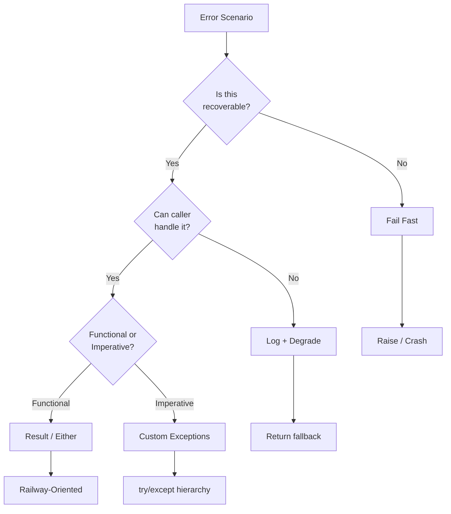

# 01 — Strategy & Exceptions

## Error Handling Strategy Selection



## Exceptions: Try/Except/Finally/Else

```python
try:
    result = risky_operation()
except ValueError as e:
    log.error(f"Invalid input: {e}")
    return fallback_value
except (IOError, OSError) as e:
    log.error(f"I/O error: {e}")
    raise  # Re-raise, don't swallow
except Exception as e:
    log.critical(f"Unexpected error: {e}")
    raise
else:
    log.info(f"Succeeded: {result}")
    return result
finally:
    cleanup()
```

### Raise From and Chaining

```python
def load_config(path: str) -> dict:
    try:
        with open(path) as f:
            return json.load(f)
    except FileNotFoundError as e:
        raise ConfigError(f"Config not found: {path}") from e
    except json.JSONDecodeError as e:
        raise ConfigError(f"Invalid JSON in {path}") from e

try:
    cfg = load_config("app.json")
except ConfigError as e:
    print(f"Caused by: {e.__cause__}")   # Original exception
    print(f"Chain: {e.__context__}")     # Previous exception
```

### Exception Handling Best Practices

| Practice | Why |
|----------|-----|
| Catch specific exceptions | Avoids masking bugs |
| Don't swallow exceptions silently | Makes debugging impossible |
| Use `raise ... from e` for chaining | Preserves root cause |
| Use `else` block | Separates success from error handling |
| Use `finally` for cleanup | Guarantees resource release |
| Never use bare `except:` | Catches `KeyboardInterrupt`, `SystemExit` too |

**Links**: [[Software-Engineering/Error Handling Patterns/02 Functional Error Handling]] | [[Software-Engineering/Error Handling Patterns/03 Retries, Degradation & Logging]] | [[Software-Engineering/Error Handling Patterns/05 Null Safety, Defensive & Async]]
**See also**: [[Clean Code Principles]], [[Debugging Strategies]]
