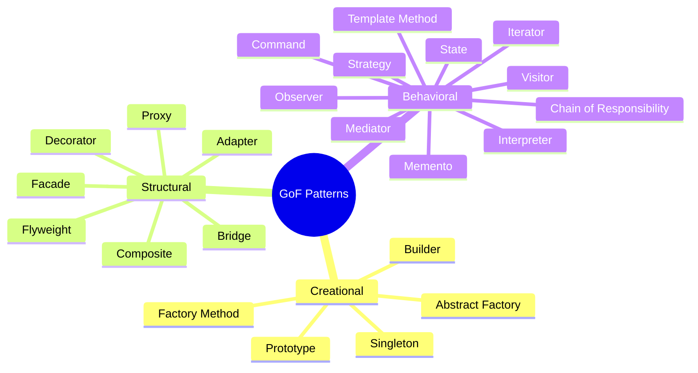
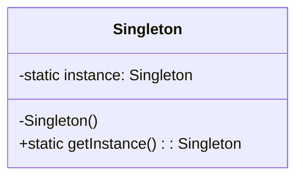
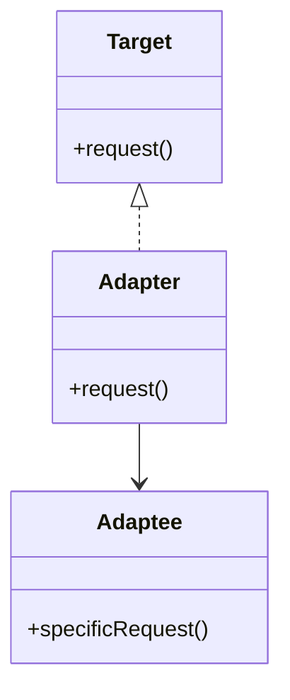
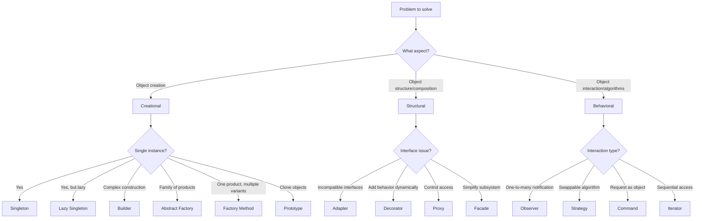

# GoF Design Patterns

Gang of Four patterns are reusable solutions to common software design problems. Catalogued in *Design Patterns: Elements of Reusable Object-Oriented Software* (1994), they remain foundational to [[Object-Oriented Programming]] and [[Software Design Principles]].

## Classification



## Creational Patterns

Creational patterns abstract the instantiation process, making a system independent of how its objects are created, composed, and represented.

### Singleton

**Intent**: Ensure a class has only one instance and provide a global point of access to it.

**Structure**:


**Python Implementation** (thread-safe with `threading.Lock`):

```python
import threading

class SingletonMeta(type):
    _instances = {}
    _lock = threading.Lock()

    def __call__(cls, *args, **kwargs):
        if cls not in cls._instances:
            with cls._lock:
                if cls not in cls._instances:
                    instance = super().__call__(*args, **kwargs)
                    cls._instances[cls] = instance
        return cls._instances[cls]

class Logger(metaclass=SingletonMeta):
    def log(self, msg: str) -> None:
        print(f"[LOG] {msg}")
```

**Module-level singleton**: In Python, modules are naturally singletons. A module `logger.py` with a top-level `logger = Logger()` instance is simpler and often preferred over metaclass-based singletons.

**When to use**:
- Managing shared resources (database connection pools, thread pools)
- Configuration objects that must be consistent across the app
- Logging, caching, and device drivers

**When NOT to use**:
- When it introduces global state that makes testing difficult (mocking becomes harder)
- When you need multiple instances later (e.g., multiple database connections to different hosts)
- In [[Functional Programming]] paradigms where pure functions and statelessness are preferred

**Drawbacks**: Hidden dependencies, global state, violated Single Responsibility Principle (they control creation *and* their own lifecycle), concurrency issues, tight coupling.

### Factory Method

**Intent**: Define an interface for creating an object, but let subclasses decide which class to instantiate.

```python
from abc import ABC, abstractmethod

class Transport(ABC):
    @abstractmethod
    def deliver(self) -> str: ...

class Truck(Transport):
    def deliver(self) -> str:
        return "Delivering by land in a truck"

class Ship(Transport):
    def deliver(self) -> str:
        return "Delivering by sea in a ship"

class Logistics(ABC):
    @abstractmethod
    def create_transport(self) -> Transport: ...

    def plan_delivery(self) -> str:
        transport = self.create_transport()
        return transport.deliver()

class RoadLogistics(Logistics):
    def create_transport(self) -> Transport:
        return Truck()

class SeaLogistics(Logistics):
    def create_transport(self) -> Transport:
        return Ship()
```

### Abstract Factory

**Intent**: Provide an interface for creating families of related or dependent objects without specifying their concrete classes.

```python
from abc import ABC, abstractmethod

class Button(ABC):
    @abstractmethod
    def paint(self): ...

class Checkbox(ABC):
    @abstractmethod
    def paint(self): ...

class WinButton(Button):
    def paint(self): print("Windows button")

class MacButton(Button):
    def paint(self): print("Mac button")

class WinCheckbox(Checkbox):
    def paint(self): print("Windows checkbox")

class MacCheckbox(Checkbox):
    def paint(self): print("Mac checkbox")

class GUIFactory(ABC):
    @abstractmethod
    def create_button(self) -> Button: ...
    @abstractmethod
    def create_checkbox(self) -> Checkbox: ...

class WinFactory(GUIFactory):
    def create_button(self) -> Button: return WinButton()
    def create_checkbox(self) -> Checkbox: return WinCheckbox()

class MacFactory(GUIFactory):
    def create_button(self) -> Button: return MacButton()
    def create_checkbox(self) -> Checkbox: return MacCheckbox()
```

| Aspect | Factory Method | Abstract Factory |
|--------|---------------|------------------|
| Scope | Single product | Product families |
| Implementation | Subclass overrides factory method | Composed factory objects |
| Complexity | Low | Medium |
| Flexibility | Subclass decides | Entire family swapped |

### Builder

**Intent**: Separate the construction of a complex object from its representation so the same construction process can create different representations.

**Fluent SQL Query Builder**:

```python
class SQLQueryBuilder:
    def __init__(self):
        self._select = ""
        self._from = ""
        self._where = []
        self._order_by = ""
        self._limit = 0

    def select(self, columns: str):
        self._select = f"SELECT {columns}"
        return self

    def from_table(self, table: str):
        self._from = f"FROM {table}"
        return self

    def where(self, condition: str):
        self._where.append(f"WHERE {condition}")
        return self

    def and_where(self, condition: str):
        self._where.append(f"AND {condition}")
        return self

    def order_by(self, column: str, direction: str = "ASC"):
        self._order_by = f"ORDER BY {column} {direction}"
        return self

    def limit(self, n: int):
        self._limit = n
        return self

    def build(self) -> str:
        query = f"{self._select} {self._from}"
        if self._where:
            query += " " + " ".join(self._where)
        if self._order_by:
            query += " " + self._order_by
        if self._limit:
            query += f" LIMIT {self._limit}"
        return query + ";"

# Usage
query = (SQLQueryBuilder()
         .select("id, name, email")
         .from_table("users")
         .where("active = 1")
         .and_where("created_at > '2024-01-01'")
         .order_by("name", "ASC")
         .limit(10)
         .build())
```

**When to use**: When an object requires many optional parameters, when construction steps vary, when you want to enforce a read-only object after construction.

### Prototype

**Intent**: Specify the kinds of objects to create using a prototypical instance and create new objects by copying this prototype.

```python
import copy
from typing import Self

class Document:
    def __init__(self, content: str, metadata: dict, tags: list[str]):
        self.content = content
        self.metadata = metadata
        self.tags = tags

    def clone_shallow(self) -> Self:
        return copy.copy(self)

    def clone_deep(self) -> Self:
        return copy.deepcopy(self)

original = Document("Hello", {"author": "Alice"}, ["draft"])
shallow = original.clone_shallow()
deep = original.clone_deep()

# shallow copy shares tags list; deep copy is fully independent
shallow.tags.append("reviewed")  # Affects original too!
deep.tags.append("final")       # Only affects deep copy
```

| Aspect | Shallow Copy | Deep Copy |
|--------|-------------|-----------|
| Nested objects | Shared references | Fully recursive copy |
| Performance | Fast, memory-efficient | Slower, more memory |
| When to use | Immutable children | Mutable nested structures |
| Python function | `copy.copy()` | `copy.deepcopy()` |

**When NOT to use**: When objects have circular references (deepcopy may be infinite) or when constructors are trivial and cheap.

## Structural Patterns

Structural patterns deal with object composition, creating relationships between entities to form larger structures.

### Adapter

**Intent**: Convert the interface of a class into another interface clients expect. Lets classes work together that couldn't otherwise due to incompatible interfaces.

**Object Adapter** (composition-based, preferred):

```python
class LegacyPrinter:
    """Old system with incompatible interface."""
    def print_legacy(self, text: str) -> None:
        print(f"Legacy: {text}")

class ModernLogger:
    """Expected target interface."""
    def log(self, message: str) -> None: ...

class PrinterAdapter(ModernLogger):
    def __init__(self, legacy: LegacyPrinter):
        self._legacy = legacy

    def log(self, message: str) -> None:
        self._legacy.print_legacy(message.upper())
```

**Class Adapter** (inheritance-based, Python multiple inheritance):

```python
class PrinterAdapter2(ModernLogger, LegacyPrinter):
    def log(self, message: str) -> None:
        self.print_legacy(message.upper())
```



Use when integrating legacy systems, third-party libraries, or when refactoring incrementally (as discussed in [[Refactoring Techniques]]).

### Decorator

**Intent**: Attach additional responsibilities to an object dynamically. Provides a flexible alternative to subclassing for extending functionality.

**Python-style decorator**:

```python
from functools import wraps
import time

def log_duration(func):
    @wraps(func)
    def wrapper(*args, **kwargs):
        start = time.perf_counter()
        result = func(*args, **kwargs)
        elapsed = time.perf_counter() - start
        print(f"{func.__name__} took {elapsed:.4f}s")
        return result
    return wrapper

@log_duration
def expensive_operation():
    return sum(range(10_000_000))
```

**Class-based middleware pattern** (e.g., Django middleware, as seen in [[API Gateway Patterns]]):

```python
class BaseMiddleware:
    def process(self, request):
        return request

class AuthMiddleware(BaseMiddleware):
    def __init__(self, inner: BaseMiddleware):
        self._inner = inner

    def process(self, request):
        if not request.get("token"):
            raise PermissionError("Unauthorized")
        return self._inner.process(request)

class LoggingMiddleware(BaseMiddleware):
    def __init__(self, inner: BaseMiddleware):
        self._inner = inner

    def process(self, request):
        print(f"Request: {request}")
        result = self._inner.process(request)
        print(f"Response: {result}")
        return result

# Chain them
handler = LoggingMiddleware(AuthMiddleware(BaseMiddleware()))
```

**When to use**: When responsibilities need to be added/removed at runtime, when subclassing would lead to an explosion of classes.

**When NOT to use**: When the decorator chain becomes too deep (hard to debug), when the object's identity matters (wrapping changes `type()`).

### Proxy

**Intent**: Provide a surrogate or placeholder for another object to control access to it.

**Virtual Proxy** (lazy loading):

```python
class HeavyImage:
    def __init__(self, filename: str):
        self.filename = filename
        self._load_from_disk()

    def _load_from_disk(self):
        print(f"Loading {self.filename} from disk...")
        time.sleep(2)

    def display(self):
        print(f"Displaying {self.filename}")

class ImageProxy:
    def __init__(self, filename: str):
        self.filename = filename
        self._real_image: HeavyImage | None = None

    def display(self):
        if self._real_image is None:
            self._real_image = HeavyImage(self.filename)
        self._real_image.display()

# Only loads when display() is called
img = ImageProxy("photo.jpg")
print("Image created, not yet loaded")
img.display()  # Loads here
```

**Protection Proxy** (access control):

```python
class BankAccount:
    def withdraw(self, amount: float):
        if amount > 0:
            print(f"Withdrew ${amount}")

class SecureBankProxy:
    def __init__(self, account: BankAccount, user_role: str):
        self._account = account
        self._role = user_role

    def withdraw(self, amount: float):
        if self._role != "admin":
            raise PermissionError("Only admins can withdraw")
        self._account.withdraw(amount)
```

**When to use**: Lazy initialization, access control, logging, caching, synchronization, remote communication (RPC proxy).

### Facade

**Intent**: Provide a unified interface to a set of interfaces in a subsystem. Defines a higher-level interface that makes the subsystem easier to use.

```python
class CPU:
    def freeze(self): print("CPU frozen")
    def jump(self, pos): print(f"Jump to {pos}")
    def execute(self): print("Executing...")

class Memory:
    def load(self, pos, data): print(f"Loaded {data} at {pos}")

class HardDrive:
    def read(self, pos, size): return f"data from {pos}"

class ComputerFacade:
    def __init__(self):
        self._cpu = CPU()
        self._memory = Memory()
        self._hd = HardDrive()

    def start(self):
        self._cpu.freeze()
        data = self._hd.read(0, 1024)
        self._memory.load(0, data)
        self._cpu.jump(0)
        self._cpu.execute()

# Simple, unified interface
ComputerFacade().start()
```

Facade parallels the [[API Gateway Patterns]] in microservices — a single entry point that routes to multiple backend services. It also relates to [[Clean Code Principles]] by hiding complexity behind well-named abstractions.

## Behavioral Patterns

Behavioral patterns concern algorithms and the assignment of responsibilities between objects.

### Observer

**Intent**: Define a one-to-many dependency between objects so that when one object changes state, all its dependents are notified and updated automatically.

```python
from abc import ABC, abstractmethod
from typing import Any

class Observer(ABC):
    @abstractmethod
    def update(self, event: str, data: Any): ...

class Subject:
    def __init__(self):
        self._observers: list[Observer] = []

    def attach(self, observer: Observer):
        self._observers.append(observer)

    def detach(self, observer: Observer):
        self._observers.remove(observer)

    def notify(self, event: str, data: Any = None):
        for obs in self._observers:
            obs.update(event, data)

class EmailNotifier(Observer):
    def update(self, event: str, data: Any):
        if event == "user_registered":
            print(f"Sending welcome email to {data['email']}")

class AuditLogger(Observer):
    def update(self, event: str, data: Any):
        print(f"[AUDIT] {event}: {data}")

# Usage
subject = Subject()
subject.attach(EmailNotifier())
subject.attach(AuditLogger())
subject.notify("user_registered", {"email": "alice@example.com"})
```

**Async pub/sub variant**:

```python
import asyncio
from collections import defaultdict

class AsyncEventBus:
    def __init__(self):
        self._handlers: dict[str, list] = defaultdict(list)

    def subscribe(self, event: str, handler):
        self._handlers[event].append(handler)

    async def publish(self, event: str, data):
        for handler in self._handlers[event]:
            await handler(data)

bus = AsyncEventBus()
bus.subscribe("order.placed", lambda d: asyncio.sleep(0.1))
```

Observer is the foundation of event-driven architectures, UI event listeners, [[Microservices Architecture]] message queues, and reactive programming.

### Strategy

**Intent**: Define a family of algorithms, encapsulate each one, and make them interchangeable. Strategy lets the algorithm vary independently from clients that use it.

```python
from abc import ABC, abstractmethod

class PaymentStrategy(ABC):
    @abstractmethod
    def pay(self, amount: float) -> str: ...

class CreditCardPayment(PaymentStrategy):
    def __init__(self, card_num: str):
        self._card = card_num

    def pay(self, amount: float) -> str:
        return f"Charged ${amount} to card {self._card[-4:]}"

class PayPalPayment(PaymentStrategy):
    def __init__(self, email: str):
        self._email = email

    def pay(self, amount: float) -> str:
        return f"Charged ${amount} via PayPal to {self._email}"

class CryptoPayment(PaymentStrategy):
    def pay(self, amount: float) -> str:
        return f"Charged ${amount} in Bitcoin"

class ShoppingCart:
    def __init__(self, strategy: PaymentStrategy):
        self._strategy = strategy

    def checkout(self, total: float) -> str:
        return self._strategy.pay(total)

cart = ShoppingCart(PayPalPayment("alice@example.com"))
print(cart.checkout(49.99))
```

**Comparison with Dependency Injection**: Strategy pattern and DI both inject behavior, but Strategy focuses on swappable algorithms at runtime, while DI focuses on wiring dependencies at construction time. You can use DI to inject a Strategy.

**Sorting example**:

```python
class SortingStrategy(ABC):
    @abstractmethod
    def sort(self, data: list) -> list: ...

class QuickSort(SortingStrategy):
    def sort(self, data: list) -> list:
        # quicksort implementation
        return sorted(data)

class BubbleSort(SortingStrategy):
    def sort(self, data: list) -> list:
        # bubble sort
        return data

class Sorter:
    def __init__(self, strategy: SortingStrategy):
        self._strategy = strategy

    def sort(self, data: list) -> list:
        return self._strategy.sort(data)
```

### Command

**Intent**: Encapsulate a request as an object, thereby letting you parameterize clients with different requests, queue or log requests, and support undoable operations.

```python
from abc import ABC, abstractmethod
from collections import deque

class Command(ABC):
    @abstractmethod
    def execute(self): ...
    @abstractmethod
    def undo(self): ...

class TextEditor:
    def __init__(self):
        self.content = ""

    def write(self, text: str):
        self.content += text

    def erase(self, n: int):
        self.content = self.content[:-n]

class WriteCommand(Command):
    def __init__(self, editor: TextEditor, text: str):
        self.editor = editor
        self.text = text

    def execute(self):
        self.editor.write(self.text)

    def undo(self):
        self.editor.erase(len(self.text))

class CommandHistory:
    def __init__(self):
        self._history: deque[Command] = deque(maxlen=100)

    def execute(self, cmd: Command):
        cmd.execute()
        self._history.append(cmd)

    def undo_last(self):
        if self._history:
            cmd = self._history.pop()
            cmd.undo()

editor = TextEditor()
history = CommandHistory()

history.execute(WriteCommand(editor, "Hello "))
history.execute(WriteCommand(editor, "World!"))
print(editor.content)  # Hello World!
history.undo_last()
print(editor.content)  # Hello
```

**Task queue / macro recording**: Batch multiple Commands into a macro:

```python
class MacroCommand(Command):
    def __init__(self, commands: list[Command]):
        self._commands = commands

    def execute(self):
        for cmd in self._commands:
            cmd.execute()

    def undo(self):
        for cmd in reversed(self._commands):
            cmd.undo()
```

Useful in UI undo/redo systems, transaction logging, batch job processing.

### Iterator

**Intent**: Provide a way to access the elements of an aggregate object sequentially without exposing its underlying representation.

**Python `__iter__` and `__next__`**:

```python
class Range:
    def __init__(self, start: int, end: int):
        self._start = start
        self._end = end

    def __iter__(self):
        self._current = self._start
        return self

    def __next__(self) -> int:
        if self._current >= self._end:
            raise StopIteration
        value = self._current
        self._current += 1
        return value

for n in Range(1, 5):
    print(n)  # 1, 2, 3, 4
```

**Generator-based (simpler)**:

```python
def fibonacci(limit: int):
    a, b = 0, 1
    for _ in range(limit):
        yield a
        a, b = b, a + b

print(list(fibonacci(10)))  # [0, 1, 1, 2, 3, 5, 8, 13, 21, 34]
```

Python's generators (`yield`) implement Iterator automatically. The iterator pattern is so ingrained in modern languages that it's often invisible — `for...of` in JS, `for..in` in Rust, `range` in Go.

## Modern Alternatives — When Patterns Are Less Necessary

| Language | Pattern | Modern Replacement |
|----------|---------|-------------------|
| Python | Singleton | Module-level constant, dependency injection |
| Python | Iterator | Generators, `__iter__` protocol built-in |
| Python | Strategy | First-class functions, functools.partial |
| Python | Command | `lambda`, `functools.partial`, coroutines |
| Go | Singleton | `sync.Once`, `init()` function |
| Go | Strategy | Function values (functions as parameters) |
| Go | Observer | Channels (`chan`), `sync.Cond` |
| Rust | Builder | `derive(Builder)` from `derive_builder` crate |
| Rust | Singleton | `once_cell::sync::Lazy` or `std::sync::OnceLock` |
| Rust | Strategy | Closures, trait objects, generics with turbofish |
| Rust | Iterator | `Iterator` trait — zero-cost abstractions |

Many GoF patterns address limitations of languages without first-class functions, closures, or traits. Modern [[Functional Programming]] idioms (map, filter, reduce, currying) often replace entire categories of behavioral patterns.

## Pattern Selection Decision Tree



## Anti-Patterns and Common Misuses

| Anti-Pattern | Description | Better Approach |
|-------------|-------------|-----------------|
| Singleton abuse | Replacing DI with global state everywhere | [[Dependency Injection]], module-level scoping |
| God Object facade | Facade becomes a god class owning too many subsystems | Split facades by domain |
| Strategy overload | Dozens of one-line strategy classes | First-class functions or lambdas |
| Decorator depth | 10+ nested decorators that are impossible to debug | Compose explicitly, limit nesting |
| Observer leaks | Subscribers never unsubscribed → memory leaks | Weak references, explicit lifecycle management |
| Command explosion | Thousands of command classes for UI actions | Functional approach: closures/partials |
| Factory for everything | Factories for simple objects | Direct construction or `__init_subclass__` |
| Parallel inheritance hierarchies | Adding a new product means adding 5+ new classes | Composition over inheritance, mixins |

## Links

**Links**: [[Software Design Principles]] | [[Code Architecture Patterns]] | [[Functional Programming]] | [[Clean Code Principles]] | [[Refactoring Techniques]] | [[Object-Oriented Programming]] | [[Domain-Driven Design]]

**See also**: [[React]] (Decorator = HOCs, Observer = hooks), [[API Gateway Patterns]] (Facade), [[Microservices Architecture]]
