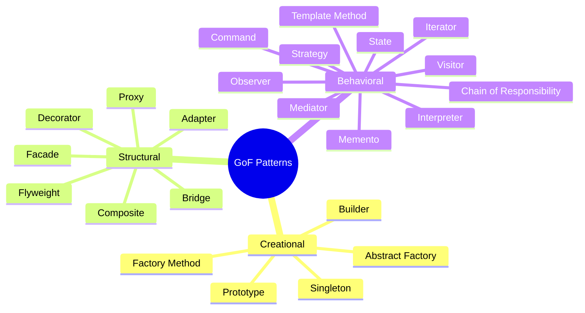

# 01 — Classification & Overview

## The 23 GoF Patterns

| Category | Focus | Patterns |
|----------|-------|----------|
| **Creational** | Object creation mechanisms | 5 |
| **Structural** | Object composition and relationships | 7 |
| **Behavioral** | Object interaction and responsibility | 11 |

**Links**: [[Software-Engineering/GoF Design Patterns/02 Creational Patterns]] | [[Software-Engineering/GoF Design Patterns/03 Structural Patterns]] | [[Software-Engineering/GoF Design Patterns/04 Behavioral Patterns]]
**See also**: [[Software Architecture Patterns]], [[Clean Code Principles]]
