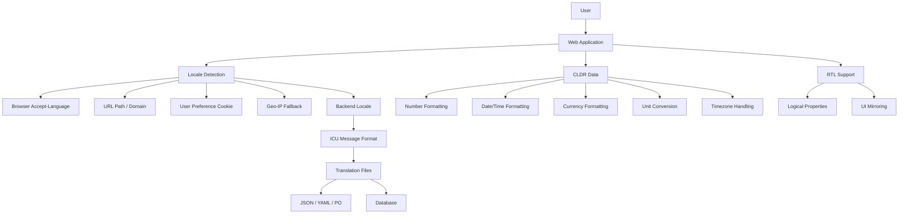

# Internationalization

**Links**: [[Web Development Fundamentals]] | [[Programming Language Paradigms]] | [[Programming Resources]] | [[Testing Guide]] | [[Unicode and Encoding]] | [[Regular Expressions]] | [[Web Accessibility]]

## What is i18n?

Internationalization (i18n) is designing software to support multiple languages and regions without code changes. Localization (l10n) is translating content for specific locales.

## i18n Architecture in a Web Application



## Key Concepts

| Term | Meaning | Example |
|------|---------|---------|
| **Locale** | Language + region | `en-US`, `fr-FR`, `ja-JP` |
| **ICU Message Format** | Standard for translations | `{count, plural, one {# item} other {# items}}` |
| **LTR/RTL** | Text direction | Arabic, Hebrew read right-to-left |
| **Plural Rules** | Language-specific plurals | 1 file, 2 files (English) vs 1, 2, 3 (Russian) |
| **CLDR** | Unicode Common Locale Data Repository | Standard locale data by Unicode Consortium |

## Locale and BCP 47

BCP 47 is the standard for language tags. The structure is:

```
language-script-region-variant-extension-privateuse
```

| Component | Example | Description |
|-----------|---------|-------------|
| **Language** (2-letter ISO 639-1) | `en`, `fr`, `ja` | Required. The base language. |
| **Script** (4-letter ISO 15924) | `Latn`, `Arab`, `Cyrl` | Optional. Writing system. |
| **Region** (2-letter ISO 3166-1) | `US`, `GB`, `FR` | Optional. Geographic region. |
| **Variant** | `1901`, `valencia` | Optional. Dialect or orthography. |

Examples:
- `en-US` - English as spoken in the United States
- `zh-Hans-CN` - Chinese, simplified script, China
- `sr-Cyrl-RS` - Serbian, Cyrillic script, Serbia
- `es-419` - Spanish, Latin America and Caribbean region

## ICU Message Format

ICU Message Format is the industry standard for writing translation messages with plural rules, gender, and selection.

### Full Syntax

```
{key, type, style}
```

| Type | Purpose | Example |
|------|---------|---------|
| `plural` | Plural rules | `{count, plural, one {# item} other {# items}}` |
| `select` | Gender / category | `{gender, select, male {He} female {She} other {They}}` |
| `selectordinal` | Ordinal numbers | `{pos, selectordinal, one {#st} two {#nd} few {#rd} other {#th}}` |
| `number` | Number formatting | `{price, number, ::currency/USD}` |
| `date` | Date formatting | `{date, date, medium}` |
| `time` | Time formatting | `{time, time, short}` |

### Plural Rule Examples

```icu
// English has: one, other
{count, plural, one {# file} other {# files}}

// Russian has: one, few, many, other
{count, plural, one {# файл} few {# файла} many {# файлов} other {# файла}}

// Arabic has: zero, one, two, few, many, other
{count, plural, zero {# ملف} one {# ملف} two {# ملفان} few {# ملفات} many {# ملف} other {# ملف}}
```

### Select and SelectOrdinal

```icu
// Gender-based greeting
{gender, select,
    male {Welcome, Mr. {lastName}}
    female {Welcome, Ms. {lastName}}
    other {Welcome, {firstName} {lastName}}
}

// Ordinal placement
You finished {position, selectordinal,
    one {#st}
    two {#nd}
    few {#rd}
    other {#th}
}
```

## CLDR Data

The Unicode CLDR (Common Locale Data Repository) provides locale-specific data for:

| Domain | Examples |
|--------|----------|
| **Numbers** | Decimal separators, grouping, negative sign patterns |
| **Dates** | Date formats (short, medium, long, full), first day of week |
| **Times** | 12h vs 24h, timezone names, AM/PM markers |
| **Currencies** | Symbols, ISO codes, decimal digits per currency |
| **Units** | Metric vs imperial, unit conversion, display names |
| **Timezones** | Zone names, daylight saving, GMT offsets |
| **Collation** | Sorting order per language |
| **Plural rules** | Cardinal and ordinal plural categories per locale |
| **Lists** | List formatting (and/or with Oxford comma rules) |

**Example**: CLDR specifies that `en-US` uses `$1,234.56` while `de-DE` uses `1.234,56 EUR`.

## Date/Time Formatting

### Approach Comparison

| Library | Bundle Size | Approach | Notes |
|---------|-------------|----------|-------|
| **moment.js** | ~300 KB (all locales) | Mutable API, heavy | Legacy. Deprecated. Avoid in new projects. |
| **date-fns** | ~10 KB (tree-shaken) | Functional, immutable | Popular for Node.js and frontend |
| **dayjs** | ~2 KB (core) | moment-compatible API | Lightweight moment replacement |
| **Intl API** | 0 KB (browser built-in) | Native, no dependency | Modern standard. Works everywhere. |
| **Luxon** | ~60 KB | Immutable, Intl-based | Modern moment successor |

### Intl.DateTimeFormat Examples

```javascript
// Browser-native date formatting - no library needed
const date = new Date("2024-03-15");

console.log(new Intl.DateTimeFormat("en-US").format(date));
// "3/15/2024"

console.log(new Intl.DateTimeFormat("de-DE").format(date));
// "15.3.2024"

console.log(new Intl.DateTimeFormat("ja-JP", {
  year: "numeric",
  month: "long",
  day: "numeric",
  weekday: "long"
}).format(date));
// "2024年3月15日金曜日"
```

### date-fns Example

```javascript
import { format } from "date-fns";
import { enUS, fr, de } from "date-fns/locale";

format(new Date(), "PPPP", { locale: enUS }); // "Saturday, March 15th, 2024"
format(new Date(), "PPPP", { locale: fr });    // "samedi 15 mars 2024"
format(new Date(), "PPPP", { locale: de });    // "Samstag, 15. März 2024"
```

## Number Formatting

### Intl.NumberFormat

```javascript
const value = 1234567.89;

// Currency
new Intl.NumberFormat("en-US", { style: "currency", currency: "USD" }).format(value);
// "$1,234,567.89"

new Intl.NumberFormat("de-DE", { style: "currency", currency: "EUR" }).format(value);
// "1.234.567,89 EUR"

// Percentages
new Intl.NumberFormat("en-US", { style: "percent", maximumFractionDigits: 1 }).format(0.875);
// "87.5%"

// Units (ES2020+)
new Intl.NumberFormat("en-US", { style: "unit", unit: "kilometer-per-hour" }).format(100);
// "100 km/h"

new Intl.NumberFormat("en-US", { style: "unit", unit: "mile-per-hour" }).format(60);
// "60 mph"
```

### CDR Plural Categories per Language

| Categories | Example Languages |
|------------|-------------------|
| 1 (one, other) | English, German, Dutch, Italian, Portuguese |
| 2 (one, other) | French, Spanish (yes, French has only 2: `one` for 0/1, `other` for 2+) |
| 3 (one, few, other) | Russian, Ukrainian, Croatian, Serbian |
| 4 (one, two, few, other) | Arabic (also has `zero`) |
| 5 (zero, one, two, few, many, other) | Arabic |

**Important**: Do not assume all languages follow English plural rules. Russian has different forms for 1, 2-4, 5-20, and 21+.

## RTL Support

Languages like Arabic, Hebrew, Persian, and Urdu read right-to-left. Supporting RTL requires more than just text alignment.

### CSS Logical Properties

Instead of physical directions (`left`, `right`), use logical properties:

```css
/* Physical - breaks in RTL */
.element {
  margin-left: 16px;
  padding-right: 8px;
  border-left: 1px solid #ccc;
  text-align: left;
}

/* Logical - works in both LTR and RTL */
.element {
  margin-inline-start: 16px;
  padding-inline-end: 8px;
  border-inline-start: 1px solid #ccc;
  text-align: start;
}
```

### CSS for RTL

```css
/* Using CSS custom properties for direction-aware values */
:root {
  --icon-arrow: url("arrow-right.svg");
}

[dir="rtl"] {
  --icon-arrow: url("arrow-left.svg");
}
```

### Things That Need Mirroring

- Icons with directional meaning (arrows, chevrons, back/forward buttons)
- Progress bars (should fill right-to-left in RTL)
- Text alignment in forms and tables
- Timeline/stepper components
- Carousel/slider navigation
- Chat UI (sent messages on right in LTR, left in RTL)

## i18n in Frontend

### Library Comparison

| Feature | i18next | react-intl | vue-i18n |
|---------|---------|------------|----------|
| **Framework** | Universal (React, Vue, Angular, plain JS) | React | Vue 2/3 |
| **ICU support** | Via i18next ICU module | Built-in | Built-in |
| **Plural rules** | Built-in | Built-in | Built-in |
| **Language detection** | Built-in (browser, cookie, path, querystring) | Manual | Manual |
| **Nested keys** | Yes (dot notation) | Flattened | Yes |
| **Lazy loading** | Built-in | Manual | Manual |
| **Interpolation** | `{{variable}}` | `{variable}` | `{variable}` |
| **Context** | Yes (gender, etc.) | Via ICU select | Via pluralization |
| **Bundle size** | ~8 KB | ~12 KB | ~6 KB (core) |
| **Backend integration** | i18next-fs-backend, i18next-http-backend | Manual | Manual |

### i18next Advanced Example

```javascript
import i18next from "i18next";

await i18next.init({
  lng: "fr",
  fallbackLng: "en",
  ns: ["common", "errors", "emails"],
  defaultNS: "common",
  resources: {
    fr: {
      common: {
        greeting: "Bonjour, {{name}}!",
        unread_messages: "{{count}} message non lu",
        unread_messages_plural: "{{count}} messages non lus"
      }
    }
  }
});

i18next.t("greeting", { name: "Marie" });
// "Bonjour, Marie!"

i18next.t("unread_messages", { count: 0 });
// "0 message non lu" (French uses 'one' for 0!)

i18next.t("unread_messages", { count: 5 });
// "5 messages non lus"
```

### react-intl Example

```tsx
import { IntlProvider, FormattedMessage, useIntl } from "react-intl";

const messages = {
  "app.greeting": "Hello, {name}!",
  "app.items": "You have {count, plural, one {# item} other {# items}}"
};

function App() {
  return (
    <IntlProvider locale="en" messages={messages}>
      <Welcome />
    </IntlProvider>
  );
}

function Welcome() {
  const intl = useIntl();
  return (
    <div>
      <FormattedMessage id="app.greeting" values={{ name: "Alice" }} />
      <p>{intl.formatMessage({ id: "app.items" }, { count: 3 })}</p>
    </div>
  );
}
```

## i18n in Backend

### Python - Django

```python
# settings.py
LANGUAGE_CODE = 'en-us'
USE_I18N = True
LOCALE_PATHS = [BASE_DIR / 'locale']

# views.py
from django.utils.translation import gettext as _

def index(request):
    output = _("Welcome to our site")
    return HttpResponse(output)

# Templates

<h1></h1>
<p>
    You have {{ counter }} message.

    You have {{ counter }} messages.
</p>
```

### Python - Flask-Babel

```python
from flask import Flask
from flask_babel import Babel, _

app = Flask(__name__)
babel = Babel(app)

@babel.localeselector
def get_locale():
    return request.accept_languages.best_match(['en', 'fr', 'de'])

@app.route('/')
def index():
    return _('Hello, World!')

# In templates
<p>{{ _('Welcome, %(name)s!', name=user.name) }}</p>
```

### Ruby on Rails

```ruby
# config/application.rb
config.i18n.available_locales = [:en, :fr, :ja]
config.i18n.default_locale = :en

# config/locales/fr.yml
fr:
  welcome: "Bienvenue"
  messages:
    unread:
      one: "Vous avez %{count} message non lu"
      other: "Vous avez %{count} messages non lus"

# In views
<%= t('welcome') %>
<%= t('messages.unread', count: @unread_count) %>
```

## Translation Management

### Tool Comparison

| Tool | Pricing | Key Features | Formats |
|------|---------|--------------|---------|
| **Crowdin** | Freemium | Screenshots, TM, MT integration, API | JSON, YAML, PO, XLIFF |
| **Lokalise** | Paid (free tier) | Auto-translation, QA checks, Figma plugin | JSON, YAML, PO, CSV |
| **Transifex** | Paid | TM, glossary, project per locale | JSON, YAML, PO, XLIFF |
| **POEditor** | Freemium | Inline suggestions, translation memory, API | JSON, PO, XLSX, XML |
| **Pontoon** | Free (Mozilla) | Open source, in-context editing | PO, JSON, properties |

### Translation Workflow

```
Developer → Extract strings → Upload to TMS → Translators → Reviewers → Download → PR → Deploy

1. Extract all translatable strings from code
2. Upload source language file to translation management system (TMS)
3. Translators/localize each locale
4. Reviewers verify quality and consistency
5. Download completed translation files
6. Submit PR with new translations
7. Deploy and verify
```

## Pseudo-localization

Pseudo-localization is a technique for testing i18n readiness without actual translations.

```javascript
// Pseudo-locale transformation
function pseudoLocalize(text) {
  // 1. Replace ASCII chars with accented equivalents
  // 2. Pad strings by 30% to simulate text expansion
  // 3. Add brackets to identify truncation
  return `[${text.replace(/[aeiou]/g, (c) => {
    return { a: "\u00e4", e: "\u00eb", i: "\u00ef", o: "\u00f6", u: "\u00fc" }[c];
  })}]`;
}
```

**What pseudo-l10n catches**:
- Hardcoded strings (they won't get pseudo-transformed)
- Text truncation (strings overflow containers)
- Missing text expansion allowance
- Concatenated strings (fragments don't make sense)
- RTL issues (brackets reveal alignment problems)

## AI-Powered Translation

Modern translation pipelines integrate machine translation APIs.

| Service | Quality | Cost | Custom Models |
|---------|---------|------|---------------|
| **DeepL** | Excellent (especially European languages) | Pay per character | No |
| **Google Translate** | Good, broad language coverage | Pay per character | AutoML Translation |
| **AWS Translate** | Good, integrated with AWS | Pay per character | Custom terminology |
| **OpenAI GPT-4** | Context-aware, handles idioms | Pay per token | Fine-tuning |

### Integration Pattern

```javascript
import translate from "@google-cloud/translate";

async function autoTranslate(keys, sourceLang, targetLang) {
  const client = new translate.v2.TranslateClient();

  for (const [key, value] of Object.entries(keys)) {
    const [translation] = await client.translate(value, {
      from: sourceLang,
      to: targetLang,
    });

    // Post-process: check glossary, apply term consistency
    translatedKeys[key] = translation.replace(/CompanyName/g, "NomSociete");
  }

  return translatedKeys;
}
```

**Best practice**: Use AI for first-pass translation, then human review. Never ship raw MT without verification.

## Performance

### Lazy Loading Locales

```javascript
// Instead of loading all locales upfront:
import { format } from "date-fns";
import { enUS, fr, de } from "date-fns/locale"; // all loaded eagerly

// Use dynamic imports:
async function formatLocalized(date, formatStr, localeCode) {
  const locales = {
    en: () => import("date-fns/locale/en-US").then(m => m.default),
    fr: () => import("date-fns/locale/fr").then(m => m.default),
    de: () => import("date-fns/locale/de").then(m => m.default),
  };
  const locale = await locales[localeCode]();
  return format(date, formatStr, { locale });
}
```

### Tree-Shaking Translations

With i18next and webpack/vite:

```javascript
// Only include supported locales in the bundle
import i18next from "i18next";
import { LANGUAGES } from "./config";

LANGUAGES.forEach((lang) => {
  import(`./locales/${lang}.json`).then((resources) => {
    i18next.addResourceBundle(lang, "translation", resources);
  });
});
```

### Bundle Size Optimization Tips

| Technique | Savings |
|-----------|---------|
| Load translations by namespace, not all at once | 60-80% initial load reduction |
| Compress translation JSON | 70-90% size reduction |
| Server-side rendering with locale | Eliminate client-side load |
| CDN caching per locale | Reduce origin load |
| Split locales into chunks | Lazy load non-primary locales |

## Accessibility and i18n

### ARIA Labels in Multiple Languages

ARIA labels must also be translated. They are user-facing text.

```tsx
function SearchButton() {
  const { t } = useTranslation();

  return (
    <button aria-label={t("search.label")}>
      <SearchIcon />
    </button>
  );
}
```

### Accessibility Checklist for i18n

- [ ] All ARIA labels are extracted to translation files
- [ ] `lang` attribute on `<html>` matches current locale
- [ ] Page title is translated
- [ ] Error messages are translated
- [ ] Alt text for images is localized
- [ ] Date/time announcements use localized formats
- [ ] Number announcements (screen readers) use localized patterns
- [ ] RTL pages have `dir="rtl"` on the root element
- [ ] Font supports non-Latin character sets (CJK, Arabic, Devanagari)
- [ ] Line height accommodates text expansion (CJK text is denser, Arabic text is taller)

## Testing i18n

### Snapshot Tests per Locale

```javascript
test("renders greeting in all locales", () => {
  const locales = ["en", "fr", "de", "ja"];

  locales.forEach((locale) => {
    const { container } = render(
      <IntlProvider locale={locale} messages={messages[locale]}>
        <Greeting name="World" />
      </IntlProvider>
    );
    expect(container).toMatchSnapshot(locale);
  });
});
```

### Visual Regression Testing

```javascript
// With Storybook + Chromatic
export const English = () => <MyComponent />;
English.parameters = { locale: "en" };

export const French = () => <MyComponent />;
French.parameters = { locale: "fr" };

export const Arabic = () => <MyComponent />;
Arabic.parameters = { locale: "ar", direction: "rtl" };
```

### Common i18n Bugs to Test

| Bug | How to Catch |
|-----|--------------|
| Missing translation key | Enable development mode with key display fallback |
| Text overflow | Pseudo-localization, visual testing with long strings |
| Concatenated strings | Lint rules against string concatenation with translatable text |
| Missing plural forms | Test every plural category (0, 1, 2, 3, 5, 100) |
| Hardcoded strings | i18n linting tools (eslint-plugin-i18n) |
| Wrong date format | Test dates with `en-US`, `de-DE`, `ja-JP` side by side |

## Python Example (gettext)

```python
import gettext

# Set locale
lang = gettext.translation('messages', localedir='locale', languages=['fr'])
lang.install()

# In code
print(gettext("Hello, world!"))      # French: "Bonjour, le monde!"
print(gettext("You have %d new messages") % count)
```

## JavaScript Example (i18next)

```javascript
import i18next from 'i18next';

i18next.init({
  lng: 'fr',
  resources: {
    fr: {
      translation: {
        "welcome": "Bienvenue",
        "items": "{{count}} élément",
        "items_plural": "{{count}} éléments",
        "context": "I have {{count}} items"
      }
    }
  }
});

i18next.t('welcome');                    // "Bienvenue"
i18next.t('items', {count: 5});          // "5 éléments"
```

## Translation File Structure

```json
// locale/fr/translation.json
{
  "common": {
    "save": "Enregistrer",
    "cancel": "Annuler",
    "delete": "Supprimer"
  },
  "errors": {
    "not_found": "Page non trouvée",
    "server_error": "Erreur du serveur"
  }
}
```

## Best Practices

- Extract all user-facing strings into translation files - never hardcode
- Use message IDs, not translated text, as keys
- Support pluralization and gender rules
- Allow for text expansion (German text can be 30% longer)
- Test with all supported locales during QA
- Use a translation management system for scale
- Pseudo-localize early in development
- Keep translations in version control alongside code
- Use CI checks to catch missing translations

## Further Reading

- [[Unicode and Encoding]]
- [[Web Development Fundamentals]]
- [[Regular Expressions]]
- [[Web Accessibility]]
