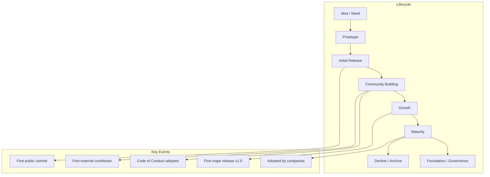
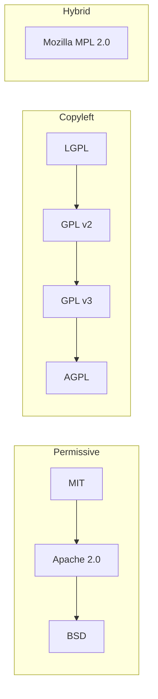
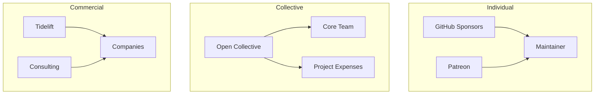

# Open Source

**Links**: [[Git Pull Requests]] | [[Git Workflows]] | [[Code Review Best Practices]] | [[Developer Workflow Automation]] | [[Documentation]] | [[Technical Writing]] | [[Developer Experience]]

Open source software (OSS) is software with publicly accessible source code that anyone can inspect, modify, and distribute.

## Open Source Project Lifecycle



## Open Source Licenses

### Permissive vs Copyleft Deep Dive



| License | Type | Requirements | Patent Grant | Network Clause |
|---------|------|-------------|--------------|----------------|
| **MIT** | Permissive | Include copyright notice | No | No |
| **Apache 2.0** | Permissive | Include notice, state changes | Yes | No |
| **BSD 2-Clause** | Permissive | Include notice | No | No |
| **BSD 3-Clause** | Permissive | Include notice, no endorsement | No | No |
| **ISC** | Permissive | Include notice | No | No |
| **Unlicense** | Public domain | None | No | No |
| **LGPL** | Weak copyleft | Share changes to library, link from proprietary | No | No |
| **MPL 2.0** | File-level copyleft | Share changes to modified files | Yes | No |
| **GPL v2** | Copyleft | Distribute source with modifications | No | No |
| **GPL v3** | Copyleft | Distribute source with modifications | Yes | No |
| **AGPL** | Strong copyleft | Share source even over network | Yes | Yes |

### License Compatibility Matrix

| Can use code licensed under... | With code under... | Result |
|--------------------------------|--------------------|--------|
| MIT | GPL v2/v3 | Compatible (GPL accepts MIT) |
| Apache 2.0 | GPL v3 | Compatible (GPL v3 is compatible with Apache 2.0) |
| Apache 2.0 | GPL v2 | Incompatible (*must use GPL v3*) |
| BSD | Any | Compatible |
| LGPL | Proprietary | Compatible (dynamic linking) |
| GPL | Proprietary | Incompatible (cannot relicense) |
| AGPL | GPL v3 | Compatible |
| MPL 2.0 | GPL v3 | Compatible |
| MPL 2.0 | Proprietary | Compatible (file-level copyleft) |

### Choosing a License - Decision Tree

```
Is the project open to all?
├── Yes → Do you want changes shared back?
│   ├── Yes → Is it a library?
│   │   ├── Yes → LGPL or MPL 2.0
│   │   └── No → Is network use a concern?
│   │       ├── Yes → AGPL
│   │       └── No → GPL v3
│   └── No → Do you need patent protection?
│       ├── Yes → Apache 2.0
│       └── No → MIT
└── No (internal/company) → Proprietary or Inner Source license
```

## Starting an Open Source Project

### Naming and Branding

- Choose a name that is memorable, searchable, and not trademarked
- Check npm, PyPI, GitHub, crates.io for name conflicts
- Consider a domain name for the project website
- Create a logo and consistent visual identity

### Repository Setup

```
my-project/
├── README.md           # Project overview and quick start
├── CONTRIBUTING.md     # How to contribute
├── CODE_OF_CONDUCT.md  # Expected behavior
├── SECURITY.md         # How to report vulnerabilities
├── LICENSE             # License file (required!)
├── CHANGELOG.md        # Release history
├── .github/
│   ├── ISSUE_TEMPLATE/ # Bug report and feature request templates
│   │   ├── bug_report.md
│   │   └── feature_request.md
│   └── PULL_REQUEST_TEMPLATE.md
├── docs/               # Documentation site source
├── src/                # Source code
├── tests/              # Test suite
└── examples/           # Usage examples
```

### The Initial Commit

The first commit should include:

1. A working prototype (even if minimal)
2. A README with installation and usage instructions
3. A LICENSE file
4. Test coverage
5. CI/CD configuration
6. Issue and PR templates

**Do not** start with an empty repo and a "Coming Soon" README. People contribute to working software, not ideas.

## Community Building

### Code of Conduct

A Code of Conduct sets expectations for community behavior. Popular choices:

| Template | Organization | Adoption |
|----------|--------------|----------|
| **Contributor Covenant** | Coraline Ada Ehmke | Most widely adopted (Linux, Kubernetes, Rails) |
| **Citizen Code of Conduct** | Stumptown Syndicate | Simpler, less formal |
| **LLVM Code of Conduct** | LLVM Foundation | Less restrictive |

**Enforcement**: A CoC without enforcement is worse than none at all. Designate a reporting channel and maintainers to handle violations privately and fairly.

### Contributing Guide (CONTRIBUTING.md)

```markdown
# Contributing to MyProject

## Getting Started
1. Fork the repository
2. Clone your fork: `git clone https://github.com/YOUR_USERNAME/myproject.git`
3. Install dependencies: `npm install`
4. Run tests: `npm test`

## Making Changes
1. Create a feature branch: `git checkout -b feat/my-feature`
2. Make your changes
3. Write/update tests
4. Run the full test suite
5. Commit with [Conventional Commits](https://www.conventionalcommits.org/) style

## Submitting a PR
1. Push to your fork
2. Open a pull request
3. Fill out the PR template
4. Ensure CI passes
5. Respond to reviewer feedback
```

### Issue Templates

Well-structured issue templates reduce maintainer burden:

```yaml
# .github/ISSUE_TEMPLATE/bug_report.md
---
name: Bug Report
about: Create a report to help us improve
title: ''
labels: bug
assignees: ''

---
**Describe the bug**
A clear and concise description of what the bug is.

**To Reproduce**
Steps to reproduce the behavior.

**Expected behavior**
What you expected to happen.

**Environment**
- OS: [e.g. Ubuntu 22.04]
- Version: [e.g. 1.2.3]

**Additional context**
Logs, screenshots, etc.
```

## Maintainership

### Dealing with Burnout

Open source maintenance is unpaid labor for most. Burnout is the #1 reason projects die.

**Warning signs**:
- Dreading GitHub notifications
- Feeling guilty about unmerged PRs
- Snapping at contributors
- Neglecting self-care

**Strategies**:
- Set clear response time expectations (e.g., "I respond within 2 weeks")
- Use GitHub labels to triage: `good first issue`, `help wanted`, `needs discussion`
- Enable GitHub Actions for automation (CI, dependabot, stale bot)
- Recruit co-maintainers early
- Take breaks - the project will survive without you for a week
- Consider moving to a foundation if the project becomes too large

### Saying No

| Scenario | How to Say No |
|----------|---------------|
| Feature request outside scope | "That's outside the project's scope, but here's a workaround..." |
| Low-quality PR | "Thanks for contributing! The approach needs some changes - here's what I'd suggest..." |
| Entitled demands | "I maintain this project in my free time. Here are the contribution guidelines." |
| Abusive behavior | "This violates our Code of Conduct. Please review it before continuing." |

### Setting Boundaries

- Use issue labels and auto-close stale issues after 30-60 days
- Document the release process so others can help
- Use `.github/CODEOWNERS` to delegate responsibility
- Protect main branch with required reviews and CI checks
- Write a GOVERNANCE.md if you share control

## Funding

| Source | Best For | Platform Fee |
|--------|----------|--------------|
| **GitHub Sponsors** | Individual maintainers | 0% (first year), then 6% |
| **Open Collective** | Transparent team funding | 10% + payment processing |
| **Patreon** | Monthly recurring | 5-12% depending on tier |
| **Ko-fi** | One-time donations | 0% (payment fees only) |
| **Tidelift** | Professional OSS support | Platform negotiates with companies |
| **Grants** | Large feature work | Varies (Sloan, NLNet, ARDC, etc.) |

### Funding Model Comparison



## Security

### Reporting Vulnerabilities

Create a `SECURITY.md` file at the project root:

```markdown
# Security Policy

## Reporting a Vulnerability

If you discover a security vulnerability, please do NOT open a public issue.

Instead, send an email to: security@myproject.dev

We will acknowledge receipt within 48 hours and provide a timeline for a fix.

## Disclosure Policy

- We will coordinate the fix before public disclosure
- We will credit reporters in release notes (unless anonymity is requested)
- We aim to release fixes within 90 days of notification
```

### Embargo Process

When a vulnerability is reported:

1. Triage within 24-48 hours
2. Develop fix on a private branch
3. Request CVE identifier (via MITRE or GitHub Security Advisories)
4. Coordinate disclosure date with reporter
5. Release fix and publish advisory simultaneously

### GitHub Security Advisories

GitHub provides a private channel for vulnerability disclosure:

- Draft advisory privately
- Invite collaborators to review
- Request CVE via GitHub UI
- Publish advisory at the same time as the fix release

## Release Management

### Semantic Versioning (SemVer)

```
MAJOR.MINOR.PATCH
   |      |      |
   |      |      +-- Backward-compatible bug fixes
   |      +--------- Backward-compatible new features
   +---------------- Breaking changes
```

| Version | Meaning |
|---------|---------|
| `1.0.0` | First stable release |
| `1.2.0` | Added new feature (backward-compatible) |
| `1.2.1` | Bug fix (backward-compatible) |
| `2.0.0` | Breaking API change |

### Pre-release versions

```
1.0.0-alpha.1
1.0.0-beta.1
1.0.0-rc.1  (release candidate)
```

### Changelog

Use Keep a Changelog format:

```markdown
# Changelog

## [2.0.0] - 2024-03-15

### Added
- New authentication API with OAuth 2.0 support
- Rate limiting middleware

### Changed
- API responses now use JSON:API format (breaking)
- Minimum Node.js version raised to 18.x

### Fixed
- Memory leak in WebSocket connections
- Race condition in file upload handler

### Removed
- Deprecated v1 API endpoints
```

### Release Automation

```yaml
# .github/workflows/release.yml
name: Release
on:
  push:
    tags:
      - 'v*'
jobs:
  release:
    runs-on: ubuntu-latest
    steps:
      - uses: actions/checkout@v4
      - run: npm ci
      - run: npm test
      - run: npm run build
      - uses: softprops/action-gh-release@v1
        with:
          generate_release_notes: true
          files: dist/*
```

## Governance Models

| Model | Description | Examples | Pros | Cons |
|-------|-------------|----------|------|------|
| **BDFL** | Benevolent Dictator for Life. One person has final say. | Linux (Linus), Python (Guido), Go (Russ Cox) | Fast decisions, strong vision | Bus factor, single point of failure |
| **Meritocracy** | Contributors earn voting rights through contributions | Apache Foundation, Eclipse | Fair, community-driven | Slow decisions, politics |
| **Foundation** | Neutral non-profit owns the project | CNCF (Kubernetes), Node.js Foundation, Rust Foundation | Legal protection, vendor-neutral | Bureaucracy, overhead |
| **Corporate** | Company controls development | React (Meta), Angular (Google), VS Code (Microsoft) | Dedicated resources | Company priorities may not align with community |
| **Do-ocracy** | Those who do the work make decisions | Small projects, tools | Simple, effective | Scales poorly |

### Governance Comparison Table

| Aspect | BDFL | Meritocracy | Foundation | Corporate |
|--------|------|-------------|------------|-----------|
| **Decision speed** | Fast | Slow | Slow | Fast |
| **Community power** | Low | High | High | Low |
| **Sustainability** | Low (depends on one person) | Medium | High | High |
| **Vendor neutrality** | Low | High | High | Low |
| **Best for** | Early-stage projects | Established communities | Critical infrastructure | Internal tools, large frameworks |

## Documentation

### README

A great README answers four questions:

1. **What is this?** - One-line description
2. **Why should I use it?** - Differentiator, benefits
3. **How do I get started?** - Installation, quick start example
4. **How do I contribute?** - Link to CONTRIBUTING.md

### README Template

```markdown
# Project Name

[![CI][ci-badge]][ci-link]
[![npm][npm-badge]][npm-link]
[![License][license-badge]][license-link]

One-paragraph description of what this project does and why it exists.

## Installation
```bash
npm install my-project
```

## Usage
```javascript
import { myFunction } from 'my-project';

myFunction({ option: true });
// => result
```

## API

### `myFunction(options)`
- `options.foo` (string): Description
- Returns: `Promise<Result>`

## Contributing
See [CONTRIBUTING.md](CONTRIBUTING.md).

## License
MIT © Your Name
```

### Documentation Site

| Tool | Language | Hosting |
|------|----------|---------|
| **Docusaurus** | React | GitHub Pages, Netlify |
| **VitePress** | Vue | GitHub Pages, Netlify |
| **MkDocs** | Python | Read the Docs |
| **Sphinx** | Python | Read the Docs |
| **Docsify** | JavaScript | GitHub Pages |
| **mdBook** | Rust | GitHub Pages |

**Essential pages**:
- Getting Started / Quick Start
- Installation
- API Reference
- Guides / Tutorials
- FAQ
- Changelog

## Open Source in Companies

### Inner Source

Inner source applies open source practices to internal code within a company.

- Internal repos are visible to all developers
- Anyone can submit a PR to any internal project
- Internal maintainers review and merge
- Shared tooling and CI standards
- Reduces silos and duplicate effort

### Open Source Program Office (OSPO)

An OSPO manages a company's open source strategy:

| Function | Responsibilities |
|----------|------------------|
| **Compliance** | License audits, dependency monitoring |
| **Publishing** | Manage open sourcing internal projects |
| **Contributing** | Guide employees on contributing to external OSS |
| **Security** | Vulnerability management, CVE response |
| **Community** | Relationship with foundations, communities |
| **Legal** | Trademark management, CLA administration |

**Companies with OSPOs**: Google (Open Source Programs Office), Meta (Open Source), Microsoft (Open Source Programs Office), Netflix, Spotify, Uber.

## Legal Considerations

### Trademarks

- Project name and logo can be trademarked even under an open source license
- The license covers code, not the brand
- Consider registering the trademark if the project grows
- Set clear guidelines for logo usage in a BRAND.md or TRADEMARKS.md

### Contributor License Agreements (CLAs)

| Type | Description | Used By |
|------|-------------|---------|
| **Individual CLA** | Signed by each contributor | Apache, Eclipse |
| **Corporate CLA** | Signed by employer, covers all employees | Google, Meta |
| **Developer Certificate of Origin (DCO)** | Signed-off-by line in commits (no separate CLA) | Linux Kernel, CNCF |

**DCO is preferred** because it is lighter weight. It simply certifies that the contributor has the right to submit the code.

```
Signed-off-by: Jane Doe <jane@example.com>
```

The DCO says: "I certify that I created this contribution or have the right to submit it under the project's license."

## Contribution Workflow

```
Fork → Clone → Branch → Commit → Push → PR → Review → Merge
```

### Detailed Workflow

1. Fork the repository on GitHub
2. Clone your fork: `git clone https://github.com/YOUR_USERNAME/project.git`
3. Add upstream remote: `git remote add upstream https://github.com/ORIGINAL_OWNER/project.git`
4. Create a feature branch: `git checkout -b feat/my-feature`
5. Make changes and commit with conventional commits
6. Sync with upstream: `git fetch upstream && git rebase upstream/main`
7. Push to your fork: `git push origin feat/my-feature`
8. Open a pull request via GitHub UI
9. Respond to reviewer feedback
10. Squash commits and merge

## Good First Contributions

| Area | Examples |
|------|----------|
| **Documentation** | Fix typos, improve examples |
| **Tests** | Add test coverage |
| **Bugs** | Good-first-issue labels |
| **Localization** | Translate strings |
| **Refactoring** | Improve code quality |

## PR Etiquette

- Keep PRs small and focused
- Write descriptive title and body
- Link to related issue
- Respond to review feedback promptly
- Squash commits before merge
- Ensure CI passes
- Respect the project's commit style
- Do not force-push on open PRs unless asked

## Sustainability

- **Funding**: Sponsors (GitHub Sponsors, Open Collective), grants, consulting
- **Burnout**: Maintainers face high pressure - set boundaries
- **Community**: Contributors come and go; documentation reduces bus factor
- **Automation**: CI/CD, dependabot, issue templates reduce maintainer load

## Resources

- Choose a License: choosealicense.com
- Open Source Guides: opensource.guide
- GitHub Open Source: github.com/open-source
- Open Source Insights: ossinsight.io
- Bestie: bestie.js.org
- First Timers Only: firsttimersonly.com

## Further Reading

- [[Git Pull Requests]]
- [[Git Workflows]]
- [[Code Review Best Practices]]
- [[Technical Writing]]
- [[Developer Experience]]
