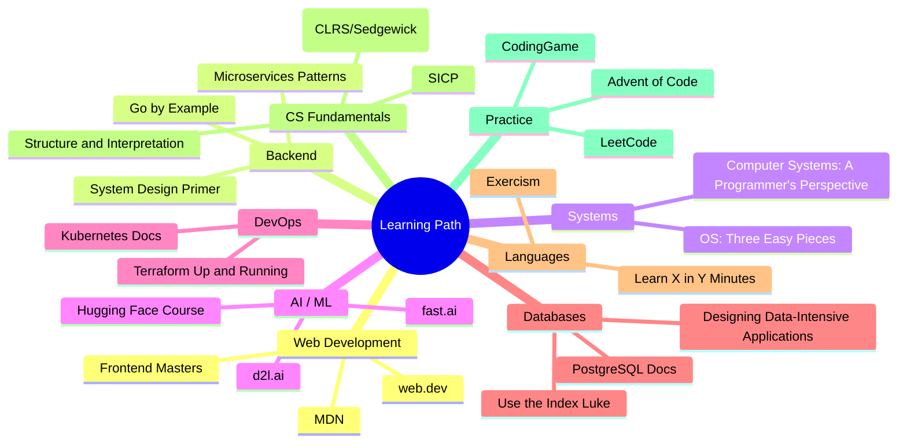

# Programming Resources

Curated collection of learning resources for software development. Each entry includes an annotation explaining why it's worth your time.

## Web Development

### Documentation & References

- [MDN Web Docs](https://developer.mozilla.org/) — The definitive reference for HTML, CSS, and JavaScript. Every web developer has this open constantly. More reliable than any other source.
- [web.dev](https://web.dev/) — Google's curated guides on modern web capabilities, performance (Core Web Vitals), and PWA best practices.
- [Can I Use](https://caniuse.com/) — Browser support tables for web features. Always check before using a new CSS/JS API in production.

### Courses

- [Frontend Masters](https://frontendmasters.com/) — High-quality, deep-dive courses from industry experts (Rich Harris, Kyle Simpson, Will Sentance). Worth the subscription.
- [The Odin Project](https://www.theodinproject.com/) — Free full-stack curriculum covering HTML/CSS/JS/Node/Rails. Project-based and comprehensive.
- [Full Stack Open](https://fullstackopen.com/) — University of Helsinki's free course on React, Node.js, GraphQL, and modern web dev. Excellent depth.

### CSS

- [CSS-Tricks](https://css-tricks.com/) — Classic reference with clear explanations of layout (Flexbox, Grid), animations, and techniques.
- [Josh W Comeau's CSS Course](https://www.joshwcomeau.com/) — Interactive, visually rich CSS tutorials that build deep intuition for layout and animations.

## Backend Development

### System Design

- [System Design Primer](https://github.com/donnemartin/system-design-primer) — The most comprehensive free resource for learning system design. Covers scaling, databases, caching, load balancing, and CDN patterns.
- [ByteByteGo](https://bytebytego.com/) — Visual explanations of system design concepts. Their newsletter and YouTube channel are excellent for interview prep.
- [Microservices Patterns (Chris Richardson)](https://microservices.io/) — Patterns for decomposing monoliths, saga orchestration, CQRS, and event sourcing.

### API Design

- [REST API Tutorial](https://restfulapi.net/) — Covers REST constraints, resource naming, HTTP methods, and status codes.
- [OpenAPI Specification](https://spec.openapis.org/oas/latest.html) — The standard for describing HTTP APIs. Learn this to document and generate API clients automatically.
- [GraphQL Docs](https://graphql.org/learn/) — Official GraphQL learning path covering schemas, resolvers, and practical patterns.

## Systems Programming

### Operating Systems

- [Operating Systems: Three Easy Pieces](https://pages.cs.wisc.edu/~remzi/OSTEP/) — The best free OS textbook. Covers virtualization, concurrency, and persistence with clarity. Read this if you want to understand how your code actually runs.
- [Computer Systems: A Programmer's Perspective (CS:APP)](https://csapp.cs.cmu.edu/) — CMU's legendary course. Bridges the gap between high-level languages and what the hardware actually does.

### Low-Level Learning

- [Learn x86-64 Assembly by Building a GUI](https://viewsourcecode.org/snaptoken/kilo/) — Walks through building a text editor in C, teaching systems programming fundamentals.
- [Beej's Guide to Network Programming](https://beej.us/guide/bgnet/) — The classic sockets programming guide. Still the best introduction to POSIX networking.
- [Let's Build a Compiler](https://compilers.iecc.com/crenshaw/) — Walks through building a compiler from scratch. Teaches parsing, code generation, and optimization.

## AI / Machine Learning

### Courses

- [Hugging Face NLP Course](https://huggingface.co/learn/nlp-course) — Best practical introduction to transformers and modern NLP. Uses the Hugging Face ecosystem (transformers, datasets, tokenizers).
- [fast.ai Practical Deep Learning](https://www.fast.ai/) — Top-down approach: start with working code, understand theory as you go. Teaches PyTorch and modern ML practices.
- [D2L (Dive into Deep Learning)](https://d2l.ai/) — Interactive deep learning textbook with executable code in PyTorch, TensorFlow, and JAX. Strong on theory + practice.
- [Andrej Karpathy's Neural Networks: Zero to Hero](https://karpathy.ai/zero-to-hero.html) — Build neural networks from scratch in Python. Best for truly understanding what's happening under the hood.

### Tools & Libraries

- [LangChain Docs](https://python.langchain.com/docs/) — Framework for building LLM applications: chains, agents, RAG, and tool use. Essential for production LLM work.
- [Sentence-Transformers](https://www.sbert.net/) — State-of-the-art embedding models for semantic similarity, clustering, and retrieval. Use this for any text similarity task.
- [Papers With Code](https://paperswithcode.com/) — Research papers + code implementations + benchmark results. Best way to find state-of-the-art for any ML task.

## DevOps & Infrastructure

### Containers & Orchestration

- [Kubernetes Documentation](https://kubernetes.io/docs/) — The official docs are surprisingly good. Start with concepts, then try the interactive tutorials.
- [Docker Docs](https://docs.docker.com/) — Docker's official documentation. The "Get Started" guide is the best onboarding.
- [Kubernetes The Hard Way](https://github.com/kelseyhightower/kubernetes-the-hard-way) — Bootstrap K8s from scratch without automation. Teaches what every component actually does.

### Infrastructure as Code

- [Terraform Up and Running (Yevgeniy Brikman)](https://www.terraformupandrunning.com/) — Best book on Terraform. Covers modules, state management, and production patterns.
- [Pulumi Documentation](https://www.pulumi.com/docs/) — Infrastructure as code using real programming languages (Python, TypeScript, Go). Alternative to Terraform's HCL.

### CI/CD

- [GitHub Actions Docs](https://docs.github.com/en/actions) — Comprehensive workflow automation reference.
- [The DevOps Handbook](https://itrevolution.com/devops-handbook/) — Cultural and process aspects of DevOps: deployment frequency, lead time, and reliability.

## Databases

- [PostgreSQL Documentation](https://www.postgresql.org/docs/) — The gold standard for database docs. The "Performance Tips" and "Index Types" sections are must-reads.
- [Use The Index, Luke](https://use-the-index-luke.com/) — Everything you need to know about SQL indexing explained clearly. If you write database queries, read this.
- [SQLite Documentation](https://www.sqlite.org/docs.html) — Excellent, thorough docs for the world's most deployed database engine.
- [Designing Data-Intensive Applications (Martin Kleppmann)](https://dataintensive.net/) — The single best book on distributed systems and data storage. Covers replication, partitioning, transactions, and consensus.
- [High Performance MySQL](https://www.oreilly.com/library/view/high-performance-mysql/9781449332471/) — The definitive guide to MySQL performance tuning, schema design, and query optimization.
- [pgvector](https://github.com/pgvector/pgvector) — Vector similarity search as a PostgreSQL extension. Use for semantic search and RAG without a separate vector database.

## Programming Languages

### Learn a New Language

- [Learn X in Y Minutes](https://learnxinyminutes.com/) — One-page syntax overviews for almost every language. Great for getting the syntax down in 15 minutes.
- [Exercism](https://exercism.org/) — Practice exercises with mentor feedback in 70+ languages. Free. The mentoring is what makes it special.
- [Tour of Go](https://go.dev/tour/) — Interactive Go tutorial. Best way to learn Go's concurrency model and interface system.

### Language-Specific

- [Python Docs](https://docs.python.org/3/) — Official Python reference. The standard library documentation is the most valuable part.
- [Effective Python (Brett Slatkin)](https://effectivepython.com/) — 90 specific ways to write better Python. Each item is a concrete, actionable recommendation.
- [Rust Book](https://doc.rust-lang.org/book/) — The official Rust book is one of the best language introductions ever written. Teaches ownership, borrowing, and lifetimes with clarity.
- [You Don't Know JS (YDKJS)](https://github.com/getify/You-Dont-Know-JS) — Deep dive into JavaScript mechanics. Read this to truly understand closures, prototypes, and async.

## Computer Science Fundamentals

### Algorithms & Data Structures

- [Introduction to Algorithms (CLRS)](https://mitpress.mit.edu/9780262046305/introduction-to-algorithms/) — The bible of algorithms. Comprehensive and rigorous. Use as a reference, not a cover-to-cover read.
- [Algorithms (Sedgewick & Wayne)](https://algs4.cs.princeton.edu/) — More accessible than CLRS. Focuses on practical implementations in Java. The Coursera course is excellent.
- [The Algorithm Design Manual (Skiena)](https://www.algorist.com/) — Great balance of theory and practice. The "war stories" sections are uniquely valuable.

### Theory

- [Structure and Interpretation of Computer Programs (SICP)](https://mitpress.mit.edu/sites/default/files/sicp/index.html) — MIT's legendary intro to CS. Teaches abstraction, recursion, and programming paradigms through Scheme.
- [Crafting Interpreters (Robert Nystrom)](https://craftinginterpreters.com/) — Build a full programming language interpreter and compiler. Best practical introduction to programming languages.
- [The Art of Computer Programming (Knuth)](https://www-cs-faculty.stanford.edu/~knuth/taocp.html) — The definitive reference. Monumental in scope. More of an encyclopedia than a tutorial.

## Practice & Challenges

### Coding Platforms

- [LeetCode](https://leetcode.com/) — The standard for interview preparation. Focus on patterns (sliding window, two pointers, DP) rather than grinding hundreds of problems.
- [Advent of Code](https://adventofcode.com/) — Annual December coding challenge with a puzzle narrative. Problems range from easy to very hard. Great for learning a new language.
- [Codewars](https://www.codewars.com/) — Community-created kata with rank progression. Good for daily practice.
- [Project Euler](https://projecteuler.net/) — Mathematical/algorithmic problems that require both programming and mathematical insight. Less interview-focused, more brain-teasing.
- [CodinGame](https://www.codingame.com/) — Gamified coding challenges with real-time multiplayer games. More fun than traditional platforms.
- [HackerRank](https://www.hackerrank.com/) — Interview preparation kits, certifications, and company-specific challenges.

### System Design Practice

- [System Design Interview (Alex Xu)](https://www.amazon.com/System-Design-Interview-Insiders-Guide/dp/1736049119) — Step-by-step walkthroughs of common system design questions. Best for interview prep.
- [System Design Primer](https://github.com/donnemartin/system-design-primer) — Free, comprehensive. Covers fundamentals and has an interactive question bank.

## News & Community

### Newsletters

- [TLDR Newsletter](https://tldr.tech/) — Daily digest of tech news. Concise, covers everything.
- [ByteByteGo Newsletter](https://blog.bytebytego.com/) — System design and architecture visualizations delivered weekly.
- [The Pragmatic Engineer](https://newsletter.pragmaticengineer.com/) — Deep dives on engineering culture, big tech practices, and career growth.
- [This Week in Rust](https://this-week-in-rust.org/) — Weekly Rust ecosystem update.

### Podcasts

- [Software Engineering Daily](https://softwareengineeringdaily.com/) — Daily interviews on software engineering topics. Broad coverage.
- [CoRecursive](https://corecursive.com/) — In-depth storytelling about software development history and the people behind it.
- [Syntax](https://syntax.fm/) — Web development podcast by Wes Bos and Scott Tolinski. Practical and fun.
- [The Changelog](https://changelog.com/podcast) — Interviews with open source maintainers and community leaders.

### YouTube Channels

- [ThePrimeagen](https://www.youtube.com/@ThePrimeagen) — Vim, algorithms, coding culture, and entertaining rants.
- [Low Level Learning](https://www.youtube.com/@LowLevelLearning) — Systems programming, assembly, and low-level concepts made accessible.
- [Fireship](https://www.youtube.com/@Fireship) — Fast-paced tech explainers. "100 Seconds of Code" series is excellent for high-level overviews.
- [Computerphile](https://www.youtube.com/@Computerphile) — CS fundamentals explained by university professors.

### Communities

- [r/programming](https://reddit.com/r/programming) — General programming discussion. Mixed quality but good for discovering new tools and trends.
- [r/cscareerquestions](https://reddit.com/r/cscareerquestions) — Career advice, interview experiences, and industry discussion.
- [Hacker News](https://news.ycombinator.com/) — Tech news and discussion. High signal-to-noise if you filter for points > 50.
- [Dev.to](https://dev.to/) — Developer blogging platform. Good for tutorials and experience-sharing.
- [Discord programming servers](https://discord.com/servers/) — The Programmer's Hangout, The Odin Project, and language-specific servers are great for real-time help.
- [Conference talks (YouTube)](https://www.youtube.com/user/GoogleTechTalks) — Search for talks from Strange Loop, RailsConf, PyCon, KubeCon, and RustConf.

## Books

### Must-Read Classics

| Book | Author | Why Read |
|------|--------|----------|
| Clean Code | Robert C. Martin | Fundamental principles of writing readable, maintainable code |
| The Pragmatic Programmer | Hunt & Thomas | Timeless advice on the craft of software development |
| Code Complete | Steve McConnell | Encyclopedia of software construction best practices |
| Designing Data-Intensive Applications | Martin Kleppmann | Modern distributed systems — the most important book for backend engineers |
| The Mythical Man-Month | Fred Brooks | Classic on software project management and team dynamics |

### Architecture & Design

| Book | Author | Why Read |
|------|--------|----------|
| Domain-Driven Design | Eric Evans | Strategic and tactical patterns for complex domains |
| Patterns of Enterprise Application Architecture | Martin Fowler | Catalog of enterprise patterns with practical examples |
| Building Microservices | Sam Newman | Practical guide to microservice architecture |
| Software Architecture: The Hard Parts | Ford, Richards, Sadalage | Tradeoff analysis for modern architecture decisions |

### Specialized

| Book | Author | Why Read |
|------|--------|----------|
| Working Effectively with Legacy Code | Michael Feathers | Techniques for safely changing code without tests |
| Refactoring | Martin Fowler | Catalog of refactoring patterns with mechanics |
| Test-Driven Development by Example | Kent Beck | TDD practice through concrete examples |
| Fluent Python | Luciano Ramalho | Advanced Python patterns and idioms |
| Effective Java | Joshua Bloch | Java best practices from a language insider |

## Tools & Productivity

### CLI Tools

| Tool | Purpose |
|------|---------|
| [fzf](https://github.com/junegunn/fzf) | Fuzzy finder for anything (files, git commits, processes) |
| [ripgrep (rg)](https://github.com/BurntSushi/ripgrep) | Blazingly fast code search. Better than grep. |
| [fd](https://github.com/sharkdp/fd) | Fast file finder. Simpler and faster than `find`. |
| [bat](https://github.com/sharkdp/bat) | `cat` with syntax highlighting and git integration. |
| [jq](https://jqlang.github.io/jq/) | JSON processor for the command line. Essential for API debugging. |
| [lazygit](https://github.com/jesseduffield/lazygit) | Terminal-based git UI. Makes staging, branching, and rebasing much easier. |
| [tmux](https://github.com/tmux/tmux) | Terminal multiplexer. Persistent sessions, split panes. |
| [httpie](https://httpie.io/) | User-friendly HTTP client for APIs. More readable than curl for exploration. |

### Editors

| Editor | Best For |
|--------|----------|
| VS Code | General purpose with extensive extension ecosystem |
| Neovim/Vim | Keyboard-driven editing, terminal-native |
| JetBrains IDEs | Language-specific deep IDE features (PyCharm, IntelliJ, GoLand) |
| Zed | Modern, fast, collaborative code editor |
| Helix | Modal editor with built-in LSP, simpler than Neovim |

### Productivity

- [Obsidian](https://obsidian.md/) — Knowledge management and note-taking (you're here!). Local-first, extensible, graph-based.
- [DevDocs](https://devdocs.io/) — Combined API documentation browser. Offline-capable.

## Interview Preparation

### LeetCode Patterns

Not all problems are equally valuable. Focus on patterns:

| Pattern | Key Problems |
|---------|-------------|
| Sliding Window | Maximum subarray, longest substring without repeating |
| Two Pointers | Container with most water, 3Sum |
| BFS/DFS | Number of islands, word ladder |
| Binary Search | Rotated array, search in matrix |
| Dynamic Programming | Knapsack, coin change, Edit distance |
| Graph | Dijkstra, topological sort, union-find |
| Trees | LCA, serialization, tree iterator |
| Intervals | Merge intervals, insert interval |

### System Design Interview Prep

| Topic | Key Resources |
|-------|---------------|
| Load balancing | Consistent hashing, reverse proxy patterns |
| Caching | Redis, CDN, cache invalidation strategies |
| Databases | Sharding, replication, indexing |
| Message queues | Kafka, RabbitMQ, pub/sub patterns |
| Consistency | CAP theorem, CRDTs, consensus algorithms |

### Behavioral Prep

Use the STAR method (Situation, Task, Action, Result) for:

- "Tell me about a challenging bug you fixed"
- "Describe a time you disagreed with a teammate"
- "What's a project you're proud of?"
- "How do you handle tight deadlines?"

## See Also

This note serves as the central hub. All other notes in this vault relate to topics covered here:

[[Clean Code Principles]] | [[Debugging Strategies]] | [[Code Review Process]] | [[Object-Oriented Programming]] | [[Functional Programming]] | [[Refactoring Techniques]] | [[Software Design Principles]] | [[Code Review Best Practices]] | [[Error Handling Patterns]] | [[Unit Testing Guide]] | [[SOLID Principles Deep Dive]] | [[Git Version Control]] | [[HTTP Protocol]] | [[SQL Query Optimization]] | [[Code Architecture Patterns]] | [[NLP Pipeline Design]] | [[PostgreSQL Features]] | [[Git Bisect]] | [[Git Blame]] | [[Monitoring and Observability]] | [[Distributed Tracing]] | [[Performance Profiling]] | [[Git Pull Requests]] | [[Developer Workflow Automation]] | [[CI CD Pipelines]] | [[Security Best Practices]]
