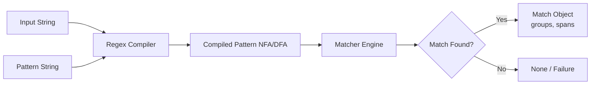
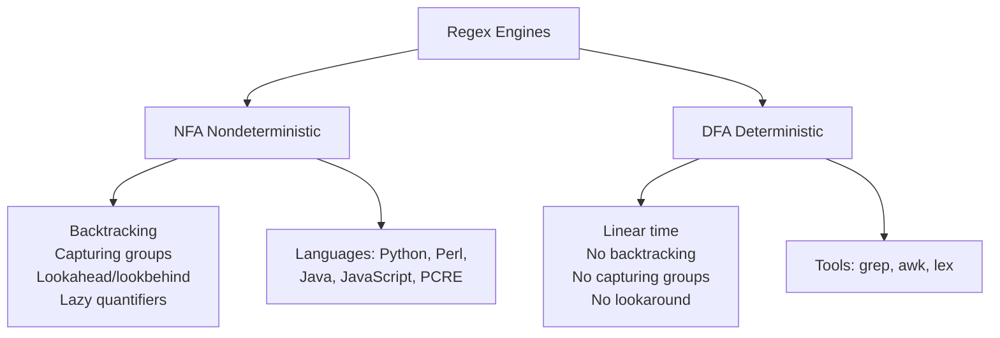

# Regular Expressions

Regular expressions (regex) are patterns used to match character combinations in strings.

## Regex Parsing Flow



## Anchors

Anchors do not match characters — they match positions.

| Anchor | Meaning | Example |
|--------|---------|---------|
| `^` | Start of string | `^hello` matches "hello" only at start |
| `$` | End of string | `world$` matches "world" only at end |
| `\b` | Word boundary | `\bfoo\b` matches standalone "foo" |
| `\B` | Non-word boundary | `\Bfoo\B` matches "foo" inside "foobar" |
| `\A` | Start of string (multiline-safe) | Same as `^` with `re.MULTILINE` off |
| `\Z` | End of string | Same as `$` with `re.MULTILINE` off |

## Quantifiers

| Quantifier | Meaning | Example |
|------------|---------|---------|
| `*` | Zero or more | `ab*c` matches "ac", "abc", "abbc" |
| `+` | One or more | `ab+c` matches "abc", "abbc" |
| `?` | Zero or one | `ab?c` matches "ac", "abc" |
| `{n}` | Exactly n | `a{3}` matches "aaa" |
| `{n,}` | n or more | `a{2,}` matches "aa", "aaa" |
| `{n,m}` | n to m | `a{2,4}` matches "aa", "aaa", "aaaa" |

## Character Classes

```regex
[aeiou]       # Any vowel (a, e, i, o, u)
[^0-9]        # Not a digit
[a-zA-Z]      # Any letter
[\s\S]        # Any character including newline
[\w-]         # Word character or hyphen
[\[\]]        # Literal bracket (escape inside class)
[.?!]         # Punctuation
```

### Shorthand Classes

| Class | Equivalent | Notes |
|-------|------------|-------|
| `\d` | `[0-9]` | Digit (note: includes non-ASCII in some engines) |
| `\w` | `[a-zA-Z0-9_]` | Word character |
| `\s` | `[ \t\n\r\f\v]` | Whitespace |
| `\D` | `[^\d]` | Non-digit |
| `\W` | `[^\w]` | Non-word |
| `\S` | `[^\s]` | Non-whitespace |

## Groups and Capturing

### Capturing Groups

```regex
(\d{3})-(\d{3})-(\d{4})      # Phone: (555) 123-4567
```

```python
import re
m = re.match(r"(\d{3})-(\d{3})-(\d{4})", "555-123-4567")
m.group(0)   # "555-123-4567"
m.group(1)   # "555"
m.groups()   # ("555", "123", "4567")
```

### Non-Capturing Groups

```regex
(?:Mr|Mrs|Ms)\.?\s(\w+)       # Captures name, not title
```

### Named Groups

```regex
(?P<area>\d{3})-(?P<exchange>\d{3})-(?P<number>\d{4})
```

```python
m = re.match(r"(?P<area>\d{3})-(?P<exch>\d{3})-(?P<num>\d{4})", "555-123-4567")
m.group("area")  # "555"
m.groupdict()   # {"area": "555", "exch": "123", "num": "4567"}
```

## Lookahead and Lookbehind

### Positive Lookahead `(?=...)`

Matches a position followed by the pattern. Useful for "followed by" without consuming.

```regex
\d+(?=px)        # Matches "12" in "12px" but not "12pt"
\w+(?=\s+Jones)  # Match first name before "Jones"
```

### Negative Lookahead `(?!...)`

Matches a position NOT followed by the pattern.

```regex
foo(?!bar)        # Matches "foo" not followed by "bar"
\d+(?!\d)         # Last digit in a sequence
```

### Positive Lookbehind `(?<=...)`

```regex
(?<=\$)\d+       # Matches "50" in "$50" but not "€50"
(?<=@)\w+        # Matches username after @ sign
```

### Negative Lookbehind `(?<!...)`

```regex
(?<!\\n)\d+      # Digits not preceded by newline
(?<!\$)\d+       # Digits not preceded by $ sign
```

### Real-World Patterns

```python
# Password: 8+ chars, at least one upper, one lower, one digit
PASSWORD = r"^(?=.*[A-Z])(?=.*[a-z])(?=.*\d).{8,}$"

# Price extraction: numbers not preceded by negative sign
PRICES = r"(?<![-\$])\b\d+\.\d{2}\b"

# Negative lookahead to exclude certain strings
NOT_ADMIN = r"^(?!admin).*$"
```

## Backreferences

```python
# Match repeated words
re.search(r"(\w+)\s+\1", "the the")       # Matches

# Find HTML tags (basic)
re.findall(r"<(\w+)>.*?</\1>", "<p>hi</p>")

# Named backreference
re.search(r"(?P<word>\w+)\s+(?P=word)", "hello hello")
```

## Greedy vs Lazy Quantifiers

```python
text = "<div><p>Hello</p></div>"

# Greedy (default): matches as much as possible
re.findall(r"<.+>", text)   # ["<div><p>Hello</p></div>"]

# Lazy: matches as little as possible
re.findall(r"<.+?>", text)  # ["<div>", "<p>", "</p>", "</div>"]
```

| Greedy | Lazy | Behavior |
|--------|------|----------|
| `*` | `*?` | Zero or more (minimal) |
| `+` | `+?` | One or more (minimal) |
| `?` | `??` | Zero or one (prefer zero) |
| `{n,m}` | `{n,m}?` | n to m (minimal) |

**When lazy matters:**
- Parsing HTML/XML tags
- Extracting content between delimiters
- Matching inside balanced pairs
- Any pattern with overlapping matches

## Regex Engine Types: NFA vs DFA



### NFA Features (Most Languages)

- Supports backreferences, lookaround, capturing groups
- Can have exponential worst-case time
- Backtracking enables lazy quantifiers
- Can suffer from [[Error Handling Patterns | catastrophic backtracking]]

### DFA Features (Tools)

- Guaranteed linear time: O(n)
- No capturing groups or backreferences
- No lookahead/lookbehind
- No lazy quantifiers (always greedy)

## Common Patterns

### Email (Multiple Specs)

```python
# Simple (RFC 5322 simplified)
EMAIL_SIMPLE = r"^[\w.+-]+@[\w-]+\.[\w.]+$"

# RFC 5322 (more complete)
EMAIL_RFC5322 = r"^[a-zA-Z0-9.!#$%&'*+/=?^_`{|}~-]+@[a-zA-Z0-9](?:[a-zA-Z0-9-]{0,61}[a-zA-Z0-9])?(?:\.[a-zA-Z0-9](?:[a-zA-Z0-9-]{0,61}[a-zA-Z0-9])?)*$"

# With display name
EMAIL_DISPLAY = r"^\"?([^\"]+)\"?\s*<([^>]+)>$"

# Python email validator (recommended for production)
from email_validator import validate_email, EmailNotValidError
```

### URL

```python
URL = r"^https?://" \
      r"(?:[\w-]+\.)+[a-zA-Z]{2,}" \
      r"(?::\d{1,5})?" \
      r"(?:/[^\s?#]*)?(\\?[^\s#]*)?(?:#[^\s]*)?"

# With auth
URL_AUTH = r"^https?://(?:[\w:%]+@)?(?:[\w-]+\.)+[a-zA-Z]{2,}(?::\d{1,5})?(?:/[^\s]*)?$"

# Data URLs
DATA_URL = r"^data:([\w/+-]+)?(;charset=[\w-]+)?(;base64)?,.*$"
```

### Phone Numbers

```python
# North America
US_PHONE = r"^\+?1?\s?\(?(\d{3})\)?[\s.-]?(\d{3})[\s.-]?(\d{4})$"

# International (basic)
INTL_PHONE = r"^\+?\d{1,4}[\s-]?\d{1,14}(\s?ext\.?\s?\d{1,5})?$"

# E.164 format (canonical)
E164 = r"^\+[1-9]\d{1,14}$"
```

### Date

```python
ISO_DATE = r"^\d{4}-(0[1-9]|1[0-2])-(0[1-9]|[12]\d|3[01])$"
ISO_DATETIME = r"^\d{4}-\d{2}-\d{2}T\d{2}:\d{2}:\d{2}(\.\d+)?(Z|[+-]\d{2}:\d{2})?$"
US_DATE = r"^(0[1-9]|1[0-2])/(0[1-9]|[12]\d|3[01])/\d{4}$"
```

### IP Addresses

```python
# IPv4
IPV4 = r"^(?:(?:25[0-5]|2[0-4]\d|[01]?\d\d?)\.){3}(?:25[0-5]|2[0-4]\d|[01]?\d\d?)$"

# IPv6 (simplified)
IPV6 = r"^(?:(?:[0-9a-fA-F]{1,4}:){7}[0-9a-fA-F]{1,4}|(?:[0-9a-fA-F]{1,4}:){1,7}:|(?:[0-9a-fA-F]{1,4}:){1,6}:[0-9a-fA-F]{1,4}|(?:[0-9a-fA-F]{1,4}:){1,5}(?::[0-9a-fA-F]{1,4}){1,2}|...)$"

# CIDR notation
CIDR = r"^(?:\d{1,3}\.){3}\d{1,3}/\d{1,2}$"
```

### Credit Card

```python
# Generic
CC = r"^\d{13,19}$"

# With Luhn check (via code)
def luhn_check(cc: str) -> bool:
    digits = [int(d) for d in cc if d.isdigit()]
    checksum = sum(d if i % 2 else (d * 2 - 9 if d > 4 else d * 2)
                   for i, d in enumerate(reversed(digits)))
    return checksum % 10 == 0
```

## Performance and Catastrophic Backtracking

### Problem

Certain patterns cause exponential backtracking, leading to ReDoS attacks or hangs.

```python
# BAD — catastrophic backtracking on "aaaaaaaaac"
BAD = r"^(a+)+b$"          # (a+)+ creates nested quantifiers

# BAD — alternation with overlapping
BAD2 = r"^(\d+|\d+)+$"

# BAD — nested quantifiers with alternation
BAD3 = r"^(.+)+$"
```

### Solutions

```python
# GOOD — possessive quantifier (where supported: PCRE, Java)
GOOD = r"^(a++)+b$"        # ++ gives up backtracking

# GOOD — atomic group
GOOD2 = r"^(?>(a+)+)b$"    # Atomic: once matched, never backtracks inside

# GOOD — avoid nesting
GOOD3 = r"^a+b$"
```

### ReDoS Attack Vectors

- Input length of 20+ chars on bad regex can freeze a CPU
- User-supplied regex patterns are a security risk
- Always set timeouts for regex matching
- Use `re.fullmatch` instead of `re.match` when appropriate

```python
# Python 3 — timeout pattern (using regex module)
import regex
try:
    result = regex.search(r"^(a+)+b$", "aaaaaaaaaaaaaaaaac",
                          timeout=1)
except regex.TimeoutError:
    print("ReDoS detected!")
```

## Debugging Regex

### Step-by-Step Matching

```mermaid
flowchart LR
    A[/"abc123"/] --> B[/foo(\d+)/]
    B --> C{f at pos 0?}
    C -->|Yes| D{o at pos 1?}
    D -->|Yes| E{o at pos 2?}
    E -->|Yes| F{\d+ at pos 3?}
    F -->|"123"| G[Match: "foo123", group 1: "123"]
    C -->|No| H[Fail]
```

### Online Tools

- **[regex101.com](https://regex101.com)** — Debugger, explanation, quick reference
- **[regexr.com](https://regexr.com)** — Visual editor with expression reference
- **[debuggex.com](https://debuggex.com)** — Railroad diagram generator
- **[regexcrossword.com](https://regexcrossword.com)** — Practice puzzles

## Language Differences

| Feature | Python `re` | Python `regex` | JavaScript | PCRE |
|---------|-------------|----------------|------------|------|
| Atomic groups | No | Yes | No | Yes |
| Possessive quantifiers | No | Yes | No | Yes |
| Recursive patterns | No | Yes | No | Yes |
| Unicode property `\p{L}` | Partial | Full | Yes (ES2018) | Yes |
| Lookbehind | Fixed-width | Variable-width | Fixed-width (ES2018) | Fixed-width |
| `\A` / `\Z` anchors | Yes | Yes | No | Yes |
| Subroutine calls | No | No | No | Yes |

```python
# Python re (limited)
import re
re.match(r"\p{L}+", "café")                            # Error: not supported

# Python regex module (recommended for complex patterns)
import regex
regex.match(r"\p{L}+", "café")                          # Matches
regex.match(r"(?<=\b\w+)", "hello world",              # Variable-width lookbehind
            flags=regex.VERSION1)
```

## Unicode Regex

```python
import regex

# Unicode letter (any language)
pattern = r"^\p{L}+$"
regex.match(pattern, "café")     # Match
regex.match(pattern, "你好")     # Match
regex.match(pattern, "123")      # No match

# Unicode categories
"""
\p{L}   Any letter
\p{Lu}  Uppercase letter
\p{Ll}  Lowercase letter
\p{N}   Any number
\p{P}   Punctuation
\p{Sc}  Currency symbol
\p{M}   Combining mark
\p{Z}   Separator (whitespace, etc.)
"""

# Word boundary with Unicode
regex.split(r"\b", "café world")        # May not work in re
regex.split(r"\b", "café world",        # Unicode-aware
            flags=regex.WORD | regex.VERSION1)
```

**See also**: [[Unicode and Encoding]], [[Data Serialization]]

## When NOT to Use Regex

| Case | Why Not | Alternative |
|------|---------|-------------|
| Parsing HTML | HTML is not regular | lxml, BeautifulSoup, html.parser |
| Parsing JSON/XML | Nested structures | `json.loads`, `xml.etree.ElementTree` |
| Nested parentheses/braces | Need a stack, not regex | Parser combinators, PLY, Lark |
| Math expression evaluation | PEG/CFG required | `ast.parse`, `sympy`, dedicated parser |
| URL validation | Too many edge cases | `urllib.parse.urlparse`, validators lib |
| Email validation | RFC 5322 is huge | `email_validator` library |

**Famous quote**: "Some people, when confronted with a problem, think 'I know, I'll use regular expressions.' Now they have two problems." — Jamie Zawinski

## ReDoS Attacks

Regular expression Denial of Service (ReDoS) exploits catastrophic backtracking:

```python
import re

# Evil input for r"^(\w+)+$"
payload = "a" * 30 + "!"       # 30 a's + exclamation
# This will take exponential time

# Safe approach — reject long inputs
def safe_match(pattern: str, text: str, max_len: int = 100):
    if len(text) > max_len:
        raise ValueError(f"Input too long: {len(text)}")
    return re.search(pattern, text)
```

### Mitigation

- Limit input length before regex matching
- Prefer `re.fullmatch` (anchored both ends) over `re.search`
- Avoid nested quantifiers: `(a+)+`, `(x|y)*$`
- Use atomic groups `(?>...)` where supported
- Set timeouts in production
- Never apply user-supplied regex to untrusted data
- Use `regex` module (Python) with timeouts

**See also**: [[NLP Pipeline Design]], [[Error Handling Patterns]], [[Web Security]]
