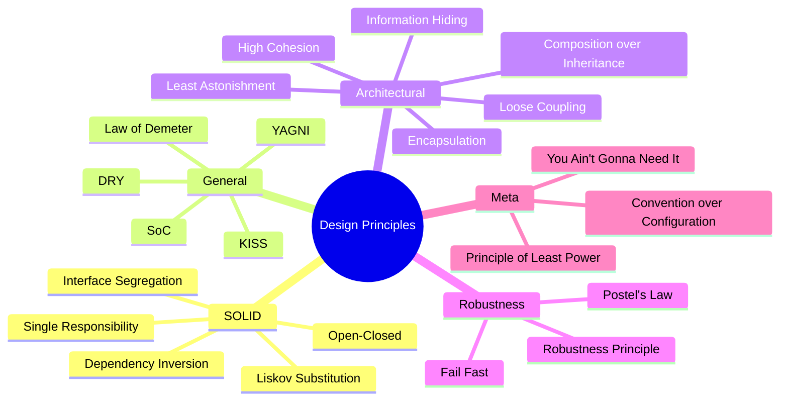
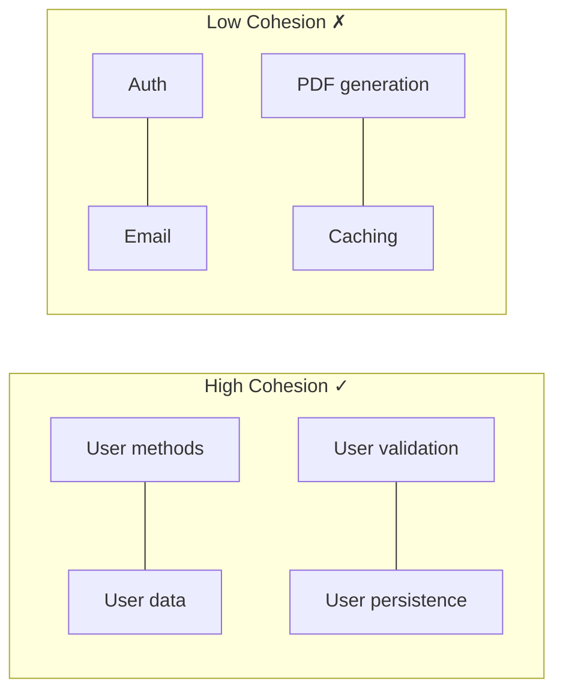

# Software Design Principles

Good software design makes code maintainable, testable, and scalable. These principles guide developers in creating robust architectures.

## SOLID Principles

| Principle | Meaning |
|-----------|---------|
| **S**ingle Responsibility | One class, one reason to change |
| **O**pen-Closed | Open for extension, closed for modification |
| **L**iskov Substitution | Subtypes must be substitutable for base types |
| **I**nterface Segregation | Many specific interfaces > one general |
| **D**ependency Inversion | Depend on abstractions, not concretions |

See [[SOLID Principles Deep Dive]] for full treatment.

## Mermaid Mindmap



## DRY — Don't Repeat Yourself

> Every piece of knowledge must have a single, unambiguous, authoritative representation within a system.

DRY is often confused with "don't write the same code twice," but its true meaning is about *knowledge duplication*, not code duplication. Accidental duplication (same logic by coincidence) is fine. Essential duplication (same *knowledge* in multiple places) is the problem.

### Types of Duplication

| Type | Example | Fix |
|------|---------|-----|
| True duplication | Same business rule in 3 places | Extract to single source |
| Accidental duplication | Two functions that happen to have same algorithm but different meaning | Leave as-is |
| Malformed duplication | Duplicated because dev didn't know the code existed | Improve discoverability |
| Documentation duplication | Business logic comments that repeat what the code says | Remove comments |
| Configuration duplication | Same connection string in dev/staging/prod | Environment variables |

### When Repetition IS Acceptable

- When extracting would add unnecessary abstraction (violating [[YAGNI]])
- When the duplicated logic is coincidental and likely to diverge
- In test code (test fixtures often repeat setup — that's fine)
- When two systems have different evolution rates and coupling them would be worse

### DRY Violation Example

```python
# BEFORE — DRY violation: status logic duplicated
def process_order(order):
    if order.status == "paid" and order.amount > 0:
        send_confirmation(order)

def cancel_order(order):
    if order.status == "paid" and order.amount > 0:
        refund(order)

# AFTER — single source of truth
def is_paid(order) -> bool:
    return order.status == "paid" and order.amount > 0

def process_order(order):
    if is_paid(order):
        send_confirmation(order)

def cancel_order(order):
    if is_paid(order):
        refund(order)
```

## YAGNI — You Aren't Gonna Need It

> Always implement things when you actually need them, never when you just foresee that you need them.

### Examples of Over-Engineering

- Building a plugin system when you only have two behaviors
- Abstract factory for what could be a single `if` statement
- Full caching layer before measuring a performance problem
- Internationalization framework for a prototype with one locale
- Generic type parameters everywhere "just in case"

### Cost of Unnecessary Abstraction

```
Cost = (time to build) + (time to maintain) + (time for others to understand)
     - (value if actually needed someday * probability of need)
```

Premature abstraction increases cognitive load and reduces [[Developer Experience]]. As [[Refactoring Techniques]] teaches, you can always add abstraction later when patterns emerge.

## KISS — Keep It Simple, Stupid

> Systems work best when they are simple rather than complex.

### Real-World Examples of Overcomplicated Solutions

| Overcomplicated | Simple Alternative |
|----------------|-------------------|
| Custom ORM with query builder, cache layer, and event system | Use established ORM (SQLAlchemy, Django ORM) |
| State machine pattern when 2 booleans suffice | `if` statements |
| Chain of Responsibility for 3-step validation | Sequential `if` checks |
| Microservices architecture for a CRUD app | Monolith with modular structure |

```python
# OVERCOMPLICATED
class NumberProcessor:
    def __init__(self, strategy: Strategy, formatter: Formatter, validator: Validator):
        ...
    def process(self, numbers: list[int]) -> str:
        validated = self._validator.validate(numbers)
        transformed = self._strategy.apply(validated)
        return self._formatter.format(transformed)

# KISS
def format_average(numbers: list[int]) -> str:
    return f"Average: {sum(numbers) / len(numbers):.2f}"
```

## Separation of Concerns

Divide a system into distinct sections where each section addresses a separate concern.

### Layered Architecture

```
┌──────────────────────────┐
│    Presentation Layer     │  HTML/JSON/GraphQL
├──────────────────────────┤
│    Application Layer      │  Use cases, orchestration
├──────────────────────────┤
│    Domain Layer           │  Business rules, entities
├──────────────────────────┤
│    Infrastructure Layer   │  DB, cache, external APIs
└──────────────────────────┘
```

### Cross-Cutting Concerns

Concerns like logging, authentication, metrics, and error handling span multiple layers. Handle these through:

- **Decorators** / middleware (see [[GoF Design Patterns]])
- **Aspect-Oriented Programming** (AOP)
- **Pipeline patterns** in web frameworks

Each layer should only depend on layers below it. Violating this creates tight coupling that [[Refactoring Techniques]] must later undo.

## Law of Demeter (Principle of Least Knowledge)

> Each unit should have only limited knowledge about other units: only units "closely" related to the current unit.

### Violation: Train Wreck

```python
# Bad — Law of Demeter violation
customer.orders().last().payment().amount()
```

### Fixed: Tell, Don't Ask

```python
# Better — delegate
customer.last_order_amount()
```

The "Tell, Don't Ask" principle means you should tell objects what to do rather than querying their state and making decisions for them.

### Common Violations

```python
# VIOLATION: reaching through multiple objects
if user.get_profile().get_address().get_zip() == "10001":
    apply_nyc_tax(user)

# FIXED: ask the user
if user.lives_in_zip("10001"):
    user.apply_tax_for_location()
```

This relates to [[Clean Code Principles]]' emphasis on small, focused methods and [[Object-Oriented Programming]]'s encapsulation.

## Composition over Inheritance

> Prefer object composition over class inheritance.

### Before: Rigid Inheritance

```python
class Bird:
    def fly(self): return "I can fly"

class Penguin(Bird):
    def fly(self): raise NotImplementedError("Can't fly")  # LSP violation!
```

### After: Composable Behaviors

```python
from abc import ABC, abstractmethod

class FlyingBehavior(ABC):
    @abstractmethod
    def fly(self): ...

class CanFly(FlyingBehavior):
    def fly(self): return "I can fly"

class CannotFly(FlyingBehavior):
    def fly(self): return "I cannot fly"

class Bird:
    def __init__(self, flying: FlyingBehavior):
        self._flying = flying

    def fly(self): return self._flying.fly()

sparrow = Bird(CanFly())
penguin = Bird(CannotFly())
```

Inheritance creates rigid taxonomies; composition creates flexible systems. See [[GoF Design Patterns]] (Strategy pattern) and [[Domain-Driven Design]] (aggregates, value objects).

## Encapsulation

> Bundle data with the methods that operate on that data, and restrict direct access to internal state.

### Why It Matters

- Prevents invalid state (no more `customer.balance = -100`)
- Decouples internal representation from external usage
- Enables change without affecting callers
- Reduces bug surface area

### Leaky Abstractions

A leaky abstraction exposes implementation details despite attempts to hide them. Examples:

- ORM that lets you write raw SQL through it (but performance requires raw SQL)
- File system APIs that work locally but not over network
- `async`/`await` that still requires understanding threading

As [[Functional Programming]] shows, immutability is the ultimate form of encapsulation — no one can modify what cannot be mutated.

## Principle of Least Astonishment

> A system should behave in a way that least surprises its users.

### API Design Examples

| Surprising | Unsurprising |
|-----------|-------------|
| `list.sort()` returns `None` (mutates in-place) | `sorted(list)` returns new sorted list |
| `random.shuffle()` returns `None` | `random.shuffle()` clearly named |
| `datetime.timezone` vs `pytz` confusion | `zoneinfo` from stdlib (Python 3.9+) |
| `open()` default mode is `'rt'` | Explicit modes |
| `is` vs `==` for string comparison | Clear documentation of identity vs equality |

Consistency matters. If one method returns a new object, all similar methods should too. Follow [[Clean Code Principles]]: names should reveal intent, functions should do one thing, and side effects should be obvious.

## Coupling vs Cohesion

### High Cohesion

Elements within a module should be strongly related. A class should have focused responsibility ([[SOLID Principles Deep Dive]] — Single Responsibility).



### Loose Coupling

Modules should depend on abstractions, not concrete implementations. Change in one module should require minimal change in another.

| Coupling Type | Degree | Example |
|-------------|--------|---------|
| Content coupling | Worst | Module modifies another's internal data |
| Common coupling | Bad | Global variables shared |
| External coupling | Bad | Shared file format/protocol |
| Control coupling | Moderate | Passing flags to control behavior |
| Stamp coupling | Moderate | Passing entire objects when only one field needed |
| Data coupling | Good | Passing only needed primitives |
| Message coupling | Best | Communication through well-defined interfaces |

### Loose Coupling Example

```python
# Tight coupling
def process_csv(filename: str):
    with open(filename) as f:
        # ... tightly coupled to file system

# Loose coupling
def process_data(stream: Iterable[str]):
    for line in stream:
        # ... works with any iterable
```

## Information Hiding

> Hide design decisions that are most likely to change.

### Pimpl Idiom (C++)

The "Pointer to Implementation" idiom hides implementation details behind an opaque pointer, so changes to the implementation don't recompile clients.

Implementation details, internal algorithms, and data structures should be private. Public interfaces should be stable and minimal.

```python
class DatabaseConnection:
    def query(self, sql: str) -> list[dict]:
        # Callers don't need to know about:
        # - connection pool management
        # - retry logic
        # - query parsing/optimization
        # - network protocol details
        ...
```

## Robustness Principle (Postel's Law)

> Be conservative in what you do, be liberal in what you accept from others.

### Application

- **APIs**: Accept flexible input formats, produce strict output
- **Network protocols**: Tolerate malformed packets, emit well-formed ones
- **Data parsing**: Accept multiple date formats, emit ISO 8601
- **Input validation**: Be lenient with whitespace, casing; reject truly invalid data

```python
# Liberal in what you accept
def parse_date(value: str) -> datetime:
    formats = ["%Y-%m-%d", "%m/%d/%Y", "%d-%m-%Y", "%Y/%m/%d"]
    for fmt in formats:
        try:
            return datetime.strptime(value, fmt)
        except ValueError:
            continue
    raise ValueError(f"Unrecognized date: {value}")

# Conservative in what you send
def format_date(dt: datetime) -> str:
    return dt.isoformat()  # Always ISO 8601
```

**Caveat**: Being too liberal can mask bugs and create security vulnerabilities. Balance with [[Fail Fast]] principles.

## Convention over Configuration

> A framework or system should use sensible defaults, reducing the number of decisions a developer must make.

### Examples

| Framework | Convention | Config Override |
|-----------|-----------|-----------------|
| Rails | Database table name = plural of model class | `self.table_name = "users"` |
| Spring Boot | Auto-configured beans based on classpath | `@Configuration` classes |
| Django | `models.py`, `views.py`, `urls.py` structure | Custom app layouts |
| Next.js | File-based routing from `pages/` dir | Custom server config |

Convention over Configuration reduces boilerplate and lets developers focus on unique business logic. It embodies [[KISS]] and [[DRY]] by codifying repeated decisions into framework defaults.

## Principle of Least Power

> Given a choice among solutions, pick the least powerful solution capable of solving the problem.

### Power Spectrum

```
Most powerful:  Turing-complete programming languages
               General-purpose scripting
               Template engines with logic
               Configuration languages (YAML, JSON)
               Declarative DSLs
Least powerful:  Data formats (CSV, plain text)
```

### Practical Application

- Don't write code when a config file suffices
- Don't write a custom parser when JSON works
- Don't build a state machine when a lookup table works
- Don't use a full programming language for a simple template

This relates to [[GoF Design Patterns]]: prefer simpler patterns over complex ones. A simple factory is better than abstract factory unless you truly need product families.

## Links

**See also**: [[Code Architecture Patterns]], [[Programming Language Paradigms]], [[REST API Design]]

**Related**: [[SOLID Principles Deep Dive]] | [[Clean Code Principles]] | [[GoF Design Patterns]] | [[Refactoring Techniques]] | [[Code Architecture Patterns]] | [[Domain-Driven Design]] | [[Functional Programming]] | [[Object-Oriented Programming]] | [[API Gateway Patterns]] | [[Microservices Architecture]]
