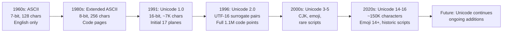
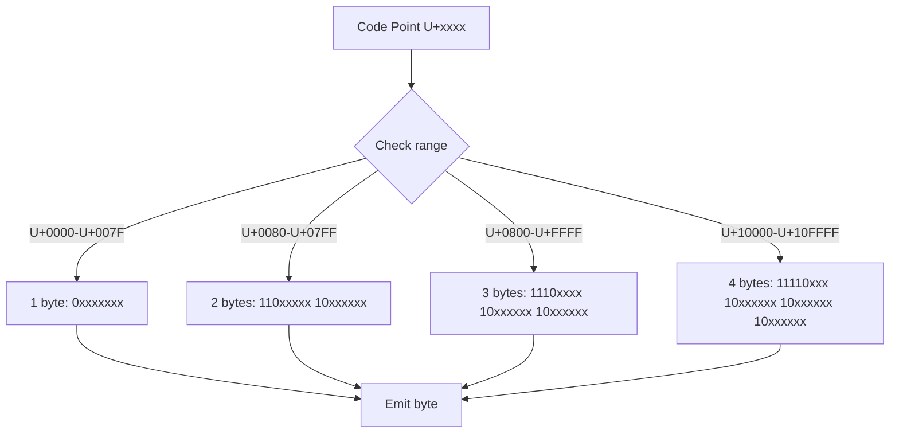

# Unicode and Encoding

**Links**: [[Tokenization]] | [[Internationalization]] | [[Data Serialization]] | [[Web Security]] | [[Programming Language Paradigms]]

## What is Unicode?

A universal standard assigning a unique number (code point) to every character, regardless of platform or language.

## ASCII → Unicode Evolution Timeline



## Code Points, Planes, Surrogate Pairs

### Code Points

```
U+0041  → 'A'       U+00E9  → 'é'
U+03A9  → 'Ω'       U+4E2D  → '中'
U+1F600 → '😀'      U+1F468 → '👨'
```

### Unicode Planes

| Plane | Range | Name | Contents |
|-------|-------|------|----------|
| 0 | U+0000–U+FFFF | Basic Multilingual Plane (BMP) | Most common scripts, Latin, CJK, emoji |
| 1 | U+10000–U+1FFFF | Supplementary Multilingual Plane (SMP) | Historic scripts, music symbols |
| 2 | U+20000–U+2FFFF | Supplementary Ideographic Plane (SIP) | Rare CJK ideographs |
| 14 | U+E0000–U+EFFFF | Supplementary Special-purpose Plane | Tags, language tags |
| 15-16 | U+F0000–U+10FFFF | Private Use Planes | Custom characters |

### Surrogate Pairs (UTF-16)

Code points above U+FFFF (supplementary planes) are encoded as two 16-bit code units in UTF-16:

```
U+1F600 😀
High surrogate: 0xD83D
Low surrogate:  0xDE00
```

### Grapheme Clusters

A grapheme cluster is what a user perceives as a single character. It may be multiple code points.

```python
import unicodedata

# "é" can be one code point or two
one = "\u00E9"          # é (precomposed)
two = "\u0065\u0301"    # e + combining acute accent

print(len(one))  # 1
print(len(two))  # 2
print(one == two)  # False!

# Normalize first
print(unicodedata.normalize("NFC", one) == unicodedata.normalize("NFC", two))
# True
```

## UTF-8, UTF-16, UTF-32 Comparison

| Encoding | Bytes/Code Point | Properties |
|----------|-----------------|------------|
| **UTF-8** | 1–4 | ASCII-compatible, most common on web, self-synchronizing |
| **UTF-16** | 2 or 4 | Windows/Java native, surrogate pairs for non-BMP |
| **UTF-32** | 4 | Fixed-width (wasteful), no surrogates needed |

### Byte Order Mark (BOM)

```
UTF-8:     EF BB BF     (optional, often omitted)
UTF-16 BE: FE FF
UTF-16 LE: FF FE
UTF-32 BE: 00 00 FE FF
UTF-32 LE: FF FE 00 00
```

| BOM Present | Common in | Issue |
|-------------|-----------|-------|
| UTF-8 with BOM | Windows (Notepad++) | `\ufeff` at start, can break scripts |
| UTF-16 BE | Unix, Network | Must detect BOM or configure |
| UTF-16 LE | Windows | Must detect BOM or configure |

## UTF-8 Encoding Algorithm



### Manual Encoding Example

```
Code point: U+1F600 (😀) = 0x1F600 = 128,000 decimal
Binary: 0001 1111 0110 0000 0000

UTF-8 4-byte pattern:
11110xxx 10xxxxxx 10xxxxxx 10xxxxxx

Fill bits from right to left:
11110000 10011111 10011000 10000000
= F0 9F 98 80
```

### UTF-8 Continuation Byte Rules

- Leading byte tells how many total bytes: `0xxxxxxx` (1), `110xxxxx` (2), `1110xxxx` (3), `11110xxx` (4)
- Continuation bytes always start with `10xxxxxx`
- Self-synchronizing: from any byte you can find the start of the character within 4 bytes
- Invalid byte sequences are detectable

## Normalization Forms

| Form | Name | Behavior | Example: "é" |
|------|------|----------|-------------|
| **NFC** | Normalization Form C | Precomposed where possible | `U+00E9` (1 code point) |
| **NFD** | Normalization Form D | Decomposed (base + combining) | `U+0065 + U+0301` (2 code points) |
| **NFKC** | NFK Compatibility | Compatibility decomposition + NFC | `"ffi"` → `"ffi"` (ligature broken) |
| **NFKD** | NFK Decomposition | Compatibility decomposition + NFD | Composed + ligature broken |

```python
import unicodedata

text = "café"  # U+00E9

# NFC (composed)
nfc = unicodedata.normalize("NFC", text)
print([hex(ord(c)) for c in nfc])
# ['0x63', '0x61', '0x66', '0xe9']

# NFD (decomposed)
nfd = unicodedata.normalize("NFD", text)
print([hex(ord(c)) for c in nfd])
# ['0x63', '0x61', '0x66', '0x65', '0x301']

# NFKD — strips formatting
print(unicodedata.normalize("NFKD", "ℓ"))
# "l" (script l → regular l)
```

### When to Use Each

| Use Case | Form |
|----------|------|
| Storage / display | NFC |
| Sorting / collation | NFD or NFKD |
| Search / indexing | NFKD (ignores formatting) |
| Security / filtering | NFKD (decomposes homoglyphs) |
| URL normalization | NFC (RFC 3986) |
| File names | NFC (macOS default is NFD!) |

## Python 3: str vs bytes

```python
# str → bytes: encode
text = "Hello 世界 🌍"
encoded = text.encode("utf-8")       # b'Hello \xe4\xb8\x96\xe7\x95\x8c \xf0\x9f\x8c\x8d'
encoded_sg = text.encode("utf-16")   # BOM + UTF-16LE

# bytes → str: decode
decoded = encoded.decode("utf-8")    # "Hello 世界 🌍"

# Error handling modes
text.encode("ascii", errors="strict")     # UnicodeEncodeError!
text.encode("ascii", errors="ignore")     # "Hello  " (removes non-ASCII)
text.encode("ascii", errors="replace")    # "Hello ???" (replaces with ?)
text.encode("ascii", errors="xmlcharrefreplace")  # "Hello 世界 🌍"
text.encode("ascii", errors="backslashreplace")   # "Hello \\u4e16\\u754c \\U0001f30d"
```

### Reading/Writing Files

```python
# ALWAYS specify encoding
with open("file.txt", "r", encoding="utf-8") as f:
    content = f.read()

# Binary mode (no encoding)
with open("file.txt", "rb") as f:
    raw = f.read()

# Python's default encoding
import sys
print(sys.getdefaultencoding())   # 'utf-8' (Python 3)
print(sys.getfilesystemencoding())  # 'utf-8' on most systems
```

## Common Pitfalls

### Mojibake (Garbled Text)

```
Input encoded as UTF-8, decoded as Latin-1:
"café" (UTF-8) → "café" (Latin-1)
"café" (Latin-1) → "café" (UTF-8)
```

| Encoded As | Decoded As | Result |
|------------|------------|--------|
| UTF-8 | Latin-1 | Accented chars become é, Â, etc. |
| Latin-1 | UTF-8 | Special chars become replacement � |
| Windows-1252 | UTF-8 | Smart quotes become “ etc. |
| UTF-8 | Windows-1252 | Same as Latin-1 issues |

### UnicodeDecodeError

```python
# Binary data misread as text
import requests
# BAD: response.text auto-decodes, may guess wrong encoding
data = requests.get(url).text

# GOOD: work with bytes, decode explicitly
raw = requests.get(url).content
text = raw.decode("utf-8")
```

### BOM Issues

```python
# UTF-8 with BOM confuses parsers
with open("file.csv", encoding="utf-8-sig") as f:
    # utf-8-sig strips BOM automatically
    header = f.readline()

# Without BOM handling:
with open("file.csv", encoding="utf-8") as f:
    header = f.readline()
    print(header[0])  # '\ufeff' (ZERO WIDTH NO-BREAK SPACE)
```

## Emoji: ZWJ Sequences, Skin Tones, Flags

### ZWJ (Zero Width Joiner) Sequences

Multiple emoji joined by U+200D to form a single glyph:

```
👨 (U+1F468) + ‍ (U+200D) + 👩 (U+1F469) + ‍ (U+200D) + 👧 (U+1F467) + ‍ (U+200D) + 👦 (U+1F466)
→ 👨‍👩‍👧‍👦 (family: man, woman, girl, boy) = 7 code points
```

### Skin Tone Modifiers

```
👍            U+1F44D          (thumbs up, default yellow)
👍🏻            U+1F44D U+1F3FB  (light skin tone)
👍🏿            U+1F44D U+1F3FF  (dark skin tone)
```

### Flag Sequences

Regional indicator symbols (U+1F1E6–U+1F1FF) form flags as pairs:

```
🇯 + 🇵 = 🇯🇵  (Japan)
U+1F1EF + U+1F1F5
🇺 + 🇸 = 🇺🇸  (US)
U+1F1FA + U+1F1F8
```

### Counting Emoji

```python
import regex

text = "👨‍👩‍👧‍👦 Hello 👍🏻"

# Naive: len() counts code points
print(len(text))  # 12 (wrong for user-perceived chars)

# grapheme cluster count (uses regex module)
print(len(regex.findall(r"\X", text)))  # 9 (correct)

# emoji detection
emojis = regex.findall(r"\p{Emoji_Presentation}|\p{Emoji}\uFE0F", text)
```

## Collation and Sorting

```python
import locale

# Locale-aware sorting
locale.setlocale(locale.LC_ALL, "en_US.UTF-8")
words = ["café", "cafe", "caba", "cáfe"]
print(sorted(words))                               # ASCII-based (wrong)
print(sorted(words, key=locale.strxfrm))           # Locale-aware

# PyICU for full Unicode Collation Algorithm (UCA)
import icu
collator = icu.Collator.createInstance(icu.Locale("es_ES.UTF-8"))
sorted(words, key=collator.getSortKey)
```

## Security: Normalization Attacks

### Homoglyph Attacks

Visually identical characters with different code points:

```
A (Latin):     U+0041
А (Cyrillic):  U+0410
Α (Greek):     U+0391

Input: "paypal.com" vs "раypal.com" (first a is Cyrillic)
```

### IDN Spoofing

Internationalized Domain Names can contain homoglyphs:

```python
import unicodedata
import idna

# Decompose to catch homoglyphs
domain = "раypal.com"
normalized = unicodedata.normalize("NFKC", domain)
if domain != normalized:
    print(f"Suspicious: {domain} != {normalized}")

# Use IDNA library for domain parsing
try:
    decoded = idna.decode("xn--pypal-4ve.com")  # Punycode
    print(f"Decoded: {decoded}")
except idna.IDNAError:
    print("Invalid domain")
```

**See also**: [[Web Security]]

### Other Security Considerations

| Attack | Description | Mitigation |
|--------|-------------|------------|
| Overlong UTF-8 | Invalid byte sequences encoding ASCII chars | Reject overlong sequences |
| BOM injection | BOM at start of file confuses parsers | Strip BOM, use utf-8-sig |
| Right-to-left override | U+202E hides code visually | Reject control chars in input |
| Zero-width characters | Invisible code in strings | Strip from user input |
| Case-folding attacks | Different case rules across scripts | Use NFKC + case fold |

## Character Detection

```python
# chardet (pure Python)
import chardet

raw = b"\xc3\xa9\xc3\xa0\xc3\xbc"
result = chardet.detect(raw)
print(result)  # {'encoding': 'UTF-8', 'confidence': 0.99, 'language': ''}

# cchardet (faster, C extension)
import cchardet as chardet
encoding = chardet.detect(raw)["encoding"]

# Practical usage
def read_with_auto_encoding(path: str) -> str:
    with open(path, "rb") as f:
        raw = f.read()
    result = chardet.detect(raw)
    encoding = result["encoding"] or "utf-8"
    return raw.decode(encoding)
```

**See also**: [[Tokenization]], [[Internationalization]], [[Regular Expressions]]
