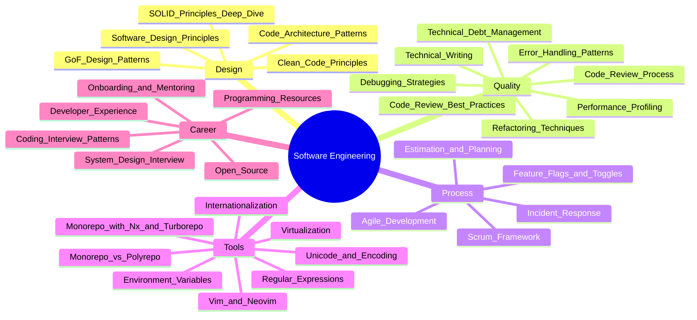

# 📐 Software Engineering — Map of Content

## Topics

| Category | Notes |
|----------|-------|
| **Design** | [[SOLID Principles Deep Dive]], [[Software Design Principles]], [[GoF Design Patterns]], [[Clean Code Principles]], [[Code Architecture Patterns]] |
| **Quality** | [[Refactoring Techniques]], [[Code Review Best Practices]], [[Code Review Process]], [[Error Handling Patterns]], [[Debugging Strategies]], [[Performance Profiling]], [[Technical Debt Management]], [[Technical Writing]] |
| **Process** | [[Agile Development]], [[Scrum Framework]], [[Estimation and Planning]], [[Incident Response]], [[Feature Flags and Toggles]] |
| **Tools** | [[Monorepo vs Polyrepo]], [[Monorepo with Nx and Turborepo]], [[Internationalization]], [[Unicode and Encoding]], [[Regular Expressions]], [[Environment Variables]], [[Vim and Neovim]], [[Virtualization]] |
| **Career** | [[Onboarding and Mentoring]], [[Developer Experience]], [[Open Source]], [[Coding Interview Patterns]], [[System Design Interview]], [[Programming Resources]] |

## Cross-Domain Links

- [[Software-Engineering/Clean Code Principles]] → [[Testing/Unit Testing Guide]], [[Testing/Test-Driven Development]]
- [[Software-Engineering/GoF Design Patterns]] → [[Web-Dev/React]], [[Web-Dev/State Management Patterns]]
- [[Software-Engineering/CI CD Pipelines|CI/CD]] ↔ [[Git/Git Workflows]], [[DevOps/CI-CD/CI CD Pipelines]]
- [[Software-Engineering/Incident Response]] → [[DevOps/Monitoring/Monitoring and Observability]], [[DevOps/Monitoring/Site Reliability Engineering]]
- [[Software-Engineering/Performance Profiling]] → [[Web-Dev/Vite and esbuild]], [[System-Design/Architecture/Architecture Patterns]]
