# Software Engineering -- Map of Content

Software engineering principles govern how code is structured, reviewed, tested, and delivered. This folder covers design patterns (SOLID, GoF, architectural), clean code practices, code review workflows, testing strategies (unit, integration, property-based), agile methodologies, and developer experience (DX) — the practices that scale engineering teams.

**Parent**: [[_MOC|Master Index]]

## Structure

```mermaid
graph TB
    SE["Software Engineering"] --> DESIGN["Design"]
    SE --> QUALITY["Quality"]
    SE --> PROCESS["Process"]
    SE --> TOOLS["Tools"]
    SE --> CAREER["Career"]

    DESIGN --> SOLID["SOLID Principles Deep Dive"]
    DESIGN --> SDP["Software Design Principles"]
    DESIGN --> GOF["GoF Design Patterns"]
    DESIGN --> CCP["Clean Code Principles"]
    DESIGN --> CAP["Code Architecture Patterns"]

    QUALITY --> REF["Refactoring Techniques"]
    QUALITY --> CRBP["Code Review Best Practices"]
    QUALITY --> CRP["Code Review Process"]
    QUALITY --> ERR["Error Handling Patterns"]
    QUALITY --> DBG["Debugging Strategies"]
    QUALITY --> PROF["Performance Profiling"]
    QUALITY --> TDM["Technical Debt Management"]
    QUALITY --> TW["Technical Writing"]

    PROCESS --> AGILE["Agile Development"]
    PROCESS --> SCRUM["Scrum Framework"]
    PROCESS --> EST["Estimation and Planning"]
    PROCESS --> IR["Incident Response"]
    PROCESS --> FF["Feature Flags and Toggles"]

    TOOLS --> MONOREPO["Monorepo vs Polyrepo"]
    TOOLS --> NX["Monorepo with Nx and Turborepo"]
    TOOLS --> I18N["Internationalization"]
    TOOLS --> UNICODE["Unicode and Encoding"]
    TOOLS --> REGEX["Regular Expressions"]
    TOOLS --> ENV["Environment Variables"]
    TOOLS --> VIM["Vim and Neovim"]
    TOOLS --> VIRT["Virtualization"]

    CAREER --> ONB["Onboarding and Mentoring"]
    CAREER --> DX["Developer Experience"]
    CAREER --> OSS["Open Source"]
    CAREER --> CIP["Coding Interview Patterns"]
    CAREER --> SDI["System Design Interview"]
    CAREER --> PR["Programming Resources"]
```

## Topics

| Category | Notes |
|----------|-------|
| **Design** | [[SOLID Principles Deep Dive]], [[Software Design Principles]], [[GoF Design Patterns]], [[Clean Code Principles]], [[Code Architecture Patterns]] |
| **Quality** | [[Refactoring Techniques]], [[Code Review Best Practices]], [[Code Review Process]], [[Error Handling Patterns]], [[Debugging Strategies]], [[Performance Profiling]], [[Technical Debt Management]], [[Technical Writing]] |
| **Process** | [[Agile Development]], [[Scrum Framework]], [[Estimation and Planning]], [[Incident Response]], [[Feature Flags and Toggles]] |
| **Tools** | [[Monorepo vs Polyrepo]], [[Monorepo with Nx and Turborepo]], [[Internationalization]], [[Unicode and Encoding]], [[Regular Expressions]], [[Environment Variables]], [[Vim and Neovim]], [[Virtualization]] |
| **Career** | [[Onboarding and Mentoring]], [[Developer Experience]], [[Open Source]], [[Coding Interview Patterns]], [[System Design Interview]], [[Programming Resources]] |

## Internal Relationships

| From | Connects To | Relationship |
|------|-------------|--------------|
| [[Clean Code Principles]] | [[Refactoring Techniques]], [[Software Design Principles]] | Refactoring applies clean code principles |
| [[SOLID Principles Deep Dive]] | [[Software Design Principles]], [[GoF Design Patterns]] | SOLID is a subset of design principles; patterns implement SOLID |
| [[Error Handling Patterns]] | [[Debugging Strategies]], [[Clean Code Principles]] | Good error handling prevents bugs; debugging finds them |
| [[Code Review Best Practices]] | [[Code Review Process]], [[Onboarding and Mentoring]] | Best practices inform the process; reviews mentor juniors |
| [[Agile Development]] | [[Scrum Framework]], [[Estimation and Planning]] | Scrum is an agile framework; estimation supports planning |
| [[Monorepo vs Polyrepo]] | [[Monorepo with Nx and Turborepo]] | Decision guide leads to implementation |
| [[Unicode and Encoding]] | [[Internationalization]] | Unicode enables i18n |
| [[Regular Expressions]] | [[Unicode and Encoding]] | Regex with Unicode patterns for multilingual matching |
| [[Environment Variables]] | [[Feature Flags and Toggles]] | Feature flags can use env vars for simple toggles |
| [[Technical Debt Management]] | [[Refactoring Techniques]], [[Clean Code Principles]] | Debt is paid via refactoring toward clean code |
| [[Performance Profiling]] | [[Database Indexing Deep Dive]], [[Caching Strategies]] | Profiles identify indexing/caching needs |
| [[System Design Interview]] | [[Coding Interview Patterns]] | Both are interview prep, different scopes |

## Cross-Domain Links

- [[Clean Code Principles]] -> [[Testing/Unit Testing Guide]], [[Testing/Test-Driven Development]]
- [[GoF Design Patterns]] -> [[Web-Dev/React]], [[Web-Dev/State Management Patterns]]
- [[CI CD Pipelines|CI/CD]] <-> [[Git/Git Workflows]], [[DevOps/CI-CD/CI CD Pipelines]]
- [[Incident Response]] -> [[DevOps/Monitoring/Monitoring and Observability]], [[DevOps/Monitoring/Site Reliability Engineering]]
- [[Performance Profiling]] -> [[Web-Dev/Vite and esbuild]], [[System-Design/Architecture/Architecture Patterns]]
- [[Debugging Strategies]] -> [[Git/Git Bisect]], [[Git/Git Blame]], [[DevOps/Monitoring/Distributed Tracing]]
- [[Error Handling Patterns]] -> [[DevOps/Monitoring/Logging Best Practices]], [[Web-Dev/HTTP Protocol]]
- [[Internationalization]] -> [[Web-Dev/Web Accessibility]], [[Testing/Visual Regression Testing]]
- [[Virtualization]] -> [[DevOps/Containers/Docker Containers]], [[DevOps/Infrastructure/Cloud Computing]]
- [[Technical Writing]] -> [[Web-Dev/API Documentation with OpenAPI]], [[Web-Dev/API Documentation]]
- [[Programming Resources]] -> all Software-Engineering notes (hub note)
- [[Environment Variables]] -> [[Security/Vault and Secret Management]], [[DevOps/Infrastructure/Infrastructure as Code]]
- [[Feature Flags and Toggles]] -> [[DevOps/CI-CD/CI CD Pipelines]], [[DevOps/Infrastructure/Cloud Computing]]
- [[Onboarding and Mentoring]] -> [[DevOps/Infrastructure/Dev Environment Setup]]
- [[Unicode and Encoding]] -> [[AI-ML/NLP/Tokenization]], [[AI-ML/NLP/Machine Translation]]
- [[Estimation and Planning]] -> [[DevOps/CI-CD/CI CD Pipelines]]
- [[Open Source]] -> [[Git/Git Pull Requests]], [[Git/Git Workflows]]
