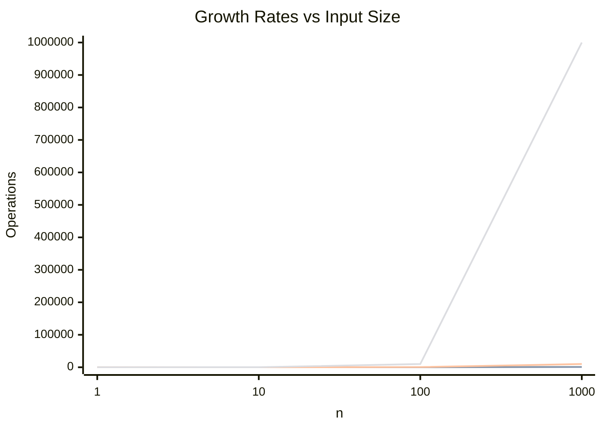

# Big O Notation

Big O describes the performance or complexity of an algorithm in terms of input size (n). It measures worst-case time or space growth.

## Common Complexities

| Notation | Name | Example |
|----------|------|---------|
| O(1) | Constant | Array access by index |
| O(log n) | Logarithmic | Binary search |
| O(n) | Linear | Linear search |
| O(n log n) | Linearithmic | Merge sort, Quick sort |
| O(n²) | Quadratic | Bubble sort, nested loops |
| O(2ⁿ) | Exponential | Fibonacci recursive |
| O(n!) | Factorial | Traveling salesman (brute force) |

## Growth Comparison

For n = 1000:
- O(1): 1 operation
- O(log n): ~10 operations
- O(n): 1000 operations
- O(n log n): ~10,000 operations
- O(n²): 1,000,000 operations

## Complexity Class Comparison

Actual operation counts for various input sizes:

| Notation | n = 10 | n = 100 | n = 1000 | n = 10⁶ |
|----------|--------|---------|----------|---------|
| O(1) | 1 | 1 | 1 | 1 |
| O(log n) | ~3 | ~7 | ~10 | ~20 |
| O(n) | 10 | 100 | 1000 | 10⁶ |
| O(n log n) | ~33 | ~664 | ~9966 | ~20 × 10⁶ |
| O(n²) | 100 | 10,000 | 10⁶ | 10¹² |
| O(2ⁿ) | 1024 | 1.3 × 10³⁰ | — | — |

## Space Complexity

Space complexity measures the additional memory an algorithm requires relative to input size. In-place algorithms achieve O(1) space by reusing input memory.

| Notation | Name | Example |
|----------|------|---------|
| O(1) | Constant | In-place swap, iterative loop |
| O(log n) | Logarithmic | Binary recursion, quicksort stack |
| O(n) | Linear | Copy of array, recursion depth n |
| O(n²) | Quadratic | 2D matrix, adjacency matrix |

A recursive Fibonacci implementation uses O(n) stack space, while an iterative version uses O(1). Always consider the stack when analysing recursive algorithms.

## Amortized Analysis

Amortized analysis averages the cost of operations over a sequence, giving a realistic bound when individual operations vary. For example, a dynamic array (e.g., Python list) occasionally resizes by doubling — an O(n) copy. Spread over n appends, the cost per insertion is O(1) amortized.

Three methods:

- **Aggregate**: Sum total cost across all operations, divide by n.
- **Accounting**: Assign extra "credit" to cheap operations to pay for expensive ones later.
- **Potential**: Use a function representing prepaid work; amortized cost = actual cost + change in potential.

Amortized bounds are **worst-case over a sequence**, not an average over input distributions. A common example: inserting n elements into a hash table that occasionally rehashes is O(1) amortized per insert.

## Common Pitfalls

- **Dropping constants too early**: O(2n) simplifies to O(n), but constants matter in practice — an O(1000n) algorithm may be slower than O(n²) for small n.
- **Best-case vs worst-case**: Linear search is O(1) best-case but O(n) worst-case; always analyse worst-case unless stated otherwise.
- **Hidden loops**: String concatenation in a loop (`s += c`) turns O(n) into O(n²) in languages with immutable strings (Java, C#, Python).
- **Recursion depth**: A recursive algorithm may use O(n) stack space even when time is O(log n). Consider iterative alternatives for deep recursion.
- **Confusing amortized with average-case**: Amortized is a deterministic bound over any sequence; average-case depends on a probabilistic input distribution.
- **Assuming O(n²) is always bad**: For n ≤ 100, an O(n²) algorithm with low constants can outperform a complex O(n log n) algorithm.

Always strive for the lowest complexity that solves the problem correctly.

**See also**: [[Programming Language Paradigms]], [[Code Architecture Patterns]], [[SQL Query Optimization]]

**Links**: [[Algorithm Paradigms]] | [[Computational Complexity]] | [[Graph Algorithms]] | [[Numerical Methods]]
