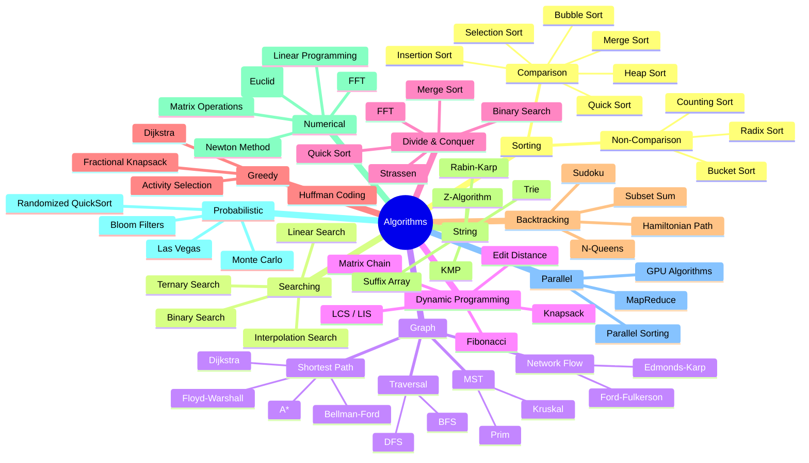

# 🔢 Algorithms — Map of Content

Algorithms are step-by-step procedures for solving computational problems. This folder covers the essential algorithm categories — sorting and searching, graph traversal, dynamic programming, greedy algorithms, and string processing — with complexity analysis, implementation trade-offs, and real-world application guidance. Use the decision matrices to choose the right algorithm for your constraints.

**Parent**: [[System-Design/_MOC|System Design]]

## Algorithm Classification

## Topics

| Topic | Description | Key Pages |
|-------|-------------|-----------|
| [[Big O Notation]] | Time and space complexity analysis | Asymptotic notation, master theorem, amortized analysis |
| [[Algorithm Paradigms]] | Divide & conquer, DP, greedy, backtracking | Recursion trees, memoization, optimal substructure |
| [[Computational Complexity]] | P, NP, NP-complete, reductions | SAT, TSP, vertex cover, Cook-Levin theorem |
| [[Graph Algorithms]] | BFS, DFS, shortest path, MST | Adjacency lists, topological sort, strongly connected components |
| [[Numerical Methods]] | Linear algebra, optimization, simulation | Gradient descent, Newton, Runge-Kutta |

## Complexity Comparison

| Category | Algorithm | Time (Avg) | Time (Worst) | Space | Stable Online? |
|----------|-----------|-----------|-------------|-------|---------------|
| Sorting | Quick Sort | O(n log n) | O(n²) | O(log n) | No / No |
| Sorting | Merge Sort | O(n log n) | O(n log n) | O(n) | Yes / No |
| Sorting | Heap Sort | O(n log n) | O(n log n) | O(1) | No / No |
| Sorting | Counting Sort | O(n + k) | O(n + k) | O(k) | Yes / No |
| Searching | Binary Search | O(log n) | O(log n) | O(1) | N/A |
| Graph | Dijkstra | O((V+E) log V) | O((V+E) log V) | O(V) | N/A |
| Graph | Floyd-Warshall | O(V³) | O(V³) | O(V²) | N/A |
| DP | LCS | O(mn) | O(mn) | O(min(m,n)) | N/A |
| String | KMP | O(n + m) | O(n + m) | O(m) | N/A |

## Selection Guide

| Problem Type | Recommended Algorithm | Why |
|-------------|----------------------|-----|
| Sort small arrays (< 50) | Insertion Sort | Adaptive, fast on nearly-sorted, cache-friendly |
| Sort large arrays | Quick Sort (introsort) | In-place, O(n log n) average (C++ std::sort, Rust) |
| Sort linked lists | Merge Sort | O(1) extra space for lists, stable |
| Sort with limited range | Counting / Radix Sort | O(n) time when k is small |
| Need stable sort | Merge Sort or TimSort | Python, Java, JS use TimSort |
| Find in sorted array | Binary Search | O(log n), simple |
| Shortest path (non-negative) | Dijkstra (heap) | Optimal for weighted graphs |
| Shortest path (negative edges) | Bellman-Ford | Handles negative weights, detects cycles |
| All-pairs shortest paths | Floyd-Warshall | O(V³), good for dense graphs |
| String matching | KMP / Rabin-Karp | O(n+m) or O(n) average |
| Optimization (discrete) | Dynamic Programming | Optimal substructure + overlapping subproblems |
| Optimization (continuous) | Gradient Descent / Simplex | Convex or linear objectives |
| NP-hard (small n) | Backtracking + pruning | Exact solution for n ≤ 20–30 |
| NP-hard (large n) | Approximation / Heuristic | Genetic, simulated annealing, greedy |

## Trade-offs Between Paradigms

| Paradigm | When to Use | When to Avoid |
|----------|-------------|---------------|
| Divide & Conquer | Problem decomposes into independent subproblems | Subproblems overlap significantly |
| Dynamic Programming | Overlapping subproblems + optimal substructure | No overlapping subproblems (use D&C) |
| Greedy | Locally optimal choices → globally optimal | Problem requires looking ahead (use DP) |
| Backtracking | Small search space, need exact answer | Large search space (use heuristic) |
| Randomized | Deterministic solution too slow | Need guaranteed worst-case bounds |
| Approximation | NP-hard, need near-optimal quickly | Need exact optimal answer |

## Cross-Domain Links

- [[Big O Notation]] → [[System-Design/Databases/Database Indexing]], [[System-Design/Architecture/CAP Theorem and PACELC]]
- [[Algorithm Paradigms]] → [[System-Design/Architecture/Domain-Driven Design]], [[Functional Programming]]
- [[Graph Algorithms]] → [[System-Design/Architecture/CDN Architecture]], [[System-Design/Databases/Consistent Hashing]], [[DevOps/Monitoring/Distributed Tracing]]
- [[Computational Complexity]] → [[System-Design/Databases/CRDTs]], [[System-Design/Architecture/Blockchain Fundamentals]]
- [[Numerical Methods]] → [[AI-ML/Deep-Learning/Machine-Learning/Model Training and Optimization]], [[AI-ML/Deep-Learning/Machine-Learning/MLOps]]
- [[Sorting Algorithms]] → [[System-Design/Databases/Database Indexing]], [[Web-Dev/Sorting Algorithms]]
- [[Data Structures Overview]] → [[System-Design/Data-Structures/_MOC|Data Structures MOC]]
- [[Algorithm Paradigms]] → [[System-Design/Databases/Stream Processing]], [[Database Transactions]]
- Search & Sort → [[Web-Dev/HTTP Caching]], [[System-Design/Databases/Caching Strategies]]
- [[System-Design/Algorithms/_MOC|Algorithms MOC]] → [[System-Design/_MOC|System Design Hub]], [[DevOps/_MOC|DevOps Hub]]
