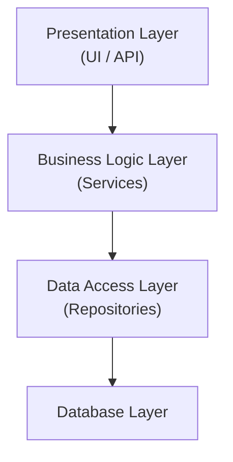
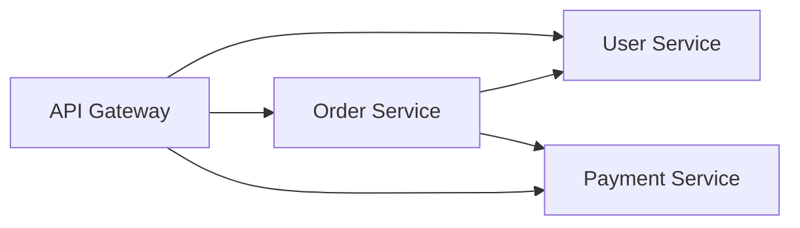
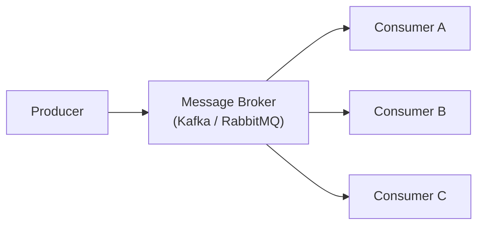

# Code Architecture Patterns

Software architecture patterns provide proven solutions to common design problems. Choosing the right pattern depends on scale, team size, and requirements.

## Layered Architecture



Each layer depends only on the layer below. Changes are isolated, making the system maintainable.

## MVC (Model-View-Controller)

| Component | Responsibility |
|-----------|----------------|
| Model | Data and business logic |
| View | User interface / presentation |
| Controller | Handles input, updates model/view |

Common in web frameworks (Django, Rails, Spring MVC). The controller receives input, updates the model, and selects a view.

## Microservices



Independent services that communicate via APIs. Each service owns its data and domain.

## Event-Driven Architecture

Components communicate via events through a message broker.



Decouples producers from consumers. Enables real-time processing and system resilience.

## CQRS (Command Query Responsibility Segregation)

| Aspect | Command (Write) | Query (Read) |
|--------|----------------|---------------|
| Purpose | Mutate state | Return data |
| Model | Domain model | Denormalized view |
| Scaling | Consistency-focused | Performance-optimized |

Useful when read and write workloads differ significantly.

## Repository Pattern

Abstracts data access behind an interface, making the data layer swappable.

```python
class UserRepository:
    def get_by_id(self, id): ...
    def save(self, user): ...

class PostgresUserRepository(UserRepository):
    def get_by_id(self, id):
        return db.query("SELECT * FROM users WHERE id = %s", id)
```

## Pattern Comparison

| Pattern | Best For | Drawback |
|---------|----------|----------|
| Layered | Simple apps, familiar teams | Can become monolithic |
| MVC | Web apps, UI-heavy projects | Controller bloat |
| Microservices | Large teams, independent deploy | Network complexity, data consistency |
| Event-Driven | Real-time, decoupled systems | Eventual consistency, debugging complexity |
| CQRS | Read/write imbalance | Increased surface area |
| Repository | Swappable data sources | Boilerplate for simple CRUD |

**See also**: [[Software Design Principles]], [[REST API Design]], [[Programming Language Paradigms]], [[Unit Testing Guide]]

**Links**: [[Architecture Patterns]] | [[Blockchain Fundamentals]] | [[CAP Theorem and PACELC]] | [[CDN Architecture]] | [[Computer Architecture and Organization]] | [[Computer Networking]] | [[Concurrency Models]] | [[DNS Deep Dive]] | [[Domain-Driven Design]] | [[Event-Driven Architecture]] | [[Istio Service Mesh]] | [[Memory Management]] | [[Microservices Architecture]] | [[Operating Systems]] | [[Raft Consensus Algorithm]] | [[Saga and Distributed Transactions]] | [[Serverless Computing]] | [[Service Mesh]] | [[System Design Fundamentals]]
