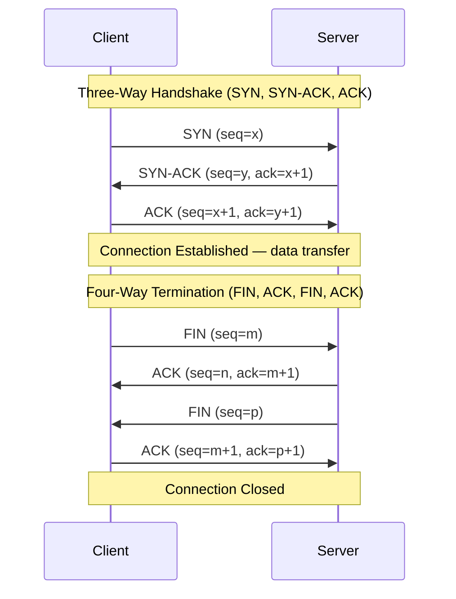
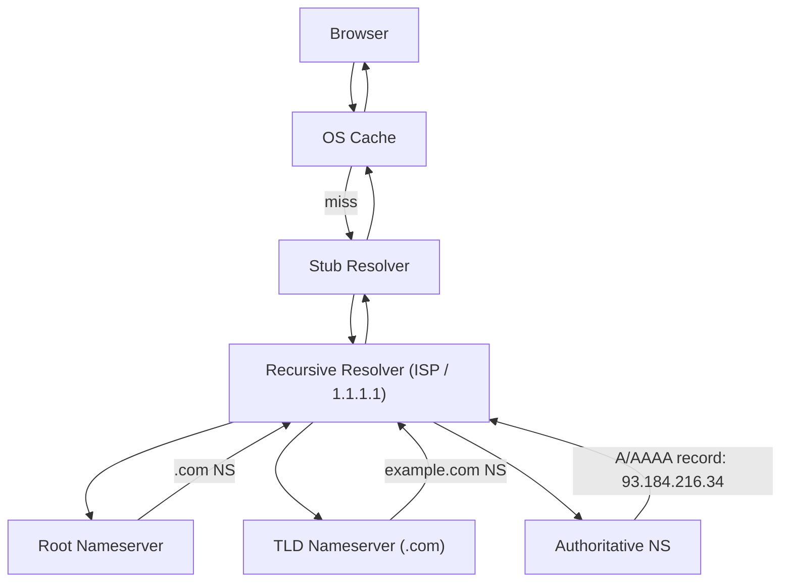
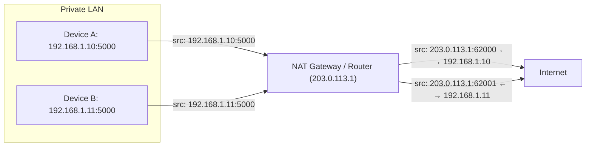

# Computer Networking

Computer networking enables communication between devices through protocols, addressing, and data transmission standards.

## OSI Model (7 Layers)

The OSI model partitions networking into seven abstraction layers, each serving the layer above and being served by the layer below.

| Layer | Name | Function | Example Protocols |
|-------|------|----------|-------------------|
| 7 | Application | User-facing services | HTTP, FTP, SMTP, DNS, SSH |
| 6 | Presentation | Data encoding, encryption, compression | TLS/SSL, JPEG, ASCII, EBCDIC |
| 5 | Session | Session management, checkpoints | RPC, NetBIOS, PPTP |
| 4 | Transport | End-to-end delivery, segmentation | TCP, UDP, QUIC |
| 3 | Network | Logical addressing, routing | IP, ICMP, OSPF, BGP, ARP |
| 2 | Data Link | Framing, MAC addressing, error detection | Ethernet, Wi-Fi (802.11), PPP |
| 1 | Physical | Bit-level transmission, electrical/optical signals | Cables (Cat6), radio, fiber optics |

Data flows down the stack on the sender (encapsulation) and up on the receiver (decapsulation). Each layer adds its own header.

## TCP vs UDP

| Feature | TCP | UDP |
|---------|-----|-----|
| Connection | Connection-oriented (3-way handshake) | Connectionless |
| Reliability | Guaranteed delivery via ACKs + retransmission | Best-effort delivery, no ACKs |
| Ordering | Preserves byte order (sequence numbers) | No ordering guarantees |
| Flow control | Sliding window, congestion avoidance | None |
| Header size | 20–60 bytes | 8 bytes |
| Speed | Slower (overhead) | Faster |
| Use cases | Web (HTTP), email (SMTP), file transfer (FTP), SSH | Streaming video, VoIP, DNS, gaming, QUIC |

## TCP Handshake & Termination

The three-way handshake ensures both sides are reachable and synchronises initial sequence numbers. Termination requires four messages because TCP supports half-close — the server may still have data to send after receiving the client's FIN.

## DNS Resolution Flow

When a browser visits `https://www.example.com`, DNS resolution follows this chain:

Each level caches results (TTL-based) to reduce latency. Typical resolution takes 20–120 ms. Modern browsers also maintain a DNS prefetch cache.

## HTTP Versions

| Feature | HTTP/1.1 (1997) | HTTP/2 (2015) | HTTP/3 (2022) |
|---------|-----------------|---------------|---------------|
| Transport | TCP | TCP | QUIC (UDP) |
| Multiplexing | No (head-of-line blocking) | Yes (streams) | Yes (no HoL blocking) |
| Header compression | No | Yes (HPACK) | Yes (QPACK) |
| Server push | No | Yes | Yes |
| Connection reuse | Keep-alive (persistent) | Single TCP connection | Single QUIC connection |
| 0-RTT handshake | No | No | Yes (resumption) |
| Encryption | Optional (HTTPS) | Required (ALPN) | Required (built-in QUIC) |

HTTP/3 uses QUIC, which is built on UDP and eliminates TCP head-of-line blocking by multiplexing independent streams within a single connection. This significantly improves performance on lossy networks.

## NAT & Subnetting

**Subnetting** divides an IP network into smaller subnets, reducing waste and improving routing efficiency. An IP address has a network portion and a host portion, separated by the subnet mask.

| CIDR | Subnet Mask | Usable Hosts | Example |
|------|-------------|-------------|---------|
| /24 | 255.255.255.0 | 254 | 192.168.1.0/24 |
| /16 | 255.255.0.0 | 65,534 | 10.0.0.0/16 |
| /8 | 255.0.0.0 | 16,777,214 | 10.0.0.0/8 |
| /28 | 255.255.255.240 | 14 | 192.168.1.0/28 |

**Network Address Translation (NAT)** maps private IPs (RFC 1918: 10.x.x.x, 172.16–31.x.x, 192.168.x.x) to a single public IP, conserving global IPv4 address space.

NAT modifies the source IP:port in outgoing packets and maintains a translation table so return traffic is forwarded to the correct internal host (Connection Tracking). Common NAT types: Full Cone, Restricted Cone, Port-Restricted Cone, Symmetric.

## Common Network Topologies

| Topology | Pros | Cons |
|----------|------|------|
| Star | Centralised management, easy troubleshooting | Single point of failure (hub/switch) |
| Mesh | High redundancy, fault-tolerant | Expensive cabling, complex wiring |
| Bus | Simple, cheap | Hard to troubleshoot, limited length |
| Tree | Scalable, hierarchical | Root failure affects all children |
| Ring | Deterministic performance | Single break disrupts entire ring |

## Key Concepts

- **Subnetting**: Dividing IP networks into smaller segments for efficient addressing and routing
- **NAT**: Maps private IPs to a public IP to conserve address space
- **CDN**: Geographical content distribution for low latency (e.g., CloudFront, Cloudflare)
- **Load Balancer**: Distributes traffic across servers (Layer 4 vs Layer 7)
- **VLAN**: Virtual LAN segmentation for network isolation without extra hardware
- **MTU**: Maximum Transmission Unit (typically 1500 bytes for Ethernet); fragmentation occurs when exceeded

**Links**: [[HTTP Protocol]] | [[Web Security]] | [[Nginx Configuration]] | [[REST API Design]] | [[Cloud Computing]]
