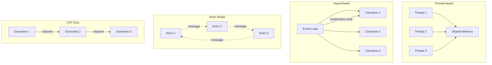

# Concurrency Models

Concurrency enables multiple tasks to make progress simultaneously, improving throughput and responsiveness. Concurrency is *not* the same as parallelism — concurrency is about structure (dealing with many things at once), while parallelism is about execution (doing many things at once).

## Model Comparison



## 1. Thread-Based Model (Java)

Threads are OS-managed. They share memory and synchronise via locks, semaphores, or monitors. Heavy per-thread overhead (~1 MB stack) limits scale to thousands.

```java
public class ThreadExample {
    private static int counter = 0;
    private static final Object lock = new Object();

    public static void main(String[] args) throws InterruptedException {
        Thread t1 = new Thread(() -> {
            for (int i = 0; i < 10000; i++) {
                synchronized (lock) { counter++; }
            }
        });
        Thread t2 = new Thread(() -> {
            for (int i = 0; i < 10000; i++) {
                synchronized (lock) { counter++; }
            }
        });

        t1.start(); t2.start();
        t1.join();  t2.join();
        System.out.println(counter);  // 20000
    }
}
```

**Pros**: Direct OS support, familiar tooling. **Cons**: High memory per thread, risk of deadlock/race, context-switch overhead.

## 2. Async/Await Model (Python / JavaScript)

Tasks yield voluntarily at `await` points, allowing the event loop to interleave others. One thread handles many thousands of I/O-bound operations.

```python
import asyncio

async def fetch_data(url):
    async with aiohttp.ClientSession() as session:
        async with session.get(url) as response:
            return await response.json()

async def main():
    tasks = [fetch_data(url) for url in urls]
    results = await asyncio.gather(*tasks)
```

```javascript
// JavaScript / Node.js equivalent
async function fetchData(url) {
  const res = await fetch(url);
  return res.json();
}

async function main() {
  const results = await Promise.all(urls.map(fetchData));
}
```

**Pros**: Huge concurrency with little overhead. **Cons**: CPU-bound work blocks the event loop (needs worker threads in JS / `loop.run_in_executor` in Python).

## 3. Actor Model (Erlang / Elixir / Akka)

Each actor is an isolated process (not OS process — Erlang process is ~2.5 KB) with a private mailbox. Actors communicate only via asynchronous messages — no shared state.

```erlang
% Erlang — counter actor
-module(counter).
-export([start/0, loop/1]).

start() -> spawn(fun() -> loop(0) end).

loop(Count) ->
    receive
        {increment, From} ->
            NewCount = Count + 1,
            From ! {ok, NewCount},
            loop(NewCount);
        {get, From} ->
            From ! {count, Count},
            loop(Count);
        stop ->
            ok
    end.
```

```java
// Akka (Java) — counter actor
public class CounterActor extends AbstractBehavior<Integer> {
    private int count = 0;

    public static Behavior<Integer> create() { return Behaviors.setup(CounterActor::new); }

    @Override
    public Receive<Integer> createReceive() {
        return newReceiveBuilder()
            .onMessage(Integer.class, n -> {
                count += n;
                System.out.println("Count: " + count);
                return this();
            })
            .build();
    }
}
```

**Pros**: No shared state = no locks, fault isolation (let it crash), location transparent. **Cons**: Message ordering not guaranteed, debugging distributed state is hard.

## 4. CSP (Communicating Sequential Processes) — Go Channels

Goroutines are lightweight (~2 KB stack, grows/shrinks). They communicate over typed channels rather than shared memory.

```go
package main

import "fmt"

func main() {
    // Unbuffered channel — synchronous send/receive
    ch := make(chan string)
    done := make(chan struct{})

    go func() {
        for i := 0; i < 5; i++ {
            ch <- fmt.Sprintf("ping %d", i)
        }
        close(ch)
    }()

    go func() {
        for msg := range ch {
            fmt.Println(msg)
        }
        done <- struct{}{}
    }()

    <-done  // wait for consumer to finish
}
```

**Pros**: Very high concurrency (millions of goroutines), channel-based composition (select, fan-in, fan-out). **Cons**: Shared memory still possible (unsafe), debugging race conditions requires the race detector.

## Shared Memory vs Message Passing

| Aspect                | Shared Memory                          | Message Passing                      |
|-----------------------|----------------------------------------|--------------------------------------|
| **Synchronisation**   | Locks, mutexes, semaphores             | Channels, mailboxes, queues          |
| **State visibility**  | All threads see the same memory        | Copies of data (immutable by default)|
| **Bugs**              | Race conditions, deadlocks             | Deadlocks (blocked on channel/await) |
| **Performance**       | Fast data access, contention overhead  | Copy/serialisation overhead          |
| **Scalability**       | Limited by lock contention             | Scales well across cores and nodes   |
| **Examples**          | Java `synchronized`, C++ `std::mutex`  | Go channels, Erlang actors, MPI      |
| **Fault isolation**   | Poor (corrupt shared state crashes all)| Good (no shared state to corrupt)    |

## Common Pitfalls

- **Race conditions**: Two or more threads read/write shared state without synchronisation. Fix: use atomic ops, locks, or message passing.
- **Deadlocks**: Thread A holds lock L1 and waits for L2; Thread B holds L2 and waits for L1. Fix: acquire locks in a consistent global order; use timeouts.
- **Starvation**: A low-priority or unlucky thread never gets CPU time. Fix: fair scheduling (Go 1.14+ preemptive scheduler), avoid spinlocks.
- **Livelock**: Threads keep changing state in response to each other but make no progress. Fix: add randomness (exponential backoff with jitter).
- **GIL (Python)**: Only one thread executes Python bytecode at a time. CPU-bound Python programs won't see parallel speedup from threads alone — use `multiprocessing` instead.
- **Callback hell / async soup**: Deeply nested callbacks or mixed async/sync code. Fix: use promise chains, async/await, or structured concurrency (Trio, structured tasks in Kotlin).

**See also**: [[Functional Programming]], [[Code Architecture Patterns]], [[Error Handling Patterns]]

**Links**: [[Architecture Patterns]] | [[Blockchain Fundamentals]] | [[CAP Theorem and PACELC]] | [[CDN Architecture]] | [[Code Architecture Patterns]] | [[Computer Architecture and Organization]] | [[Computer Networking]] | [[DNS Deep Dive]] | [[Domain-Driven Design]] | [[Event-Driven Architecture]] | [[Istio Service Mesh]] | [[Memory Management]] | [[Microservices Architecture]] | [[Operating Systems]] | [[Raft Consensus Algorithm]] | [[Saga and Distributed Transactions]] | [[Serverless Computing]] | [[Service Mesh]] | [[System Design Fundamentals]]
