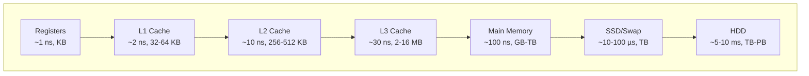

# Memory Management

Memory management controls how programs allocate, use, and release memory. Different languages use different strategies.

## Memory Hierarchy Pyramid



## Stack vs Heap

| Aspect | Stack | Heap |
|--------|-------|------|
| Allocation | Automatic (function calls) | Manual or GC |
| Size | Fixed (per thread, ~1-8 MB) | Large (GBs) |
| Speed | Fast (push/pop) | Slower (allocation, fragmentation) |
| Lifetime | Function scope | Until freed or GC'd |
| Data size | Known at compile time | Dynamic |

## Virtual Memory and MMU

The **Memory Management Unit (MMU)** translates virtual addresses to physical addresses using page tables:

```
CPU → Virtual Address → MMU (TLB lookup) → Page Table Walk → Physical Address → RAM
```

**Benefits of virtual memory**:
- **Isolation**: Each process has its own address space; one cannot corrupt another.
- **Overcommit**: Allocate more virtual memory than physical RAM exists (backed by swap).
- **Shared memory**: Different virtual pages can map to the same physical page.
- **Simplified linking**: All processes use the same virtual address layout.

## Garbage Collection Algorithms

| Algorithm | How It Works | Pros | Cons |
|-----------|-------------|------|------|
| Reference Counting | Count references, free when 0 | Simple, predictable | Cannot handle cycles |
| Mark-and-Sweep | Trace from roots, mark reachable, sweep rest | Handles cycles | Pauses program, creates fragmentation |
| Copying (Cheney) | Divide heap into two halves, copy live objects | No fragmentation, compacting | Uses 2× memory, only half available |
| Generational | New objects collected more often (nursery) | Efficient (most die young) | Tuning needed, cross-gen pointers |
| Concurrent | GC runs in parallel with program threads | Low pause times | More CPU overhead, write barriers |

## Memory Fragmentation

| Type | Cause | Result |
|------|-------|--------|
| External | Variable-size allocations and frees leave gaps | Allocation fails despite enough total free memory |
| Internal | Allocated block larger than requested (e.g., paging rounding) | Wasted space within blocks |

**Compaction**: Rearranging live objects to close gaps (used in compacting GCs). **Buddy allocators** and **slab allocators** mitigate fragmentation by grouping same-size objects.

## Manual Memory Management (C)

```c
int* arr = (int*)malloc(10 * sizeof(int));
// use arr...
free(arr);  // must free exactly once
```

## RAII (C++)

Resource Acquisition Is Initialization — destructors run automatically when objects go out of scope:

```cpp
std::vector<int> v; // allocates on heap
// ... use v ...
// automatically freed when v goes out of scope
```

## Ownership (Rust)

Rust's borrow checker enforces memory safety at compile time:

```rust
let s = String::from("hello"); // s owns the string
let t = s; // ownership moves to t, s is invalid
```

## Automatic Reference Counting (Swift/ObjC)

```swift
class User {
    var name: String
    weak var pet: Pet? // weak avoids retain cycles
}
```

## Memory Pooling and Arena Allocators

| Technique | How It Works | Best For |
|-----------|-------------|----------|
| Object Pool | Pre-allocate fixed-size objects, reuse | Connection pools, thread pools |
| Arena/Region | Allocate from a contiguous block, free all at once | Frame allocators (games), request scopes |
| Slab Allocator | Pre-populated caches of kernel objects | Linux kernel (kmem_cache) |
| Stack Allocator | LIFO bump allocation, no fragmentation | Short-lived allocations, recursion |

## Memory Leaks

Common causes:
- Unreferenced objects still reachable (stuck in a collection)
- Event listeners never unregistered
- Circular references in ref-counted systems
- Cached data without eviction
- Closure capturing large objects

## Memory Profiling Tools

| Tool | Platform | Use |
|------|----------|-----|
| Valgrind (memcheck) | Linux | Detects leaks and errors |
| heaptrack | Linux | Heap profiler |
| Instruments | macOS/iOS | Allocation tracking |
| dotMemory | .NET | Memory analysis |
| Chrome DevTools | Web | Heap snapshots, allocation timeline |

**Links**: [[Operating Systems]] | [[Performance Profiling]] | [[Data Structures]] | [[Concurrency Models]] | [[Python Imports and Modules]]
