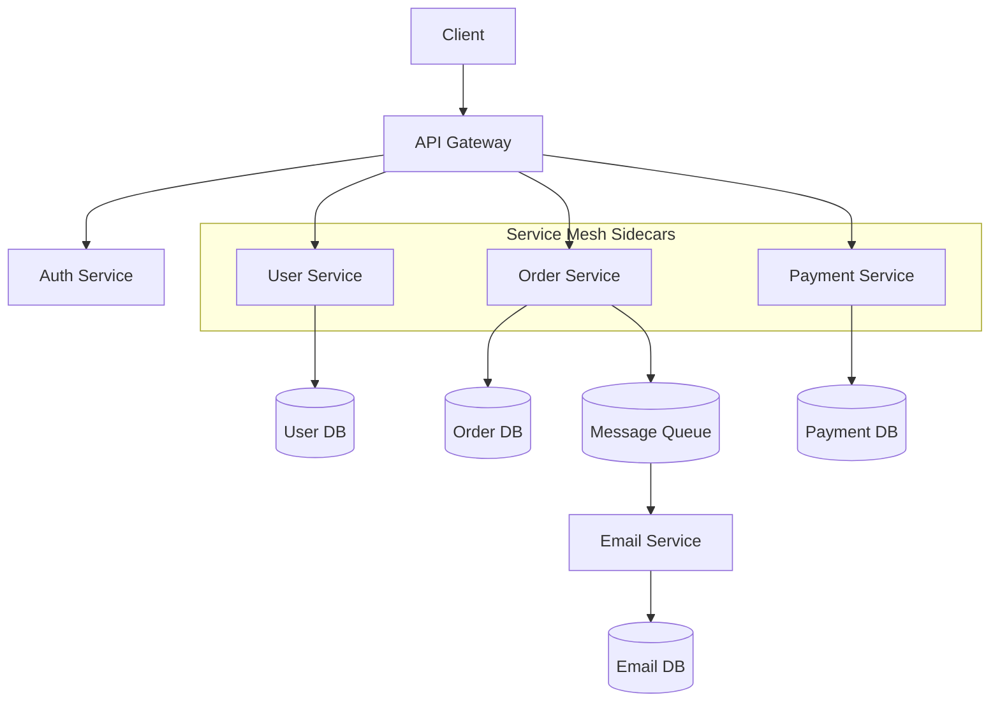

# Microservices Architecture

Microservices decompose an application into independently deployable services that each own their data and domain.

## Monolith vs Microservices

| Aspect | Monolith | Microservices |
|--------|----------|---------------|
| Deployment | Single unit | Independent per service |
| Scaling | Scale entire app | Scale individual services |
| Team autonomy | Low | High |
| Complexity | Low (simple app) | High (distributed) |
| Testing | End-to-end | Per service + integration |

## Database per Service

Each microservice owns its private database — no other service accesses it directly. This enforces loose coupling and allows each team to choose the best storage technology (relational, document, graph, etc.).

| Service | Database | Rationale |
|---------|----------|-----------|
| User | PostgreSQL | ACID for user data |
| Orders | PostgreSQL | Strong consistency for transactions |
| Inventory | Redis | Low-latency stock lookups |
| Analytics | Cassandra | High write throughput |
| Search | Elasticsearch | Full-text search |

Interservice data joins happen via API calls or event-driven replication, not shared DB queries.

## Inter-Service Communication Patterns

| Pattern | Mechanism | When to Use |
|---------|-----------|-------------|
| Synchronous (request/reply) | HTTP/REST, gRPC | Queries, commands needing immediate response |
| Asynchronous (events) | Message queues, Kafka | Decoupled workflows, notifications, CQRS |
| Async (commands) | RabbitMQ, SQS | Task offloading, ordered processing |
| Service Mesh | Sidecar proxy (Envoy, Linkerd) | Observability, retries, traffic splitting |

Synchronous calls are simpler but introduce temporal coupling. Asynchronous events decouple services at the cost of eventual consistency.

## Expanded Key Patterns

- **API Gateway**: Single entry point that routes requests, aggregates responses, and enforces auth. Avoids scattering cross-cutting concerns across services.
- **Service Discovery**: Services register their network location on startup. Clients query a registry (Consul, etcd, Kubernetes DNS) to find healthy instances.
- **Circuit Breaker**: Wraps remote calls. After N failures, the breaker opens and subsequent calls fail immediately without hitting the downstream. Periodic probes check for recovery (half-open → closed).
- **Saga**: Coordinates a distributed transaction as a sequence of local transactions. Each step publishes an event that triggers the next step. If a step fails, compensating actions undo prior steps.
- **CQRS**: Segregates read models from write models. Writes go through command handlers to a write store; reads query a denormalised read store optimised for specific queries.

## When to Use vs When to Avoid

| Prefer Microservices When | Prefer Monolith When |
|---------------------------|---------------------|
| Large engineering teams (10+) | Small team (< 5) |
| Multiple independent domains | Simple CRUD application |
| Need to scale components independently | Low traffic, simple deployment |
| Polyglot tech stack desired | Single technology stack preferred |
| Frequent independent deployments | Infrequent releases |

**Avoid microservices as a first step** — start with a modular monolith, extract services only when the monolith's boundaries become clear and the coordination cost is justified.

## Challenges

- Network latency and failures
- Data consistency across services
- Observability (distributed tracing)
- Deployment complexity

**Links**: [[API Gateway Patterns]] | [[Code Architecture Patterns]] | [[Message Queues]] | [[REST API Design]] | [[Docker Containers]] | [[Kubernetes Basics]] | [[Service Mesh]] | [[Event-Driven Architecture]] | [[Domain-Driven Design]] | [[Saga and Distributed Transactions]] | [[Distributed Tracing]]

**See also**: [[Caching Strategies]], [[Database Sharding]], [[Monitoring and Observability]], [[CI CD Pipelines]]
