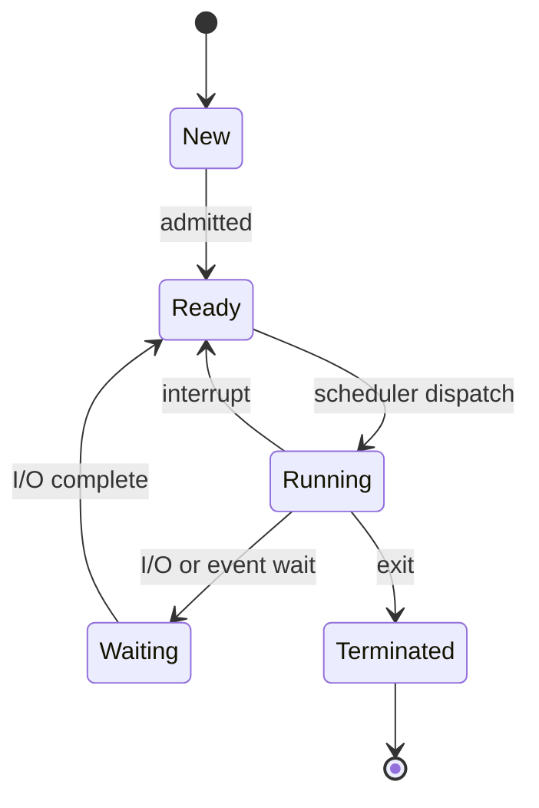

# Operating Systems

An operating system manages hardware resources, provides abstractions for applications, and ensures isolation between processes.

## Process vs Thread

| Aspect | Process | Thread |
|--------|---------|--------|
| Address Space | Private | Shared with process |
| Overhead | High (fork, copy) | Low |
| Isolation | Fully isolated | Within-process shared |
| Communication | IPC (pipes, sockets) | Shared memory |
| Debugging | Independent | Can affect siblings |

## Process Lifecycle



States: **New** (created but not yet loaded), **Ready** (loaded, waiting for CPU), **Running** (executing), **Waiting** (blocked on I/O), **Terminated** (finished).

## CPU Scheduling Algorithms

| Algorithm | Strategy | Preemptive? | Starvation? | Context Switches |
|-----------|----------|-------------|-------------|------------------|
| FCFS | First come, first served | No | No | Minimal |
| SJF | Shortest job first (by duration) | No | Yes (long jobs) | Low |
| SRTF | Shortest remaining time | Yes | Yes | Moderate |
| Round Robin | Fixed time quantum per process | Yes | No | High (quantum dependent) |
| Priority | Higher priority runs first | Optional | Yes (low priority) | Moderate |
| Multilevel Queue | Separate queues per priority class | Yes | Possible | Moderate |
| Multilevel Feedback | Processes can move between queues | Yes | Rare (aging helps) | Higher |

**Quantum tuning**: Too large → degenerates to FCFS. Too small → excessive context switching overhead.

## Memory Management

- **Paging**: Fixed-size pages (4 KB typical) mapped to physical frames. Eliminates external fragmentation. Page table per process.
- **Segmentation**: Variable-size logical segments (code, data, stack). Matches programmer's view, but causes external fragmentation.

| Feature | Paging | Segmentation |
|---------|--------|--------------|
| Unit size | Fixed | Variable |
| Fragmentation | Internal (last page) | External |
| Sharing | Complex (shared pages) | Natural (whole segments) |
| Protection | Per-page bits | Per-segment bits |

## Memory Hierarchy

```
Registers (1 cycle) → L1 Cache (2-4 cycles) → L2 Cache (10-20 cycles) → L3 Cache (30-50 cycles) → RAM (100-300 cycles) → SSD (10-100 µs) → HDD (5-10 ms)
```

Each level is larger, slower, and cheaper per byte. The OS manages data movement between levels (caching, prefetching, swap).

## File System Comparison

| FS | OS | Max File Size | Max Volume Size | Journaling | Features |
|----|----|---------------|-----------------|------------|----------|
| NTFS | Windows | 16 EB | 256 TB | Yes | ACLs, compression, encryption (EFS) |
| ext4 | Linux | 16 TB | 1 EB | Yes | Extents, delayed allocation |
| APFS | macOS | 8 EB | 8 EB | Yes | Copy-on-write, snapshots, encryption |
| ZFS | Cross-platform | 16 EB | 256 ZB | Yes (COW) | Checksumming, dedup, RAID-Z, snapshots |
| XFS | Linux | 8 EB | 8 EB | Yes | Excellent large-file throughput |

## Deadlock Conditions (all 4 required)

1. **Mutual Exclusion**: Resources are non-sharable
2. **Hold and Wait**: Process holds resources while waiting
3. **No Preemption**: Resources released voluntarily
4. **Circular Wait**: Circular chain of processes waiting

Prevention: break any one condition. Most systems use lock ordering to break circular wait.

## IPC Mechanisms

| Method | Type | Use Case |
|--------|------|----------|
| Pipe | Byte stream | Parent-child processes |
| Socket | Network/stream | Cross-machine |
| Shared Memory | Fast direct access | High throughput |
| Message Queue | Structured messages | Decoupled services |
| Semaphore | Synchronization | Mutual exclusion |

## System Calls

Key categories: process control (fork, exec), file management (open, read, write), device management (ioctl), information (getpid), communication (pipe, socket).

**Links**: [[Concurrency Models]] | [[Memory Management]] | [[Docker Containers]] | [[Performance Profiling]]
