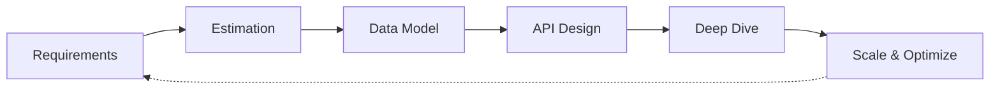

# System Design Fundamentals

System design is the process of defining architecture, components, modules, and data flow to meet functional and non-functional requirements.

## System Design Process



The process is iterative — deep dives often reveal new constraints that feed back into requirements.

## Key Principles

| Principle | Description |
|-----------|-------------|
| Separation of Concerns | Divide into distinct layers/services |
| Single Responsibility | Each component does one thing |
| Loose Coupling | Minimize dependencies between components |
| High Cohesion | Related logic stays together |
| Redundancy | Duplicate critical components for fault tolerance |
| Statelessness | Prefer stateless designs for horizontal scaling |

## Back-of-the-Envelope Estimation

Quick calculations to size the system before building:

| Metric | Formula | Example (Twitter-scale) |
|--------|---------|------------------------|
| QPS | DAU × actions per user / 86400 | 500M DAU × 2 tweets / 86400 ≈ 11,500 write QPS |
| Storage | QPS × avg size × retention | 11,500 × 1 KB × 86,400 × 365 ≈ 360 TB/year |
| Bandwidth | Bytes per request × QPS | 1 KB × 11,500 × 8 ≈ 92 Mbps writes + 10× reads = ~1 Gbps |
| Memory (cache) | Read QPS × cache TTL × obj size | 115,000 reads × 300s × 1 KB ≈ 34 GB cache |

**Rule of thumb**: Double your estimate. Real-world traffic patterns are bursty.

## CAP Theorem

A distributed system can only guarantee two of three properties:

| Property | Meaning |
|----------|---------|
| Consistency | Every read returns the most recent write |
| Availability | Every request gets a non-error response |
| Partition Tolerance | System continues despite network failures |

**Practical choices**: CP (consistency over availability) for banking; AP (availability over consistency) for social media; CA is not realistic in distributed systems.

## Consistency Models

| Model | Guarantee |
|-------|-----------|
| Strong | Read always sees latest write |
| Eventual | Reads eventually converge |
| Causal | Related operations ordered, unrelated can diverge |
| Read-Your-Writes | Client sees its own writes |

## Common Trade-Offs

| Trade-Off | Choice A | Choice B |
|-----------|----------|----------|
| Consistency vs Latency | Strong consistency (higher latency) | Eventual consistency (faster reads) |
| Cost vs Performance | Vertical scaling (expensive) | Horizontal scaling (complex) |
| Accuracy vs Speed | Strict calculation | Approximate (Bloom filters, HyperLogLog) |
| Availability vs Durability | In-memory caches | Disk-backed persistence |
| Flexibility vs Constraints | NoSQL schemas | SQL schemas (ACID) |

## Load Balancing

- **Round Robin**: Distributes evenly, doesn't consider load
- **Least Connections**: Sends to least busy server
- **IP Hash**: Consistent routing by client IP (good for sticky sessions)
- **Weighted**: Servers with higher capacity get more traffic

## Caching Layers

```
Client → CDN → Load Balancer → App Server → In-Memory Cache → Database
```

Cache eviction policies: **LRU** (most common), **LFU**, **TTL**, **FIFO**.

## Database Scaling

| Strategy | Description |
|----------|-------------|
| Vertical | Increase server resources (RAM, CPU) |
| Read Replicas | Copy data to read-only nodes |
| Sharding | Split data across databases by key |
| Partitioning | Split tables within a database |

## Key Architectural Considerations

| Concern | What It Means | Mitigation |
|---------|---------------|------------|
| Scalability | Handle growing load | Horizontal scaling, partitioning |
| Reliability | Work correctly despite failures | Redundancy, graceful degradation |
| Availability | Serve requests consistently | Load balancers, failover, health checks |
| Performance | Respond within latency SLAs | Caching, CDN, connection pooling |
| Security | Protect data and access | Encryption, auth, rate limiting |

**Links**: [[Microservices Architecture]] | [[Database Sharding]] | [[Caching Strategies]] | [[REST API Design]] | [[Message Queues]]
