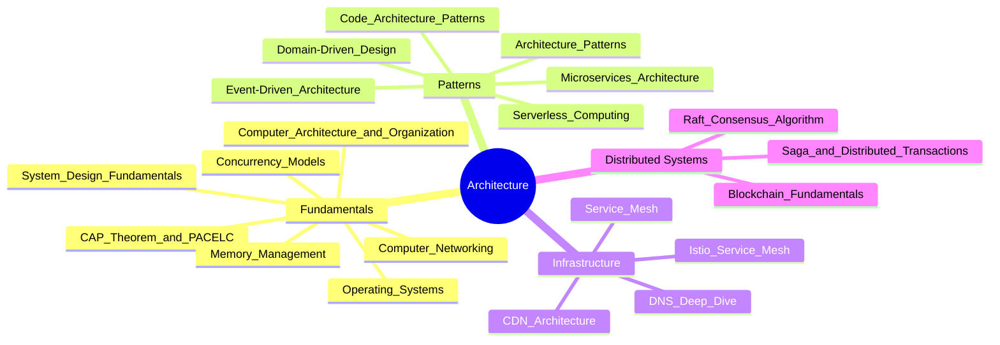

# 🏛️ Architecture — Map of Content

**Parent**: [[System-Design/_MOC|System Design]]

System architecture defines how components interact, scale, and fail. This folder covers fundamental concepts (CAP theorem, consensus algorithms), architectural patterns (microservices, event-driven, DDD), infrastructure primitives (DNS, CDN, service mesh), and distributed systems theory (Raft, Saga, blockchain). These notes prepare you to design, evaluate, and communicate system architectures.

## Topics

| Category | Notes |
|----------|-------|
| **Fundamentals** | [[System Design Fundamentals]], [[CAP Theorem and PACELC]], [[Computer Networking]], [[Operating Systems]], [[Memory Management]], [[Concurrency Models]], [[Computer Architecture and Organization]] |
| **Patterns** | [[Architecture Patterns]], [[Microservices Architecture]], [[Event-Driven Architecture]], [[Domain-Driven Design]], [[Code Architecture Patterns]], [[Serverless Computing]] |
| **Infrastructure** | [[CDN Architecture]], [[DNS Deep Dive]], [[Service Mesh]], [[Istio Service Mesh]] |
| **Distributed** | [[Raft Consensus Algorithm]], [[Saga and Distributed Transactions]], [[Blockchain Fundamentals]] |

## Cross-Domain Links

- [[System-Design/Architecture/Microservices Architecture]] → [[DevOps/Containers/Docker Containers]], [[DevOps/Containers/Kubernetes Basics]]
- [[System-Design/Architecture/CAP Theorem and PACELC]] → [[System-Design/Databases/Cassandra]], [[System-Design/Databases/MongoDB Deep Dive]]
- [[System-Design/Architecture/Event-Driven Architecture]] → [[System-Design/Databases/Message Queues]], [[System-Design/Databases/Kafka Deep Dive]]
- [[System-Design/Architecture/CDN Architecture]] → [[Web-Dev/HTTP Caching]], [[System-Design/Databases/Caching Strategies]]
