# 📦 Data Structures — Map of Content

Data structures organize and store data for efficient access and modification. This folder covers the complete taxonomy — linear structures (arrays, linked lists, stacks, queues), trees (BST, AVL, B-Tree, Trie), hash-based structures, graphs, and probabilistic data structures (Bloom filters, HyperLogLog) — with complexity analysis and selection guidance for engineering problems.

**Parent**: [[System-Design/_MOC|System Design]]

## Data Structure Classification

```mermaid
graph TD
    DS["Data Structures"] --> Linear["Linear"]
    DS --> Tree["Tree-Based"]
    DS --> Hash["Hash-Based"]
    DS --> Graph["Graph"]
    DS --> Prob["Probabilistic"]

    Linear --> Array["Array"]
    Linear --> LL["Linked List"]
    Linear --> Stack["Stack"]
    Linear --> Queue["Queue"]
    Linear --> Deque["Deque"]

    Tree --> BST["Binary Search Tree"]
    Tree --> AVL["AVL Tree"]
    Tree --> RBT["Red-Black Tree"]
    Tree --> BTree["B-Tree / B+ Tree"]
    Tree --> Trie["Trie (Prefix Tree)"]
    Tree --> SegTree["Segment Tree"]
    Tree --> BIT["Fenwick Tree"]
    Tree --> Heap["Heap (Priority Queue)"]

    Hash --> HT["Hash Table"]
    Hash --> HM["Hash Map"]
    Hash --> HS["Hash Set"]

    Graph --> AdjMat["Adjacency Matrix"]
    Graph --> AdjList["Adjacency List"]

    Prob --> BF["Bloom Filter"]
    Prob --> HLL["HyperLogLog"]
    Prob --> CMS["Count-Min Sketch"]
    Prob --> CS["Cuckoo Filter"]

    style Linear fill:#4285f4,color:#fff
    style Tree fill:#ea4335,color:#fff
    style Hash fill:#fbbc04,color:#000
    style Graph fill:#34a853,color:#fff
    style Prob fill:#ff6d01,color:#fff
```

## Topics

| Topic | Description | Key Pages |
|-------|-------------|-----------|
| [[Data Structures]] | Arrays, linked lists, trees, hash tables, heaps | Implementations, trade-offs, language specifics |
| [[Data Structures Overview]] | Cross-cutting patterns and real-world applications | Indexing, caching, database internals |
| [[Probabilistic Data Structures]] | Bloom filters, HyperLogLog, Count-Min Sketch | Space-efficiency, false positives, approximate counting |

## Operations Complexity

| Data Structure | Access | Search | Insert | Delete | Space |
|---------------|--------|--------|--------|--------|-------|
| Array | O(1) | O(n) | O(n) | O(n) | O(n) |
| Sorted Array | O(1) | O(log n) | O(n) | O(n) | O(n) |
| Singly Linked List | O(n) | O(n) | O(1) | O(1) | O(n) |
| Doubly Linked List | O(n) | O(n) | O(1) | O(1) | O(n) |
| Stack | O(n) | O(n) | O(1) | O(1) | O(n) |
| Queue | O(n) | O(n) | O(1) | O(1) | O(n) |
| Hash Table | N/A | O(1) avg / O(n) worst | O(1) avg / O(n) worst | O(1) avg / O(n) worst | O(n) |
| Binary Search Tree | O(log n) avg | O(log n) avg / O(n) worst | O(log n) avg / O(n) worst | O(log n) avg / O(n) worst | O(n) |
| AVL / Red-Black Tree | O(log n) | O(log n) | O(log n) | O(log n) | O(n) |
| B-Tree | O(log n) | O(log n) | O(log n) | O(log n) | O(n) |
| Heap (Min/Max) | O(1) at root | O(n) | O(log n) | O(log n) | O(n) |
| Trie | O(k) | O(k) | O(k) | O(k) | O(n × k) |
| Segment Tree | O(log n) | O(log n) | O(log n) | O(log n) | O(4n) |
| Fenwick Tree | N/A | O(log n) prefix sum | O(log n) | O(log n) | O(n) |
| Adjacency Matrix (Graph) | O(1) edge check | O(V²) | O(V²) | O(V²) | O(V²) |
| Adjacency List (Graph) | O(deg(v)) | O(V + E) | O(1) | O(E) | O(V + E) |
| Bloom Filter | N/A | O(k) (k hashes) | O(k) | N/A | O(m) bits |
| HyperLogLog | N/A | N/A | O(1) | N/A | O(2^p) |

## Selection Guide

| Use Case | Recommended Structure | Why |
|----------|----------------------|-----|
| Fast index-based access | Array | O(1) random access |
| Frequent insertions/deletions at ends | Linked List / Deque | O(1) at ends |
| LIFO access | Stack | Simple, O(1) push/pop |
| FIFO access | Queue | Simple, O(1) enqueue/dequeue |
| Fast key-value lookups | Hash Table | O(1) average |
| Sorted key-value with range queries | B-Tree / B+ Tree | O(log n) range scan (used by databases) |
| Fast prefix search | Trie | O(k) per lookup |
| Priority queue operations | Heap (Binary Heap) | O(log n) insert/extract-min |
| Range min/max/sum queries | Segment Tree / Fenwick | O(log n) query + update |
| Check membership (space-critical) | Bloom Filter | Constant space, tunable false-positive rate |
| Count distinct elements (approx) | HyperLogLog | ~1.5% error with ~1.5 KB |
| Frequent item detection (streaming) | Count-Min Sketch | Sub-linear space, approximate counts |
| Graph traversal / shortest path | Adjacency List | Space-efficient for sparse graphs |
| Database indexing | B+ Tree | Minimizes disk I/O, fanout ~1000 |
| Caching (LRU, LFU) | Hash Map + Doubly Linked List | O(1) get/put |

## Memory Footprint Comparison

| Structure | Per Element Overhead | Cache Locality |
|-----------|---------------------|----------------|
| Array | Minimal (value only) | Excellent (contiguous) |
| Linked List | 2 pointers (16–32 bytes) | Poor (scattered) |
| Hash Table | 1 pointer + load factor overhead | Moderate |
| Balanced Tree | 2–3 pointers + color bit | Poor |
| B-Tree | Array of keys/pointers per node | Excellent (sequential within node) |
| Trie | Number of children × pointer | Poor (pointer chasing) |
| Bloom Filter | 1 bit (compressed) | Good (contiguous bit array) |

## Data Structure Trade-offs

- **Array vs Linked List**: Arrays win on locality and random access; linked lists win on non-contiguous insert/delete.
- **Hash Table vs BST**: Hash tables win on single-key lookups; BSTs win on ordered operations (range scan, min/max).
- **BST vs B-Tree**: BSTs win in-memory; B-Trees win on-disk (minimize page fetches).
- **Bloom Filter vs Hash Set**: Bloom filters use ~1/10th the memory but have false positives and cannot store values.
- **Segment Tree vs Fenwick Tree**: Fenwick uses less memory but only handles prefix operations; segment tree supports arbitrary ranges.

## Cross-Domain Links

- [[Data Structures Overview]] → [[System-Design/Databases/Database Indexing]], [[System-Design/Databases/Database Sharding]], [[System-Design/Databases/LSM-Tree Storage Engines]]
- [[Probabilistic Data Structures]] → [[System-Design/Databases/Caching Strategies]], [[System-Design/Databases/Cassandra]], [[System-Design/Databases/Redis Deep Dive]]
- [[Data Structures Overview]] → [[System-Design/Algorithms/_MOC|Algorithms MOC]], [[System-Design/Architecture/Computer Architecture]]
- [[Data Structures Overview]] → [[Web-Dev/HTTP Caching]], [[System-Design/Architecture/CDN Architecture]]
- B-Tree / B+ Tree → [[System-Design/Databases/Database Engines Compared]], [[System-Design/Databases/PostgreSQL Features]], [[System-Design/Databases/MySQL Deep Dive]]
- Hash Tables → [[System-Design/Databases/Database Sharding]], [[System-Design/Databases/Consistent Hashing]]
- Heap → [[System-Design/Architecture/Message Queues]], [[System-Design/Databases/Apache Kafka Deep Dive]]
- Graph Structures → [[System-Design/Databases/Neo4j and Graph Databases]], [[System-Design/Architecture/Service Mesh]]
- Trie → [[Web-Dev/Autocomplete Systems]], [[System-Design/Databases/Search Engines]]
- [[System-Design/Data-Structures/_MOC|DS MOC]] → [[System-Design/_MOC|System Design Hub]], [[DevOps/_MOC|DevOps Hub]]
