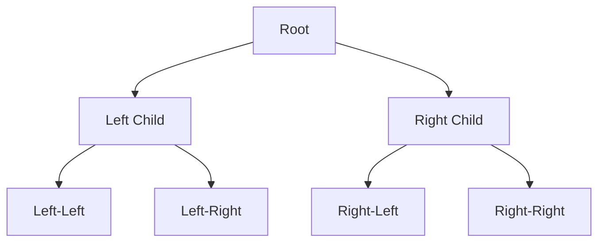

**Links**: [[Data Structures Overview]] | [[Probabilistic Data Structures]]

# Data Structures

Data structures organize and store data for efficient access and modification. Choosing the right structure is critical for performance.

## Fundamental Structures

| Structure | Access | Search | Insert | Delete |
|-----------|--------|--------|--------|--------|
| Array | O(1) | O(n) | O(n) | O(n) |
| Linked List | O(n) | O(n) | O(1) | O(1) |
| Hash Table | O(1)* | O(1)* | O(1)* | O(1)* |
| Binary Search Tree | O(log n) | O(log n) | O(log n) | O(log n) |
| Stack | O(1) top | O(n) | O(1) push | O(1) pop |
| Queue | O(1) front/back | O(n) | O(1) enqueue | O(1) dequeue |
| Heap | O(1) min/max | O(n) | O(log n) | O(log n) |

*Average case; worst-case O(n) with collisions

## Tree Structures



Balanced trees (AVL, Red-Black) maintain O(log n) operations by auto-rotating.

## Advanced Structures

| Structure | Use Case | Key Operation |
|-----------|----------|---------------|
| Trie | String prefix search, autocomplete | O(k) lookup by prefix |
| Graph | Networks, social connections, routes | BFS/DFS traversal |
| Bloom Filter | Probabilistic set membership | False-positive possible |
| Segment Tree | Range queries with updates | O(log n) range sum |
| LRU Cache | Bounded memory with eviction | O(1) get/put |
| Disjoint Set | Union-find, connected components | Near O(1) union/find |

## Implementation Examples

```python
# Hash Table
cache = {"user:1": "Alice", "user:2": "Bob"}

# Stack (LIFO)
stack = []
stack.append("a")  # push
stack.pop()        # pop → "a"

# Queue (FIFO)
from collections import deque
queue = deque()
queue.append("a")  # enqueue
queue.popleft()    # dequeue → "a"

# LRU Cache
from functools import lru_cache
@lru_cache(maxsize=128)
def expensive_query(id):
    return fetch_from_db(id)
```

## When to Use

| Need | Structure |
|------|-----------|
| Fast lookups by key | Hash Table |
| Ordered data | BST / Balanced Tree |
| FIFO processing | Queue |
| LIFO processing | Stack |
| Priority-based | Heap |
| String prefix search | Trie |
| Relationships | Graph |
| Cache bounded in size | LRU Cache |
| Membership (large set) | Bloom Filter |
| Range queries | Segment Tree |

**See also**: [[Big O Notation]], [[Programming Language Paradigms]], [[Code Architecture Patterns]]
