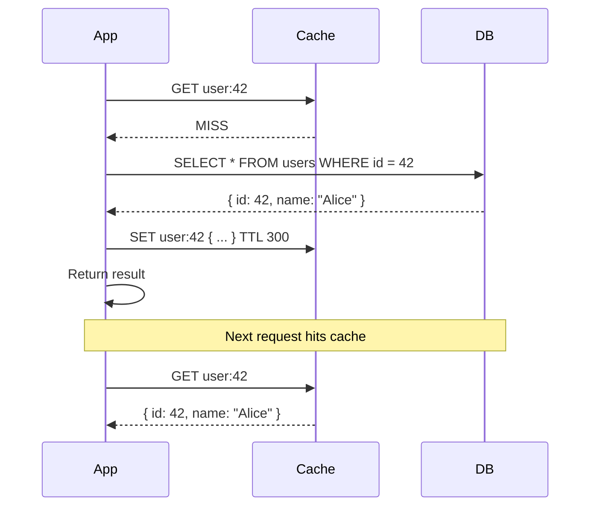
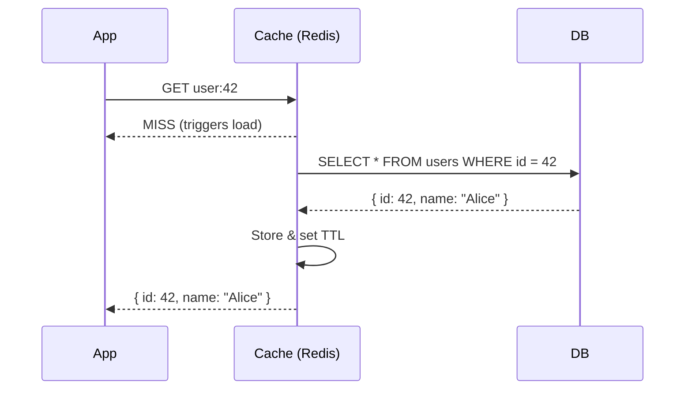
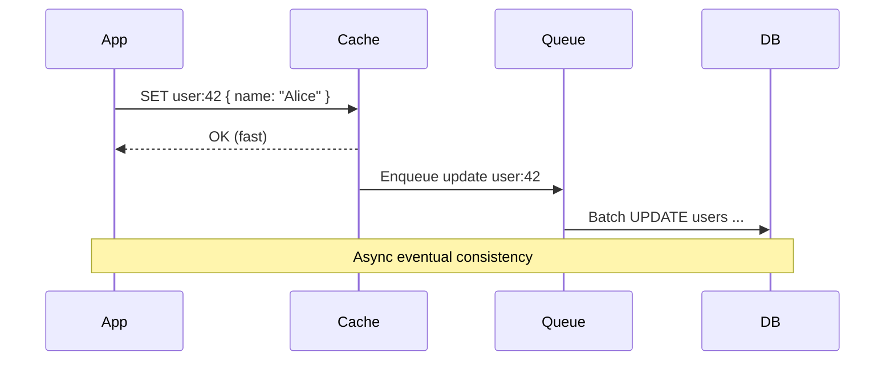

**Links**: [[Redis Deep Dive]] | [[Database Indexing Strategies]] | [[Database Engines Compared]] | [[Consistent Hashing]] | [[Rate Limiting]] | [[Stream Processing]]


# Caching Strategies

Caching stores frequently accessed data in fast-access storage to reduce latency and backend load. Effective caching can reduce response times from 100ms+ to single-digit milliseconds.

## Cache Levels

| Level | Examples | Latency | Capacity |
|-------|----------|---------|----------|
| L1/L2 CPU | Per-core cache | ~1 ns | KB |
| In-memory | Redis, Memcached, local hashmap | ~1 ms | GB |
| CDN | CloudFront, Cloudflare, Fastly | ~10 ms | TB |
| Browser | localStorage, sessionStorage, HTTP cache | ~0 ms (local) | MB |
| Application | In-process cache (Caffeine, Guava) | ~0.1 ms | MB-GB |

## Caching Patterns

### Cache-Aside (Lazy Loading)

Application checks cache first; on miss, fetches from DB and populates cache.



```python
def get_user(user_id):
    key = f"user:{user_id}"
    user = cache.get(key)
    if user is None:
        user = db.query("SELECT * FROM users WHERE id = %s", user_id)
        cache.set(key, user, ttl=300)
    return user
```

### Read-Through

Cache layer is responsible for fetching from DB on miss. Application only talks to cache.



### Write-Through

Data is written to cache and DB in the same transaction. Ensures cache is always consistent with DB.

```python
def update_user(user_id, data):
    db.update("users", data, where={"id": user_id})
    cache.set(f"user:{user_id}", data, ttl=300)
```

**Trade-off**: Higher write latency, but reads are always fresh.

### Write-Behind (Write-Back)

Data is written to cache immediately; DB is updated asynchronously (batched).



**Trade-off**: Very fast writes, but risk of data loss if cache fails before DB write.

## Eviction Policies

| Policy | Behavior | Use Case |
|--------|----------|----------|
| **LRU** (Least Recently Used) | Evicts oldest accessed item | General-purpose, good for most workloads |
| **LFU** (Least Frequently Used) | Evicts least accessed item | Content with skewed popularity (videos, articles) |
| **FIFO** (First In, First Out) | Evicts the oldest item regardless of access | Streaming / event buffers |
| **TTL** (Time-To-Live) | Expires items after fixed duration | Session data, OTP codes, rate limit counters |
| **MRU** (Most Recently Used) | Evicts the most recently used item | Large working sets where old items are hot |

```python
# Redis example: LRU with maxmemory
# In redis.conf:
# maxmemory 256mb
# maxmemory-policy allkeys-lru
```

## Cache Invalidation Challenges

| Problem | Description | Solution |
|---------|-------------|----------|
| **Stale data** | Cache returns outdated values after DB update | TTL, write-through, event-driven invalidation |
| **Thundering herd** | Many requests for same key after mass expiry | Re-validate with locking, staggered TTLs |
| **Cache stampede** | Concurrent cache misses overwhelm DB | Early re-compute, probabilistic expiration |
| **Cold start** | Empty cache after deployment or restart | Pre-warming, gradual traffic ramp |
| **Data inconsistency** | Cache and DB out of sync | Dual-write patterns, CDC (change data capture) |

```python
# Prevent thundering herd with mutex
def get_user(user_id):
    key = f"user:{user_id}"
    user = cache.get(key)
    if user is None:
        lock_key = f"lock:{key}"
        if cache.setnx(lock_key, "locked", ttl=5):
            user = db.query("SELECT * FROM users WHERE id = %s", user_id)
            cache.set(key, user, ttl=300)
            cache.delete(lock_key)
        else:
            time.sleep(0.01)
            return get_user(user_id)  # retry
    return user
```

## Redis-Specific Patterns

```python
import redis

r = redis.Redis(host="localhost", port=6379, decode_responses=True)

# SET with TTL and NX (only set if not exists)
r.set("user:42", '{"name":"Alice"}', ex=300, nx=True)

# Sorted set for leaderboard / hot items
r.zadd("leaderboard", {"player1": 1500, "player2": 2300})
top = r.zrevrange("leaderboard", 0, 9, withscores=True)

# Publish/Subscribe for real-time invalidation
r.publish("cache:invalidate", "user:42")

# Rate limiting with sliding window
current = r.incr("ratelimit:ip:192.168.1.1")
r.expire("ratelimit:ip:192.168.1.1", 60)
if current > 100:
    raise RateLimitExceeded()
```

**Links**: [[Redis Deep Dive]] | [[HTTP Caching]] | [[CDN Architecture]] | [[Database Engines Compared]] | [[REST API Design]] | [[SQL Query Optimization]] | [[Consistent Hashing]]

**See also**: [[API Gateway Patterns]], [[Microservices Architecture]], [[Architecture Patterns]]
