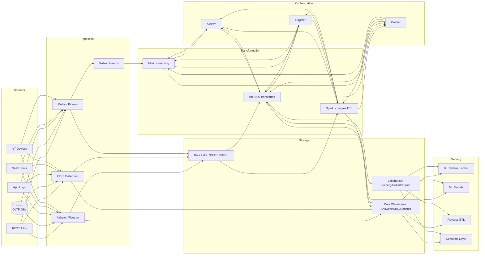
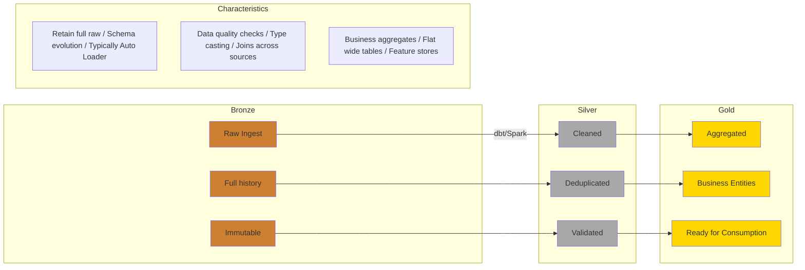
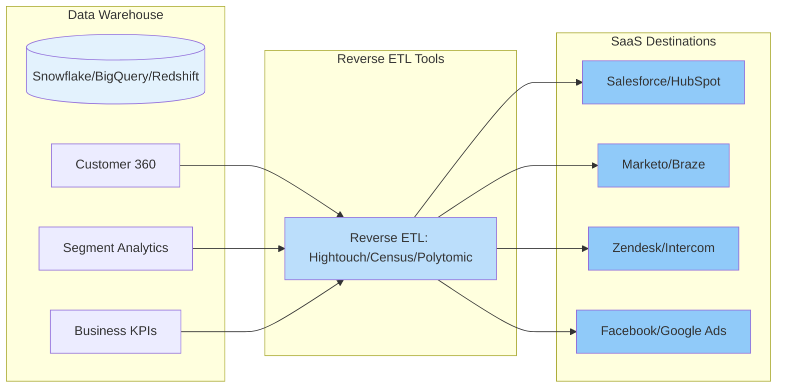
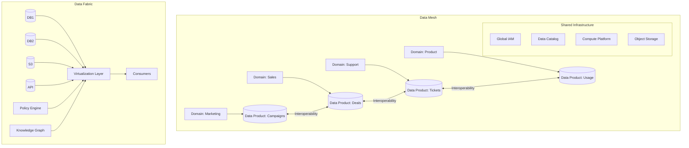
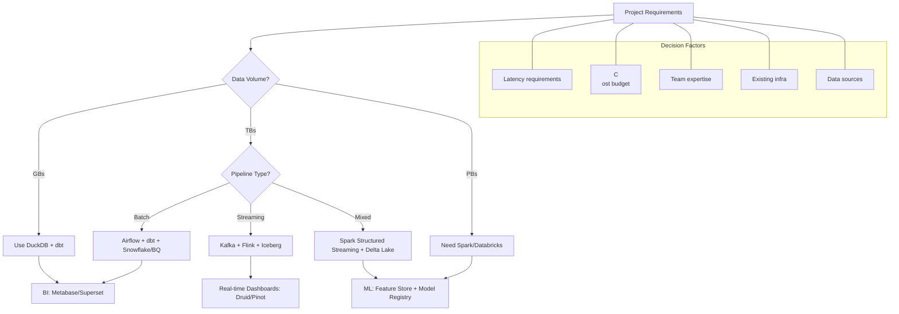

**Links**: [[ETL and Data Pipeline Patterns]] | [[Data Warehouse Modeling]] | [[Apache Spark]] | [[Apache Airflow]] | [[Stream Processing]] | [[Delta Lake and Apache Iceberg]]


# Data Engineering

Data engineering builds infrastructure and pipelines to collect, store, process, and serve data for analytics and machine learning.

## ETL vs ELT

| Aspect | ETL | ELT |
|--------|-----|-----|
| Order | Extract → Transform → Load | Extract → Load → Transform |
| Compute | Transformation happens in staging | Transformation happens in warehouse |
| Best for | Complex transformations, legacy systems | Cloud warehouses (BigQuery, Snowflake, Redshift) |
| Storage | Staging area needed | Raw data lands directly in warehouse |

## Data Pipeline Stages

```
Sources → Ingestion → Storage → Transformation → Serving
  ↓           ↓          ↓           ↓              ↓
Apps,     Kafka,     Data Lake,  dbt, Spark,    BI tools,
DBs,      Kinesis,   Warehouse,  Airflow        ML models,
APIs      Airbyte    Iceberg                     reverse ETL
```

## Data Modeling

| Schema | Description | Best For |
|--------|-------------|----------|
| Star Schema | Fact table + dimension tables | BI and reporting |
| Snowflake Schema | Normalized dimensions | Complex relationships |
| Data Vault | Hubs, links, satellites | Auditable, scalable DW |
| One Big Table | Denormalized flat table | ML feature stores |

## Modern Data Stack

| Layer | Tools |
|-------|-------|
| Ingestion | Airbyte, Fivetran, Debezium (CDC) |
| Storage | S3, GCS, ADLS (data lake) |
| Compute | Spark, Trino, DuckDB |
| Transformation | dbt, Spark SQL, Flink |
| Orchestration | Airflow, Dagster, Prefect |
| Serving | Snowflake, BigQuery, Redshift, ClickHouse |
| BI | Tableau, Metabase, Looker |

## Data Warehousing Facts vs Dimensions

```
Fact Table                          Dimension Tables
┌──────────────────┐               ┌─────────────┐
│ sale_id (PK)     │──────→        │ product_id   │
│ product_id (FK)  │               │ product_name │
│ customer_id (FK) │──────→        │ category     │
│ date_id (FK)     │               └─────────────┘
│ amount           │               ┌─────────────┐
│ quantity         │               │ customer_id  │
└──────────────────┘               │ name         │
                                   │ region       │
                                   └─────────────┘
```

## CDC (Change Data Capture)

Captures database changes in real time:

| Method | How | Latency |
|--------|-----|---------|
| Log-based | Read DB transaction log | Real-time |
| Trigger-based | DB triggers write changes | Low |
| Timestamp-based | Query rows with updated_at | Batch |

## dbt (Data Build Tool)

SQL-first transformation tool:

```sql
-- models/orders_summary.sql
SELECT
    customer_id,
    COUNT(*) as order_count,
    SUM(amount) as total_spent
FROM {{ ref('stg_orders') }}
GROUP BY customer_id
```

## Modern Data Pipeline Architecture



## Data Lake vs Warehouse vs Lakehouse

| Capability | Data Lake | Data Warehouse | Lakehouse |
|-----------|-----------|----------------|-----------|
| Data format | Raw (any format) | Structured, SQL | Open formats (Parquet, Iceberg) |
| Schema | Schema-on-read | Schema-on-write | Schema-on-write + evolution |
| Storage cost | Low ($/TB ~$23 S3) | Higher ($/TB ~$300 BQ) | Low (S3 + metadata) |
| Performance | Moderate | High (indexing, caching) | High (optimized readers) |
| ACID transactions | Limited | Full | Full (via Iceberg/Delta) |
| ML support | Native (Python/Spark) | Limited | Native |
| BI support | Limited | Excellent | Good |
| Governance | Hard (no catalog needed) | Built-in | Emerging (Unity, Polaris) |
| Use case | Data science, ML | BI, dashboards, reports | Converged workloads |

## Medallion Architecture



### Bronze Layer
- Raw data as-is from source systems (full snapshot or CDC)
- Append-only, immutable by default
- Preserves schema evolution from source
- Typically uses Auto Loader (Databricks) or COPY INTO (Snowflake)

### Silver Layer
- Data deduplication, type casting, standardization
- Data quality checks (not null, referential integrity, domain constraints)
- Joins across multiple bronze tables
- Usually overwrite (merge) — cleanest version of data

### Gold Layer
- Business-level aggregates, KPIs, metrics
- Star schema / dimensional model ready for BI
- Feature engineering for ML
- Typically materialized views or incremental models

## dbt — Deep Dive

### Project Structure

```
my_dbt_project/
├── models/
│   ├── staging/
│   │   ├── stg_orders.sql
│   │   ├── stg_customers.sql
│   │   └── stg_payments.sql
│   ├── marts/
│   │   ├── core/
│   │   │   ├── dim_customers.sql
│   │   │   └── fct_orders.sql
│   │   └── finance/
│   │       └── revenue_kpis.sql
│   └── sources.yml
├── tests/
│   ├── unique_customer_id.sql
│   └── not_null_order_amount.sql
├── macros/
│   ├── grant_permissions.sql
│   └── pivot_columns.sql
├── analyses/
├── seeds/
├── snapshots/
│   └── scd_customers.sql
├── docs/
│   └── overview.md
├── dbt_project.yml
└── profiles.yml
```

### Sources

```yaml
# models/sources.yml
version: 2

sources:
  - name: raw_sales
    database: analytics_db
    schema: raw
    tables:
      - name: orders
        description: "Raw order data from source system"
        loaded_at_field: _loaded_at
        freshness:
          warn_after: {count: 6, period: hour}
          error_after: {count: 24, period: hour}
        columns:
          - name: order_id
            description: "Primary key"
            tests:
              - unique
              - not_null
          - name: customer_id
            tests:
              - relationships:
                  to: source('raw_sales', 'customers')
                  field: customer_id

      - name: customers
        loaded_at_field: _loaded_at
        freshness:
          warn_after: {count: 12, period: hour}
          error_after: {count: 48, period: hour}
```

### Models — Staging

```sql
-- models/staging/stg_orders.sql
WITH source AS (
    SELECT * FROM {{ source('raw_sales', 'orders') }}
),

cleaned AS (
    SELECT
        order_id,
        customer_id,
        CAST(order_date AS DATE) AS order_date,
        CASE
            WHEN status IS NULL THEN 'unknown'
            ELSE LOWER(TRIM(status))
        END AS order_status,
        COALESCE(amount, 0) AS amount,
        _loaded_at
    FROM source
    WHERE order_id IS NOT NULL
)

SELECT * FROM cleaned
```

### Models — Marts (Fact & Dimension)

```sql
-- models/marts/core/dim_customers.sql
WITH customers AS (
    SELECT * FROM {{ ref('stg_customers') }}
),

orders AS (
    SELECT * FROM {{ ref('stg_orders') }}
),

customer_aggregates AS (
    SELECT
        customer_id,
        COUNT(DISTINCT order_id) AS total_orders,
        SUM(amount) AS lifetime_value,
        MIN(order_date) AS first_order_date,
        MAX(order_date) AS last_order_date,
        DATEDIFF('day', MAX(order_date), CURRENT_DATE) AS days_since_last_order
    FROM orders
    GROUP BY 1
)

SELECT
    c.customer_id,
    c.full_name,
    c.email,
    c.region,
    c.acquisition_channel,
    ca.total_orders,
    ca.lifetime_value,
    ca.first_order_date,
    ca.last_order_date,
    ca.days_since_last_order,
    CASE
        WHEN ca.total_orders >= 10 AND ca.lifetime_value > 1000 THEN 'VIP'
        WHEN ca.total_orders >= 5 THEN 'Regular'
        WHEN ca.total_orders >= 1 THEN 'Occasional'
        ELSE 'Never Ordered'
    END AS customer_tier
FROM customers c
LEFT JOIN customer_aggregates ca ON c.customer_id = ca.customer_id
```

### Tests

```sql
-- tests/assert_total_orders_positive.sql
-- Generic test example
SELECT customer_id, total_orders
FROM {{ ref('dim_customers') }}
WHERE total_orders < 0

-- models/marts/core/fct_orders.yml
version: 2

models:
  - name: fct_orders
    columns:
      - name: order_id
        tests:
          - unique
          - not_null
      - name: customer_id
        tests:
          - not_null
          - relationships:
              to: ref('dim_customers')
              field: customer_id
      - name: amount
        tests:
          - not_null
      - name: order_date
        tests:
          - not_null
      - name: order_status
        tests:
          - accepted_values:
              values: ['completed', 'cancelled', 'refunded', 'pending']

    tests:
      - dbt_utils.expression_is_true:
          expression: "amount >= 0"
      - dbt_utils.recency:
          datepart: day
          field: order_date
          interval: 7
```

### Macros

```sql
-- macros/generate_schema_name.sql
-- Custom schema naming

    
        {{ target.schema }}
    
        {{ custom_schema_name }}_{{ target.name }}
    


-- macros/pivot_columns.sql

    
        SUM(CASE WHEN {{ column }} = '{{ value }}' THEN amount ELSE 0 END) AS {{ prefix }}{{ value | lower }}
        ,
    
    FROM {{ source_table }}


-- Usage:
-- SELECT customer_id, {{ pivot_columns(ref('fct_orders'), 'category', ['Electronics', 'Clothing', 'Food'], 'cat_') }}
-- GROUP BY customer_id
```

### Snapshots (SCD Type 2)

```sql
-- snapshots/scd_customers.sql


{{
    config(
        target_database='analytics',
        target_schema='snapshots',
        strategy='timestamp',
        unique_key='customer_id',
        updated_at='updated_at',
        invalidate_hard_deletes=True,
    )
}}

SELECT * FROM {{ source('raw_sales', 'customers') }}


```

### Exposures

```yaml
# models/exposures.yml
version: 2

exposures:
  - name: revenue_dashboard
    label: Revenue Dashboard
    type: dashboard
    url: https://looker.company.com/dashboards/42
    owner:
      name: Finance Team
      email: finance@company.com
    depends_on:
      - ref('fct_orders')
      - ref('dim_customers')
      - source('raw_sales', 'orders')

  - name: customer_ml_model
    label: Customer Churn Prediction
    type: ml
    url: https://mlflow.company.com/models/churn
    owner:
      name: ML Team
      email: ml@company.com
    depends_on:
      - ref('dim_customers')
      - ref('fct_orders')
      - ref('stg_customer_interactions')
```

## Orchestration

### Airflow DAG Examples

```python
# dags/sales_pipeline.py
from airflow import DAG
from airflow.operators.python import PythonOperator
from airflow.operators.bash import BashOperator
from airflow.providers.dbt.cloud.operators.dbt import DbtCloudRunJobOperator
from datetime import datetime, timedelta

default_args = {
    'owner': 'data_engineering',
    'depends_on_past': False,
    'email_on_failure': True,
    'email_on_retry': False,
    'retries': 2,
    'retry_delay': timedelta(minutes=5),
    'execution_timeout': timedelta(hours=2),
}

with DAG(
    dag_id='sales_analytics_pipeline',
    default_args=default_args,
    description='Daily sales data pipeline',
    schedule_interval='0 6 * * *',  # Daily at 6 AM
    start_date=datetime(2024, 1, 1),
    catchup=False,
    tags=['sales', 'production'],
    params={
        'environment': 'production',
        'full_refresh': False,
    },
) as dag:

    # Task 1: Extract from source
    extract_orders = BashOperator(
        task_id='extract_orders',
        bash_command='python /scripts/extract_orders.py --date {{ ds }}',
        pool='extraction_pool',
    )

    # Task 2: Validate extracted data
    validate_data = PythonOperator(
        task_id='validate_data',
        python_callable=lambda: print("Validation passed"),
        trigger_rule='all_success',
    )

    # Task 3: Run dbt transforms
    run_dbt = DbtCloudRunJobOperator(
        task_id='run_dbt_models',
        dbt_cloud_conn_id='dbt_cloud',
        job_id=12345,
        trigger_rule='all_success',
        wait_for_completion=True,
        check_interval=30,
        timeout=3600,
    )

    # Task 4: Data quality checks
    quality_checks = BashOperator(
        task_id='run_quality_checks',
        bash_command='dbt test --select tag:production',
    )

    # Task 5: Load to serving layer
    load_to_reporting = BashOperator(
        task_id='load_reporting',
        bash_command='python /scripts/refresh_materialized_views.py',
    )

    # Task 6: Notify on success/failure
    notify = BashOperator(
        task_id='notify_slack',
        bash_command='python /scripts/slack_notify.py --dag sales_analytics_pipeline --status success',
    )

    # Dependencies
    extract_orders >> validate_data >> run_dbt >> quality_checks >> load_to_reporting >> notify
```

### Dagster vs Prefect vs Airflow

| Feature | Airflow | Dagster | Prefect |
|---------|---------|---------|---------|
| Paradigm | DAG as code | Software-defined assets | Flow/Deployment |
| Asset lineage | Implicit (XComs) | First-class (asset graph) | Manual tracking |
| Data quality | Custom operators | Asset checks (built-in) | Custom checks |
| Local dev | Hard (need Astronomer) | Great (dagster dev) | Great (prefect server) |
| Scheduling | cron expressions | Sensors + schedules | Schedules + events |
| Backfilling | Complex (catchup) | Simple (partitioned assets) | Simple (flow runs) |
| CI/CD integration | Manual | Built-in (CodeLocation) | Manual |
| UI | Mature | Excellent (Dagit) | Clean (Prefect UI) |
| Scaling | Celery/K8s Executor | Built-in K8s | Server-based (Prefect Cloud) |
| Python-native | Partially (DAG objects) | Fully (decorators) | Fully (decorators) |
| Testing | Hard | Great (asset materialization) | Good |
| Learning curve | Steep | Moderate | Low |
| Best for | Large enterprise (legacy) | Data platform teams | Startups, teams migrating |

## Data Quality

```yaml
# dbt quality expectations
expectations:
  - table: dim_customers
    constraints:
      - unique: customer_id
      - not_null: [customer_id, email, region]
      - pattern:
          column: email
          regex: ^[A-Za-z0-9._%+-]+@[A-Za-z0-9.-]+\.[A-Z|a-z]{2,}$

  - table: fct_orders
    constraints:
      - unique: order_id
      - not_null: [order_id, customer_id, amount]
      - range:
          column: amount
          min: 0
          max: 100000
      - foreign_key:
          column: customer_id
          ref: dim_customers
          ref_field: customer_id

    freshness:
      - table: stg_orders
        timestamp_column: _loaded_at
        max_age: 6h
      - table: fct_orders
        timestamp_column: order_date
        max_age: 24h

# Great Expectations example
# from great_expectations.dataset import PandasDataset
# import great_expectations as ge
#
# df_ge = ge.dataset.PandasDataset(df)
# df_ge.expect_column_values_to_not_be_null('customer_id')
# df_ge.expect_column_values_to_be_between('amount', 0, 100000)
# df_ge.expect_table_row_count_to_be_between(min_value=100, max_value=1000000)
# results = df_ge.validate()
```

## Data Cataloging

### Tools Comparison

| Tool | Open Source | Search | Lineage | Governance | Key Features |
|------|-------------|--------|---------|------------|--------------|
| **DataHub** | Yes (Apache 2.0) | Elasticsearch | Column-level | Fine-grained | Real-time metadata, GraphQL API |
| **Amundsen** | Yes (Apache 2.0) | Elasticsearch | Table-level | Basic | Good search, badges, owner |
| **Atlan** | Proprietary | AI-powered | Column-level | RBAC/ABAC | Collaboration, playbooks |
| **Apache Atlas** | Yes (Apache 2.0) | Solr | Column-level | Full RBAC | Deep Hadoop integration |
| **Marquez** | Yes (Apache 2.0) | Basic | Column-level | Basic | Focus on lineage |
| **Alation** | Proprietary | AI-powered | Column-level | Full | Data culture, stewardship |

### DataHub Ingestion

```yaml
# datahub_recipe.yml
source:
  type: dbt
  config:
    manifest_path: ./target/manifest.json
    catalog_path: ./target/catalog.json
    sources_path: ./target/sources.json
    target_platform: snowflake
    enable_meta_mapping: false
    write_semantics: PATCH

source:
  type: snowflake
  config:
    username: $SNOWFLAKE_USER
    password: $SNOWFLAKE_PASSWORD
    account_id: my_account
    warehouse: COMPUTE_WH
    database: ANALYTICS
    schema_filter:
      includes:
        - "PUBLIC"
        - "DWH_*"
    profiling:
      enabled: true
      profile_table_level_only: true

sink:
  type: datahub-rest
  config:
    server: http://localhost:8080
```

## Reverse ETL



Common reverse ETL use cases:
| Use Case | Source (Warehouse) | Destination |
|----------|-------------------|-------------|
| Customer scoring | Customer 360 table | Salesforce lead score field |
| Product recommendations | Purchase history | Braze event triggers |
| Ad audiences | Segment membership | Facebook Custom Audiences |
| Support enrichment | Order history | Zendesk ticket sidebar |
| Sales alerts | Real-time KPI changes | Slack/Teams notifications |

## Data Mesh vs Data Fabric

| Aspect | Data Mesh | Data Fabric |
|--------|-----------|-------------|
| Philosophy | Organizational (socio-technical) | Technical (architecture) |
| Ownership | Domain teams own their data | Centralized IT governance |
| Architecture | Decentralized domains with shared infra | Virtualized, connected layer |
| Governance | Federated computational governance | Centralized policy management |
| Data topology | Domains connected via interoperability | Graph-based virtual data layer |
| Key principle | "You built it, you run it" (for data) | "Connect anywhere, govern centrally" |
| Technology | Domain-oriented data products, Kafka | Data virtualization, graph catalogs |
| Best for | Large organizations with distinct domains | Hybrid multi-cloud environments |
| Complexity | Organizational complexity | Technical complexity |
| Example | Netflix, Zalando | IBM, TIBCO solutions |



## Real-Time Streaming

### Kafka Streams Example

```java
// Kafka Streams — stateful streaming
StreamsBuilder builder = new StreamsBuilder();

KStream<String, Order> orders = builder.stream(
    "orders",
    Consumed.with(Serdes.String(), orderSerde)
);

// Enrich orders with customer info
KTable<String, Customer> customers = builder.table(
    "customers",
    Consumed.with(Serdes.String(), customerSerde)
);

KStream<String, EnrichedOrder> enriched = orders.join(
    customers,
    (order, customer) -> new EnrichedOrder(order, customer),
    Joined.with(Serdes.String(), orderSerde, customerSerde)
);

// Aggregate by region
KGroupedStream<String, EnrichedOrder> byRegion = enriched
    .groupBy((key, order) -> order.getRegion());

KTable<Windowed<String>, Long> regionCounts = byRegion
    .windowedBy(TimeWindows.ofSizeWithNoGrace(Duration.ofMinutes(5)))
    .count();

regionCounts.toStream().to("region-stats", Produced.with(
    WindowedSerdes.timeWindowedSerdeFrom(String.class, 5 * 60 * 1000),
    Serdes.Long()
));
```

### Flink vs Spark Streaming

| Aspect | Apache Flink | Spark Streaming |
|--------|-------------|-----------------|
| Processing model | True streaming (event-by-event) | Micro-batch (DStream/Structured) |
| Latency | Sub-second | Seconds (batch interval) |
| Event time | Native (watermarks) | Supported (Structured Streaming) |
| State management | Built-in (RocksDB, FsState) | Checkpointing |
| Exactly-once | Yes (pipeline-wide) | Yes (with sink support) |
| SQL support | Flink SQL (evolving) | Spark SQL (mature) |
| Windowing | Flexible (event/processing time) | Supported (event/processing) |
| CEP (Complex Event Proc) | Native (Flink CEP) | External (via libraries) |
| Backpressure | Automatic (credit-based) | Adaptive (Dynamic Allocation) |
| Batch/streaming unification | Single runtime | Separate APIs (mostly unified) |
| Community | Growing rapidly | Very large |
| Best for | Low-latency, complex event processing | High-throughput, integrated batch+stream |

```python
# PySpark Structured Streaming
from pyspark.sql import SparkSession
from pyspark.sql.functions import window, col

spark = SparkSession.builder \
    .appName("StreamingAnalytics") \
    .config("spark.sql.streaming.checkpointLocation", "/checkpoints") \
    .getOrCreate()

# Read stream
orders = spark \
    .readStream \
    .format("kafka") \
    .option("kafka.bootstrap.servers", "localhost:9092") \
    .option("subscribe", "orders") \
    .option("startingOffsets", "latest") \
    .load() \
    .selectExpr("CAST(value AS STRING) as json") \
    .select(from_json(col("json"), order_schema).alias("data")) \
    .select("data.*")

# Aggregate with window
stats = orders \
    .withWatermark("event_time", "10 minutes") \
    .groupBy(
        col("region"),
        window(col("event_time"), "5 minutes", "1 minute")
    ) \
    .agg(
        sum("amount").alias("revenue"),
        count("*").alias("order_count"),
        avg("amount").alias("avg_order_value")
    )

# Write to sink
query = stats \
    .writeStream \
    .format("console") \
    .outputMode("append") \
    .trigger(processingTime="10 seconds") \
    .option("truncate", False) \
    .start()

query.awaitTermination()
```

## Schema Evolution

### Avro Schema Evolution

```avro
// Schema V1 (original)
{
  "type": "record",
  "name": "Order",
  "namespace": "com.company",
  "fields": [
    {"name": "order_id", "type": "string"},
    {"name": "customer_id", "type": "string"},
    {"name": "amount", "type": "double"},
    {"name": "order_date", "type": "string"}
  ]
}

// Schema V2 (evolved) — backward compatible
{
  "type": "record",
  "name": "Order",
  "namespace": "com.company",
  "fields": [
    {"name": "order_id", "type": "string"},
    {"name": "customer_id", "type": "string"},
    {"name": "amount", "type": "double"},
    {"name": "order_date", "type": "string"},
    {"name": "currency", "type": "string", "default": "USD"},  // Added with default
    {"name": "discount", "type": ["null", "double"], "default": null}  // Optional
  ]
}
```

### Protocol Buffers

```protobuf
syntax = "proto3";

message Order {
  string order_id = 1;
  string customer_id = 2;
  double amount = 3;
  string order_date = 4;
  
  // New fields (backward compatible — can't remove/rename old fields)
  string currency = 5;       // Added — new field number
  optional double discount = 6;  // Optional field
  Status status = 7;         // Enum
  
  enum Status {
    STATUS_UNSPECIFIED = 0;
    PENDING = 1;
    COMPLETED = 2;
    CANCELLED = 3;
  }
  
  repeated LineItem items = 8;  // Repeated field
}

message LineItem {
  string product_id = 1;
  int32 quantity = 2;
  double price = 3;
}
```

### Iceberg Table Evolution

```sql
-- Apache Iceberg — schema evolution (add/drop/rename/update columns)

-- Create Iceberg table
CREATE TABLE catalog.sales.orders (
    order_id BIGINT,
    customer_id STRING,
    amount DECIMAL(10,2),
    order_date DATE
) USING iceberg
PARTITIONED BY (days(order_date));

-- Add column
ALTER TABLE catalog.sales.orders
ADD COLUMN currency STRING AFTER amount;

-- Add nested column
ALTER TABLE catalog.sales.orders
ADD COLUMN shipping.address STRUCT<street: STRING, city: STRING, zip: STRING>;

-- Rename column
ALTER TABLE catalog.sales.orders
RENAME COLUMN customer_id TO buyer_id;

-- Update column type (widening — string to decimal, etc.)
ALTER TABLE catalog.sales.orders
ALTER COLUMN amount TYPE DECIMAL(12,2);

-- Drop column
ALTER TABLE catalog.sales.orders
DROP COLUMN temporary_flag;

-- Partition evolution
ALTER TABLE catalog.sales.orders
ADD PARTITION FIELD months(order_date);

-- Time travel queries
SELECT * FROM catalog.sales.orders FOR SYSTEM_VERSION AS OF 123456789;
SELECT * FROM catalog.sales.orders FOR TIMESTAMP AS OF '2024-06-01 00:00:00';
```

### Schema Evolution Compatibility Rules

| Change | Avro (Backward) | Avro (Forward) | Protobuf | Iceberg |
|--------|-----------------|----------------|----------|---------|
| Add field with default | ✓ | ✓ | ✓ | ✓ |
| Add field without default | ✗ | ✓ (old fails) | ✓ (always optional) | ✓ |
| Remove field | ✓ (if default present) | ✗ | ✗ (use deprecated) | ✓ |
| Rename field | ✗ (new name, new field) | ✗ | ✗ | ✓ |
| Change type (widening) | ✓ (int→long, float→double) | ✓ | ✓ | ✓ |
| Change type (narrowing) | ✗ | ✗ | ✗ | ✗ |
| Reorder fields | ✓ | ✓ | ✓ (by tag number) | ✓ |

## Cost Optimization in Modern Data Stacks

### Snowflake

| Strategy | Savings | Implementation |
|----------|---------|----------------|
| Auto-suspend | 30-60% | Set warehouse auto-suspend to 1-5 min |
| Multi-cluster auto-scales | 20-40% | Set max clusters = 2-3, not default 10 |
| Materialized queries | 20-50% | Cache expensive aggregations |
| Clustering keys | 10-30% | Cluster on frequently filtered columns |
| Search optimization | 10-50% | For point-lookup queries |
| Data compression | 15-30% | Use appropriate data types |
| Resource monitors | Prevents overrun | Set monthly credit caps with alerts |

```sql
-- Snowflake cost queries
-- Warehouse credit usage
SELECT
    warehouse_name,
    SUM(credits_used) AS total_credits,
    SUM(credits_used_compute) AS compute_credits,
    SUM(credits_used_cloud_services) AS cloud_credits
FROM snowflake.account_usage.warehouse_metering_history
WHERE start_time >= DATEADD('month', -1, CURRENT_DATE)
GROUP BY 1
ORDER BY 2 DESC;

-- Query cost by ID
SELECT
    query_id,
    query_text,
    warehouse_size,
    credits_used_cloud_services,
    execution_time / 1000 AS execution_seconds,
    partitions_scanned,
    partitions_total
FROM snowflake.account_usage.query_history
WHERE start_time >= DATEADD('day', -7, CURRENT_DATE)
    AND credits_used_cloud_services > 0
ORDER BY credits_used_cloud_services DESC;
```

### General Cost Strategies

| Area | Strategy | Impact |
|------|----------|--------|
| Storage | Compress data (Parquet/Zstd) | 50-75% reduction |
| Storage | Tiered storage (S3 Standard → Glacier) | 60-80% reduction |
| Compute | Right-size clusters (not over-provisioned) | 30-50% reduction |
| Compute | Spot/preemptible instances | 60-90% reduction |
| Compute | Use serverless (Snowflake/BQ auto-scaling) | Pay per query |
| Compute | Schedule non-critical jobs during off-peak | Better burst capacity |
| Data | Delete staging/temp tables regularly | Reduces scan bytes |
| Data | Partition pruning (partition elimination) | 50-90% scan reduction |
| Data | Incremental processing (not full refresh) | 70-95% reduction |
| Pipeline | Consolidate small files | Faster reads, less overhead |
| Pipeline | Cache intermediate results | Avoid recomputation |

### Data Engineering Technology Stack Decision Flow



## Quick Reference: Data Engineering Tools

| Category | Tool | Use Case | Pros | Cons |
|----------|------|----------|------|------|
| Ingestion | Airbyte | SaaS → warehouse | 300+ connectors, open source | Python-heavy custom connectors |
| Ingestion | Fivetran | Managed ingestion | Zero maintenance, reliable | Expensive at scale |
| Ingestion | Debezium | CDC from DBs | Kafka-native, reliable | Complex setup |
| Streaming | Kafka | Event backbone | Battle-tested, huge ecosystem | Operational complexity |
| Streaming | Flink | Real-time processing | True streaming, event-time | Learning curve |
| Compute | Spark | Large-scale ETL | Mature, batch+streaming | Memory-heavy |
| Compute | DuckDB | Analytical queries | Embeddable, fast, free | Single-node |
| Transform | dbt | SQL transformations | Version control, testing | SQL only |
| Orchestration | Airflow | Complex DAGs | Extensible, huge community | Ops-heavy, DAG as code |
| Orchestration | Dagster | Data platform | Asset-centric, testing | Smaller community |
| Orchestration | Prefect | Python-first flows | Great DX, auto-retry | Cloud for best features |
| Storage | Iceberg | Lakehouse format | ACID, time travel, schema evolution | Performance tuning needed |
| Storage | Delta Lake | Lakehouse format | Databricks integration, fast | Tied to Spark ecosystem |
| Storage | Snowflake | Cloud warehouse | Zero management, separation of compute/storage | Cost at scale |
| Catalog | DataHub | Metadata search | Column-level lineage, GraphQL | Deployment complexity |
| Quality | Great Expectations | Data validation | Rich expectations | Can be slow on big data |
| Quality | dbt tests | Built-in quality | SQL-native, fast | Limited to dbt models |

**Links**: [[Stream Processing]] | [[SQL vs NoSQL Databases]] | [[RAG Architecture]] | [[Time Series Databases]] | [[Cloud Computing]]
