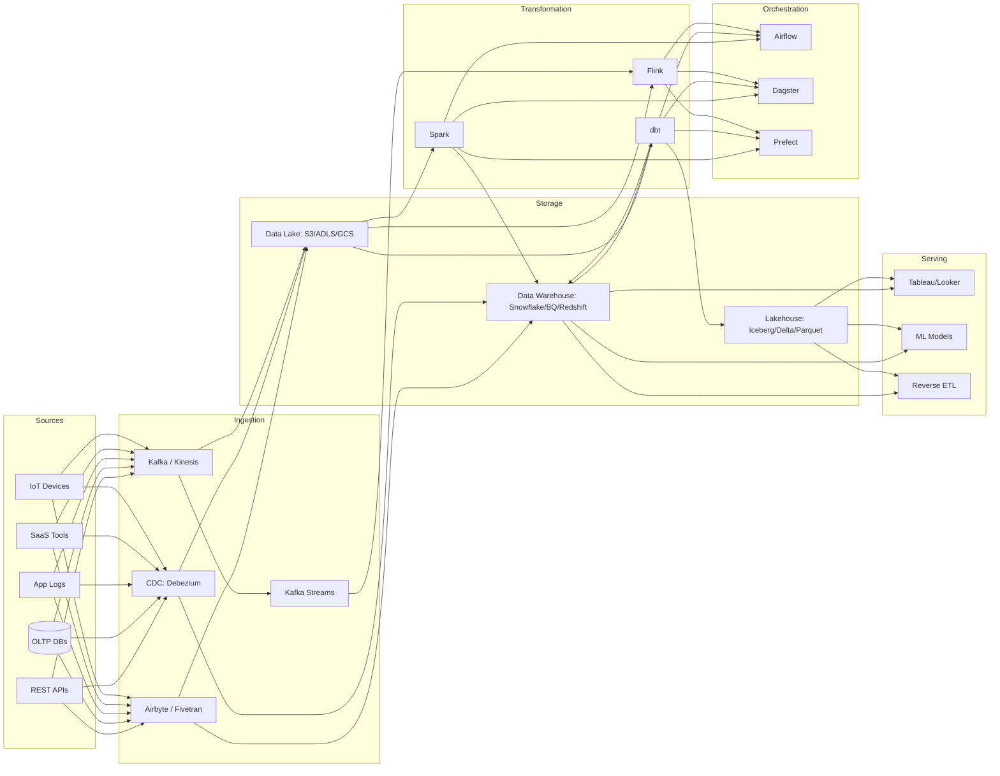
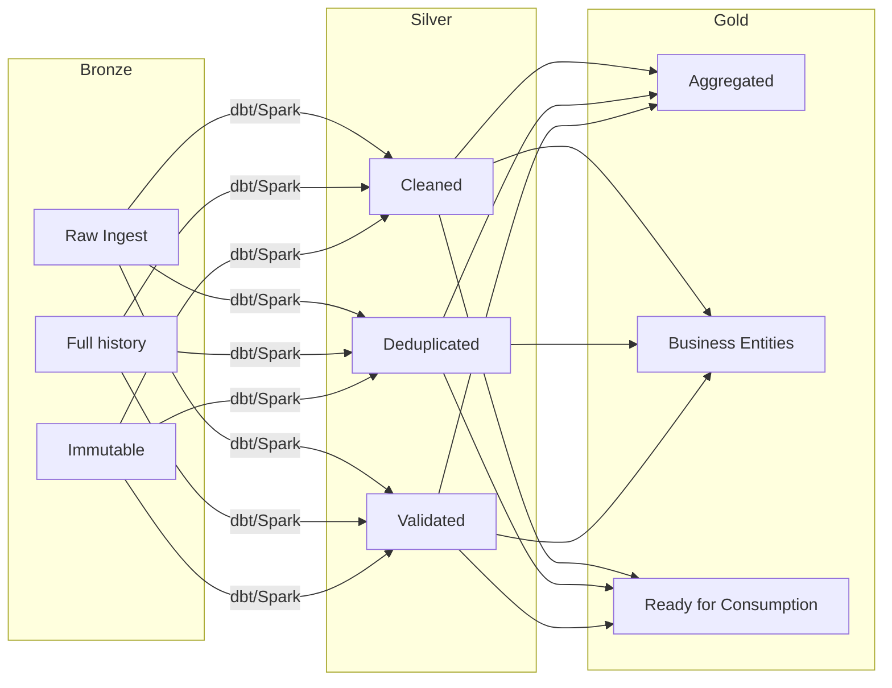

# 02 — Architecture & Medallion

## Modern Data Pipeline Architecture

## Data Lake vs Warehouse vs Lakehouse

| Capability | Data Lake | Data Warehouse | Lakehouse |
|-----------|-----------|----------------|-----------|
| Data format | Raw (any format) | Structured, SQL | Open formats (Parquet, Iceberg) |
| Schema | Schema-on-read | Schema-on-write | Schema-on-write + evolution |
| Storage cost | Low (~$23/TB S3) | Higher (~$300/TB BQ) | Low (S3 + metadata) |
| ACID | Limited | Full | Full (Iceberg/Delta) |
| ML support | Native | Limited | Native |
| BI support | Limited | Excellent | Good |

## Medallion Architecture

| Layer | Characteristics |
|-------|----------------|
| **Bronze** | Raw data as-is, append-only, immutable, preserves schema evolution |
| **Silver** | Deduplicated, type-cast, standardized, quality checks applied |
| **Gold** | Business aggregates, star schema, feature engineering, BI-ready |

**Links**: [[System-Design/Databases/Data Engineering/01 Fundamentals]] | [[System-Design/Databases/Data Engineering/03 dbt]] | [[System-Design/Databases/Data Engineering/06 Reverse ETL & Data Mesh]]
**See also**: [[Delta Lake and Apache Iceberg]], [[Data Warehouse Modeling]]
