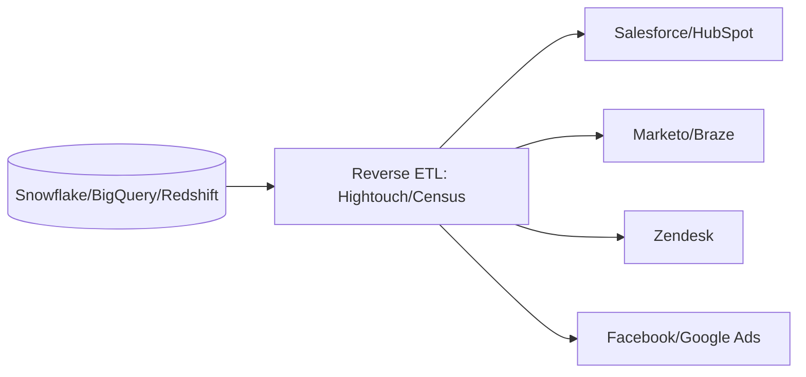
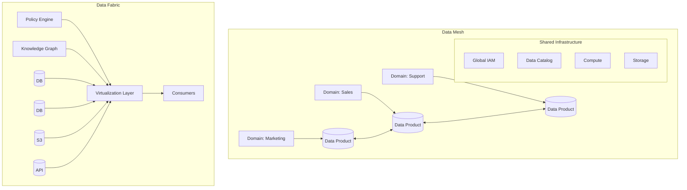

# 06 — Reverse ETL & Data Mesh

## Reverse ETL

| Use Case | Source | Destination |
|----------|--------|-------------|
| Customer scoring | Customer 360 table | Salesforce lead score |
| Product recommendations | Purchase history | Braze event triggers |
| Ad audiences | Segment membership | Facebook Custom Audiences |
| Support enrichment | Order history | Zendesk ticket sidebar |
| Sales alerts | KPI changes | Slack notifications |

## Data Mesh vs Data Fabric

| Aspect | Data Mesh | Data Fabric |
|--------|-----------|-------------|
| Philosophy | Organizational (socio-technical) | Technical (architecture) |
| Ownership | Domain teams own their data | Centralized IT governance |
| Architecture | Decentralized domains + shared infra | Virtualized, connected layer |
| Governance | Federated computational governance | Centralized policy management |
| Key principle | "You built it, you run it" | "Connect anywhere, govern centrally" |
| Best for | Large orgs with distinct domains | Hybrid multi-cloud environments |

**Links**: [[System-Design/Databases/Data Engineering/02 Architecture & Medallion]] | [[System-Design/Databases/Data Engineering/05 Data Quality & Cataloging]] | [[System-Design/Databases/Data Engineering/09 Cost Optimization]]
**See also**: [[Data Warehouse Modeling]], [[Apache Kafka]]
