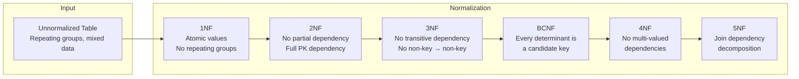
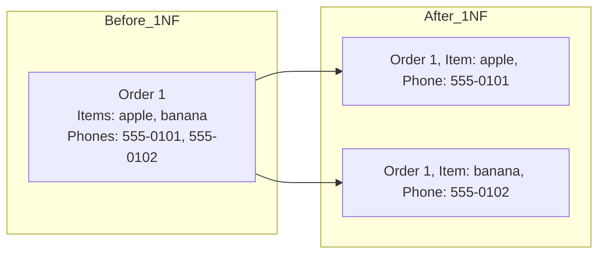
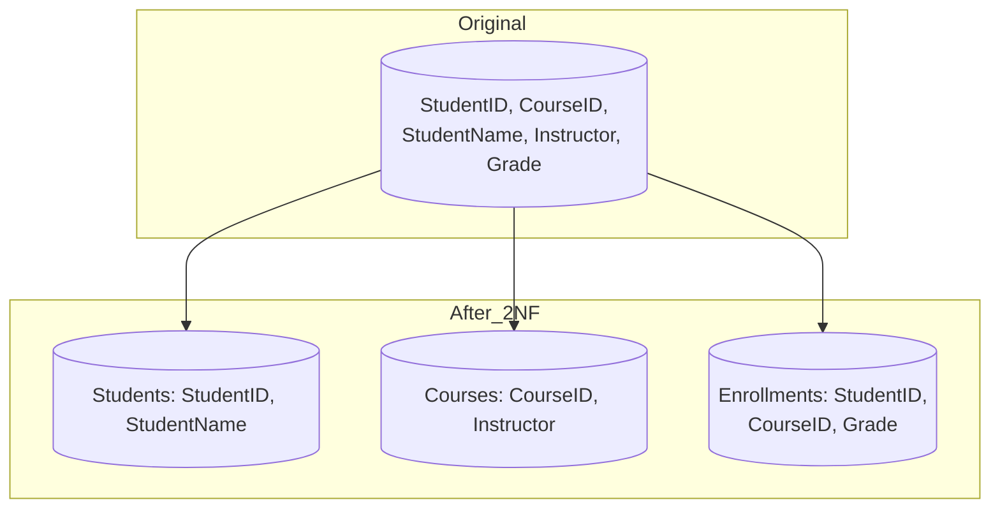
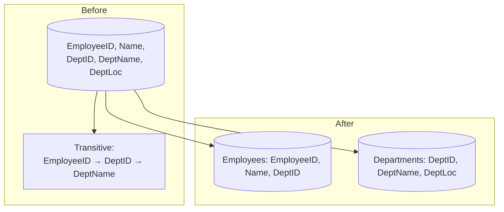
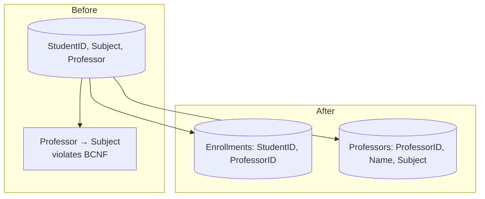
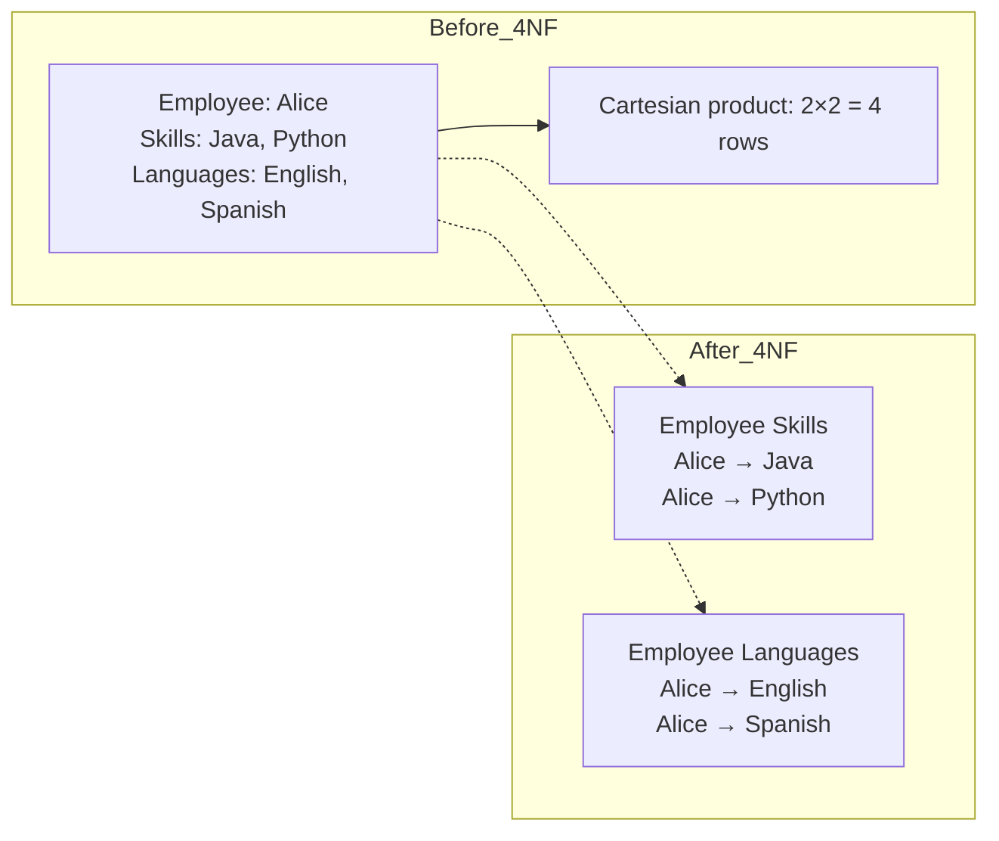
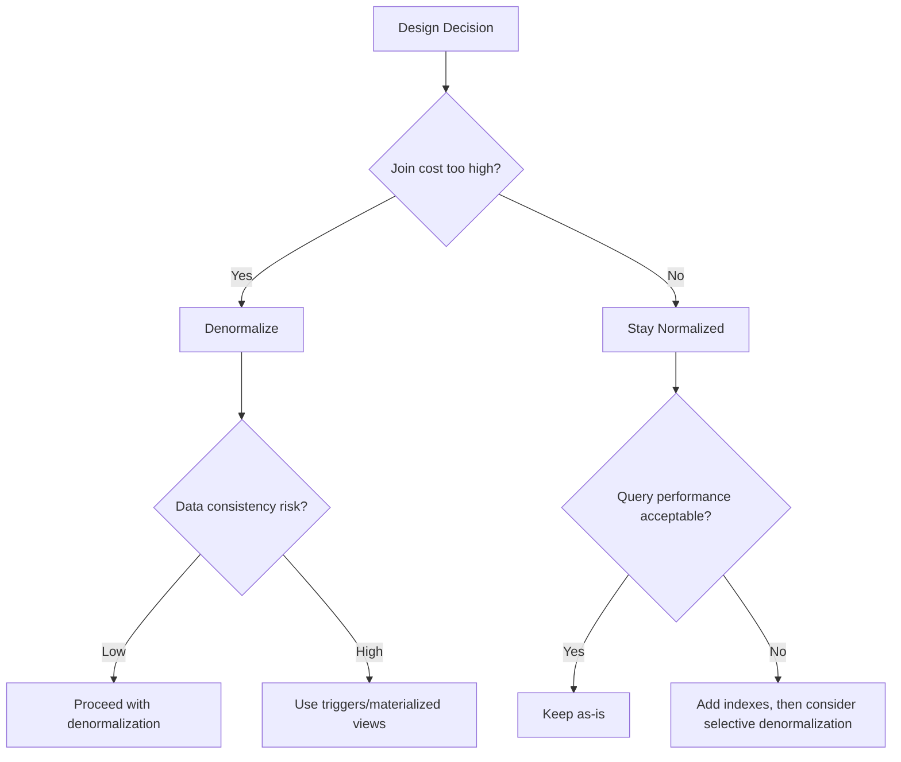

# Data Normalization Rules

Normalization organizes data to reduce redundancy and improve integrity. Each normal form addresses a specific type of anomaly.

## Normal Forms

### 1NF — Atomic Values
Each column contains indivisible values. No repeating groups or arrays.

### 2NF — Full Dependency
Must be in 1NF. Every non-key column depends on the **entire** primary key.

### 3NF — No Transitive Dependency
Must be in 2NF. No non-key column depends on another non-key column.

### BCNF — Stronger 3NF
Every determinant must be a candidate key.

### 4NF — No Multi-Valued Dependencies
No independent multi-valued facts about an entity in the same table.

## Practical Approach

1. Start at 3NF by default
2. Profile query performance
3. Denormalize specific hot paths where joins are too expensive
4. Use triggers or application logic to keep denormalized data consistent

> Normalize until it hurts, denormalize until it works.

## Normalization Process Overview



## 1NF — Atomicity and Repeating Groups

### Rule
Every column must contain a single, indivisible value. No arrays, sets, or nested tables within a column.

### Bad Example (Violates 1NF)

| OrderID | Customer | Items | PhoneNumbers |
|---------|----------|-------|--------------|
| 1 | Alice | apple, banana | 555-0101, 555-0102 |
| 2 | Bob | cherry | 555-0103 |
| 3 | Carol | apple, date | 555-0104, 555-0105, 555-0106 |

Problems:
- `Items` contains multiple values (comma-separated)
- `PhoneNumbers` contains multiple values
- Cannot index individual items
- Cannot JOIN on individual items
- Updating one item requires parsing the string

### Good Example (1NF)

| OrderID | Customer | Item | PhoneNumber |
|---------|----------|------|-------------|
| 1 | Alice | apple | 555-0101 |
| 1 | Alice | banana | 555-0102 |
| 2 | Bob | cherry | 555-0103 |
| 3 | Carol | apple | 555-0104 |
| 3 | Carol | date | 555-0105 |
| 3 | Carol | - | 555-0106 |



Even better: normalize into separate tables for `OrderItems` and `CustomerPhones`.

## 2NF — Eliminating Partial Dependency

### Rule
Must be in 1NF. Every non-key column must depend on the **entire** primary key (not just part of it).

### Problem: Composite Primary Key with Partial Dependency

Consider a table with composite PK (StudentID, CourseID):

| StudentID | CourseID | StudentName | Instructor | Grade |
|-----------|----------|-------------|------------|-------|
| 1 | CS101 | Alice | Dr. Smith | A |
| 1 | CS102 | Alice | Dr. Jones | B |
| 2 | CS101 | Bob | Dr. Smith | C |

- **StudentName** depends only on StudentID (partial dependency)
- **Instructor** depends only on CourseID (partial dependency)
- **Grade** depends on the full composite key (StudentID + CourseID)

### After 2NF Decomposition



### Students Table

| StudentID | StudentName |
|-----------|-------------|
| 1 | Alice |
| 2 | Bob |

### Courses Table

| CourseID | Instructor |
|----------|------------|
| CS101 | Dr. Smith |
| CS102 | Dr. Jones |

### Enrollments Table

| StudentID | CourseID | Grade |
|-----------|----------|-------|
| 1 | CS101 | A |
| 1 | CS102 | B |
| 2 | CS101 | C |

### Anomalies Fixed

| Anomaly | Before | After |
|---------|--------|-------|
| **Update** | Changing Dr. Smith's name updates N rows | Update once in Courses table |
| **Insert** | Can't add a course without a student | Insert directly into Courses |
| **Delete** | Deleting last enrollment deletes instructor | Instructor preserved in Courses |

## 3NF — Eliminating Transitive Dependency

### Rule
Must be in 2NF. No non-key column depends on another non-key column (transitive dependency).

### Problem: Transitive Dependency

| EmployeeID | EmployeeName | DepartmentID | DepartmentName | DepartmentLocation |
|------------|-------------|--------------|---------------|-------------------|
| 1 | Alice | D1 | Engineering | Building A |
| 2 | Bob | D1 | Engineering | Building A |
| 3 | Carol | D2 | Sales | Building B |

- `DepartmentName` depends on `DepartmentID` (which is non-key)
- `DepartmentLocation` depends on `DepartmentID` (which is non-key)
- This is a **transitive dependency**: EmployeeID → DepartmentID → DepartmentName

### After 3NF Decomposition



### Employees Table

| EmployeeID | EmployeeName | DepartmentID |
|------------|-------------|--------------|
| 1 | Alice | D1 |
| 2 | Bob | D1 |
| 3 | Carol | D2 |

### Departments Table

| DepartmentID | DepartmentName | DepartmentLocation |
|--------------|---------------|-------------------|
| D1 | Engineering | Building A |
| D2 | Sales | Building B |

### Anomalies Fixed

| Anomaly | Before | After |
|---------|--------|-------|
| **Update** | Renaming Engineering updates N rows | Update once in Departments |
| **Insert** | Can't add dept without employees | Insert directly into Departments |
| **Delete** | Removing last employee removes dept info | Department preserved independently |

## BCNF — Boyce-Codd Normal Form

### Rule
Every **determinant** (attribute that determines another) must be a **candidate key**.

### When 3NF Isn't Enough

| StudentID | Subject | Professor |
|-----------|---------|-----------|
| 1 | Math | Dr. Adams |
| 1 | Physics | Dr. Brown |
| 2 | Math | Dr. Adams |
| 2 | Chemistry | Dr. Clark |

Functional dependencies:
- StudentID + Subject → Professor (PK)
- Professor → Subject (each professor teaches exactly one subject)

**Problem**: Professor is a determinant that is NOT a candidate key. This violates BCNF.

### BCNF Decomposition



### Enrollments Table

| StudentID | ProfessorID |
|-----------|-------------|
| 1 | P1 |
| 1 | P2 |
| 2 | P1 |
| 2 | P3 |

### Professors Table

| ProfessorID | Name | Subject |
|------------|------|---------|
| P1 | Dr. Adams | Math |
| P2 | Dr. Brown | Physics |
| P3 | Dr. Clark | Chemistry |

## 4NF — Multi-Valued Dependencies

### Rule
No independent multi-valued facts about an entity in the same table.

### Problem

| Employee | Skill | Language |
|----------|-------|----------|
| Alice | Java | English |
| Alice | Python | English |
| Alice | Java | Spanish |
| Alice | Python | Spanish |

Every skill is paired with every language (Cartesian product). This is a **multi-valued dependency**: Employee →→ Skill and Employee →→ Language.



### After 4NF Decomposition

**Employee Skills**

| Employee | Skill |
|----------|-------|
| Alice | Java |
| Alice | Python |

**Employee Languages**

| Employee | Language |
|----------|----------|
| Alice | English |
| Alice | Spanish |

This eliminates the unnecessary row explosion.

## 5NF / 6NF Overview

### 5NF — Join Dependency

A table is in 5NF if every **join dependency** is implied by candidate keys. Essentially, the table cannot be decomposed further without losing information.

Example: `Agent(Company, Product, Agent)` where all three are needed (no pairwise decomposition).

### 6NF — Domain Key Normal Form

Eliminates all join dependencies by decomposing to individual attributes per table. Useful for:
- Temporal databases (tracking changes to specific columns)
- Column-oriented storage
- Rarely used in practice for OLTP

## Normalization vs Denormalization Tradeoffs

| Aspect | Normalized | Denormalized |
|--------|-----------|--------------|
| Storage | Minimal (no redundancy) | More (redundant data) |
| Write speed | Faster (one table) | Slower (multiple tables/triggers) |
| Read speed | Slower (JOINs required) | Faster (single table access) |
| Consistency | High (single source of truth) | Risk of drift (sync needed) |
| Query complexity | Complex JOINs | Simple single-table queries |
| Index efficiency | Targeted indexes | Wide indexes needed |
| Backup/restore | Granular | Coarse |
| Schema evolution | Easier (isolated changes) | Harder (wide tables) |

## Real-World Denormalization Patterns

### Star Schema (Data Warehousing)

```
Fact Table: Sales
+-------------+--------+------+-------+
| DateID (FK) | Store  | Product | Revenue |
+-------------+--------+---------+--------+
| 20240101    | S1     | P1      | 100    |
| 20240101    | S2     | P2      | 200    |
+-------------+--------+---------+--------+

Dimension: Products      Dimension: Stores
+----------+-------+     +----------+------+
| ProductID | Name  |     | StoreID  | City |
+----------+-------+     +----------+------+
```

A star schema is intentionally denormalized for analytical queries.

### Pre-joined Tables

```sql
-- Normalized: query needs JOIN
SELECT o.*, u.name FROM orders o JOIN users u ON o.user_id = u.id;

-- Denormalized: pre-join into reporting table
CREATE TABLE order_summary AS
SELECT o.*, u.name FROM orders o JOIN users u ON o.user_id = u.id;
```

### Caching Derived Values

```
orders table:              user_totals table (denormalized):
+----+---------+-------+   +---------+-------------+
| ID | user_id | total |   | user_id | total_spent |
+----+---------+-------+   +---------+-------------+
| 1  | 1       | 100   |   | 1       | 450         |
| 2  | 1       | 200   |   | 2       | 200         |
| 3  | 1       | 150   |   +---------+-------------+
+----+---------+-------+
```

Maintained via triggers or scheduled recomputation.

## When to Violate Each Normal Form

| Normal Form | When to Violate | Real-World Example |
|-------------|----------------|-------------------|
| **1NF** | Arrays/JSON for loosely structured data | User preferences as JSONB column |
| **2NF** | Reporting tables where partial dependencies are acceptable | Denormalized order history |
| **3NF** | Hot-path queries avoiding one more JOIN | Store department name in employee table |
| **BCNF** | Overlapping candidate keys are rare; violate when decomposition creates complexity | Simple lookup tables |
| **4NF** | Rarely violated intentionally | Audit logs with multiple independent details |

### Practical Decision Framework



**See also**: [[DB Relationship Patterns]], [[Database Engines Compared]], [[SQL JOIN Operations]], [[PostgreSQL Features]]
