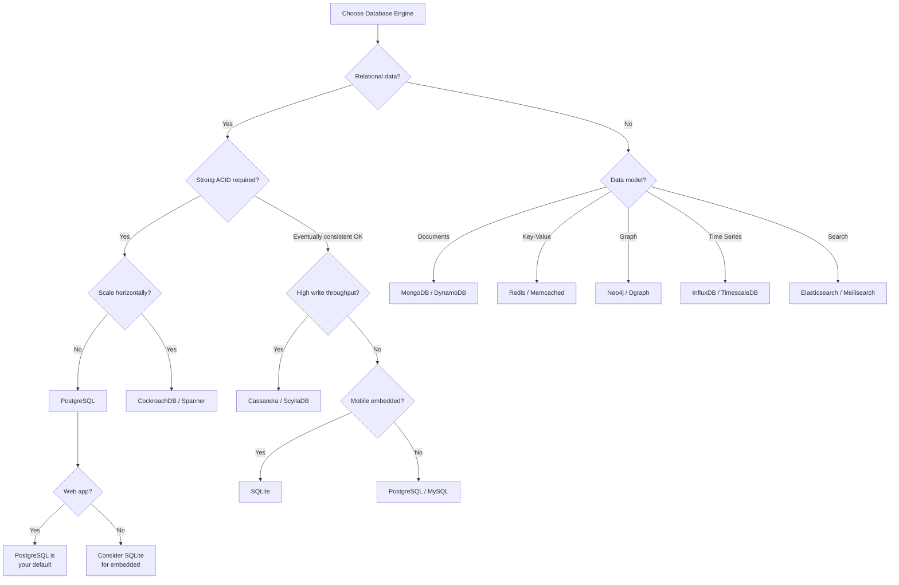
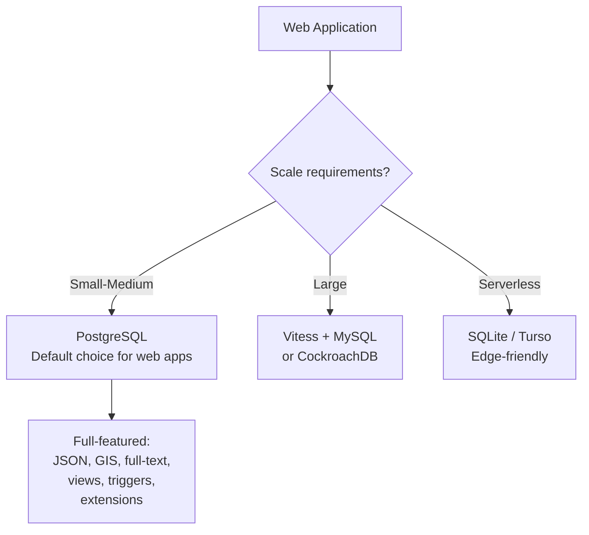

**Links**: [[SQL vs NoSQL Databases]] | [[PostgreSQL Features]] | [[MongoDB]] | [[Cassandra]] | [[Redis Deep Dive]] | [[Database Indexing Strategies]]


# Database Engines Compared

Choosing the right database engine depends on your data model, access patterns, scalability needs, and consistency requirements.

## Relational (SQL)

| Engine | Strengths |
|--------|-----------|
| PostgreSQL | ACID, extensibility, JSONB, geospatial |
| MySQL | Speed, simplicity, wide hosting support |
| SQLite | Embedded, zero-config, serverless |

## NoSQL

| Type | Engine | Use Case |
|------|--------|----------|
| Document | MongoDB | JSON docs, flexible schemas |
| Key-Value | Redis | Caching, real-time, sessions |
| Column-Family | Cassandra | Time-series, high write throughput |
| Graph | Neo4j | Connected data, recommendations |

## Selection Criteria

1. **Data shape**: Structured → SQL, Semi-structured → Document, Connected → Graph
2. **Consistency**: Strong ACID → SQL, Eventual → NoSQL
3. **Scale**: Vertical → SQL, Horizontal → NoSQL/NewSQL
4. **Query patterns**: Complex joins → SQL, Simple lookups → Key-Value

---

## Engine Selection Decision Tree



## Storage Engine Comparison

### Relational Storage Engines

| Engine | Database(s) | Row Format | Compression | MVCC | Crash Recovery |
|--------|------------|------------|-------------|------|---------------|
| **InnoDB** | MySQL | B+tree clustered | Page-level (Barracuda) | Yes (undo log) | Redo log + doublewrite |
| **MyISAM** | MySQL (legacy) | Uncompressed | None | No | Table repair (myisamchk) |
| **Aria** | MariaDB | Page-level | Page-level | Yes | Crash-safe |
| **TokuDB** | MySQL (Fractal Tree) | Fractal tree index | High (zlib, lzma) | Yes | WAL |
| **MyRocks** | MySQL (RocksDB) | LSM-tree | Yes (zstd, lz4) | Snapshot (RocksDB) | WAL + SST recovery |

### NoSQL / NewSQL Storage Engines

| Engine | Database(s) | Structure | Compaction | Read/Write Profile |
|--------|------------|-----------|------------|-------------------|
| **WiredTiger** | MongoDB | B+tree + LSM | Background | Balanced reads/writes |
| **RocksDB** | MyRocks, YugabyteDB | LSM-tree | Leveled/tiered | Write-optimized |
| **LSM-tree** | Cassandra, LevelDB | Sorted SSTables | Compaction (SizeTiered/Leveled) | Write-heavy workloads |
| **Paxos/Raft** | CockroachDB, Yugabyte | Replicated KV store | Variable | Distributed ACID |
| **C-store** | SingleStore, ClickHouse | Columnar | Merge tree | Analytical queries |

## Performance Benchmarks

### Read-Heavy Workload (90% reads, 10% writes)

| Engine | QPS (100 clients) | P99 Latency | Cache Hit Ratio |
|--------|------------------|-------------|-----------------|
| PostgreSQL 16 | 45,000 | 15ms | 99.2% |
| MySQL 8 (InnoDB) | 52,000 | 12ms | 99.1% |
| Redis | 180,000 | 2ms | 100% (in-memory) |
| CockroachDB (3 nodes) | 12,000 | 45ms | 97% |

### Write-Heavy Workload (20% reads, 80% writes)

| Engine | WPS (100 clients) | P99 Write Latency | Storage/day |
|--------|------------------|-------------------|-------------|
| Cassandra (ScyllaDB) | 150,000 | 5ms | ~500 GB |
| MongoDB (WiredTiger) | 85,000 | 8ms | ~400 GB |
| PostgreSQL 16 | 32,000 | 18ms | ~350 GB |
| MySQL 8 | 38,000 | 15ms | ~380 GB |
| CockroachDB (3 nodes) | 15,000 | 35ms | ~450 GB |

### Mixed Workload (50/50)

| Engine | TPS | P99 Latency | CPU Utilization |
|--------|-----|-------------|-----------------|
| PostgreSQL 16 | 28,000 | 20ms | 65% |
| MySQL 8 | 35,000 | 16ms | 70% |
| CockroachDB | 8,500 | 50ms | 80% |
| Cassandra | 60,000 | 12ms | 75% |

## Consistency Models Comparison

| Engine | Default Isolation | Consistency Model | CAP Classification |
|--------|-------------------|-------------------|-------------------|
| **PostgreSQL** | Read Committed | Strong (single node) / Configurable | CP / CA |
| **MySQL (InnoDB)** | Repeatable Read | Strong (single node) | CP / CA |
| **SQLite** | Serializable | Strong (single writer) | CA |
| **CockroachDB** | Serializable (SSI) | Strong (distributed) | CP |
| **Cassandra** | Read Committed | Eventual / Tunable | AP |
| **MongoDB** | Snapshot (replica) | Configurable (write concern) | CP (primary) / AP (configurable) |
| **DynamoDB** | Read Committed | Eventual / Strong (configurable) | AP |
| **Redis** | N/A (single-threaded) | Strong (single node) | CP (standalone) |

### CAP Property Definitions

```mermaid
graph TD
    subgraph CAP_Theorem
        C[Consistency<br/>Every read sees latest write]
        A[Availability<br/>Every request gets a response]
        P[Partition Tolerance<br/>System continues despite<br/>network failures]
    end
    
    subgraph Choices
        CP[Cassandra? No<br/>HBase, CockroachDB, MongoDB<br/>(partition + consistency)]
        AP[Cassandra, DynamoDB, Riak<br/>(partition + availability)]
        CA[Single-node: PostgreSQL, MySQL<br/>(consistency + availability)]
    end
    
    C <--> CP
    A <--> AP
    C <--> CA
    A <--> CA
    P <--> CP
    P <--> AP
```

## Ecosystem and Tooling Comparison

### Management and Operations

| Feature | PostgreSQL | MySQL | MongoDB | Cassandra |
|---------|-----------|-------|---------|-----------|
| **Backup tool** | pg_dump, pg_basebackup | mysqldump, XtraBackup | mongodump, Ops Manager | nodetool snapshot |
| **Monitoring** | pg_stat_*, pgBadger | Performance Schema, PMM | Atlas, Ops Manager | JMX, nodetool |
| **Migration tool** | Sqitch, Flyway, Alembic | Flyway, Liquibase | mongosh scripts | CQL scripts |
| **Schema change** | DDL transactions | Online DDL (pt-osc) | Schema flexibility | ALTER ... WITH |
| **GUI** | pgAdmin, DBeaver | MySQL Workbench | Compass, Atlas | DataStax Studio |
| **Cloud managed** | RDS, Cloud SQL, Aurora | RDS, Cloud SQL, Aurora | Atlas, DocumentDB | Astra, Keyspaces |

### Language Driver Support

| Language | PostgreSQL | MySQL | MongoDB | Cassandra |
|----------|-----------|-------|---------|-----------|
| **Python** | psycopg2, asyncpg | mysql-connector, PyMySQL | pymongo | cassandra-driver |
| **Node.js** | pg, postgres.js | mysql2, mysql | mongoose, native driver | cassandra-driver |
| **Go** | pgx, pq | go-sql-driver | mongo-go-driver | gocql |
| **Java** | JDBC, R2DBC | JDBC, R2DBC | sync/async driver | DataStax driver |
| **Rust** | sqlx, diesel, tokio-postgres | sqlx, diesel | mongodb crate | scylla/rust-driver |
| **C#/.NET** | Npgsql | MySqlConnector | MongoDB.Driver | CassandraCSharpDriver |

### Ecosystem Maturity

| Feature | PostgreSQL | MySQL | MongoDB |
|---------|-----------|-------|---------|
| **Extensions** | 400+ (PostGIS, pgvector, pg_partman) | Numerous (XtraDB, Spider) | Atlas, aggregation pipelines |
| **Full-text search** | Built-in (tsvector) | Built-in + InnoDB full-text | Built-in (text indexes) |
| **Geospatial** | PostGIS (industry standard) | Spatial extensions | GeoJSON support (2dsphere) |
| **Vector search** | pgvector, pgvector.rs | No native (MemSQL has) | Atlas Vector Search |
| **Message queue** | LISTEN/NOTIFY, pgmq | No built-in | Change streams |
| **Caching** | pg_buffercache | InnoDB buffer pool, memcache API | WiredTiger cache |

## Detailed Engine Comparison Tables

### Storage Characteristics

| Property | PostgreSQL | MySQL (InnoDB) | SQLite | MongoDB | Cassandra |
|----------|-----------|----------------|--------|---------|-----------|
| **Storage type** | Heap (default) / BRIN | Clustered B+tree | B+tree | B+tree + LSM | LSM-tree |
| **Max database size** | Unlimited | Unlimited | 281 TB (theoretical) | Unlimited | Unlimited |
| **Max row size** | 1.6 TB | 64 KB (row format) | ~1 GB | 16 MB | 2 GB |
| **Max table size** | 32 TB | 64 TB | 256 TB | Unlimited | Unlimited |
| **Compression** | TOAST (large values) | Page compression | None | Zlib, Snappy, Zstd | LZ4, Zstd, Deflate |
| **Data file format** | Heap pages | `.ibd` (tablespace) | `.db` / `.sqlite` | WiredTiger files | SSTables |

### Concurrency Characteristics

| Property | PostgreSQL | MySQL (InnoDB) | SQLite | MongoDB | Cassandra |
|----------|-----------|----------------|--------|---------|-----------|
| **Concurrency model** | Process per connection | Thread per connection | Single writer | Thread pool | Shared-nothing |
| **Max connections** | ~500 (default), 5000+ (configured) | ~151 (default), 10000+ (configured) | 1 writer (WAL mode: many readers) | ~50000 (configurable) | C* per node |
| **Lock granularity** | Row (MVCC) | Row + gap locks | Table (WAL: page) | Document level | Partition level |
| **Deadlock detection** | Wait-for graph | Wait-for graph (auto-detect) | N/A (single writer) | N/A (optimistic) | N/A |
| **Hot standby** | Yes (physical + logical) | Yes (async + semi-sync) | N/A | Replica set secondary | Any node can serve |

### Feature Comparison Matrix

| Feature | PostgreSQL | MySQL | SQLite | MongoDB | Cassandra |
|---------|-----------|-------|--------|---------|-----------|
| **ACID transactions** | ✓ Full | ✓ Full (InnoDB) | ✓ | ✓ (4.0+) | ❌ (lightweight) |
| **JSON/JSONB** | ✓ (JSONB, GIN indexes) | ✓ (JSON, partial support) | ✓ (JSON1 ext) | ✓ (native BSON) | ❌ (frozen) |
| **Full-text search** | ✓ (built-in) | ✓ (InnoDB, built-in) | ✓ (FTS5) | ✓ (text indexes) | ❌ (DSE Search) |
| **GIS/geospatial** | ✓✓ (PostGIS) | ✓ (basic) | ❌ | ✓✓ (GeoJSON) | ❌ |
| **Materialized views** | ✓ | ❌ (MySQL 8: no) | ❌ | ✓ ($merge pipeline) | ❌ |
| **Window functions** | ✓ | ✓ (8.0+) | ✓ (3.25+) | ✓ ($setWindowFields) | ❌ |
| **Recursive CTEs** | ✓ | ✓ (8.0+) | ✓ (3.8+) | ❌ | ❌ |
| **Foreign keys** | ✓ | ✓ (InnoDB) | ✓ (enforced) | ❌ (manual) | ❌ |
| **UNIQUE constraints** | ✓ | ✓ | ✓ | ✓ (unique index) | ✓ (primary key) |
| **CHECK constraints** | ✓ | ✓ (8.0.16+) | ✓ | ❌ | ❌ |
| **Triggers** | ✓ | ✓ | ✓ | ✓ (change streams) | ❌ |
| **Stored procedures** | ✓ (PL/pgSQL, Python, etc.) | ✓ (SQL/PSM) | ❌ | ✓ (JS) | ❌ (CQL only) |
| **HASH index** | ✓ (hash index) | ✓ (hash index, MEMORY) | ❌ | ✓ (hashed shard key) | ✓ (partition key hash) |
| **GIN/GiST index** | ✓ | ❌ | ❌ | ❌ | ❌ |
| **Columnar storage** | ✓ (columnar ext) | ❌ (InnoDB row) | ❌ | ❌ | ✓ (native column) |
| **Vector similarity** | ✓ (pgvector) | ❌ | ❌ | ✓ (Atlas) | ❌ |
| **Graph queries** | ✓ (age, janusgraph) | ❌ | ❌ | ❌ | ❌ (DSE Graph) |

## Use Case Recommendations

### Web Applications (OLTP)



### Analytics / OLAP

| Engine | Strengths | Weaknesses |
|--------|-----------|------------|
| **ClickHouse** | Columnar, extreme compression, fast aggregation | Poor single-row performance |
| **PostgreSQL (columnar ext)** | ACID, full SQL, good for moderate analytics | Slower than dedicated OLAP engines |
| **SingleStore** | Hybrid row/columnar | Licensing cost |
| **Redshift** | Petabyte-scale, AWS integration | Less flexible for OLTP |
| **BigQuery** | Serverless, automatic scaling | Cost at high query volumes |

### Time Series

| Engine | Architecture | Retention | Downsampling |
|--------|-------------|-----------|-------------|
| **TimescaleDB** | Hypertables (PostgreSQL ext) | Automated | Continuous aggregates |
| **InfluxDB** | Custom storage engine | TSM retention policies | Downsampling tasks |
| **VictoriaMetrics** | LSM-tree inspired | Retention periods | Rollups |
| **ClickHouse** | Columnar merges | TTL on tables | Materialized views |

### Search

| Engine | Index Type | CAP | Typical Use |
|--------|-----------|-----|-------------|
| **Elasticsearch** | Inverted index | CP (eventual) | Full-text, log analytics |
| **Meilisearch** | Inverted index | AP | Typo-tolerant user-facing search |
| **Typesense** | In-memory inverted | CP | Fast, typo-tolerant search |
| **PostgreSQL FTS** | GIN/tsvector | CP (ACID) | Integrated search with relational data |

**See also**: [[PostgreSQL Features]], [[SQLite Reference]], [[SQL JOIN Operations]], [[DB Relationship Patterns]], [[Data Normalization Rules]]
