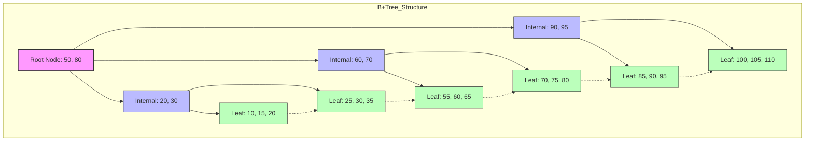
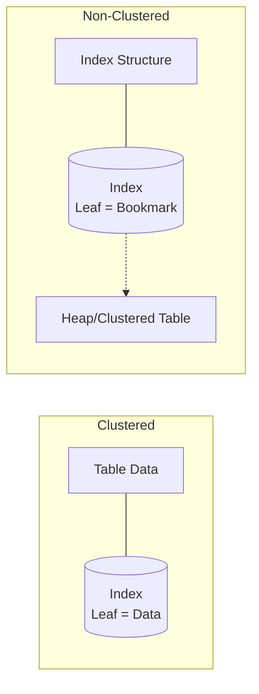
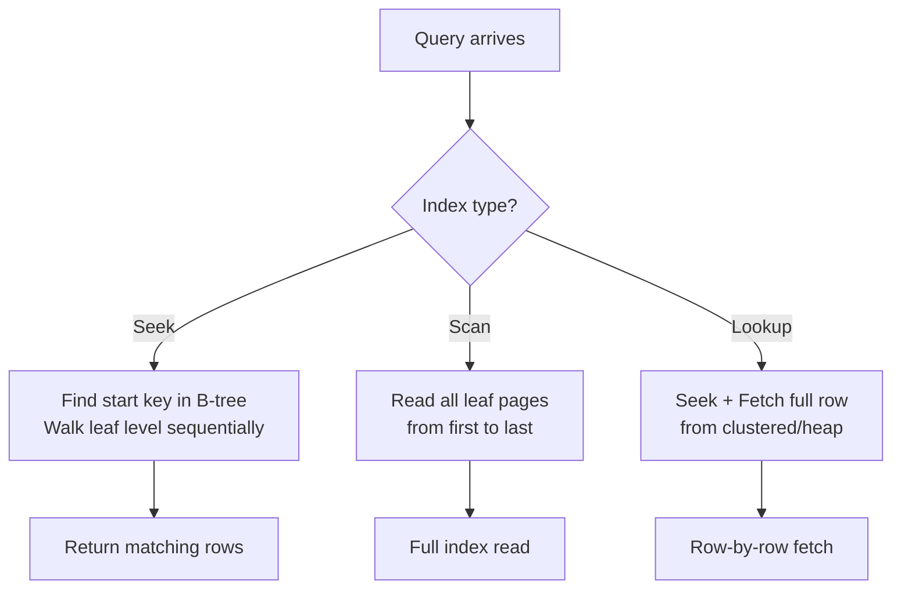

**Links**: [[Database Indexing Strategies]] | [[SQL Query Optimization]] | [[LSM-Tree Storage Engines]] | [[Database Engines Compared]] | [[PostgreSQL Performance Tuning]] | [[Database Transactions]]


# Database Indexing Deep Dive

Indexes are data structures that speed up data retrieval at the cost of slower writes and additional storage.

## B-Tree Index (Default)

Balanced tree structure optimized for disk I/O.

B-tree depth grows slowly — even billions of rows need only ~4 levels.

## Index Types

| Type | Internal Structure | Best For |
|------|------------------|----------|
| B-tree | Balanced tree | Equality + range queries |
| Hash | Hash table | Exact equality lookups |
| GiST | Generalized Search Tree | Full-text, geometry |
| GIN | Generalized Inverted Index | JSONB, arrays, full-text |
| BRIN | Block Range Index | Large naturally sorted tables |

## Composite Index

Columns order matters: put high-selectivity columns first.

```sql
CREATE INDEX idx_user_status_date
ON orders(status, created_at DESC);
```

---

## B-Tree Structure: How It Works

A B-tree is a self-balancing tree that maintains sorted data and enables efficient insertions, deletions, and searches.

```
Root:        [50, 80]
           /    |     \
Internal: [20,30] [60,70] [90,95]
          / | \   / | \   / | \
Leaf:    [10][20][30][40][50][60][70][80][90][100]
```

### B-Tree vs B+Tree

| Feature | B-Tree | B+Tree |
|---------|--------|--------|
| Data pointers | In internal + leaf nodes | Leaf nodes only |
| Leaf node linkage | Not linked | Linked list structure |
| Range scans | Slower (scatter) | Faster (sequential) |
| Used by | MongoDB (WiredTiger) | InnoDB, PostgreSQL |
| Space utilization | Lower | Higher |



## How Indexes Work Under the Hood

### Page Structure

Databases store data in fixed-size pages (typically 8KB or 16KB). Each page contains:

```
+------------------------------------------+
| Page Header (24 bytes)                   |
| - Page Type (leaf/internal)              |
| - Number of records                      |
| - Free space pointer                     |
| - Checksum                               |
+------------------------------------------+
| Record Pointers (slot array)             |
| Slot 1 | Slot 2 | ... | Slot N          |
+------------------------------------------+
| Free Space (unused area)                 |
|                                          |
+------------------------------------------+
| Actual Record Data (stored bottom-up)    |
| Record N | ... | Record 2 | Record 1    |
+------------------------------------------+
```

### Page Splitting

When a page fills up, the database splits it:

1. Allocate a new page
2. Move ~50% of records to the new page
3. Update the parent node's pointers
4. If parent is full, split propagates upward

### What Happens During an Index INSERT

```
Value 42 inserted into B-tree:

1. Read root page → determine child pointer
2. Read internal page → determine leaf page
3. Read leaf page → insert value in sorted position
4. If page overflows → split (50-50 distribution)
5. Update parent pointer → cascade if needed
```

## Clustered vs Non-Clustered Indexes



| Aspect | Clustered | Non-Clustered |
|--------|-----------|---------------|
| Data storage | Leaf nodes hold full rows | Leaf nodes hold pointers |
| Number per table | 1 (physical order) | Up to 999 |
| Primary key default | Yes (InnoDB, SQL Server) | Secondary index |
| Insert speed | Slower (page splits) | Faster |
| Range queries | Very fast (sequential) | Slower (lookup each row) |
| Extra storage | None (data = index) | Yes (duplicate keys) |

### When to Use Each

- **Clustered**: Range queries, ORDER BY, BETWEEN, sequential access patterns
- **Non-clustered**: Exact lookups, covering indexes, multiple access paths

## Covering Indexes and Index-Only Scans

A covering index contains ALL columns needed by a query, eliminating table lookups.

```sql
-- Table: users(id, name, email, age, status)

-- Without covering index:
CREATE INDEX idx_status ON users(status);
-- Query needs a table lookup after index scan:
SELECT name, email FROM users WHERE status = 'active';
-- Plan: Index Seek → Key Lookup → Result

-- With covering index:
CREATE INDEX idx_status_covering ON users(status) INCLUDE (name, email);
-- Query satisfied entirely from index:
SELECT name, email FROM users WHERE status = 'active';
-- Plan: Index Scan → Result (no table access!)
```

### INCLUDE Columns

PostgreSQL 11+, SQL Server, and MySQL 8+ support included columns:

```sql
CREATE INDEX idx_orders_cov ON orders(user_id, status) INCLUDE (total, created_at);
```

Benefits:
- Avoids key lookup (random I/O)
- Wider index works for more queries
- INCLUDE columns don't affect sort order

## Index Scan vs Seek vs Lookup



| Operation | What Happens | When Used | Cost |
|-----------|-------------|-----------|------|
| **Index Seek** | Navigate tree to a starting point, then scan leaf pages | Equality + range predicates | O(log n) + matching rows |
| **Index Scan** | Read all leaf pages in order | No useful predicate, full index traversal | O(n) |
| **Key Lookup** | For each matching index entry, fetch full row from table | Non-covering non-clustered index | O(m) random I/O |
| **Index Only Scan** | Read index leaf pages only; no table access | Covering index | Optimal |

## Partial Indexes

Index only a subset of rows matching a WHERE clause:

```sql
-- Only index active users
CREATE INDEX idx_active_users ON users(email) WHERE status = 'active';

-- Index recent orders only
CREATE INDEX idx_recent_orders ON orders(created_at) WHERE created_at > '2024-01-01';
```

### Benefits

| Factor | Full Index | Partial Index |
|--------|-----------|---------------|
| Index size | Large | Small (fits in RAM) |
| Write overhead | High (update every row) | Low (update subset) |
| Query speed | Same for filtered queries | Faster (smaller tree) |
| Maintenance | More fragmentation | Less fragmentation |

## Indexing Strategies by Query Pattern

### Equality Lookups

```sql
-- WHERE id = 42
-- Best: Unique index on id
CREATE UNIQUE INDEX idx_id ON users(id);
```

### Range Queries

```sql
-- WHERE created_at BETWEEN '2024-01-01' AND '2024-01-31'
-- Best: B-tree on created_at (range column last in composite)
CREATE INDEX idx_created ON orders(created_at);
```

### ORDER BY

```sql
-- ORDER BY created_at DESC LIMIT 10
-- Best: Index that matches sort order exactly
CREATE INDEX idx_created_desc ON orders(created_at DESC);
```

### GROUP BY / Aggregation

```sql
-- SELECT status, COUNT(*) FROM orders GROUP BY status
-- Best: Index on status column (or covering index)
CREATE INDEX idx_status_count ON orders(status) INCLUDE (id);
```

### JOINs

```sql
-- SELECT * FROM users u JOIN orders o ON u.id = o.user_id
-- Best: Index on foreign key column in the join
CREATE INDEX idx_orders_user_id ON orders(user_id);
```

## Multi-Column Index: Column Order Rules

### The Golden Rule: Equality First, Range Last

```sql
-- Query: WHERE status = 'active' AND created_at > '2024-01-01'
-- Correct order:
CREATE INDEX idx_status_date ON orders(status, created_at);
-- status: equality → can seek to exact position
-- created_at: range → scan forward from point

-- Wrong order:
CREATE INDEX idx_date_status ON orders(created_at, status);
-- created_at: range across many values
-- status: cannot use equality efficiently after range
```

| Column Position | Predicate Type | Effect |
|----------------|---------------|--------|
| First | Equality (=) | Seek to exact rows |
| Middle | Equality | Filter remaining rows |
| Last | Range (> , <, BETWEEN) | Scan within range |
| Not included | ORDER BY, GROUP BY | Sort/aggregate from index |

### Skipping Columns

```sql
-- Index: (a, b, c)
-- Query uses: a = ? AND c = ?
-- Can use index for 'a' seek, but needs filter for 'c'
```

PostgreSQL can do **Index Skip Scan** (11+), MySQL has **Loose Index Scan**.

## Index Maintenance

### Fragmentation

Over time, page splits and deletions create fragmentation:

| Type | Description | Impact |
|------|-------------|--------|
| Internal | Empty space within pages | Wasted storage, more pages to read |
| External | Logical order ≠ physical order | More random I/O on range scans |

### Checking Fragmentation

```sql
-- PostgreSQL
SELECT schemaname, tablename, indexname, avg_leaf_density
FROM pg_stat_all_indexes;

-- SQL Server
SELECT avg_fragmentation_in_percent, page_count
FROM sys.dm_db_index_physical_stats(...);
```

### Rebuild vs Reorganize

| Operation | What It Does | When to Use |
|-----------|-------------|-------------|
| **REBUILD** | Drop and recreate index (offline or online) | Fragmentation > 30% |
| **REORGANIZE** | Defragment leaf pages in-place | Fragmentation 10-30% |
| **UPDATE STATISTICS** | Refresh histogram for query optimizer | After large data changes |

```sql
-- PostgreSQL: REINDEX
REINDEX INDEX idx_orders_created;

-- SQL Server: Rebuild
ALTER INDEX idx_orders_created ON orders REBUILD;
ALTER INDEX idx_orders_created ON orders REORGANIZE;

-- MySQL: Optimize table (rebuilds indexes)
OPTIMIZE TABLE orders;
```

## Indexing Antipatterns

### Over-Indexing

| Symptom | Problem | Fix |
|---------|---------|-----|
| Many indexes on same table | Slow writes, large storage | Audit unused indexes |
| Index on every column | Query optimizer confusion | Composite indexes instead |
| Indexing low-cardinality columns | Wasted space, poor selectivity | Only if needed for equality |

### Under-Indexing

| Symptom | Problem | Fix |
|---------|---------|-----|
| Full table scans on hot queries | High CPU, slow response | Add targeted indexes |
| Foreign keys not indexed | Slow JOINs, lock escalation on cascading deletes | Index all FK columns |
| No covering index for critical query | Key lookups causing random I/O | Add INCLUDE columns |

### Common Mistakes

```sql
-- MISTAKE 1: Indexing by first name in a users table (low selectivity)
CREATE INDEX idx_first_name ON users(first_name);  -- 1000s of "John"s

-- MISTAKE 2: Using LIKE with leading wildcard (index can't help)
SELECT * FROM users WHERE name LIKE '%smith%';  -- Always full scan

-- MISTAKE 3: Function on indexed column prevents index use
SELECT * FROM orders WHERE DATE(created_at) = '2024-01-01';  -- No index
-- Better:
SELECT * FROM orders WHERE created_at >= '2024-01-01' AND created_at < '2024-01-02';

-- MISTAKE 4: OR conditions that defeat index merge
SELECT * FROM users WHERE email = ? OR phone = ?;  -- Consider UNION ALL
```

## Expression Indexes / Functional Indexes

Index the result of a function or expression:

```sql
-- PostgreSQL
CREATE INDEX idx_lower_email ON users(LOWER(email));
-- Query now uses the index:
SELECT * FROM users WHERE LOWER(email) = 'user@example.com';

-- Expression on computed column:
CREATE INDEX idx_total_price ON orders(quantity * unit_price);
```

### Use Cases

- Case-insensitive lookups
- Date truncation queries
- JSON field extractions
- Computed columns

### Trade-offs

| Pro | Con |
|-----|-----|
| Makes function-based queries fast | Increases write overhead |
| Avoids adding computed columns | Less intuitive to debug |
| Index size = result size | Stats may be less accurate |

## Full-Text Indexes

Designed for searching natural language text:

```sql
-- PostgreSQL
CREATE INDEX idx_articles_fts ON articles USING GIN(to_tsvector('english', body));

-- Query:
SELECT * FROM articles
WHERE to_tsvector('english', body) @@ to_tsquery('database & indexing');
```

| Feature | B-tree | Full-Text (GIN) |
|---------|--------|-----------------|
| Tokenization | Exact value | Word-level tokens |
| Partial match | LIKE only | Stemming, ranking |
| Stop words | No | Yes (the, and, etc.) |
| Ranking | No | ts_rank() |
| Speed | O(log n) | O(number of matching docs) |

## Spatial Indexes (R-tree, GiST)

For geospatial and geometric data:

```sql
-- PostgreSQL with PostGIS
CREATE INDEX idx_locations ON places USING GIST(location);

-- Query: find places within 10km
SELECT * FROM places
WHERE ST_DWithin(location, ST_MakePoint(-73.9857, 40.7484), 10000);
```

### How R-tree Works

```
Bounding boxes in a hierarchy:

       [USA]
      /      \
[East Coast]  [West Coast]
   /    \        /     \
[NYC] [BOS]   [SF]   [LA]
```

Each node stores the minimum bounding rectangle (MBR) of its children.

## JSON/JSONB Indexing (GIN)

```sql
-- GIN index on JSONB
CREATE INDEX idx_users_metadata ON users USING GIN(metadata);

-- Query:
SELECT * FROM users WHERE metadata @> '{"age": 30}';

-- Or B-tree on specific path:
CREATE INDEX idx_users_email ON users((metadata->>'email'));
SELECT * FROM users WHERE metadata->>'email' = 'user@example.com';
```

| Index Type | JSONB Operations Supported | Use Case |
|------------|---------------------------|----------|
| GIN | @>, ?, ?&, ?\ | Arbitrary key/value lookups |
| B-tree on expression | ->, ->> | Specific field with high cardinality |
| GIN + jsonb_path_ops | @> | Faster containment (smaller index) |

## Real-World Case Study: Optimizing a Slow Query

### The Problem

```sql
-- Runs in 12 seconds on 10M orders
SELECT o.id, o.total, u.name, u.email
FROM orders o
JOIN users u ON o.user_id = u.id
WHERE o.status = 'pending'
  AND o.created_at > '2024-06-01'
ORDER BY o.created_at DESC
LIMIT 50;
```

### The Plan (Before)

```
Hash Join  (cost=180K, actual time=12000ms)
  ├─ Seq Scan on orders (cost=160K, rows=5M, filter: status='pending')
  └─ Hash
       └─ Seq Scan on users (cost=20K, rows=10M)
Sort: created_at DESC (cost=extra)
Limit: 50 rows
```

### Diagnosis

1. Full table scan on orders (no index on status + created_at)
2. Key lookup for every row
3. Sorting 5M rows for ORDER BY

### The Fix

```sql
-- Composite covering index for the query
CREATE INDEX idx_orders_pending_date
ON orders(status, created_at DESC)
INCLUDE (user_id, total);

-- Ensure foreign key is indexed (was already indexed)
CREATE INDEX idx_users_id ON users(id);
```

### The Plan (After)

```
Index Only Scan using idx_orders_pending_date (cost=2ms, actual time=3ms)
  ├─ Seek to status='pending'
  ├─ Scan forward by created_at DESC
  └─ Return 50 rows immediately (LIMIT stops early)
Nested Loop:
  └─ Index Seek on users (key lookup by id)
```

### Results

| Metric | Before | After | Improvement |
|--------|--------|-------|-------------|
| Query time | 12,000 ms | 4 ms | 3000x |
| Rows scanned | 5,000,000 | 50 | 100,000x |
| I/O (pages read) | ~150,000 | ~100 | 1500x |

**See also**: [[SQL Query Optimization]], [[PostgreSQL Features]], [[SQL JOIN Operations]], [[Data Structures]]