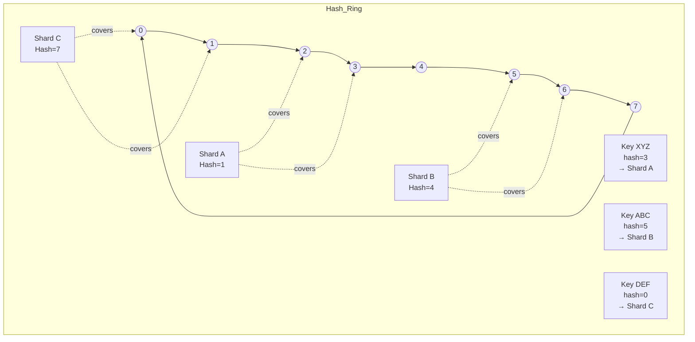
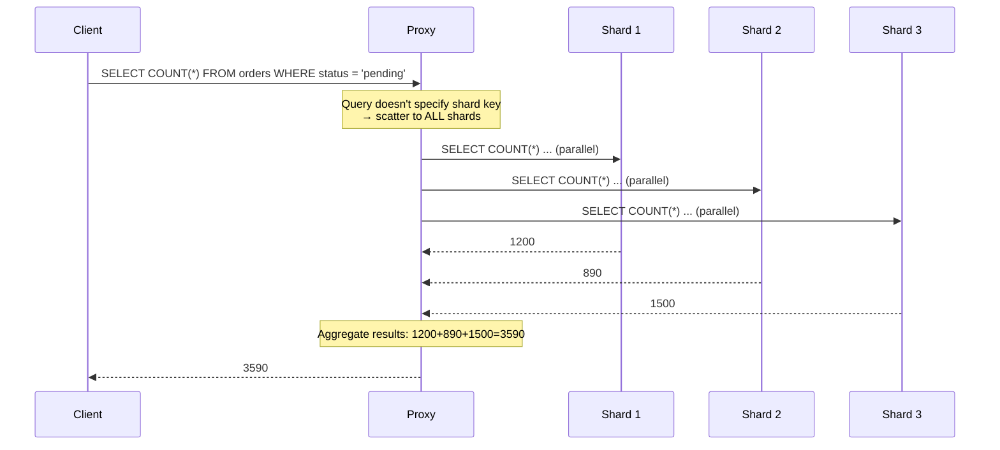

# Database Sharding

**Links**: [[Database Engines Compared]] | [[Database Indexing Deep Dive]] | [[Database Transactions]] | [[Cloud Computing]] | [[Infrastructure as Code]]

## What is Sharding?

Sharding horizontally partitions a database across multiple servers. Each shard holds a subset of the data. Together, all shards contain the full dataset.

```
Shard 1: users_id 0001-3333
Shard 2: users_id 3334-6666
Shard 3: users_id 6667-9999
```

## Sharding Strategies

### Key-Based (Hash)

```python
def get_shard(user_id: int, total_shards: int) -> int:
    return hash(user_id) % total_shards
```

Pros: Even distribution. Cons: Resharding is expensive.

### Range-Based

```
Shard 1: users A-D
Shard 2: users E-H
Shard 3: users I-L
```

Pros: Easy to add shards. Cons: Hot spots on popular ranges.

### Directory-Based

A lookup service maps keys to shards.

Pros: Flexible routing. Cons: Single point of failure (or complexity).

## Challenges

| Challenge | Description | Mitigation |
|-----------|-------------|------------|
| **Cross-shard queries** | JOINs across shards | Application-level joins |
| **Transactions** | ACID across shards | Distributed transactions (2PC, Saga) |
| **Resharding** | Moving data when adding shards | Consistent hashing, virtual shards |
| **Hot spots** | Uneven load distribution | Rebalance, hash keys |
| **Backups** | Consistent backup across shards | Per-shard backup |

## Alternatives

| Approach | Description | Complexity |
|----------|-------------|------------|
| **Read replicas** | Scale reads, one writer | Low |
| **Partitioning** | Split table within one DB | Medium |
| **Sharding** | Split across servers | High |
| **NewSQL** | Auto-sharding (CockroachDB, Spanner) | Low (managed) |

---

## Sharded Database Architecture

```mermaid
graph TB
    subgraph Clients
        C1[Client App]
        C2[Client App]
        C3[Client App]
    end
    subgraph Proxy_Layer
        P[Proxy / Load Balancer<br/>e.g., Vitess, pgpool-II]
    end
    subgraph Shard_Map
        SM[Shard Key → Shard Mapping<br/>Consistent Hash Ring]
    end
    subgraph Shards
        S1[Shard 1<br/>users_id 0001-3333<br/>Server A]
        S2[Shard 2<br/>users_id 3334-6666<br/>Server B]
        S3[Shard 3<br/>users_id 6667-9999<br/>Server C]
    end
    subgraph Global_Tables
        GT[Global/Reference Tables<br/>(replicated to all shards)]
    end
    
    C1 --> P
    C2 --> P
    C3 --> P
    P --> SM
    SM --> S1
    SM --> S2
    SM --> S3
    S1 -.-> GT
    S2 -.-> GT
    S3 -.-> GT
```

## Consistent Hashing Deep Dive

### The Problem with Modular Hashing

```python
def get_shard(user_id, total_shards):
    return hash(user_id) % total_shards  # 3 shards → 3 buckets
```

When adding a 4th shard: `hash(id) % 4` yields completely different bucket assignments → **every key remaps** → massive data migration.

### Consistent Hashing Solution



### How Consistent Hashing Works

1. **Hash both keys and shards** onto a circular ring (0 to 2^32 - 1)
2. **Each shard** is assigned one or more positions on the ring
3. **Each key** is assigned to the next shard encountered when moving clockwise
4. **When a shard is added/removed**: only keys in the immediate neighborhood remap

```python
import hashlib

class ConsistentHashRing:
    def __init__(self, nodes=None, replicas=150):
        self.replicas = replicas  # Virtual nodes per physical node
        self.ring = {}
        self.sorted_keys = []
        if nodes:
            for node in nodes:
                self.add_node(node)

    def _hash(self, key: str) -> int:
        return int(hashlib.md5(key.encode()).hexdigest(), 16)

    def add_node(self, node: str):
        for i in range(self.replicas):
            virtual_key = f"{node}:{i}"
            hash_val = self._hash(virtual_key)
            self.ring[hash_val] = node
            self.sorted_keys.append(hash_val)
        self.sorted_keys.sort()

    def get_node(self, key: str) -> str:
        if not self.ring:
            return None
        hash_val = self._hash(key)
        # Binary search for next clockwise position
        for ring_key in self.sorted_keys:
            if hash_val <= ring_key:
                return self.ring[ring_key]
        return self.ring[self.sorted_keys[0]]  # Wrap around
```

## Virtual Shards / Shard Groups

Virtual sharding decouples the logical shard from physical storage:

```
Physical Reality:
  Server A (16 shards)   Server B (16 shards)   Server C (16 shards)

Virtual Layer (48 shards total):
  [0][1][2][3]...[15] | [16][17][18]...[31] | [32][33][34]...[47]

When adding Server D:
  Move 12 virtual shards from A/B/C → D
  Only 25% of data moves (vs 75% with modular hashing from 3→4)
```

### Benefits

| Benefit | Explanation |
|---------|-------------|
| **Fine-grained rebalancing** | Move individual virtual shards, not entire servers |
| **Load balancing** | Hot shards can be split across physical nodes |
| **Simpler operations** | Add/remove servers with minimal data movement |
| **Uniform distribution** | More virtual shards than physical nodes → better spread |

## Shard Key Selection Strategies

### Critical Principles

1. **High cardinality**: The key should have many distinct values
2. **Even distribution**: Values should be uniformly distributed
3. **Query alignment**: Most queries should specify the shard key
4. **Stability**: The key value should rarely or never change

### Common Strategies

| Strategy | Example | Pros | Cons |
|----------|---------|------|------|
| **User ID** | `shard = user_id % N` | Even distribution, most queries filter by user | Hot users can overload a shard |
| **Geographic** | `shard = region_hash(city)` | Low latency for local users | Skewed if one region dominates |
| **Tenant ID** | `shard = tenant_id % N` | Natural isolation for SaaS | Massive tenants cause hot spots |
| **Time-based** | `shard = date_range(created_at)` | Easy archiving, range scans | Write hot spot on latest shard |
| **Business entity** | `shard = order_id % N` | Most queries include order_id | Cross-entity queries expensive |

### Common Mistakes

| Mistake | Why It Fails | Example |
|---------|-------------|---------|
| **Low cardinality key** | All values land on few shards | `status` (active/inactive) |
| **Monotonically increasing key** | All writes go to last shard | Auto-increment ID |
| **Frequently updated key** | Must remap shard on update | User's email |
| **Natural key that changes** | Data ends up in wrong shard | User's country after move |
| **Overly wide shard key** | Each shard gets too much data | Only 2 shards for 10TB data |

## Cross-Shard Query Patterns

### Scatter-Gather



### Scatter-Gather Performance

| Pattern | Latency | Resource Use | Notes |
|---------|---------|-------------|-------|
| **Parallel scatter** | Max of all shard times | High (all shards) | Fastest, highest resource |
| **Sequential scatter** | Sum of all shard times | Lower (one at a time) | Slow for many shards |
| **Fan-out with limits** | Adjustable | Moderate | `LIMIT 100` per shard + merge |
| **Cached aggregation** | Fast | Low | Materialized view per shard |

### Reducing Cross-Shard Queries

```sql
-- BAD: Cross-shard (no shard key in WHERE)
SELECT * FROM orders WHERE status = 'pending';

-- GOOD: Shard key specified (routes to single shard)
SELECT * FROM orders WHERE user_id = 42 AND status = 'pending';
```

### Cross-Shard JOINs

```sql
-- Cannot JOIN across shards natively
-- Application must:
-- 1. Query both shards separately
-- 2. Perform merge/pagination in application code
-- 3. Or use a global table (replicated everywhere)

-- Better: design around the shard key
-- If users and orders are co-located by user_id:
SELECT u.name, o.total
FROM users u
JOIN orders o ON u.id = o.user_id
WHERE u.id = 42;  -- Single shard!
```

## Shard Rebalancing Strategies

### Fixed Sharding

```
Initial:    10 shards, 10 servers (1:1)
Rebalancing: Add 2 servers → shuffle all data

Problems:
- Massive data migration
- Downtime or read-only mode during rebalance
- Difficult to predict completion time
```

### Dynamic Sharding (Virtual Shards)

```
Initial:    1024 virtual shards, 10 servers (~102:1)
Rebalancing: Add 2 servers → move ~170 virtual shards each

Benefits:
- Small, controlled data moves
- No downtime (migrate one virtual shard at a time)
- Gradual rebalancing over hours/days
```

### Rebalancing Strategies Comparison

| Strategy | Downtime | Data Moved | Complexity | Control |
|----------|----------|------------|------------|---------|
| **Stop the world** | Full | 100% | Low | None |
| **Modular rehashing** | Minimal | 100% | Medium | Coarse |
| **Consistent hashing** | None | K/N (fraction) | High | Fine |
| **Virtual shards** | None | Configurable (e.g., 10%) | High | Very fine |
| **Ranged rebalancing** | None | Split ranges | Medium | Moderate |

## Sharding Implementations

### Vitess (MySQL)

- **Type**: Proxy-based
- **Architecture**: vtgate (proxy) + vttablet (per-shard mysql)
- **Features**: Automatic resharding, online schema changes, connection pooling
- **Best for**: Large-scale MySQL horizontal scaling

```yaml
# Vitess sharding config example
shards:
  - name: "-80"  # Range [0, 0x80)
    tablets:
      - type: PRIMARY
        cell: cell1
  - name: "80-"  # Range [0x80, max)
    tablets:
      - type: PRIMARY
        cell: cell1
```

### Citus (PostgreSQL)

- **Type**: Extension-based (library)
- **Architecture**: Coordinator node + worker nodes
- **Features**: Distributed SQL, CTEs, reference tables
- **Best for**: PostgreSQL scaling, real-time analytics

```sql
-- Citus: create distributed table
SELECT create_distributed_table('orders', 'user_id');

-- Create reference table (copied to all nodes)
SELECT create_reference_table('countries');

-- Distributed query (automatically pushed down)
SELECT count(*) FROM orders WHERE user_id = 42;
```

### MongoDB

- **Type**: Native sharding
- **Architecture**: mongos (router) + config servers + shard replica sets
- **Features**: Auto-balancing, zones, hashed/range sharding
- **Best for**: Document model, flexible schema

```javascript
// Enable sharding on database
sh.enableSharding("ecommerce")

// Shard collection with hashed key
sh.shardCollection("ecommerce.orders", { user_id: "hashed" })

// Create zone for specific region
sh.addShardTag("shard01", "US")
sh.updateZoneKeyRange("ecommerce.orders", 
  { country: "US" }, { country: "US" }, "US")
```

### CockroachDB

- **Type**: NewSQL (auto-sharding)
- **Architecture**: Shared-nothing, each node contains ranges
- **Features**: Auto-rebalancing, distributed ACID, SQL compatibility
- **Best for**: Geo-distributed, strongly consistent workloads

```sql
-- CockroachDB: tables are automatically sharded
CREATE TABLE orders (
  id UUID PRIMARY KEY DEFAULT gen_random_uuid(),
  user_id UUID,
  total DECIMAL,
  created_at TIMESTAMP
);

-- Set replication zone for geo-distribution
ALTER TABLE orders CONFIGURE ZONE USING
  constraints = '{+region=us-east: 1, +region=eu-west: 1}';
```

## Proxy-Based vs Library-Based Sharding

| Aspect | Proxy-Based (Vitess) | Library-Based (Citus, Hibernate Shards) |
|--------|---------------------|-----------------------------------------|
| **App changes** | Minimal (connect to proxy) | Requires code changes |
| **Protocol** | SQL protocol compatible | Driver-level integration |
| **Deployment** | Separate infrastructure | Embedded in app process |
| **Feature support** | SQL subset (no cross-shard JOINs) | Custom query APIs |
| **Performance** | Proxy adds latency (~1ms) | Direct connections (faster) |
| **Upgrades** | Proxy manages connection pooling | Per-app library updates |

## Global Tables / Reference Tables

Tables that are replicated to every shard (small, rarely updated):

```sql
-- Examples: countries, product categories, tax rates

-- Citus reference table
SELECT create_reference_table('countries');

-- Vitess: table with no sharding key (automatically broadcast)
CREATE TABLE countries (
  code VARCHAR(2) PRIMARY KEY,
  name VARCHAR(100)
);
-- Vitess routes writes to all shards via 2PC
```

### Characteristics

| Property | Description |
|----------|-------------|
| **Size** | Small (<10,000 rows) |
| **Update frequency** | Low (config changes) |
| **JOIN requirement** | Frequently JOINed with sharded tables |
| **Consistency** | Strong (synchronous replication) or eventual |

## Unique ID Generation in Sharded Systems

Auto-increment IDs don't work across shards (duplicates). Common solutions:

### Snowflake ID (Twitter)

```
 0  0000000000000000000000000000000000000000  0000000000  000000000000
| unused | timestamp (41 bits)              | worker(10)| sequence(12) |
```

```python
import time
import threading

class SnowflakeGenerator:
    def __init__(self, worker_id: int, datacenter_id: int):
        self.worker_id = worker_id
        self.datacenter_id = datacenter_id
        self.sequence = 0
        self.last_timestamp = -1
        self.lock = threading.Lock()

    def next_id(self) -> int:
        with self.lock:
            timestamp = int(time.time() * 1000)
            if timestamp == self.last_timestamp:
                self.sequence = (self.sequence + 1) & 0xFFF
                if self.sequence == 0:
                    timestamp = self.wait_next_ms()
            else:
                self.sequence = 0
            self.last_timestamp = timestamp
            return (timestamp << 22) | (self.datacenter_id << 17) | (self.worker_id << 12) | self.sequence
```

### UUIDv7 (Time-Ordered)

```sql
-- PostgreSQL with pg_uuidv7 extension
CREATE EXTENSION pg_uuidv7;
CREATE TABLE orders (
  id UUID DEFAULT uuid_generate_v7() PRIMARY KEY,
  ...
);

-- MySQL 9+ native UUIDv7:
SELECT UUID_TO_BIN(UUID(), TRUE);  -- Time-ordered UUID
```

### ID Generation Strategies

| Method | Sortable | Size | Uniqueness | Performance |
|--------|----------|------|------------|-------------|
| **Snowflake** | Yes (time prefix) | 64-bit (BigInt) | Per worker ID | Very fast (local) |
| **UUIDv4** | No (random) | 128-bit | Global (collision improbable) | Fast |
| **UUIDv7** | Yes (timestamp) | 128-bit | Global | Fast |
| **ULID** | Yes (timestamp) | 128-bit (26 chars) | Global | Fast |
| **Sequence table** | Yes | 64-bit | Per shard (batched) | Slower (DB round-trip) |
| **KSUID** | Yes (timestamp) | 128-bit (27 chars) | Global | Fast |

## Backup and Restore for Sharded Databases

### Per-Shard Backup

```bash
# Backup each shard independently
for shard in shard-0 shard-1 shard-2; do
  pg_dump -h $shard -Fc -f backup_${shard}.dump $DB_NAME &
done
wait  # All backups run in parallel
```

### Coordinated Backup Strategies

| Strategy | Consistency | Complexity | Recovery |
|----------|-------------|------------|----------|
| **Per-shard independent** | Eventual | Low | Restore each shard separately |
| **Global snapshot** | Strong | High | All shards at same point in time |
| **Logical dump + WAL archive** | Point-in-time | Medium | PITR per shard |
| **Distributed snapshot (CockroachDB)** | Strong | Low (built-in) | Single command |

### Recovery Process

```python
# Pseudo-code for sharded recovery
def restore_sharded_backup(shards, backup_path, restore_point):
    for shard in shards:
        # Stop application traffic
        # Restore shard from backup
        restore_shard(shard, f"{backup_path}/{shard}.dump")
        # Replay WAL to restore_point (if PITR)
        replay_wal(shard, restore_point)
    # Verify consistency (checksum comparison across shards)
    verify_global_consistency()
    # Resume traffic
```

**Next**: [[Internationalization]] — Build for global users