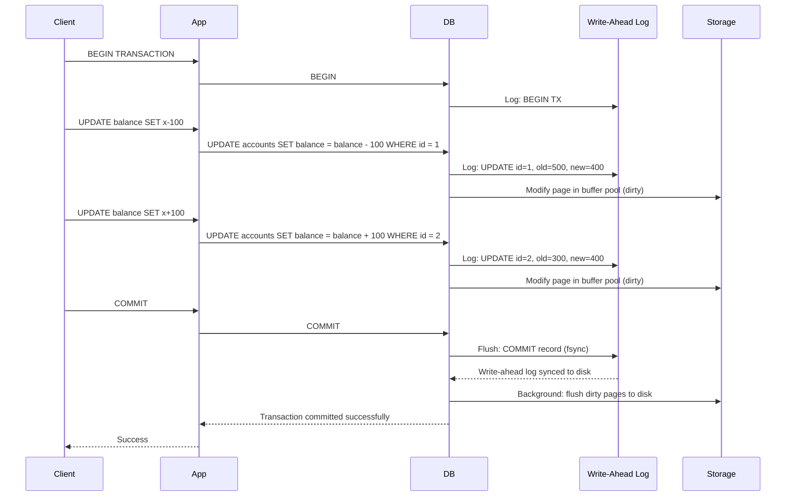
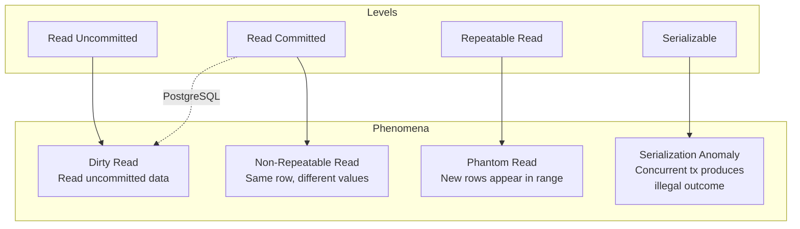
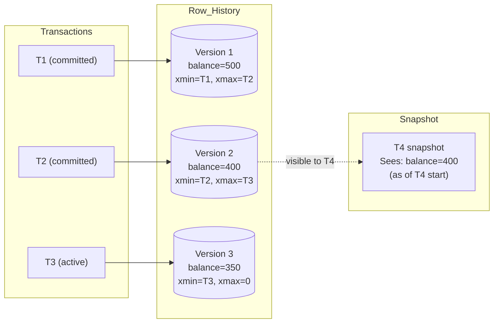
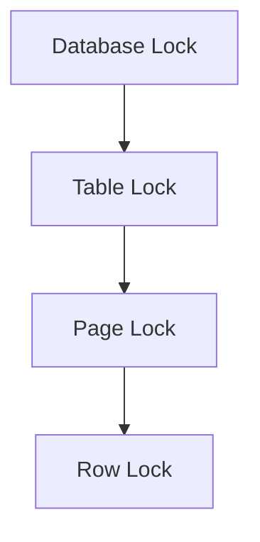
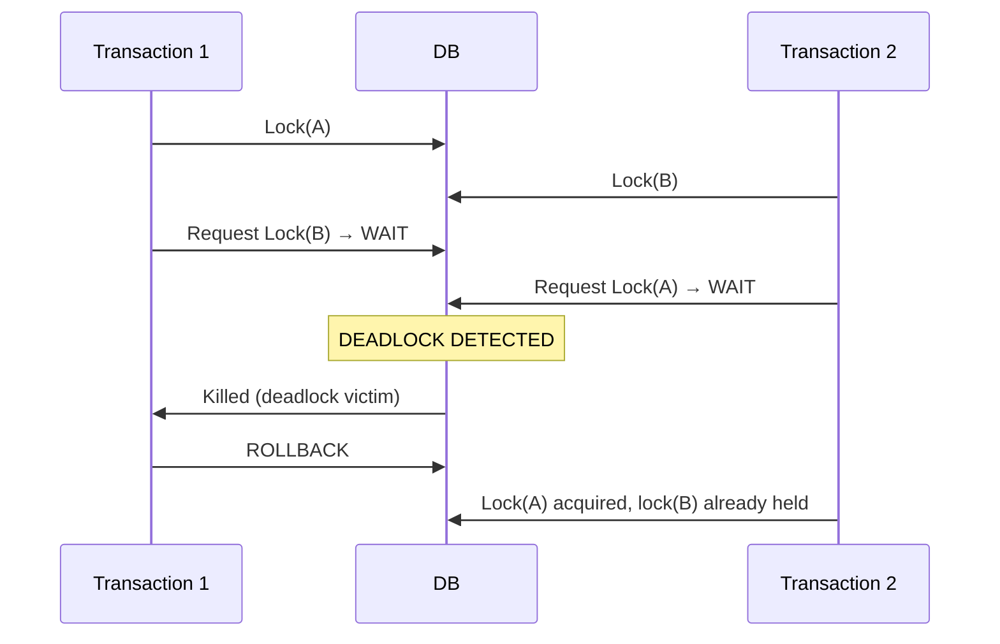
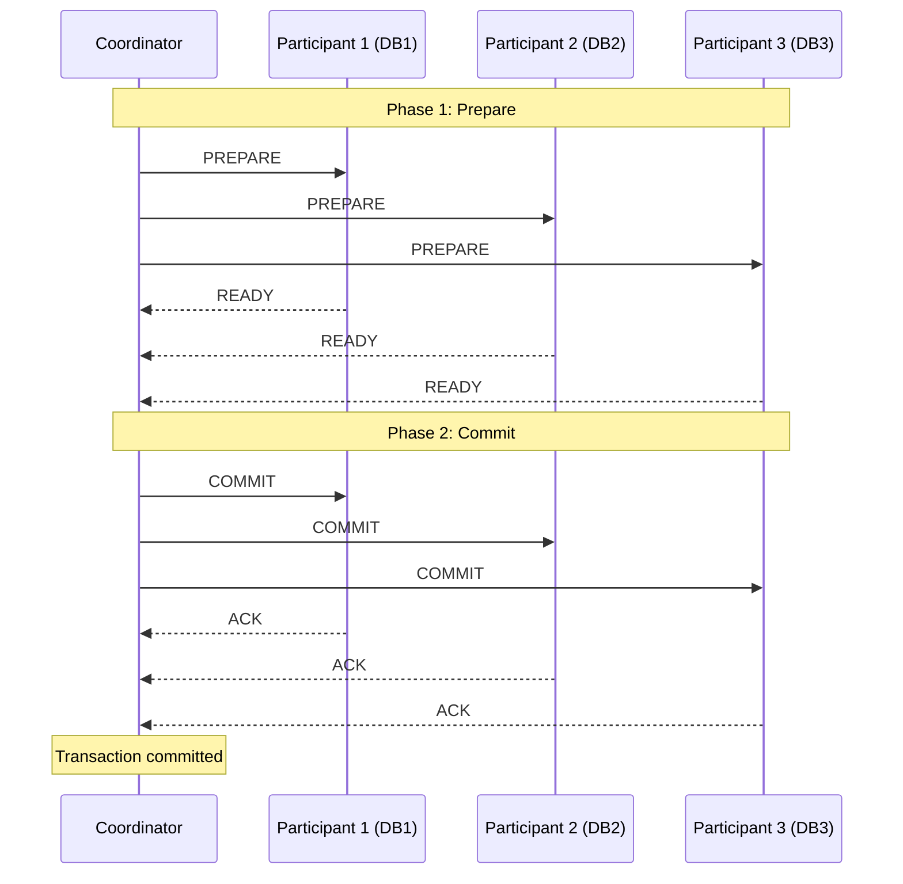
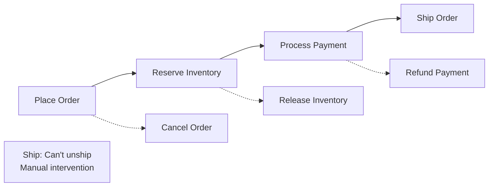

**Links**: [[Database Transaction Isolation Levels]] | [[Database Replication Strategies]] | [[Database Indexing Deep Dive]] | [[SQL Query Optimization]] | [[CRDTs]] | [[Event Sourcing Deep Dive]]


# Database Transactions

A transaction groups multiple operations into a single atomic unit that either succeeds completely or fails entirely.

## ACID Properties

| Property | Meaning |
|----------|---------|
| **Atomicity** | All or nothing — partial failure rolls back everything |
| **Consistency** | Data always satisfies all constraints |
| **Isolation** | Concurrent transactions don't interfere |
| **Durability** | Committed data survives crashes |

## Transaction Control

```sql
BEGIN;
  UPDATE accounts SET balance = balance - 100 WHERE id = 1;
  UPDATE accounts SET balance = balance + 100 WHERE id = 2;
COMMIT;
-- or ROLLBACK if error occurs
```

## Isolation Levels

| Level | Dirty Read | Non-Repeatable Read | Phantom Read |
|-------|-----------|---------------------|--------------|
| Read Uncommitted | Possible | Possible | Possible |
| Read Committed | Safe | Possible | Possible |
| Repeatable Read | Safe | Safe | Possible |
| Serializable | Safe | Safe | Safe |

---

## Transaction Flow



## Deep ACID Explanation

### Atomicity — All or Nothing

Real-world example: Bank transfer of $100 from Account A to Account B.

```sql
BEGIN;
  UPDATE accounts SET balance = balance - 100 WHERE id = 1;  -- Step 1
  -- Crash happens HERE
  UPDATE accounts SET balance = balance + 100 WHERE id = 2;  -- Step 2
COMMIT;
```

Without atomicity: $100 disappears from A but never arrives at B.
With atomicity: The database records both steps as a single unit. If the crash happens after Step 1, the recovery process rolls back Step 1.

**How it works**: The database maintains an **undo log** or **transaction log**. Before modifying data, it writes "before images" to the log. On rollback, it replays the undo log to restore original values.

### Consistency — Always Valid State

Consistency means every transaction leaves the database in a valid state:

- All constraints are satisfied (PK, FK, CHECK, UNIQUE)
- All triggers fire and complete
- Application-level invariants hold

Example: A `CHECK(balance >= 0)` constraint prevents transactions from creating negative balances.

| Constraint Type | How It's Enforced |
|----------------|-------------------|
| NOT NULL | Immediate check on write |
| UNIQUE | Index lookup before insert |
| FOREIGN KEY | Referential integrity check |
| CHECK | Expression evaluation |
| Application invariant | Application + DB triggers |

### Isolation — Concurrent Transactions Don't Interfere

Without proper isolation, concurrent transactions can interfere in several ways (see "Read Phenomena" below).

### Durability — Survives Crashes

Once a transaction commits, its changes persist even if:
- Power fails immediately after
- Operating system crashes
- Database process terminates

**Mechanisms**:
1. **Write-Ahead Logging (WAL)**: The commit record is fsynced to disk before acknowledging the commit
2. **Doublewrite buffer** (InnoDB): Prevents partial page writes
3. **Checksums**: Detect corrupted pages during recovery

## Isolation Levels — Deep Dive

### What Problem Each Level Prevents



| Isolation Level | Dirty Read | Non-Repeatable Read | Phantom Read | Serialization Anomaly |
|----------------|-----------|---------------------|--------------|----------------------|
| Read Uncommitted | Possible | Possible | Possible | Possible |
| Read Committed | Safe | Possible | Possible | Possible |
| Repeatable Read | Safe | Safe | Possible (not in PG/MySQL) | Possible |
| Serializable | Safe | Safe | Safe | Safe |

### Read Uncommitted

```sql
-- Transaction 1                    -- Transaction 2
SET TRANSACTION ISOLATION LEVEL READ UNCOMMITTED;
BEGIN;                              BEGIN;
UPDATE accounts SET balance = 0 WHERE id = 1;
                                    SELECT balance FROM accounts WHERE id = 1;
                                    -- Returns 0 (dirty read!)
ROLLBACK;  -- T1 aborts
                                    -- T2 now has stale/phantom data
```

**Risk**: DIRTY READ. T2 read a value that never existed (was rolled back).

### Read Committed

Default in PostgreSQL, SQL Server, Oracle.

```sql
-- Transaction 1                    -- Transaction 2
SET TRANSACTION ISOLATION LEVEL READ COMMITTED;
BEGIN;                              BEGIN;
SELECT balance FROM accounts WHERE id = 1;
-- Returns 500
                                    UPDATE accounts SET balance = 0 WHERE id = 1;
                                    COMMIT;
SELECT balance FROM accounts WHERE id = 1;
-- Returns 0 (non-repeatable read!)
COMMIT;
```

**Risk**: NON-REPEATABLE READ. Same row, same transaction, different values.

### Repeatable Read

Default in MySQL (InnoDB).

```sql
-- Transaction 1                    -- Transaction 2
SET TRANSACTION ISOLATION LEVEL REPEATABLE READ;
BEGIN;
SELECT * FROM orders WHERE total > 100;
-- Returns 5 rows
                                    INSERT INTO orders(total) VALUES (200);
                                    COMMIT;
SELECT * FROM orders WHERE total > 100;
-- Still returns 5 rows (phantom avoided via MVCC)
-- But if using FOR UPDATE, might see phantom
COMMIT;
```

**Risk**: PHANTOM READ (new rows appearing). MySQL's MVCC prevents phantoms at REPEATABLE READ for consistent reads, but lock-based reads can still see them.

### Serializable

```sql
SET TRANSACTION ISOLATION LEVEL SERIALIZABLE;
BEGIN;
SELECT COUNT(*) FROM accounts;  -- Takes predicate lock
-- ...
COMMIT;  -- May fail with serialization error if conflict detected
```

**Risk**: SERIALIZATION ANOMALY prevented, but at high performance cost. Transactions may abort and retry.

## Read Phenomena — Detailed Examples

### Dirty Read
Transaction T2 reads data written by uncommitted T1. If T1 aborts, T2 read invalid data.

### Non-Repeatable Read
T2 reads same row twice within the same transaction. Between reads, T1 modifies and commits the row.

### Phantom Read
T2 executes same range query twice. Between queries, T1 inserts or deletes rows within that range, changing the result set.

### Serialization Anomaly
A group of concurrent transactions runs successfully but produces an outcome impossible in any serial execution. Example: two transactions both read counter=0, both increment to 1, final result is 1 instead of 2.

## MVCC — Multi-Version Concurrency Control

### How MVCC Works

Instead of locking rows, MVCC keeps multiple versions of each row.



### Key Concepts

| Term | Meaning |
|------|---------|
| **xmin** | Transaction ID that created this row version |
| **xmax** | Transaction ID that deleted/updated this row version |
| **Snapshot** | The set of active transactions at a point in time |
| **Visibility** | A row version is visible if xmin committed and xmax not committed (or doesn't exist) |

### MVCC in PostgreSQL

```sql
-- Each row has hidden system columns:
-- xmin, xmax, ctid (physical location)

-- When SELECT runs:
-- 1. Take snapshot of active tx IDs
-- 2. For each row version, check visibility rules
-- 3. Return only visible versions

-- When UPDATE runs:
-- 1. Mark old version as deleted (set xmax)
-- 2. Insert new version with xmin = current tx
-- 3. VACUUM later reclaims dead tuples
```

### MVCC in MySQL (InnoDB)

Uses **undo log** instead of storing multiple versions in the main table:

```
Main table: latest version only
Undo log: previous versions (chained via rollback pointer)
```

### Benefits and Costs

| Aspect | Benefit | Cost |
|--------|---------|------|
| Reads | Never block on writes | May read stale versions |
| Writes | Never block on reads | More storage for old versions |
| Concurrency | High (readers and writers coexist) | VACUUM/cleanup overhead |
| Isolation | Snapshot isolation available | Transaction ID wraparound |

## Lock Types

### Granularity Hierarchy



### Row-Level Locks

```sql
-- InnoDB: row-level locks on the index
SELECT * FROM users WHERE id = 1 FOR UPDATE;  -- Exclusive row lock
SELECT * FROM users WHERE id = 1 FOR SHARE;   -- Shared row lock
```

### Intent Locks

Lock hierarchy prevents conflicts between different granularities:

| Lock Type | Symbol | Meaning |
|-----------|--------|---------|
| Intent Shared | IS | Table-level: "I might lock some rows with shared locks" |
| Intent Exclusive | IX | Table-level: "I might lock some rows with exclusive locks" |
| Shared + Intent Exclusive | SIX | Table has shared lock, some rows have exclusive |
| Shared | S | Table-level shared |
| Exclusive | X | Table-level exclusive |

**Lock Compatibility Matrix**:

| Requested →<br/>Held ↓ | IS | IX | S | SIX | X |
|-------------------|----|----|----|----|----|
| IS | ✓ | ✓ | ✓ | ✓ | ✗ |
| IX | ✓ | ✓ | ✗ | ✗ | ✗ |
| S | ✓ | ✗ | ✓ | ✗ | ✗ |
| SIX | ✓ | ✗ | ✗ | ✗ | ✗ |
| X | ✗ | ✗ | ✗ | ✗ | ✗ |

### Page-Level Locks

Used by some engines (SQL Server) when row locks become too numerous:

- Less memory overhead than row locks
- More concurrency than table locks
- Escalation: Row → Page → Table (when >5000 row locks on one table)

## Deadlock Detection and Prevention

### Deadlock Example



### Detection

- **Wait-for graph**: Database maintains a graph of "who is waiting for whom"
- **Cycle detection**: Periodically checks for cycles (typically every 1 second)
- **Victim selection**: Chooses the transaction with the lowest cost to rollback

### Prevention Strategies

| Strategy | Description |
|----------|-------------|
| **Fixed lock order** | Always access tables/resources in the same order |
| **Lock timeouts** | `SET lock_timeout = '5s'` (PostgreSQL) |
| **Short transactions** | Minimize time holding locks |
| **Indexes** | Reduce lock ranges (fewer rows locked) |
| **Avoid user input** | Don't wait for user during a transaction |

```sql
-- Good: consistent lock order
BEGIN;
  LOCK TABLE accounts IN EXCLUSIVE MODE;
  UPDATE accounts SET balance = balance - 100 WHERE id = 1;
  UPDATE accounts SET balance = balance + 100 WHERE id = 2;
COMMIT;

-- Bad: inconsistent order → deadlock risk
-- T1: lock(id=1) → lock(id=2)
-- T2: lock(id=2) → lock(id=1)  ← DANGER
```

## 2PL (Two-Phase Locking) vs MVCC

### Two-Phase Locking

```
Phase 1: Expanding (acquire locks, no release)
Phase 2: Shrinking  (release locks, no acquire)

-- T1:
LOCK A; LOCK B; -- Expanding
...work...
UNLOCK A; UNLOCK B; -- Shrinking
```

| 2PL | MVCC |
|-----|------|
| Pessimistic: locks block readers/writers | Optimistic: versions allow concurrent access |
| Prone to deadlocks | Fewer deadlocks (readers never block writers) |
| Simple to implement | Complex (version storage, cleanup) |
| Used in: SQL Server (locking mode) | Used in: PostgreSQL, MySQL/InnoDB, Oracle |
| Serializable by default | Snapshot isolation by default |

## Write-Ahead Logging (WAL)

### How WAL Works

```
1. Transaction modifies a page
2. BEFORE changing the page in memory, log the change to WAL
3. WAL record is flushed to disk (fsync)
4. Page is modified in buffer pool (may stay dirty)
5. On COMMIT, log COMMIT record to WAL (fsync)
6. Later, checkpoint flushes dirty pages to data files

CRASH RECOVERY:
1. Scan WAL from last checkpoint
2. REDO: Reapply committed changes that didn't make it to data files
3. UNDO: Roll back uncommitted changes
```

### WAL Benefits

| Benefit | Explanation |
|---------|-------------|
| **Durability** | COMMIT is fast (just log fsync, not full data flush) |
| **Performance** | Sequential writes (WAL) vs random writes (data files) |
| **Recovery** | Crash recovery replays WAL from last checkpoint |
| **Point-in-Time** | WAL archives enable PITR (restore to any moment) |

## Savepoints and Nested Transactions

```sql
BEGIN;
  INSERT INTO log(action) VALUES('start');

  SAVEPOINT sp1;
  UPDATE accounts SET balance = balance - 100 WHERE id = 1;
  -- Oops, wrong account
  ROLLBACK TO SAVEPOINT sp1;
  -- Transaction continues, first update is undone

  UPDATE accounts SET balance = balance - 100 WHERE id = 2;
  UPDATE accounts SET balance = balance + 100 WHERE id = 3;

  RELEASE SAVEPOINT sp1;  -- Release the savepoint
COMMIT;
```

| Feature | Savepoint | Nested Transaction |
|---------|-----------|-------------------|
| Rollback scope | Partial rollback within transaction | Entire inner transaction |
| Support | PostgreSQL, MySQL, SQL Server | SQL Server, Oracle |
| Use case | Error recovery within complex transactions | Modular transaction logic |
| Performance | Low overhead | Higher overhead |

## Distributed Transactions

### Two-Phase Commit (2PC)



| Phase | Action | Issues |
|-------|--------|--------|
| **Prepare** | Coordinator asks all participants to prepare | Any participant can abort |
| **Commit** | If all ready, coordinator sends commit | Coordinator crash → participants blocked |

**Problems with 2PC**:
- **Blocking**: If coordinator crashes after prepare, participants hold locks until recovery
- **Performance**: Multiple network round-trips
- **Availability**: All participants must be available

### Three-Phase Commit (3PC)

Adds a "pre-commit" phase to reduce blocking:

```
Phase 1: CanCommit? (ask if everyone can)
Phase 2: PreCommit (prepare to commit)
Phase 3: DoCommit (actually commit)
```

Less blocking than 2PC but rarely used in practice (implemented in non-mainstream databases).

### Saga Pattern

Breaks a distributed transaction into a sequence of local transactions with compensating actions:



| Pattern | Coordination | Isolation | Use Case |
|---------|-------------|-----------|----------|
| **2PC** | Central coordinator | Full ACID across nodes | Small, reliable systems |
| **Saga** | Choreography/orchestrator | Eventual consistency | Microservices, long-running workflows |
| **Saga + Orchestrator** | Central saga service | Compensating transactions | E-commerce, travel booking |

## When to Use Short vs Long Transactions

### Short Transactions (Recommended Default)

```sql
-- Good: short and focused
BEGIN;
  UPDATE inventory SET quantity = quantity - 1 WHERE product_id = 1;
  INSERT INTO orders(product_id, quantity) VALUES(1, 1);
COMMIT;
```

| Advantage | Why |
|-----------|-----|
| Fewer locks held | Less contention |
| Lower deadlock risk | Shorter lock duration |
| Better concurrency | More transactions per second |
| Smaller MVCC overhead | Fewer old row versions |

### Long Transactions (When Necessary)

```sql
-- Example: batch processing with periodic checkpoints
BEGIN;
  UPDATE large_table SET status = 'processing' WHERE batch_id = 123;

  SAVEPOINT batch_sp;
  -- Process 1000 rows...

  -- Periodically release to avoid WAL bloat
  RELEASE SAVEPOINT batch_sp;

COMMIT;
```

| Use Case | Consideration |
|----------|--------------|
| ETL/batch jobs | Use batches of 1000-10000 rows |
| Reporting queries | Use READ ONLY, transaction-level snapshot |
| Schema migrations | Watch out for lock escalation; use online DDL |
| Multi-step workflows | Consider Saga pattern or compensating transactions |

**See also**: [[PostgreSQL Features]], [[DB Relationship Patterns]], [[SQL Query Optimization]], [[SQLite Reference]]