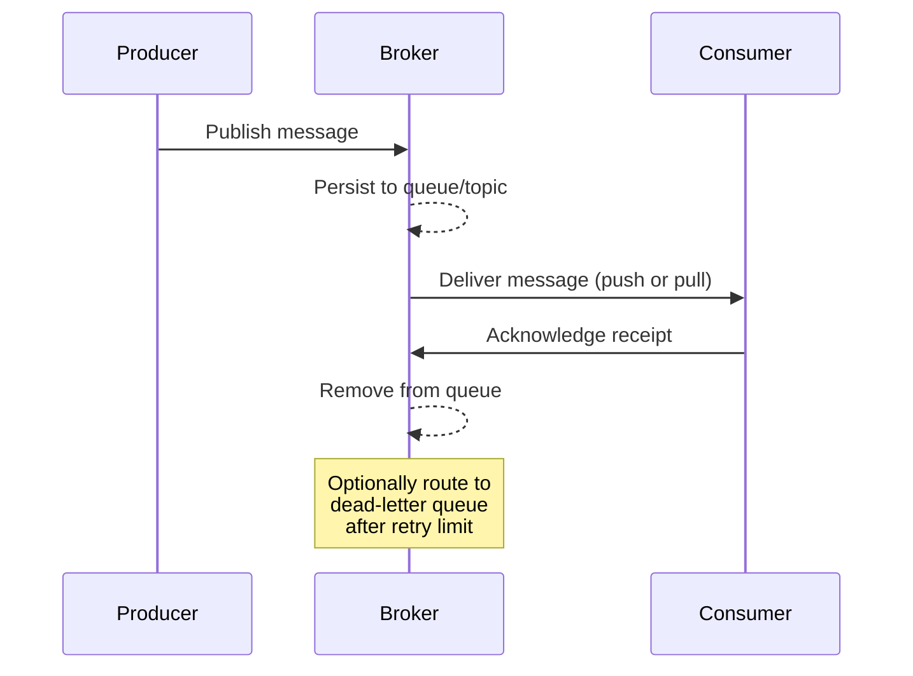

**Links**: [[Apache Kafka Deep Dive]] | [[Stream Processing]] | [[Event Sourcing]] | [[Database Transactions]] | [[Caching Strategies]] | [[Event Sourcing Deep Dive]]

# Message Queues

Message queues enable asynchronous communication between services by buffering and delivering messages.

## Queue vs Pub/Sub

| Pattern | Behavior | Examples |
|---------|----------|---------|
| Queue | One consumer per message (competing consumers) | RabbitMQ, SQS |
| Pub/Sub | Every subscriber gets each message | Kafka, Redis Pub/Sub |

## Broker Comparison

| Feature | RabbitMQ | Apache Kafka | Amazon SQS | Redis Streams |
|---------|----------|-------------|------------|---------------|
| Model | Queue + Pub/Sub | Distributed log | Queue | Pub/Sub + Queue |
| Ordering | Per queue | Per partition | Best-effort (FIFO queue available) | Per stream |
| Persistence | Optional (on/disk) | Always on disk | Configurable | Optional (RDB/AOF) |
| Throughput | Moderate (~10k msg/s) | Very high (~1M msg/s) | High (auto-scaling) | High (~100k msg/s) |
| Delivery | At-most-once, at-least-once | At-least-once, exactly-once (with idempotence) | At-least-once (standard), exactly-once (FIFO) | At-least-once |
| Retention | Acknowledged messages deleted | Configurable time or size limit | Up to 14 days | Configurable maxlen |
| Typical use | Task queues, RPC | Event streaming, log aggregation | Decoupled microservices on AWS | Real-time chat, rate limiting |

## Delivery Guarantees

| Guarantee | Meaning | Trade-off |
|-----------|---------|-----------|
| **At-most-once** | Message may be lost but never redelivered | Lowest latency, no retries |
| **At-least-once** | Message is always delivered but may be duplicated | Requires idempotent consumers |
| **Exactly-once** | Message delivered precisely once (no loss, no duplicate) | Highest complexity, throughput cost |

Exactly-once delivery typically requires a combination of idempotent producers, transactional brokers, and idempotent consumers with deduplication IDs.

## Message Ordering

- **Single queue/partition**: Messages are ordered within one partition/queue. Kafka guarantees order per partition; RabbitMQ guarantees order per queue.
- **Multiple partitions**: Order is NOT preserved across partitions. Use a consistent routing key (e.g., `order_id`) to keep related messages in the same partition.
- **Global ordering**: Achievable with a single partition, but limits throughput. Most systems accept per-key ordering as a practical compromise.

## Dead-Letter Queues (DLQ)

A DLQ stores messages that a consumer repeatedly fails to process. Typical setup:

1. A message is delivered to the main queue.
2. The consumer fails to process it (exception, timeout).
3. After N retries (e.g., 3), the broker moves the message to a DLQ.
4. A separate process monitors the DLQ, logs failures, alerts operators, or replays messages after a fix.

DLQ messages include metadata such as original queue, failure reason, and retry count. This prevents a single poison message from blocking the entire queue.

## Kafka Concepts

| Term | Meaning |
|------|---------|
| Topic | Named message stream |
| Partition | Sharded log within a topic |
| Producer | Publishes messages to topics |
| Consumer | Reads messages from topics |
| Broker | Kafka server node |
| Offset | Position in a partition log |

## Use Cases

- Decoupling microservices
- Event sourcing and CQRS
- Stream processing (real-time analytics)
- Async task offloading (email, notifications)
- Log aggregation

**Links**: [[Apache Kafka Deep Dive]] | [[Event-Driven Architecture]] | [[Event Sourcing]] | [[Stream Processing]] | [[Microservices Architecture]] | [[Concurrency Models]] | [[Code Architecture Patterns]] | [[CI CD Pipelines]]

**See also**: [[Saga and Distributed Transactions]], [[Database Transactions]], [[Apache Flink]]
