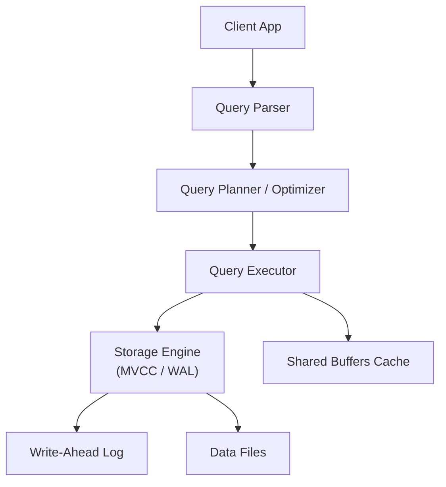

**Links**: [[PostgreSQL Extensions]] | [[PostgreSQL Performance Tuning]] | [[Database Engines Compared]] | [[SQL Query Optimization]] | [[Database Indexing Deep Dive]] | [[SQL JOIN Operations]]

# PostgreSQL Features

PostgreSQL is the world's most advanced open-source relational database. Its feature set rivals commercial databases.

## Architecture



MVCC (Multi-Version Concurrency Control) allows concurrent reads and writes without blocking.

## Advanced Data Types

| Type | Description | Example |
|------|-------------|---------|
| JSONB | Binary JSON with indexing | `{"name": "Alice", "age": 30}` |
| Array | Multi-dimensional arrays | `{1, 2, 3}` |
| hstore | Key-value store within a column | `"key=>value"` |
| UUID | Universally unique identifiers | `a0eebc99-9c0b-4ef8-bb6d-6bb9bd380a11` |
| Geometric | Points, lines, polygons | `point(10, 20)` |
| Network | INET, CIDR for IP addresses | `192.168.1.0/24` |
| Range | Date, numeric ranges with overlap | `[2026-01-01, 2026-06-30)` |
| Full-text | tsvector/tsquery for search | `to_tsvector('english', content)` |

## Indexing

| Index Type | Use Case | Example |
|------------|----------|---------|
| B-tree | Default, equality + range | `CREATE INDEX ON users (email);` |
| Hash | Equality lookups | `CREATE INDEX USING HASH ON sessions (sid);` |
| GiST | Full-text, geometry | `CREATE INDEX ON places USING GIST (location);` |
| GIN | JSONB, arrays, full-text | `CREATE INDEX ON docs USING GIN (data jsonb_path_ops);` |
| BRIN | Large sorted tables | `CREATE INDEX USING BRIN ON logs (created_at);` |
| SP-GiST | Partitioned search trees | `CREATE INDEX USING SPGIST ON points (location);` |

## Extensions

| Extension | Purpose | Command |
|-----------|---------|---------|
| pgvector | Vector similarity search (AI embeddings) | `CREATE EXTENSION vector;` |
| PostGIS | Geospatial data and queries | `CREATE EXTENSION postgis;` |
| pg_stat_statements | Query performance tracking | `CREATE EXTENSION pg_stat_statements;` |
| uuid-ossp | UUID generation | `CREATE EXTENSION "uuid-ossp";` |
| pgcrypto | Cryptographic functions | `CREATE EXTENSION pgcrypto;` |
| pg_partman | Automated partitioning | `CREATE EXTENSION pg_partman;` |

## JSONB Operations

```sql
-- Create and query JSONB
CREATE TABLE events (id SERIAL, data JSONB);
INSERT INTO events (data) VALUES ('{"user": "alice", "action": "login", "ip": "10.0.0.1"}');

-- Index and query efficiently
CREATE INDEX ON events USING GIN (data jsonb_path_ops);
SELECT * FROM events WHERE data @> '{"action": "login"}';
SELECT data->>'user' AS username FROM events;
```

## Performance Tuning

| Setting | Default | Production | Purpose |
|---------|---------|------------|---------|
| shared_buffers | 128MB | 25% of RAM | Memory for data caching |
| effective_cache_size | 4GB | 75% of RAM | Planner's cache estimate |
| work_mem | 4MB | 16-64MB | Per-operation sort memory |
| maintenance_work_mem | 64MB | 1GB | VACUUM, index creation |
| max_connections | 100 | 20-200 | Connection pool limit |

```sql
-- Analyze query performance
EXPLAIN ANALYZE SELECT * FROM users WHERE email = 'alice@example.com';
```

## VACUUM

PostgreSQL's MVCC creates dead tuples. VACUUM reclaims storage:

```sql
-- Manual vacuum
VACUUM ANALYZE;
VACUUM FULL;  -- reclaims space, but locks table

-- Auto-vacuum (configured in postgresql.conf)
-- Autovacuum runs automatically based on dead tuple thresholds
```

**See also**: [[Database Engines Compared]], [[SQL JOIN Operations]], [[SQL Query Optimization]], [[Data Normalization Rules]], [[DB Relationship Patterns]], [[SQLite Reference]]
