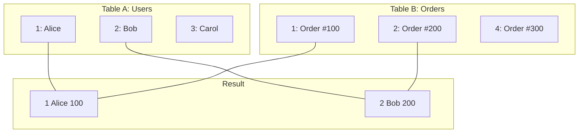
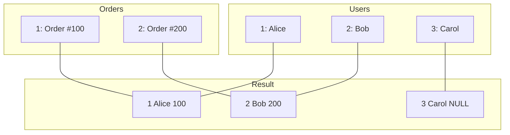
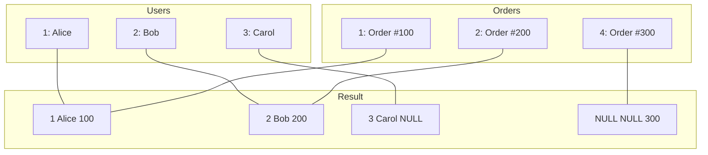
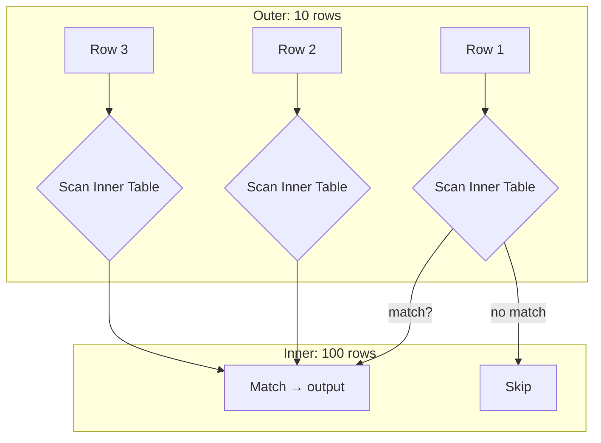
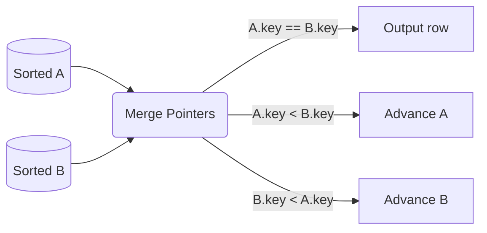

**Links**: [[SQL Query Optimization]] | [[Data Normalization Rules]] | [[DB Relationship Patterns]] | [[Database Indexing Deep Dive]] | [[PostgreSQL Features]] | [[Database Views]]


# SQL JOIN Operations

JOINs combine rows from two or more tables based on a related column. They are the backbone of relational database queries.

## Join Types

```sql
-- INNER JOIN: Only matching rows
SELECT * FROM users u
INNER JOIN orders o ON u.id = o.user_id;

-- LEFT JOIN: All users, orders where they exist
SELECT * FROM users u
LEFT JOIN orders o ON u.id = o.user_id;

-- RIGHT JOIN: All orders, users where they exist
SELECT * FROM users u
RIGHT JOIN orders o ON u.id = o.user_id;

-- FULL OUTER JOIN: All rows from both
SELECT * FROM users u
FULL OUTER JOIN orders o ON u.id = o.user_id;

-- CROSS JOIN: Cartesian product
SELECT * FROM users CROSS JOIN products;
```

## Self-Join

A table joined to itself, useful for hierarchies.

```sql
SELECT e.name AS employee, m.name AS manager
FROM employees e
LEFT JOIN employees m ON e.manager_id = m.id;
```

---

## Mermaid Venn Diagrams for Each JOIN Type

### INNER JOIN


### LEFT JOIN (all from A, matching from B)



### FULL OUTER JOIN (all from both)



## JOIN Algorithms — Under the Hood

### Nested Loop Join

The simplest algorithm — for each row in the outer table, scan the inner table.



```sql
-- Pseudo-code:
for each row r in outer_table:        -- 10 iterations
    for each row s in inner_table:    -- 100 iterations each
        if r.key == s.key:
            output(r, s)
-- Total: 10 × 100 = 1000 comparisons
```

**Best for**: Small results (~100-1000 rows), highly selective queries

### Hash Join

Builds a hash table on the smaller table, then probes with the larger table.

```mermaid
flowchart LR
    subgraph Build_Phase
        B_Small[Small Table<br/>10,000 rows] --> BH[Build Hash Table<br/>key → row]
    end
    subgraph Probe_Phase
        P_Large[Large Table<br/>1,000,000 rows] --> PH[Probe Hash: O(1)<br/>per row]
        PH --> M[Matching rows<br/>output]
    end
    BH -.-> PH
```

```sql
-- Pseudo-code:
-- Phase 1: Build hash table from smaller table
hash_table = {}
for each row s in smaller_table:
    hash_table[s.key] = s

-- Phase 2: Probe with larger table
for each row l in larger_table:
    if l.key in hash_table:
        output(l, hash_table[l.key])
-- Total: 10,000 (build) + 1,000,000 (probe) = 1,010,000 operations
```

**Best for**: Large tables, no useful indexes, equi-joins

### Merge Join

Both tables sorted on the join key, then merged in one pass.



```sql
-- Pseudo-code:
sort A by key, sort B by key
i = 0, j = 0
while i < len(A) and j < len(B):
    if A[i].key == B[j].key:
        output(A[i], B[j])
        j += 1  -- or both if needed
    elif A[i].key < B[j].key:
        i += 1
    else:
        j += 1
-- Total: O(n log n) sort + O(n) merge
```

**Best for**: Large result sets, sorted inputs, range joins

### Performance Comparison

| Algorithm | Time Complexity | Memory | Use Case |
|-----------|----------------|--------|----------|
| **Nested Loop** | O(outer × inner) | O(1) | Small result sets, indexed inner table |
| **Hash Join** | O(build + probe) | O(smaller table) | Large tables, equi-joins, no indexes |
| **Merge Join** | O(n log n + merge) | O(n) or O(1) | Large sorted tables, range joins |
| **Indexed Nested Loop** | O(outer × log inner) | O(1) | Indexed inner table, selective outer |

## Query Plan Analysis for JOINs

### Reading Execution Plans

```sql
-- PostgreSQL: EXPLAIN ANALYZE
EXPLAIN (ANALYZE, BUFFERS) 
SELECT u.name, o.total
FROM users u
JOIN orders o ON u.id = o.user_id
WHERE u.created_at > '2024-01-01';
```

### Sample Plan

```
Nested Loop  (cost=1000.42..5000.15 rows=1500 width=36)
  (actual time=0.05..45.32 rows=1420 loops=1)
  Buffers: shared hit=320 read=42
  ->  Seq Scan on users u  (cost=0.00..2000.00 rows=500 width=22)
        (actual time=0.01..8.50 rows=480 loops=1)
        Filter: (created_at > '2024-01-01')
        Rows Removed by Filter: 9520
  ->  Index Scan using idx_orders_user_id on orders o
        (cost=0.29..6.00 rows=3 width=18)
        (actual time=0.03..0.08 rows=3 loops=480)
        Index Cond: (user_id = u.id)
Planning Time: 0.25 ms
Execution Time: 45.67 ms
```

### What to Look For

| Plan Element | Good | Bad |
|-------------|------|-----|
| **Scan type** | Index Scan, Index Only Scan | Seq Scan (on large tables) |
| **Join type** | Hash Join, Merge Join | Nested Loop on large inputs |
| **Rows estimate** | Close to actual | Off by 10x+ (stale stats) |
| **Loops** | 1 (nested loops) | High (inner table scanned many times) |
| **Buffers** | shared hit (cached) | shared read (disk I/O) |

## JOIN vs Subquery Performance

```sql
-- INNER JOIN (usually faster)
SELECT u.name, o.total
FROM users u
JOIN orders o ON u.id = o.user_id;

-- Equivalent subquery (often same plan)
SELECT u.name,
  (SELECT o.total FROM orders o WHERE o.user_id = u.id)
FROM users u;
```

| Pattern | Performance | Notes |
|---------|------------|-------|
| **INNER JOIN** | Best | Optimizer finds best join order |
| **Correlated subquery** | Slower | Executes once per outer row |
| **Subquery in FROM** | Same as JOIN | Optimizer flattens to JOIN |
| **IN (subquery)** | Often slower | Semi-join optimization available |
| **EXISTS** | Good | Short-circuits on first match |

### Optimizer Flattening

Modern optimizers flatten many subqueries into JOINs:

```sql
-- PostgreSQL flattens these to the same plan:
SELECT * FROM users WHERE id IN (SELECT user_id FROM orders);
SELECT DISTINCT u.* FROM users u JOIN orders o ON u.id = o.user_id;
```

## Lateral JOINs (CROSS APPLY)

Allows a subquery to reference columns from preceding FROM items:

```sql
-- PostgreSQL (LATERAL)
SELECT u.name, recent_orders.*
FROM users u
LEFT JOIN LATERAL (
  SELECT total, created_at
  FROM orders
  WHERE user_id = u.id
  ORDER BY created_at DESC
  LIMIT 3
) recent_orders ON true;

-- SQL Server (CROSS APPLY)
SELECT u.name, recent_orders.*
FROM users u
CROSS APPLY (
  SELECT TOP 3 total, created_at
  FROM orders
  WHERE user_id = u.id
  ORDER BY created_at DESC
) recent_orders;
```

### Use Cases

| Pattern | LATERAL Solution |
|---------|-----------------|
| **Top-N per group** | `LATERAL ... ORDER BY ... LIMIT N` |
| **Complex derived columns** | Subquery referencing outer columns |
| **Function invocation** | `LATERAL generate_series(...)` |
| **Correlated aggregation** | Omit GROUP BY by using LATERAL |

### Without LATERAL (The Painful Way)

```sql
-- Using window functions (works but more complex)
SELECT DISTINCT u.id, u.name,
  FIRST_VALUE(o.total) OVER (PARTITION BY u.id ORDER BY o.created_at DESC) as last_total
FROM users u
LEFT JOIN orders o ON u.id = o.user_id;

-- Using LATERAL (cleaner)
SELECT u.id, u.name, lo.*
FROM users u
LEFT JOIN LATERAL (
  SELECT total, created_at
  FROM orders
  WHERE user_id = u.id
  ORDER BY created_at DESC
  LIMIT 3
) lo ON true;
```

## Self-Join Use Cases

### 1. Employee Hierarchy (Org Chart)

```sql
SELECT e.name AS employee,
       m.name AS manager,
       d.name AS department
FROM employees e
LEFT JOIN employees m ON e.manager_id = m.id
JOIN departments d ON e.dept_id = d.id
ORDER BY d.name, e.name;
```

### 2. Finding Duplicates

```sql
SELECT a.id, a.email, b.id AS duplicate_id
FROM users a
JOIN users b ON a.email = b.email
  AND a.id < b.id;
```

### 3. Comparing Consecutive Rows

```sql
-- Price changes over time
SELECT a.id,
       a.price AS current_price,
       b.price AS previous_price,
       (a.price - b.price) AS change
FROM product_prices a
LEFT JOIN product_prices b
  ON a.product_id = b.product_id
  AND a.effective_date = b.effective_date + INTERVAL '1 day';
```

### 4. Graph-like Relationships

```sql
-- Followers
SELECT f1.follower_id, f2.followee_id
FROM follows f1
JOIN follows f2 ON f1.followee_id = f2.follower_id;  -- Mutual follows
```

## JOIN with Aggregation

```sql
-- Incorrect: aggregation on joined table
SELECT u.name, COUNT(o.id) AS order_count
FROM users u
LEFT JOIN orders o ON u.id = o.user_id
GROUP BY u.id, u.name;  -- Must GROUP BY all non-aggregated SELECT columns

-- Correct for complex aggregations: join to a subquery
SELECT u.name, oc.order_count
FROM users u
LEFT JOIN (
  SELECT user_id, COUNT(*) AS order_count,
         SUM(total) AS total_spent
  FROM orders
  GROUP BY user_id
) oc ON u.id = oc.user_id;
```

### Performance Tips for Aggregation JOINs

| Pattern | Performance | Readability |
|---------|------------|-------------|
| **GROUP BY on join** | Fair (must scan all joined rows) | Simple |
| **Subquery aggregation + JOIN** | Good (aggregate first, then join) | Moderate |
| **CTE + JOIN** | Good (same as subquery) | Best |
| **Window function** | Best (single scan) | Complex |

```sql
-- Using CTE (best readability)
WITH user_orders AS (
  SELECT user_id, COUNT(*) AS order_count
  FROM orders
  GROUP BY user_id
)
SELECT u.name, COALESCE(uo.order_count, 0) AS order_count
FROM users u
LEFT JOIN user_orders uo ON u.id = uo.user_id;
```

## Anti-Join and Semi-Join Patterns

### Semi-Join: Rows in A that have a match in B

```sql
-- Pattern: EXISTS (semi-join)
SELECT u.*
FROM users u
WHERE EXISTS (
  SELECT 1 FROM orders o WHERE o.user_id = u.id
);

-- Equivalent: IN (also semi-join)
SELECT u.*
FROM users u
WHERE u.id IN (SELECT user_id FROM orders);

-- Equivalent: DISTINCT JOIN
SELECT DISTINCT u.*
FROM users u
JOIN orders o ON u.id = o.user_id;
```

### Anti-Join: Rows in A with NO match in B

```sql
-- Pattern 1: NOT EXISTS (best)
SELECT u.*
FROM users u
WHERE NOT EXISTS (
  SELECT 1 FROM orders o WHERE o.user_id = u.id
);

-- Pattern 2: LEFT JOIN WHERE NULL (also good)
SELECT u.*
FROM users u
LEFT JOIN orders o ON u.id = o.user_id
WHERE o.id IS NULL;

-- Pattern 3: NOT IN (BE CAREFUL with NULLs!)
SELECT u.*
FROM users u
WHERE u.id NOT IN (SELECT user_id FROM orders);
-- ⚠ If orders.user_id contains NULL, this returns empty!
```

### NOT IN vs NOT EXISTS vs LEFT JOIN WHERE NULL

| Pattern | NULL-Safe | Performance | Use When |
|---------|-----------|------------|----------|
| **NOT EXISTS** | Yes | Best (short-circuits) | Default choice |
| **LEFT JOIN WHERE NULL** | Yes | Good | Need columns from right table |
| **NOT IN** | **No** (NULL bug) | Good | Only when right column is NOT NULL |
| **NOT IN with NOT NULL** | Yes (forced) | Good | `WHERE col NOT IN (SELECT col FROM t WHERE col IS NOT NULL)` |

```sql
-- Best practice for anti-join
SELECT u.*
FROM users u
WHERE NOT EXISTS (
  SELECT 1
  FROM orders o
  WHERE o.user_id = u.id
    AND o.created_at > '2024-01-01'
);
```

## Recursive CTEs

Traverses hierarchical or tree-structured data:

```sql
WITH RECURSIVE org_tree AS (
  -- Anchor: top-level manager(s)
  SELECT id, name, manager_id, 1 AS level,
         name::TEXT AS path
  FROM employees
  WHERE manager_id IS NULL

  UNION ALL

  -- Recursive: direct reports
  SELECT e.id, e.name, e.manager_id, ot.level + 1,
         ot.path || ' → ' || e.name
  FROM employees e
  JOIN org_tree ot ON e.manager_id = ot.id
)
SELECT * FROM org_tree
ORDER BY path;
```

### Recursive CTE Structure

```
WITH RECURSIVE cte_name AS (
    ┌─────────────────────────────┐
    │ Anchor Member (non-recursive)│
    │ SELECT ... WHERE base_condition
    └──────────┬──────────────────┘
               │
    ┌──────────▼──────────────────┐
    │ UNION ALL                    │
    └──────────┬──────────────────┘
               │
    ┌──────────▼──────────────────┐
    │ Recursive Member            │
    │ SELECT ... FROM cte_name    │
    │ JOIN original_table         │
    └──────────┬──────────────────┘
               │
               ▼
    Continues until no new rows
)
SELECT * FROM cte_name;
```

### Use Cases

| Use Case | Example Query |
|----------|--------------|
| **Org chart** | Employee → manager → director |
| **Bill of materials** | Component → sub-component → part |
| **Tree navigation** | Category → sub-category → leaf |
| **Graph traversal** | Friend → friend's friend → ... |
| **Date range generation** | Generate all dates between two points |

### Generate Date Series (Without generate_series)

```sql
WITH RECURSIVE dates AS (
  SELECT '2024-01-01'::DATE AS dt
  UNION ALL
  SELECT dt + 1 FROM dates
  WHERE dt < '2024-01-31'
)
SELECT dt FROM dates;
```

### Recursive CTE Performance

| Factor | Impact | Mitigation |
|--------|--------|------------|
| **Depth** | Linear: O(depth × branching) | Limit with `MAXRECURSION` |
| **Branching factor** | Exponential worst-case | Prune with WHERE in recursive member |
| **Cycle detection** | Infinite loop risk | Track visited nodes, use LIMIT |
| **Index on join column** | Critical | Index the recursive join column (e.g., manager_id) |

**See also**: [[DB Relationship Patterns]], [[SQL Query Optimization]], [[Database Engines Compared]], [[PostgreSQL Features]]
