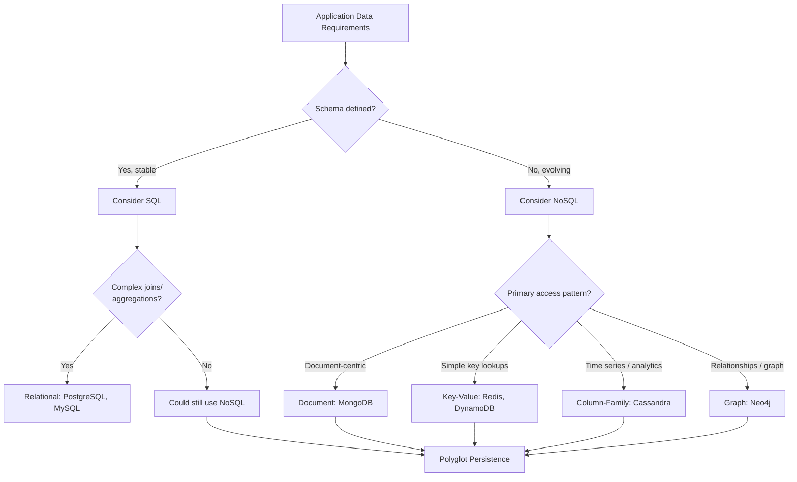
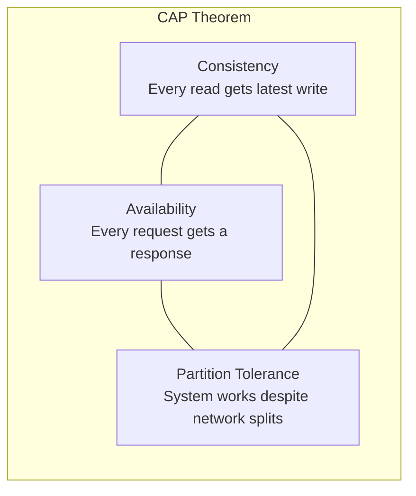

**Links**: [[Database Engines Compared]] | [[MongoDB]] | [[Cassandra]] | [[PostgreSQL Features]] | [[Graph Databases]] | [[Time Series Databases]]


# SQL vs NoSQL Databases

The choice between SQL and NoSQL depends on data structure, consistency needs, scale, and query patterns. Modern systems increasingly adopt **polyglot persistence** — using multiple database types within the same application.

## ACID vs BASE

| Property | ACID (SQL) | BASE (NoSQL) |
|----------|------------|---------------|
| **Atomicity** | All-or-nothing transactions | Basically Available — system stays up |
| **Consistency** | Data always valid after transaction | Soft state — data may change over time |
| **Isolation** | Concurrent transactions don't interfere | Eventual consistency — data converges |
| **Durability** | Committed data survives failures | Durability trade-offs for performance |



## Relational Database Types (SQL)

| Database | License | Strengths | Best For |
|----------|---------|-----------|----------|
| **PostgreSQL** | Open source | Extensibility, JSON support, GIS (PostGIS), MVCC | Complex OLTP, geospatial, mixed workloads |
| **MySQL** | Open source (dual) | Read-heavy workloads, replication, ecosystem (LAMP) | Web apps, CMS (WordPress), e-commerce |
| **SQLite** | Public domain | Embedded, zero-config, serverless | Mobile apps, local storage, prototyping |
| **Microsoft SQL Server** | Proprietary | .NET integration, BI tools, columnstore indexes | Enterprise Windows ecosystem |
| **Oracle DB** | Proprietary | Advanced analytics, RAC clustering, mature tooling | Large enterprises, financial systems |

## NoSQL Categories

| Category | Examples | Data Model | Strengths | Weaknesses |
|----------|----------|------------|-----------|------------|
| **Document** | MongoDB, Couchbase, Firestore | JSON/BSON documents | Flexible schema, intuitive for developers | Complex joins require embedding or app logic |
| **Key-Value** | Redis, DynamoDB, Riak | Opaque key → value blob | Extremely fast, simple scaling | No query beyond key lookup |
| **Wide-Column** | Cassandra, HBase, Scylla | Row key + column families | High write throughput, time-series | Eventual consistency, steep learning curve |
| **Graph** | Neo4j, ArgoDB, JanusGraph | Nodes + edges with properties | Relationship-heavy queries (social, fraud) | Sharding is hard, not for simple CRUD |

## Consistency Models

| Model | Guarantee | Latency | Example |
|-------|-----------|---------|---------|
| **Strong** | Read always returns latest write | Higher | PostgreSQL (single-node), Spanner |
| **Eventual** | Reads eventually converge | Lower | DNS, DynamoDB (default) |
| **Causal** | Causally related ops are ordered | Medium | Cassandra (with flags), Riak |
| **Read-your-writes** | Client sees its own writes | Medium | MongoDB (primary read), Firebase |
| **Monotonic reads** | Reads never go back in time | Medium | Many NoSQL with session guarantees |

## CAP Theorem Application

A distributed database can only guarantee two of three properties: **Consistency**, **Availability**, **Partition Tolerance**.



- **CP systems**: PostgreSQL (with synchronous replication), HBase — sacrifice availability during partition
- **AP systems**: Cassandra, DynamoDB — sacrifice consistency, accept eventual consistency
- **CA systems**: Single-node SQL databases — cannot handle partitions (not distributed)

In practice, P is non-negotiable in distributed systems. The real choice is **CP vs AP**.

## Polyglot Persistence

Modern architectures often mix databases, each optimized for a specific workload:

```
┌──────────────────────────────────────────────┐
│              Application Layer                │
├──────────────────────────────────────────────┤
│ Transactions → PostgreSQL  (ACID, relational) │
│ Search       → Elasticsearch (full-text)      │
│ Cache        → Redis         (key-value)      │
│ Analytics    → ClickHouse    (columnar OLAP)  │
│ Sessions     → DynamoDB      (key-value, HA)  │
│ Graph        → Neo4j         (relationships)  │
└──────────────────────────────────────────────┘
```

### CQRS Pattern

Separate read and write paths to optimize each independently:

```sql
-- Write model (normalized, ACID)
INSERT INTO orders (id, user_id, total) VALUES (1, 42, 99.95);
INSERT INTO order_items (order_id, sku, qty) VALUES (1, 'ABC', 2);

-- Read model (denormalized, cached)
-- Exposed via a read-optimized view or materialized feed
```

## Migration Paths

| From | To | Strategy |
|------|----|----------|
| SQL → NoSQL | De-normalize schema, handle joins in app, embed related data |
| NoSQL → SQL | Define rigid schema, migrate data with ETL, add foreign keys |
| Monolith → Polyglot | Extract bounded contexts one at a time (Strangler Fig pattern) |
| Single DB → Read replicas | Add read replicas for reporting, keep writes on primary |
| On-prem → Cloud DB | Use managed services (RDS, DynamoDB, Cloud Spanner) |

## Decision Summary

- **Use SQL** when: data is structured, relationships matter, consistency is non-negotiable (finance, ERP, inventory).
- **Use NoSQL** when: schema evolves rapidly, you need horizontal scale, write throughput is massive (IoT, logs, real-time analytics), or your data model is document/graph/key-value shaped.
- **Use Polyglot** when: different bounded contexts have fundamentally different access patterns and you can afford operational complexity.

**Links**: [[Database Engines Compared]] | [[Database Sharding]] | [[Database Indexing Deep Dive]] | [[Data Normalization Rules]] | [[Graph Databases]]
