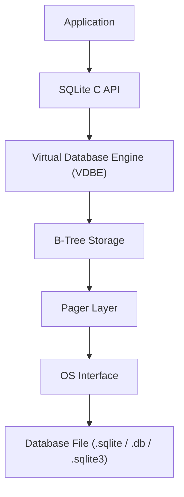

**Links**: [[DuckDB]] | [[PostgreSQL Features]] | [[Database Engines Compared]] | [[SQL JOIN Operations]] | [[Database Indexing Deep Dive]] | [[SQL Query Optimization]]

# SQLite Reference

SQLite is a C-language library that implements a small, fast, self-contained, full-featured SQL database engine. It is the most widely deployed database engine in the world.

## Architecture



SQLite compiles SQL to bytecode for execution on the VDBE.

## Key Features

- **Zero-configuration**: No setup or administration needed
- **Serverless**: Runs in-process, no separate server process
- **Single-file database**: Entire DB is one file
- **Cross-platform**: Works on all major OSes
- **Self-contained**: Minimal dependencies (~600KB library)

## Data Types (Type Affinity)

| Type | Affinity | Example |
|------|----------|---------|
| TEXT | String storage | `'hello world'` |
| INTEGER | 1-8 byte integer | `42` |
| REAL | Floating point | `3.14` |
| BLOB | Binary data | `x'ABCD'` |
| NUMERIC | Numeric with flexible storage | `'123'` stored as integer |

SQLite uses **dynamic typing** — any column can hold any type.
## Common Operations

```sql
CREATE TABLE users (
    id INTEGER PRIMARY KEY AUTOINCREMENT,
    name TEXT NOT NULL,
    email TEXT UNIQUE,
    created_at TEXT DEFAULT (datetime('now'))
);

INSERT INTO users (name, email) VALUES ('Alice', 'alice@example.com');

-- Full-text search (FTS5) and JSON support built-in
CREATE VIRTUAL TABLE docs USING fts5(title, body);
SELECT * FROM docs WHERE docs MATCH 'database';
SELECT json_extract('{"a":1}', '$.a');
```

## SQLite vs PostgreSQL

| Feature | SQLite | PostgreSQL |
|---------|--------|------------|
| Deployment | Embedded library | Client-server |
| Concurrency | Single writer, multiple readers | Full concurrent access |
| Configuration | Zero | Extensive tuning |
| Extensions | Loadable modules | Rich extension ecosystem |
| Performance (read) | Fast (in-process) | Fast (networked) |
| Performance (write) | Moderate (file lock) | High (WAL + MVCC) |
| Storage | Single file | Multiple files + WAL |
| Replication | None built-in | Streaming, logical |
| Use case | Mobile, embedded, local | Enterprise, web apps |

## Limitations

- No concurrent writes (single writer)
- No user management
- Limited ALTER TABLE support
- 140TB max database size
- No stored procedures

## Use Cases

- Mobile apps (Android, iOS)
- Embedded systems
- Desktop applications
- Development/testing
- Data analysis prototypes
- Browser storage (WebSQL replacement)

## CLI Usage

```bash
sqlite3 mydb.db
sqlite3 mydb.db ".tables"
sqlite3 mydb.db "SELECT * FROM users;"
sqlite3 mydb.db ".output data.csv"
sqlite3 mydb.db ".mode csv"
sqlite3 mydb.db "SELECT * FROM users;"
```

## Pragmas (Configuration)

```sql
PRAGMA journal_mode=WAL;      -- Better concurrency
PRAGMA synchronous=NORMAL;     -- Balance speed/safety
PRAGMA cache_size=-8000;       -- 8MB cache
PRAGMA foreign_keys=ON;        -- Enable FK enforcement
PRAGMA busy_timeout=5000;      -- Wait 5s on lock
```

**See also**: [[Database Engines Compared]], [[PostgreSQL Features]], [[SQL JOIN Operations]]
