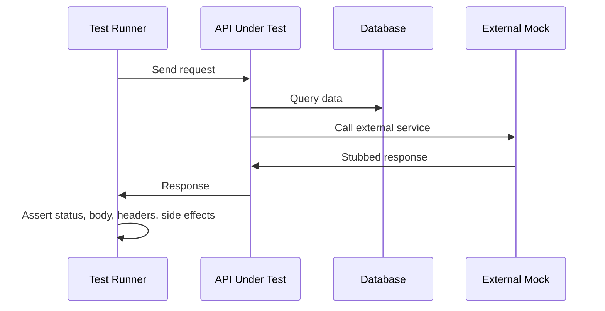

# API Testing

**Links**: [[REST API Design]] | [[Unit Testing Guide]] | [[HTTP Protocol]] | [[JSON Web Tokens]] | [[CI CD Pipelines]]

## What is API Testing?

API testing validates endpoints for correctness, performance, security, and reliability.

## Test Categories

### Functional Testing
Verifies correct behavior for valid/invalid inputs.

```python
def test_get_user_200():
    assert client.get("/users/1").status_code == 200

def test_get_user_404():
    assert client.get("/users/99999").status_code == 404
```

### Contract Testing
Ensures the API matches its specification, preventing breaking changes between consumers and providers.

| Tool | Language | Approach |
|------|----------|----------|
| **Pact** | Multi-language | Consumer-driven contracts |
| **Spring Cloud Contract** | JVM | Producer-driven contracts |
| **Dredd** | CLI | OpenAPI → test generation |

```python
@pytest.mark.contract
def test_user_contract(pact):
    (pact.given("user 1 exists")
     .upon_receiving("a request for user 1")
     .with_request(method="GET", path="/users/1")
     .will_respond_with(200, body={"id": 1, "name": "Alice"}))
    with pact:
        assert user_client.get_user(1)["name"] == "Alice"
```

### Performance Testing

| Type | What It Measures | Tool |
|------|-----------------|------|
| Load | Behavior under expected traffic | k6, Locust |
| Stress | Breaking point of the system | k6, Vegeta |
| Spike | Sudden traffic surges | Locust |

### Security Testing
Validates auth, injection resistance, rate limiting, and data exposure.

```python
def test_auth_required():
    assert client.get("/admin/users").status_code == 401

def test_sql_injection_blocked():
    resp = client.get("/users?name='; DROP TABLE users;--")
    assert resp.status_code in (400, 422)
```

## API Test Tools Comparison

| Tool | Approach | Language | Best For |
|------|----------|----------|----------|
| **Postman / Newman** | GUI + CLI runner | JS | Manual testing, quick collections |
| **REST Assured** | Java DSL | Java | Java/Groovy projects |
| **Supertest** | Fluent assertions | Node.js | Express/Koa API testing |
| **httpx / pytest** | Python test client | Python | FastAPI/Django/Flask |

```bash
npx newman run collection.json -e environment.json --reporters cli
```

## API Test Flow



## What to Test

- **Happy path**: Valid request → correct response
- **Error cases**: Missing fields, invalid types, wrong values
- **Auth**: No token, expired token, insufficient permissions
- **Edge cases**: Empty results, pagination boundaries
- **Idempotency**: Same request multiple times

## Test Structure (Arrange-Act-Assert)

```python
# Arrange
payload = {"name": "Alice", "email": "alice@example.com"}
# Act
response = client.post("/users", json=payload)
# Assert
assert response.status_code == 201
assert response.json()["name"] == "Alice"
```

**Next**: [[Load Testing]] — Performance under pressure
