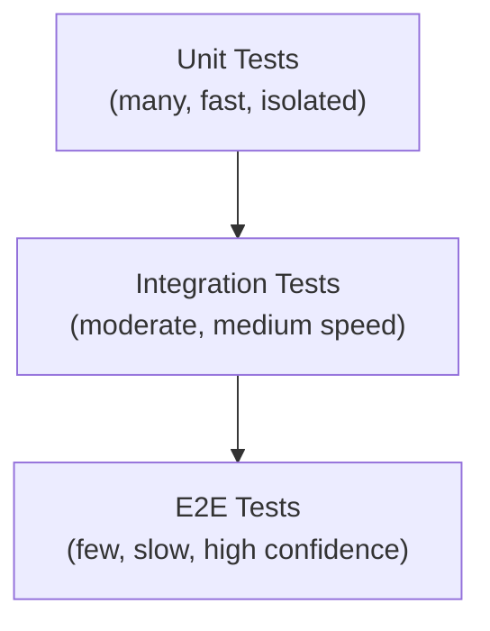

**Links**: [[Unit Testing Guide]] | [[Integration Testing Patterns]] | [[Test-Driven Development]] | [[API Testing]] | [[Performance Testing]] | [[Visual Regression Testing]]


# Software Testing Pyramid

The testing pyramid guides teams to invest in many fast, isolated unit tests, fewer integration tests, and even fewer end-to-end tests.

## Testing Pyramid



## Test Layers

### Unit Tests
Test individual functions/classes in isolation. Mock all external dependencies. Run in milliseconds.

```python
def test_calculate_discount():
    assert calculate_discount(100, 20) == 80
    assert calculate_discount(100, 0) == 100
    assert calculate_discount(100, 100) == 0
```

- **Coverage target**: 70-80%

### Integration Tests
Test interactions between components with real dependencies (test containers, in-memory DBs).

```python
def test_create_user(db_session):
    user = User(name="Alice", email="alice@example.com")
    db_session.add(user); db_session.commit()
    saved = db_session.query(User).filter_by(email="alice@example.com").first()
    assert saved is not None
```

- **Coverage target**: 15-20%

### End-to-End Tests
Test complete user workflows through the full system with browser automation (Playwright, Cypress).

```python
def test_signup(page):
    page.goto("https://app.example.com/signup")
    page.fill("#email", "alice@example.com")
    page.click("#submit")
    expect(page).to_have_url("https://app.example.com/dashboard")
```

- **Coverage target**: 5-10%

## Common Ratios (70/20/10)

| Layer | Ratio | Example (1000 tests) |
|-------|-------|----------------------|
| Unit | 70% | 700 tests |
| Integration | 20% | 200 tests |
| E2E | 10% | 100 tests |

## Anti-Patterns

| Pattern | Description |
|---------|-------------|
| **Ice-Cream Cone** | Many E2E, few unit tests — brittle, slow, hard to debug |
| **Hourglass** | Unit + E2E but no integration tests — gaps at component boundaries |

## Testing Methodologies

| Approach | Focus | Who Writes |
|----------|-------|------------|
| TDD | Write tests before code | Developers |
| BDD | Natural language behavior | Dev + QA + Product |
| ATDD | Acceptance criteria as tests | Team |

## TDD Cycle (Red-Green-Refactor)

1. Write a failing test (Red)
2. Write minimal code to pass (Green)
3. Refactor while keeping tests green

## Mocking vs Stubbing

| Double | Behavior |
|--------|----------|
| Dummy | Passed but never used |
| Stub | Returns fixed values |
| Spy | Records how it was called |
| Mock | Pre-programmed with expectations |
| Fake | Working lightweight implementation |

## Code Coverage Types

- **Line**: Which lines were executed
- **Branch**: Which condition branches were taken
- **Function**: Which functions were called
- **Mutation**: Tests detect changes in code

**Links**: [[Unit Testing Guide]] | [[API Testing]] | [[CI CD Pipelines]] | [[Error Handling Patterns]] | [[Load Testing]]
