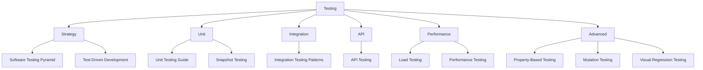

# 🧪 Testing — Map of Content

Testing ensures software behaves correctly under expected and unexpected conditions. This folder covers the testing pyramid — unit tests, integration tests, end-to-end tests — along with property-based testing, performance and load testing, API testing, and mocking strategies. Each note includes practical examples and patterns for writing maintainable test suites.

## Topics

| Category | Notes |
|----------|-------|
| **Strategy** | [[Software Testing Pyramid]], [[Test-Driven Development]] |
| **Unit** | [[Unit Testing Guide]], [[Snapshot Testing]] |
| **Integration** | [[Integration Testing Patterns]] |
| **API** | [[API Testing]] |
| **Performance** | [[Load Testing]], [[Performance Testing]] |
| **Advanced** | [[Property-Based Testing]], [[Mutation Testing]], [[Visual Regression Testing]] |

## Cross-Domain Links

- [[Testing/Software Testing Pyramid]] → [[DevOps/CI-CD/CI CD Pipelines]], [[Software-Engineering/Clean Code Principles]]
- [[Testing/API Testing]] → [[DevOps/REST API Design]], [[Web-Dev/API Gateway Patterns]], [[DevOps/CI-CD/CI CD Pipelines]]
- [[Testing/Performance Testing]] → [[DevOps/Monitoring/Monitoring and Observability]], [[System-Design/Architecture/Architecture Patterns]]
- [[Testing/Test-Driven Development]] → [[Software-Engineering/Refactoring Techniques]], [[Software-Engineering/GoF Design Patterns]]
- [[Testing/Integration Testing Patterns]] → [[DevOps/Containers/Docker Compose]], [[Testing/API Testing]]
