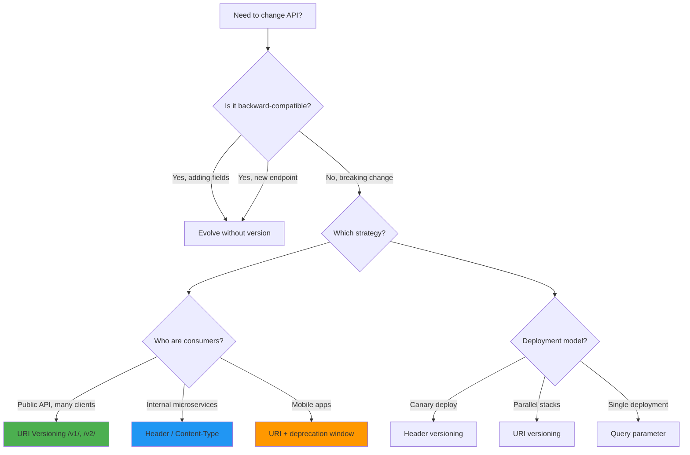

**Links**: [[REST API Design]] | [[API Gateway Patterns]] | [[GraphQL API Design]] | [[HTTP Protocol]] | [[API Documentation with OpenAPI]] | [[Web Development Fundamentals]]


# API Versioning

API versioning allows you to evolve your API without breaking existing clients. Choosing the right strategy depends on your API's consumers, complexity, and deployment model.

## Versioning Decision Tree



## Strategies

### URI Versioning

```
GET /v1/users
GET /v2/users
```

**Pros**: Simple, explicit, cacheable, easy to test in browser.
**Cons**: Clutters URIs, violates REST principle of stable URIs.

```python
from fastapi import APIRouter

v1 = APIRouter(prefix="/v1")
v2 = APIRouter(prefix="/v2")

@v1.get("/users")
async def get_users_v1():
    return [{"id": 1, "name": "Alice"}]

@v2.get("/users")
async def get_users_v2():
    return [{"id": 1, "name": "Alice", "email": "alice@example.com"}]
```

### Header Versioning

```
GET /users
Accept: application/vnd.myapp.v1+json
```

**Pros**: Clean URIs, REST-compliant.
**Cons**: Harder to test in browser, requires custom middleware.

```python
from fastapi import Request, HTTPException

VERSIONS = {"v1": handler_v1, "v2": handler_v2}

@app.get("/users")
async def get_users(request: Request):
    version = request.headers.get("Accept", "").split("vnd.myapp.")[-1].split("+")[0]
    handler = VERSIONS.get(version)
    if not handler:
        raise HTTPException(400, "Unknown version")
    return handler()
```

### Query Parameter

```
GET /users?version=1
```

**Pros**: Easy to implement, simple to test.
**Cons**: Pollutes query strings, not cacheable by default.

## Strategy Comparison

| Aspect | URI (/v1/) | Header (Accept) | Query (?v=1) | Content Negotiation |
|--------|-----------|-----------------|---------------|-------------------|
| Visibility | High | Low | Medium | Low |
| Cacheable | Yes | Yes | Depends | Yes |
| Browser testable | Yes | No | Yes | No |
| REST-compliant | Disputed | Yes | No | Yes |
| Default routing | Simple | Middleware | Simple | Middleware |
| Documentation clarity | High | Low | Medium | Low |

## When to Version

- Breaking schema changes (renaming/removing fields)
- Changed behavior or semantics
- New required parameters
- Removed endpoints
- Response format changes

## Best Practices

- Default to latest version for unversioned requests
- Deprecate old versions with clear sunset dates (6+ months notice)
- Support at most 2-3 versions simultaneously
- Communicate breaking changes via changelog and migration guides
- Use semantic versioning for API (MAJOR.minor.patch)
- Return deprecation headers: `Sunset: Sat, 1 Nov 2025 00:00:00 GMT`

```python
# Deprecation middleware example
@app.middleware("http")
async def add_deprecation_header(request: Request, call_next):
    response = await call_next(request)
    if request.url.path.startswith("/v1/"):
        response.headers["Sunset"] = "Sat, 1 Nov 2025 00:00:00 GMT"
        response.headers["Warning"] = '299 - "v1 deprecated, use v2"'
    return response
```

**See also**: [[REST API Design]], [[HTTP Protocol]], [[GraphQL API Design]]
