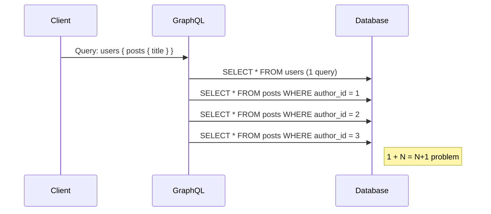

**Links**: [[GraphQL]] | [[REST API Design]] | [[API Gateway Patterns]] | [[API Versioning]] | [[gRPC]] | [[HTTP Protocol]]


# GraphQL API Design

GraphQL is a query language for APIs that lets clients request exactly the data they need, avoiding over-fetching and under-fetching common in REST.

## Schema Definition

The schema is the contract between client and server, defined in GraphQL Schema Definition Language (SDL).

```graphql
type User {
  id: ID!
  name: String!
  email: String!
  posts(limit: Int = 10): [Post!]!
}

type Post {
  id: ID!
  title: String!
  content: String!
  publishedAt: DateTime!
  author: User!
  tags: [String!]!
}

enum PostStatus {
  DRAFT
  PUBLISHED
  ARCHIVED
}

input CreatePostInput {
  title: String!
  content: String!
  tags: [String!]
  status: PostStatus = DRAFT
}

type Mutation {
  createPost(input: CreatePostInput!): Post!
  deletePost(id: ID!): Boolean!
}

type Subscription {
  postCreated: Post!
  postUpdated(authorId: ID): Post!
}

type Query {
  user(id: ID!): User
  posts(limit: Int = 20, offset: Int = 0): [Post!]!
}
```

## Resolver Function Patterns

Resolvers are functions that fetch data for each field. They follow a standard signature: `(parent, args, context, info)`.

```python
# Python (Ariadne / Strawberry)
from typing import Optional

async def resolve_user(
    parent: Optional[dict],
    info: object,
    id: str,
) -> Optional[dict]:
    return await db.fetch_one("SELECT * FROM users WHERE id = :id", {"id": id})

def resolve_user_posts(
    parent: dict,            # the parent User object
    info: object,
    limit: int,
) -> list[dict]:
    return db.fetch_all(
        "SELECT * FROM posts WHERE author_id = :uid LIMIT :lim",
        {"uid": parent["id"], "lim": limit},
    )
```

```javascript
// JavaScript (Apollo Server)
const resolvers = {
  Query: {
    user: async (_, { id }, { dataSources }) =>
      dataSources.usersAPI.getUser(id),
  },
  User: {
    posts: async (parent, { limit }, { dataSources }) =>
      dataSources.postsAPI.getByAuthor(parent.id, limit),
  },
};
```

## N+1 Problem & DataLoader

Without batching, fetching a list of N users each with their posts fires 1 + N SQL queries — the N+1 problem.



**DataLoader** batches and caches per-request, coalescing individual loads into a single query.

```javascript
const DataLoader = require('dataloader');

const postLoader = new DataLoader(async (authorIds) => {
  const rows = await db.query(
    'SELECT * FROM posts WHERE author_id = ANY($1) ORDER BY id',
    [authorIds],
  );
  // Group rows by author_id to match the input array order
  return authorIds.map((id) =>
    rows.filter((r) => r.author_id === id),
  );
});

// Resolution — each call enqueues; DataLoader dedupes and batches
const resolvers = {
  User: {
    posts: (parent, _, { loaders }) =>
      loaders.postLoader.load(parent.id),
  },
};
```

Now it becomes 1 query for users + 1 batched query for posts, regardless of N.

## Subscriptions (Real-Time)

Subscriptions push data to clients over WebSocket, enabling real-time features.

```graphql
type Subscription {
  postCreated: Post!
  postUpdated(authorId: ID): Post!
  notify(room: String!): Notification!
}
```

```javascript
// Apollo Server — pub/sub with event emitters
const { PubSub } = require('graphql-subscriptions');
const pubsub = new PubSub();

const resolvers = {
  Subscription: {
    postCreated: {
      subscribe: () => pubsub.asyncIterator(['POST_CREATED']),
    },
  },
  Mutation: {
    createPost: async (_, { input }, { db }) => {
      const post = await db.insert('posts', input);
      pubsub.publish('POST_CREATED', { postCreated: post });
      return post;
    },
  },
};
```

## GraphQL vs REST vs gRPC

| Aspect | REST | GraphQL | gRPC |
|--------|------|---------|------|
| Data fetching | Multiple endpoints | Single endpoint, client-driven | Protobuf contracts |
| Over/under-fetching | Common | None | None (typed stubs) |
| Payload format | JSON/XML | JSON | Protobuf (binary) |
| Schema | Informal (OpenAPI) | Strongly typed SDL | Protobuf `.proto` |
| Versioning | URL / header | Evolve schema, deprecate fields | Change proto package |
| Caching | HTTP caching (native) | Requires Apollo/relay cache | Not built-in |
| Real-time | Polling / SSE | Subscriptions (WS) | Bidirectional streaming |
| Tooling | curl, Postman | GraphiQL, Apollo Studio | grpcurl, protoc |
| Use case | CRUD, public APIs | Complex UIs, mobile apps | Microservices, low-latency |

## Pagination Patterns (Cursor-Based)

Cursor-based pagination is preferred over offset/limit for consistency (no skipped or duplicate items when data shifts).

```graphql
type PageInfo {
  hasNextPage: Boolean!
  hasPreviousPage: Boolean!
  startCursor: String!
  endCursor: String!
}

type PostConnection {
  edges: [PostEdge!]!
  pageInfo: PageInfo!
}

type PostEdge {
  cursor: String!
  node: Post!
}

type Query {
  posts(first: Int = 10, after: String): PostConnection!
}
```

```python
def resolve_posts(_, info, first=10, after=None):
    cursor_clause = ""
    params = {"limit": first}
    if after:
        cursor_clause = "AND id > :cursor"
        params["cursor"] = decode_cursor(after)
    rows = db.fetch_all(
        f"SELECT * FROM posts WHERE 1=1 {cursor_clause} ORDER BY id LIMIT :limit",
        params,
    )
    edges = [
        {"cursor": encode_cursor(r["id"]), "node": r}
        for r in rows
    ]
    return {
        "edges": edges,
        "pageInfo": {
            "hasNextPage": len(rows) == first,
            "startCursor": edges[0]["cursor"] if edges else None,
            "endCursor": edges[-1]["cursor"] if edges else None,
        },
    }
```

## Authentication & Authorization

- **Authentication** (who): handled at the transport layer — JWT in `Authorization` header, or session cookie.
- **Authorization** (can they?): enforced in resolvers via the `context` object.

```javascript
const server = new ApolloServer({
  context: ({ req }) => {
    const token = req.headers.authorization?.replace('Bearer ', '');
    const user = token ? verifyJwt(token) : null;
    return { user };
  },
});

const resolvers = {
  Mutation: {
    deletePost: async (_, { id }, { user, db }) => {
      if (!user) throw new AuthenticationError('Not logged in');
      const post = await db.get('posts', id);
      if (post.author_id !== user.id) {
        throw new ForbiddenError('Not your post');
      }
      return db.delete('posts', id);
    },
  },
};
```

Schema directives (e.g., `@auth`) or resolver middleware can centralise auth logic instead of repeating checks in every resolver.

**See also**: [[REST API Design]], [[HTTP Protocol]], [[SQL Query Optimization]]
