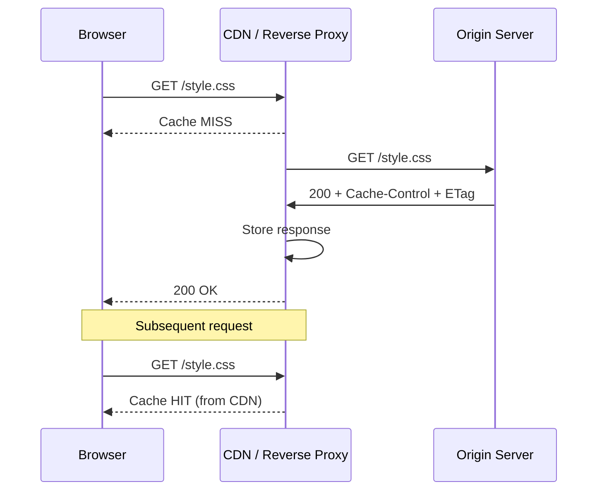

# HTTP Caching

**Links**: [[HTTP Protocol]] | [[Caching Strategies]] | [[REST API Design]] | [[Nginx Configuration]] | [[Web Security]]

## What is HTTP Caching?

HTTP caching stores responses to reduce latency, bandwidth, and server load. Controlled by response headers.
## Cache Flow



## Cache-Control Directives

| Directive | Meaning | Example |
|-----------|---------|---------|
| `max-age=N` | Cache for N seconds | `max-age=3600` |
| `s-maxage=N` | Override max-age for shared caches | `s-maxage=86400` |
| `no-cache` | Revalidate before use | `no-cache` |
| `no-store` | Never cache (sensitive data) | `no-store` |
| `private` | Browser only, not CDN/proxy | `private, max-age=3600` |
| `public` | Cache anywhere (browser, CDN, proxy) | `public, max-age=3600` |
| `must-revalidate` | Must revalidate when stale | `must-revalidate` |
| `immutable` | Never revalidate (versioned assets) | `immutable, max-age=31536000` |
| `stale-while-revalidate=N` | Serve stale while fetching fresh | `stale-while-revalidate=60` |
| `stale-if-error=N` | Serve stale if origin errors | `stale-if-error=86400` |

## Validation

### ETag (Strong Validation)

Unique content hash. Client sends `If-None-Match`; server responds `304 Not Modified` if unchanged.

```http
If-None-Match: "abc123"
→ 304 Not Modified
```
### Last-Modified (Weak Validation)

Timestamp of last modification. Client sends `If-Modified-Since`.

```http
If-Modified-Since: Mon, 15 Jan 2024 10:00:00 GMT
→ 304 Not Modified
```

Prefer ETag — detects byte-level changes even when timestamps are identical.
## Cache Strategies

| Strategy | `Cache-Control` | Use Case |
|----------|----------------|----------|
| Immutable | `public, max-age=31536000, immutable` | Versioned assets (app.js?v=2) |
| Fresh | `public, max-age=300` | API responses |
| Revalidate | `public, no-cache` | Dynamic content |
| Private | `private, max-age=3600` | User-specific content |
| No cache | `no-store` | Auth pages, sensitive data |

## Cache Invalidation Strategies

| Strategy | How It Works | Pros | Cons |
|----------|-------------|------|------|
| TTL-based | Cache expires after set duration | Simple, automatic | May serve stale data |
| Event-based | Purge on update via CDN API | Instant invalidation | Requires orchestration |
| Versioned URLs | `/static/app.v2.js` | Predictable, no purge | Version overhead |
| Key-based | Invalidate specific cache keys | Precise | Needs key convention |

## Service Worker Caching Patterns

```javascript
// Cache-first (assets)
self.addEventListener('fetch', (event) => {
  event.respondWith(
    caches.match(event.request).then((cached) => {
      return cached || fetch(event.request).then((response) => {
        return caches.open('v1').then((cache) => {
          cache.put(event.request, response.clone());
          return response;
        });
      });
    })
  );
});

// Network-first (API calls)
self.addEventListener('fetch', (event) => {
  event.respondWith(
    fetch(event.request).catch(() => caches.match(event.request))
  );
});
```

| Pattern | Strategy | Use Case |
|---------|----------|----------|
| Cache First | Cache → network fallback | Static assets |
| Network First | Network → cache fallback | API calls |
| Stale While Revalidate | Serve cache, update in bg | Content pages |

**Next**: [[Rate Limiting]] — Protect your APIs
