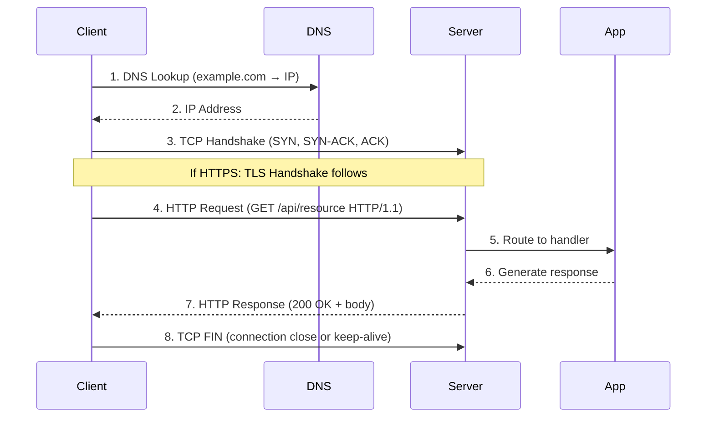
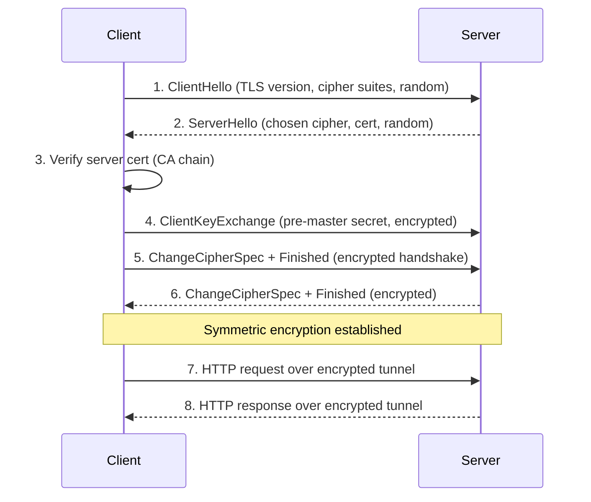

**Links**: [[HTTP Caching]] | [[HTTP-3 and QUIC]] | [[WebSocket Deep Dive]] | [[WebSockets]] | [[Web Development Fundamentals]] | [[REST API Design]]

# HTTP Protocol

HTTP (Hypertext Transfer Protocol) is the foundation of data communication on the web. It is a request-response protocol where a client sends a request to a server and the server responds.

## HTTP Request-Response Sequence

## Request Methods

| Method | Idempotent | Safe | Cacheable | Body | Purpose |
|--------|-----------|------|-----------|------|---------|
| GET | Yes | Yes | Yes | No | Retrieve a resource |
| HEAD | Yes | Yes | Yes | No | Same as GET, no body (headers only) |
| POST | No | No | Yes (freshness) | Yes | Create a resource or trigger action |
| PUT | Yes | No | No | Yes | Create or replace a resource |
| PATCH | No | No | No | Yes | Partial modification of a resource |
| DELETE | Yes | No | No | Maybe | Remove a resource |
| OPTIONS | Yes | Yes | No | No | Discover allowed methods (CORS preflight) |
| CONNECT | No | No | No | No | Establish tunnel (e.g., HTTPS proxy) |
| TRACE | Yes | Yes | No | No | Loop-back diagnostic (security risk, often disabled) |

## Status Codes

### 1xx — Informational
| Code | Name | Description |
|------|------|-------------|
| 100 | Continue | Client should continue with request body |
| 101 | Switching Protocols | Server agrees to upgrade (e.g., WebSocket) |
| 102 | Processing | Server received full request, processing (WebDAV) |
| 103 | Early Hints | Preload hints before final response |

### 2xx — Success
| Code | Name | Description |
|------|------|-------------|
| 200 | OK | Standard success response |
| 201 | Created | Resource created (POST/PUT) |
| 202 | Accepted | Request accepted for async processing |
| 203 | Non-Authoritative Info | Modified by intermediary |
| 204 | No Content | Success, no response body (DELETE) |
| 205 | Reset Content | Clear the sending form |
| 206 | Partial Content | Range request (video streaming, downloads) |
| 207 | Multi-Status | Multiple resources (WebDAV) |
| 208 | Already Reported | Previously enumerated (WebDAV) |
| 226 | IM Used | Delta encoding applied |

### 3xx — Redirection
| Code | Name | Description |
|------|------|-------------|
| 300 | Multiple Choices | Multiple representations available |
| 301 | Moved Permanently | Resource has new permanent URL (SEO) |
| 302 | Found | Temporary redirect (may change method to GET) |
| 303 | See Other | Redirect with GET (POST → GET redirect) |
| 304 | Not Modified | Use cached version (ETag/Last-Modified) |
| 305 | Use Proxy | Deprecated, security risk |
| 307 | Temporary Redirect | Like 302 but preserves HTTP method |
| 308 | Permanent Redirect | Like 301 but preserves HTTP method |

### 4xx — Client Error
| Code | Name | Description |
|------|------|-------------|
| 400 | Bad Request | Malformed syntax, invalid fields |
| 401 | Unauthorized | Authentication required or failed |
| 402 | Payment Required | Reserved for digital payments |
| 403 | Forbidden | Authenticated but no permission |
| 404 | Not Found | Resource does not exist |
| 405 | Method Not Allowed | Method not supported on this resource |
| 406 | Not Acceptable | Content negotiation failure |
| 407 | Proxy Authentication | Authenticate with proxy first |
| 408 | Request Timeout | Server timed out waiting for request |
| 409 | Conflict | Resource state conflict (versioning) |
| 410 | Gone | Resource intentionally removed |
| 411 | Length Required | Content-Length header required |
| 412 | Precondition Failed | Conditional header check failed |
| 413 | Payload Too Large | Request body exceeds server limit |
| 414 | URI Too Long | URL too long |
| 415 | Unsupported Media Type | Wrong Content-Type |
| 416 | Range Not Satisfiable | Invalid Range header |
| 417 | Expectation Failed | Expect header not supported |
| 418 | I'm a Teapot | April Fools' RFC 2324 |
| 422 | Unprocessable Entity | Semantic validation error |
| 423 | Locked | Resource locked (WebDAV) |
| 424 | Failed Dependency | Precondition failed (WebDAV) |
| 425 | Too Early | Risk of replay attack (TLS 1.3 early data) |
| 426 | Upgrade Required | Upgrade to a different protocol |
| 428 | Precondition Required | Server requires conditional requests |
| 429 | Too Many Requests | Rate limit exceeded |
| 431 | Request Header Fields Too Large | Headers too large |
| 451 | Unavailable For Legal Reasons | Blocked by law/censorship |

### 5xx — Server Error
| Code | Name | Description |
|------|------|-------------|
| 500 | Internal Server Error | Unhandled server exception |
| 501 | Not Implemented | Server does not support this method |
| 502 | Bad Gateway | Upstream server returned invalid response |
| 503 | Service Unavailable | Overloaded or under maintenance |
| 504 | Gateway Timeout | Upstream server timed out |
| 505 | HTTP Version Not Supported | Server does not support HTTP version |
| 506 | Variant Also Negotiates | Content negotiation config error |
| 507 | Insufficient Storage | Server out of storage (WebDAV) |
| 508 | Loop Detected | Infinite redirect detected (WebDAV) |
| 510 | Not Extended | Further extensions needed |
| 511 | Network Authentication Required | Captive portal login needed |

## HTTP Headers

### Request Headers
| Category | Example Headers | Purpose |
|----------|----------------|---------|
| General | Cache-Control, Connection, Date, Upgrade, Via | Applied to both request and response |
| Authentication | Authorization, Proxy-Authorization, WWW-Authenticate | Credentials and auth challenges |
| Content | Content-Type, Content-Length, Content-Encoding, Content-Language | Describe the body |
| Conditional | If-Modified-Since, If-None-Match, If-Match, If-Range | Cache validation, concurrency |
| CORS | Origin, Access-Control-Request-Method, Access-Control-Request-Headers | Cross-origin requests |
| Client | User-Agent, Accept, Accept-Language, Accept-Encoding, Referer | Client capabilities and preferences |
| Cookie | Cookie | Stored session tokens |
| Cache | Cache-Control, Pragma, Expires | Caching directives |

### Response Headers
| Category | Example Headers | Purpose |
|----------|----------------|---------|
| Status | Allow, Server, Retry-After | Server metadata |
| Content | Content-Type, Content-Length, Content-Disposition, Content-Encoding | Describe the response body |
| CORS | Access-Control-Allow-Origin, Access-Control-Allow-Methods, Access-Control-Allow-Headers | Cross-origin permissions |
| Security | Strict-Transport-Security, Content-Security-Policy, X-Frame-Options, X-Content-Type-Options | Security policies |
| Cache | Cache-Control, ETag, Last-Modified, Expires, Age | Caching and freshness |
| Set-Cookie | Set-Cookie | Store session data on client |
| Location | Location | Redirect target (3xx responses) |
| Rate Limiting | X-RateLimit-Limit, X-RateLimit-Remaining, X-RateLimit-Reset | API rate limit info |

## HTTP/1.1 vs HTTP/2 vs HTTP/3

| Feature | HTTP/1.1 | HTTP/2 | HTTP/3 |
|---------|----------|--------|--------|
| Transport | TCP | TCP | QUIC (UDP) |
| Multiplexing | No (1 request per connection) | Yes (streams) | Yes (streams, no HOL blocking) |
| Head-of-Line Blocking | Yes (TCP level) | Yes (TCP level, not stream level) | No (QUIC) |
| Header Compression | None | HPACK | QPACK |
| Server Push | No | Yes (pushes resources) | Yes (planned) |
| Connection Establishment | 3-way TCP handshake | 3-way TCP + TLS | 0-RTT (often) |
| Encryption | Optional (HTTPS) | Optional (but browsers require) | Mandatory |
| Binary Protocol | No (text) | Yes (binary frames) | Yes (binary frames) |
| Stream Prioritization | No | Yes (weighted) | Yes (extensible) |
| Adoption | Universal, legacy | ~40% of websites | ~30% of websites (growing) |

## CORS (Cross-Origin Resource Sharing)

CORS is a browser security mechanism that restricts web pages from making requests to a different origin.

### Simple Requests
- Method: GET, HEAD, or POST
- Headers: Accept, Accept-Language, Content-Language, Content-Type (limited to application/x-www-form-urlencoded, multipart/form-data, text/plain)
- Browser sends Origin header; server responds with Access-Control-Allow-Origin

### Preflighted Requests
- Any request that triggers preflight:
  - Custom methods (PUT, PATCH, DELETE)
  - Non-simple Content-Type (application/json)
  - Custom headers (Authorization, X-Requested-With)
- Browser sends OPTIONS preflight with Access-Control-Request-Method + Access-Control-Request-Headers
- Server responds with Access-Control-Allow-Origin, Access-Control-Allow-Methods, Access-Control-Allow-Headers

## Cookies

| Attribute | Description |
|-----------|-------------|
| Name=Value | Key-value cookie data |
| Domain | Which domains receive the cookie |
| Path | URL path scope |
| Max-Age / Expires | Lifetime of cookie |
| Secure | HTTPS only |
| HttpOnly | Not accessible via JavaScript (prevents XSS theft) |
| SameSite | Strict, Lax, or None (CSRF protection) |
| Partitioned | Third-party cookie isolation (CHIPS) |

## Caching Headers

| Header | Direction | Purpose |
|--------|-----------|---------|
| Cache-Control: max-age=3600 | Request/Response | Freshness in seconds |
| Cache-Control: no-cache | Request/Response | Must revalidate before use |
| Cache-Control: no-store | Response | Do not cache at all |
| Cache-Control: public | Response | Can be cached by any proxy |
| Cache-Control: private | Response | Only browser cache, no proxies |
| Cache-Control: must-revalidate | Response | Stale cache = error without revalidation |
| ETag | Response | Entity tag for conditional requests |
| Last-Modified | Response | Timestamp-based validation |
| If-None-Match | Request | Send ETag; 304 if unchanged |
| If-Modified-Since | Request | Send timestamp; 304 if unchanged |
| Expires | Response | Deprecated, use max-age |
| Age | Response | How many seconds cached by proxy |
| Vary | Response | Cache key varies by header (e.g., Accept-Encoding) |

## HTTPS & TLS Handshake

## REST vs GraphQL vs gRPC

| Feature | REST | GraphQL | gRPC |
|---------|------|---------|------|
| Protocol | HTTP/1.1 or HTTP/2 | HTTP/1.1 or HTTP/2 | HTTP/2 (mandatory) |
| Data Format | JSON, XML, HTML | JSON | Protobuf (binary) |
| Schema | OpenAPI (optional) | Schema-first (SDL) | Proto files (required) |
| Querying | Fixed endpoints | Client-specified fields | RPC method calls |
| Over-fetching | Common | Rare (client requests fields) | None (typed responses) |
| Under-fetching | Common (N+1 problem) | Rare | Rare |
| Caching | Native HTTP caching | Complex (single POST endpoint) | N/A (RPC) |
| Tooling | curl, Postman, browsers | GraphiQL, Apollo DevTools | grpcurl, protoc plugins |
| Streaming | SSE, WebSocket | Subscriptions | Native streaming (bidirectional) |
| Code Gen | Manual or OpenAPI | Apollo Codegen | Protobuf code gen |
| Best For | CRUD, resource-oriented APIs | Complex nested data, evolving UIs | High-performance microservices |
| Learning Curve | Low | Medium | High (Protobuf) |

## Cross-Domain Links

- [[REST API Design]] → [[Web-Dev/HTTP Protocol]]
- [[Programming Resources]] → [[Web-Dev/HTTP Protocol]]
- HTTP/Caching → [[System-Design/Databases/Caching Strategies]], [[System-Design/Architecture/CDN Architecture]]
- REST/API → [[System-Design/Architecture/Microservices Architecture]], [[Web-Dev/API Gateway Patterns]]
- HTTPS/TLS → [[Security/TLS and mTLS]], [[Security/API Security]]
- CORS → [[Security/API Security]], [[Security/Content Security Policy]]
- gRPC → [[Web-Dev/gRPC]], [[System-Design/Architecture/Service Mesh]]
- GraphQL → [[Web-Dev/GraphQL Fundamentals]]
- HTTP/2 & HTTP/3 → [[System-Design/Architecture/Computer Networking]], [[System-Design/Architecture/CDN Architecture]]
- WebSocket → [[Web-Dev/WebSocket and SSE]], [[Web-Dev/Real-Time Communication]]
- [[Web-Dev/HTTP Protocol]] → [[Web-Dev/_MOC|Web Dev Hub]], [[DevOps/_MOC|DevOps Hub]]
