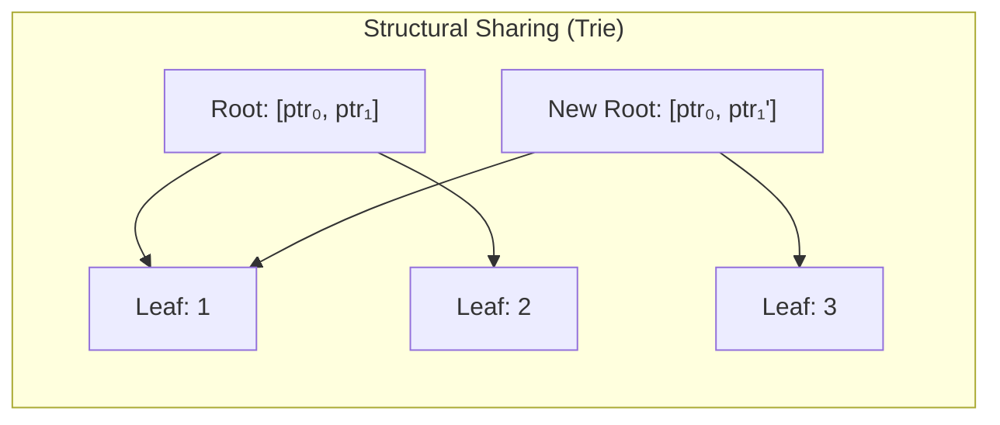
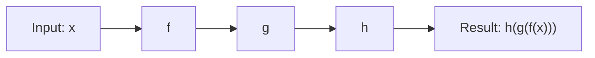
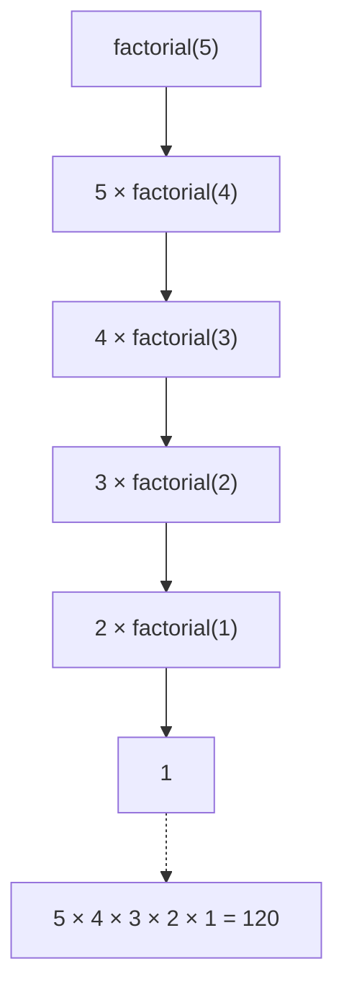

# Functional Programming

Functional programming (FP) treats computation as the evaluation of mathematical functions, avoiding mutable state and side effects. Languages like Haskell, Elixir, and Clojure embrace FP fully, while Python, JavaScript, Scala, and Rust incorporate FP features.

## Core Concepts

### Pure Functions

A pure function satisfies two conditions:
- **Deterministic**: same input always yields same output (referential transparency)
- **No side effects**: no I/O, no mutation of external state, no database writes

```python
# Pure
def add(a, b):
    return a + b

# Impure — depends on mutable external state
tax_rate = 0.1
def calculate_tax(amount):
    return amount * tax_rate  # tax_rate could change between calls

# Pure — all dependencies passed explicitly
def calculate_tax_pure(amount, rate):
    return amount * rate
```

Benefits of pure functions: easy to test (no mock setup), trivially parallelisable, cacheable (memoisation), and composable.

### Immutability & Persistent Data Structures

Immutability means data is never mutated in place — every "modification" produces a new value while the original stays intact.

```python
original = {"name": "Alice", "score": 100}
updated = {**original, "score": 150}
# original remains {"name": "Alice", "score": 100}
```

Naive copying is expensive for large data. **Persistent data structures** solve this with **structural sharing** — the new version reuses most of the old version's memory, only copying the changed path.



Clojure's vectors, Scala's `Vector`, and Immutable.js all use tries with branching factor 32, giving O(log₃₂ n) reads and writes — effectively constant time for practical sizes.

### Higher-Order Functions

Functions that accept other functions as arguments or return a function as a result.

| Function | Purpose | Signature |
|----------|---------|-----------|
| `map` | Transform each element | `(A → B) → [A] → [B]` |
| `filter` | Keep matching elements | `(A → Bool) → [A] → [A]` |
| `reduce` | Combine into single value | `(B → A → B) → B → [A] → B` |

```python
from functools import reduce

nums = [1, 2, 3, 4, 5]
doubled  = list(map(lambda x: x * 2, nums))           # [2, 4, 6, 8, 10]
evens    = list(filter(lambda x: x % 2 == 0, nums))   # [2, 4]
total    = reduce(lambda a, b: a + b, nums, 0)        # 15
products = list(map(lambda x: (x, x**2), nums))        # [(1,1), (2,4), ...]
```

### Currying & Partial Application

**Currying** transforms a multi-argument function into a chain of single-argument functions.

```python
# Uncurried
def add(a, b, c):
    return a + b + c

# Curried form
def curried_add(a):
    def _(b):
        def __(c):
            return a + b + c
        return __
    return _

curried_add(1)(2)(3)  # 6
```

**Partial application** fixes a subset of arguments, returning a function that accepts the rest.

```python
from functools import partial

def power(base, exp):
    return base ** exp

square = partial(power, exp=2)
cube   = partial(power, exp=3)

square(5)   # 25
cube(2)     # 8
```

### Function Composition

Combining small, single-purpose functions into a pipeline.



```python
from functools import reduce

def compose(*funcs):
    def composed(x):
        result = x
        for f in reversed(funcs):
            result = f(result)
        return result
    return composed

add_one = lambda x: x + 1
double  = lambda x: x * 2
to_str  = lambda x: f"→ {x}"

pipeline = compose(to_str, double, add_one)
pipeline(5)   # "→ 12"
```

### Functors & Monads

- **Functor**: a container with a `map` method that applies a function to the wrapped value (e.g., `List.map`, `Optional.map`, `Promise.then`).
- **Monad**: a functor with `flat_map` (also called `bind` or `>>=`) that chains operations returning wrapped values, avoiding nested containers.

```python
from typing import Optional

def safe_divide(a: float, b: float) -> Optional[float]:
    return a / b if b != 0 else None

def safe_sqrt(x: float) -> Optional[float]:
    return x ** 0.5 if x >= 0 else None

# Without do-notation, chaining requires explicit unwrapping
def compute(x: float, y: float) -> Optional[float]:
    d = safe_divide(x, y)
    return None if d is None else safe_sqrt(d)

# In Haskell the same logic reads linearly:
# compute x y = do
#   d <- safeDivide x y
#   safeSqrt d
```

Common monads: `Maybe`/`Optional` (nullable values), `Either` (error handling), `IO` (side effects), `Task`/`Promise` (async), `List` (non-determinism).

### Recursion

FP uses recursion instead of imperative loops. **Tail-call optimisation (TCO)** allows recursive functions to run in constant stack space.

```python
# Imperative
def factorial_iter(n):
    result = 1
    for i in range(2, n + 1):
        result *= i
    return result

# Tail-recursive (TCO in Scheme, Clojure; Python does NOT TCO)
def factorial_tail(n, acc=1):
    return acc if n <= 1 else factorial_tail(n - 1, n * acc)

# Recursive unfolding
def factorial(n):
    return 1 if n <= 1 else n * factorial(n - 1)
```



Languages that guarantee TCO: Haskell, Scheme, Clojure (via `recur`). Languages with opt-in: Scala (`@tailrec`), JavaScript (strict mode, some engines).

## Languages

- **Haskell**: Purely functional
- **Elixir/Erlang**: Functional + concurrency
- **Clojure**: Lisp on JVM
- **Scala**: OOP + FP hybrid
- **Rust**: FP-inspired features (iterators, pattern matching)

**See also**: [[Programming Language Paradigms]], [[Big O Notation]], [[Software Design Principles]]

**Links**: [[Async Python]] | [[C and C++]] | [[C Sharp and DotNET]] | [[Compiler Design]] | [[Dart and Flutter]] | [[Elixir and Erlang]] | [[Finite Automata and Formal Languages]] | [[Flutter Deep Dive]] | [[Functional Programming Concepts]] | [[Go Concurrency Patterns]] | [[Go Programming]] | [[Haskell]] | [[Java]] | [[Julia]] | [[Kotlin]] | [[Lua Scripting]] | [[Object-Oriented Programming]] | [[Pandas for Data Analysis]] | [[PHP]] | [[Programming Language Paradigms]] | [[Python Deep Dive]] | [[Python Imports and Modules]] | [[Python Type Hints]] | [[Python Virtual Environments]] | [[PyTorch Deep Dive]] | [[R for Data Science]] | [[Ruby]] | [[Rust Ownership and Borrowing]] | [[Rust]] | [[Scala]] | [[scikit-learn Deep Dive]] | [[Swift and iOS Development]] | [[TypeScript]]
