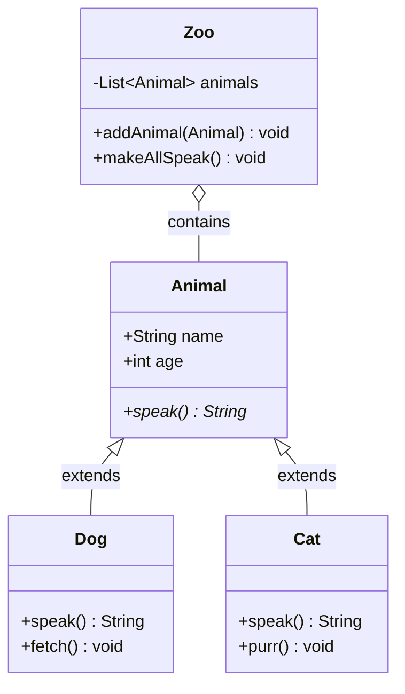

# Object-Oriented Programming

Object-Oriented Programming (OOP) organizes code around objects — data structures bundling state and behavior. It's the dominant paradigm in mainstream software development.

## Four Pillars

| Pillar | Description | Real-World Analogy |
|--------|-------------|-------------------|
| **Encapsulation** | Bundle data + methods, hide internal state | ATM: you use the interface, don't see the mechanism |
| **Inheritance** | Child class derives from parent | Vehicle → Car, Truck, Motorcycle |
| **Polymorphism** | Same interface, different implementations | `play()` on Piano vs Guitar — different sounds, same action |
| **Abstraction** | Hide complexity, expose essentials | Driving: steering wheel + pedals, not engine internals |

## Mermaid: OOP Relationships



## Encapsulation

```python
class BankAccount:
    def __init__(self, owner: str, balance: float = 0):
        self.owner = owner
        self.__balance = balance  # Name-mangled (private)

    def deposit(self, amount: float):
        if amount <= 0:
            raise ValueError("Must be positive")
        self.__balance += amount

    @property
    def balance(self) -> float:
        return self.__balance

    def withdraw(self, amount: float) -> bool:
        if 0 < amount <= self.__balance:
            self.__balance -= amount
            return True
        return False
```

## Polymorphism

```python
from abc import ABC, abstractmethod

class Animal(ABC):
    @abstractmethod
    def speak(self) -> str: ...

class Dog(Animal):
    def speak(self) -> str:
        return "Woof!"

class Cat(Animal):
    def speak(self) -> str:
        return "Meow!"

class Duck(Animal):
    def speak(self) -> str:
        return "Quack!"

def animal_sounds(animals: list[Animal]):
    for animal in animals:
        print(animal.speak())  # Polymorphic call

animal_sounds([Dog(), Cat(), Duck()])  # Woof! Meow! Quack!
```

## Composition over Inheritance

```python
class Engine:
    def start(self): print("Engine started")
    def stop(self): print("Engine stopped")

class Wheels:
    def rotate(self): print("Wheels rotating")

class Car:
    """Composition: Car has-an Engine and Wheels."""
    def __init__(self):
        self.engine = Engine()
        self.wheels = Wheels()

    def start(self):
        self.engine.start()
        self.wheels.rotate()
        print("Car ready")
```

## SOLID Principles Quick Reference

| Principle | Meaning | OOP Pillar |
|-----------|---------|------------|
| **S**ingle Responsibility | One class, one reason to change | Encapsulation |
| **O**pen/Closed | Open for extension, closed for modification | Polymorphism |
| **L**iskov Substitution | Subtypes must be substitutable for base types | Inheritance |
| **I**nterface Segregation | Many specific interfaces > one general | Abstraction |
| **D**ependency Inversion | Depend on abstractions, not concretions | Abstraction |

## When to Use OOP

| Use OOP When | Avoid OOP When |
|-------------|----------------|
| Modeling real-world entities | Pure data transformations |
| Stateful operations needed | Simple stateless functions |
| Multiple implementations of same interface | Only one implementation exists |
| Large codebase with many contributors | Small scripts or prototypes |
| Framework requires class-based design | Functional or procedural fits better |

**Links**: [[Programming Language Paradigms]] | [[Software Design Principles]] | [[GoF Design Patterns]] | [[Code Architecture Patterns]] | [[Error Handling Patterns]]

**Next**: [[GoF Design Patterns]] — Common design patterns
