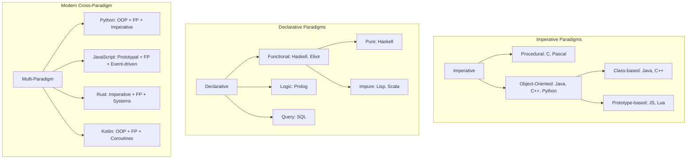

# Programming Language Paradigms

A programming paradigm is a style or way of thinking about programming. Languages often support multiple paradigms, allowing developers to choose the best approach for each problem.

## Major Paradigms

### Imperative
Describes **how** to do something step-by-step.
- **Procedural**: C, Pascal, BASIC
- **Object-Oriented**: Java, C++, Python, Ruby

### Declarative
Describes **what** to do, not how.
- **Functional**: Haskell, Lisp, Elixir, Clojure
- **Logic**: Prolog
- **Query**: SQL

### Paradigm Relationship Map



## Code Examples

### Imperative (C)
```c
int sum = 0;
for (int i = 1; i <= 10; i++) {
    sum += i;
}
```

### Declarative (SQL)
```sql
SELECT SUM(value) FROM numbers WHERE id BETWEEN 1 AND 10;
```

### Functional (Python)
```python
sum(filter(lambda x: x > 0, range(1, 11)))
```

## Paradigm Comparison

| Aspect | Imperative | Declarative | Functional | OOP |
|--------|------------|-------------|------------|-----|
| Focus | How to do it | What to do | Pure transformations | Objects & messages |
| State | Mutable | Immutable preferred | Immutable | Encapsulated |
| Flow | Loops, conditionals | Expressions, recursion | Recursion, pipelines | Method dispatch |
| Composition | Functions, modules | Functions, queries | Function composition | Inheritance, interfaces |
| Concurrency | Threads, locks | Built-in (immutability) | Immutability helps | Threads + monitors |
| Learning curve | Moderate | Moderate | Steep | Moderate |

## Best Practices

- Choose the paradigm that fits the problem, not the language
- Multi-paradigm languages let you mix styles — use the right tool for each subtask
- Prefer immutability for data that crosses boundaries (threads, APIs)
- Use pure functions for testable, predictable logic
- Encapsulate mutable state behind interfaces (OOP) or closures (FP)

**See also**: [[Software Design Principles]], [[Big O Notation]], [[Code Architecture Patterns]]

**Links**: [[Async Python]] | [[C and C++]] | [[C Sharp and DotNET]] | [[Compiler Design]] | [[Dart and Flutter]] | [[Elixir and Erlang]] | [[Finite Automata and Formal Languages]] | [[Flutter Deep Dive]] | [[Functional Programming Concepts]] | [[Functional Programming]] | [[Go Concurrency Patterns]] | [[Go Programming]] | [[Haskell]] | [[Java]] | [[Julia]] | [[Kotlin]] | [[Lua Scripting]] | [[Object-Oriented Programming]] | [[Pandas for Data Analysis]] | [[PHP]] | [[Python Deep Dive]] | [[Python Imports and Modules]] | [[Python Type Hints]] | [[Python Virtual Environments]] | [[PyTorch Deep Dive]] | [[R for Data Science]] | [[Ruby]] | [[Rust Ownership and Borrowing]] | [[Rust]] | [[Scala]] | [[scikit-learn Deep Dive]] | [[Swift and iOS Development]] | [[TypeScript]]
